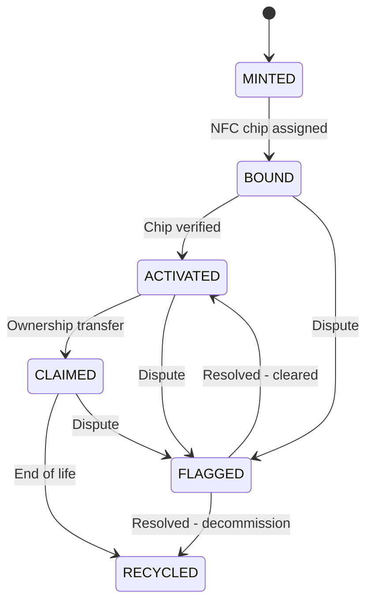

# CLAUDE.md | TAG IT Network | Version 3.0 | January 2026
# Federated Multi-Repo Edition

> Project memory file for Claude Code. Automatically loaded on every session.

---

## Your Mission

Update and expand documentation to match the current MVP state (OP Sepolia testnet).

---

## Priority Tasks

### 1. ~~Contract Address Update~~ ✅ DONE (Feb 5, 2026)
**File:** `docs/contracts/index.md`
**Completed:** All 12 live OP Sepolia addresses added. Individual contract docs updated with address sections.

### 2. Create Security Section
**Create:** `docs/security/` folder with:
- `threat-model.md` — STRIDE analysis for custody/transfer/verification
- `pqc-roadmap.md` — Post-quantum cryptography migration plan
- `private-registry.md` — Defense/gov data isolation architecture

### 3. API Authentication Docs
**File:** `docs/api/authentication.md`
**Content needed:**
- API key generation flow
- JWT token structure and refresh
- Scope definitions (read, write, admin)
- Rate limit tiers by auth level

### 4. NFC Binding Protocol
**File:** `docs/architecture/nfc-binding.md`
**Content needed:**
- Challenge-response protocol spec
- Cryptographic requirements
- Hardware integration flow

### 5. AIRP Recovery Documentation
**File:** `docs/contracts/tagit-recovery.md`
**Expand with:**
- Quarantine state machine
- Multi-party cryptographic proofs
- Recovery authorization flow

### 6. TAGIT Token Documentation
**Created:** `docs/contracts/tagit-token.md`
**Content needed:**
- ERC-20 token specifications (symbol, decimals, supply)
- Token utility mapping (governance, staking, fees, rewards)
- Distribution/tokenomics table (get from team if available)
- Staking mechanics and validator rewards
- Fee payment flows
- Contract address once deployed

**Create:** `docs/tokenomics/` folder with:
- `distribution.md` — Initial allocation and vesting
- `emissions.md` — Reward emission schedule
- `staking.md` — Validator staking mechanics

**Cross-reference:**
- Link from TAGITGovernor (voting power)
- Link from TAGITTreasury (fee distribution)
- Link from TAGITPrograms (reward payouts)

---

## Project Identity

| Field | Value |
|-------|-------|
| **Repository** | `tagit-docs` |
| **Role** | Support Repo #5 of 12 |
| **Purpose** | Documentation + examples for TAG IT Network / ORACULS stack |
| **Primary Language** | Markdown |
| **Code Samples** | Solidity, TypeScript, Kotlin, Swift, Bash |
| **Doc Framework** | Docusaurus / MkDocs (TBD) |

---

## Architecture Context

TAG IT Network is a **Web3 supply-chain authentication platform** using NFC-bound Digital Twins for verifiable authenticity, ownership, and status tracking.

### ORACULS Stack

```
┌─────────────────────────────────────────────────────────────────┐
│                        ORACULS STACK                            │
│   Oracle-Augmented Chain for Universal Logistics Security       │
├─────────────────────────────────────────────────────────────────┤
│  ┌─────────────┐  ┌─────────────┐  ┌─────────────────────────┐  │
│  │  TAGIT L2   │  │   EigenDA   │  │     CCIP Interop        │  │
│  │  (OP Stack) │  │     (DA)    │  │   (Cross-chain)         │  │
│  └─────────────┘  └─────────────┘  └─────────────────────────┘  │
├─────────────────────────────────────────────────────────────────┤
│                    Ethereum Settlement Layer                    │
├─────────────────────────────────────────────────────────────────┤
│  ┌───────────────────────┐  ┌─────────────────────────────────┐ │
│  │    Private Registry   │  │       Public Registry           │ │
│  │   (Defense/Gov Data)  │  │    (Consumer Products)          │ │
│  └───────────────────────┘  └─────────────────────────────────┘ │
└─────────────────────────────────────────────────────────────────┘
```

### Deployment Targets

| Environment | Network | Purpose |
|-------------|---------|---------|
| **Dev** | OP Sepolia | Local development + testing |
| **Stage** | OP Sepolia | Production-like integration testing |
| **Prod** | OP Mainnet | Live deployment (future) |

---

## Repository Map (12 Consolidated)

### Core Repositories (6)

| Repo | Purpose | Key Outputs |
|------|---------|-------------|
| `tagit-contracts` | All smart contracts | Solidity, ABIs, deploy scripts |
| `tagit-l2` | OP Stack rollup infrastructure | Chain config, sequencer |
| `tagit-bridge` | CCIP cross-chain adapters | Bridge contracts, relayers |
| `tagit-services` | Backend APIs + AI orchestrator | REST/GraphQL APIs |
| `tagit-indexer` | Event indexing (Graph/Goldsky) | Subgraphs, queries |
| `tagit-security` | Audits, formal verification | Audit reports, proofs |

### Support Repositories (6)

| Repo | Purpose | Key Outputs |
|------|---------|-------------|
| `tagit-dashboard` | Admin console + governance | React app |
| `tagit-mobile` | ORACULAR mobile scanner app | iOS/Android apps |
| `tagit-sdk` | JS/Kotlin/Swift SDKs + CLI | NPM/Maven/Swift packages |
| `tagit-hardware` | NFC/PQC specifications | Hardware specs, firmware |
| `tagit-docs` | Documentation + examples | **YOU ARE HERE** |
| `tagit-governance` | SOPs, RFCs, policies | Process documents |

---

## Smart Contract Modules (6)

| Module | Purpose | Key Functions |
|--------|---------|---------------|
| **TAGITCore** | Asset NFT + Lifecycle + Verification | `mint()`, `bind()`, `verify()`, `transfer()` |
| **TAGITAccess** | BIDGES badges + role-based access | `grantRole()`, `revokeRole()`, `hasRole()` |
| **TAGITRecovery** | AIRP + quarantine | `initiateRecovery()`, `quarantine()`, `release()` |
| **TAGITGovernor** | Multi-house DAO governance | `propose()`, `vote()`, `execute()` |
| **TAGITTreasury** | Protocol funds management | `deposit()`, `withdraw()`, `allocate()` |
| **TAGITPrograms** | Rewards, Customs, Recalls | `createProgram()`, `enroll()`, `claim()` |

---

## Asset Lifecycle States



### State Definitions

| State | Description | Triggers |
|-------|-------------|----------|
| **MINTED** | NFT exists on-chain, no physical binding yet | `mint()` called |
| **BOUND** | Cryptographically linked to NFC chip | `bind()` with chip signature |
| **ACTIVATED** | Chip verified, asset operational | First successful `verify()` |
| **CLAIMED** | Ownership transferred to end user | `transfer()` completed |
| **FLAGGED** | Frozen due to fraud/dispute/recall | `flag()` by authorized role |
| **RECYCLED** | Permanently deactivated (terminal) | `recycle()` — irreversible |

---

## Glossary (Key Terminology)

| Term | Definition |
|------|------------|
| **ORACULS** | Oracle-Augmented Chain for Universal Logistics Security — full stack name |
| **Digital Twin** | Cryptographic NFT representing a physical asset's identity, state, and history |
| **BIDGES** | Badge-based Identity for Decentralized Governance and Enterprise Security |
| **ORACULAR** | Mobile scanner app for NFC verification and asset interaction |
| **AIRP** | Asset Identity Recovery Protocol — handles lost/stolen/disputed assets |
| **PQC** | Post-Quantum Cryptography — future-proofing against quantum attacks |
| **Binding** | Cryptographic linkage between on-chain NFT and physical NFC chip |
| **Verification** | Challenge-response proof that physical chip matches on-chain record |

---

## Documentation Structure

```
tagit-docs/
├── CLAUDE.md                    # This file (Claude Code context)
├── README.md                    # Repo overview + quickstart
├── package.json                 # Dependencies + scripts
├── tasks/                       # Claude Code task definitions
│   ├── TODO.md
│   ├── new-contract-doc.md
│   ├── new-api-endpoint.md
│   ├── glossary-update.md
│   └── architecture-diagram.md
├── docs/
│   ├── index.md                 # Landing page
│   ├── getting-started/
│   │   ├── quickstart.md        # 5-min setup guide
│   │   ├── installation.md      # Full installation details
│   │   └── first-verification.md
│   ├── architecture/
│   │   ├── overview.md          # System overview
│   │   ├── oraculs-stack.md     # Stack deep-dive
│   │   └── data-flow.md         # Data flow diagrams
│   ├── contracts/
│   │   ├── index.md             # Contracts overview
│   │   ├── tagit-core.md
│   │   ├── tagit-access.md
│   │   ├── tagit-recovery.md
│   │   ├── tagit-governor.md
│   │   ├── tagit-treasury.md
│   │   └── tagit-programs.md
│   ├── api/
│   │   ├── overview.md
│   │   ├── authentication.md
│   │   └── endpoints/
│   │       ├── assets.md
│   │       ├── verification.md
│   │       └── programs.md
│   ├── sdk/
│   │   ├── overview.md
│   │   ├── javascript.md
│   │   ├── kotlin.md
│   │   └── swift.md
│   ├── security/              # [CREATE] Security documentation
│   │   ├── threat-model.md    # STRIDE analysis
│   │   ├── pqc-roadmap.md     # Post-quantum migration
│   │   └── private-registry.md # Defense/gov isolation
│   └── glossary.md
└── examples/
    ├── mint-and-bind/
    │   ├── README.md
    │   └── index.ts
    ├── verify-asset/
    │   ├── README.md
    │   └── index.ts
    └── transfer-ownership/
        ├── README.md
        └── index.ts
```

---

## Documentation Standards

### Markdown Conventions

| Element | Format | Example |
|---------|--------|---------|
| **Diagrams** | Mermaid code blocks | ` ```mermaid ` |
| **Code** | Language-specified blocks | ` ```solidity ` |
| **Cross-refs** | Relative paths | `[TAGITCore](./contracts/tagit-core.md)` |
| **API endpoints** | Method + path | `POST /api/v1/assets/verify` |
| **Warnings** | Blockquote + emoji | `> **Warning**: ...` |
| **Tips** | Blockquote + emoji | `> **Tip**: ...` |
| **Security** | Blockquote + emoji | `> **Security**: ...` |

### Code Sample Template

When documenting a function, use this structure:

```markdown
## functionName

Brief description of what this function does.

### Parameters

| Name | Type | Description |
| --- | --- | --- |
| `tokenId` | `uint256` | The asset's token ID |
| `data` | `bytes` | Optional calldata |

### Returns

| Type | Description |
| --- | --- |
| `bool` | Success status |

### Solidity

\`\`\`solidity
function functionName(uint256 tokenId, bytes calldata data) external returns (bool);
\`\`\`

### TypeScript (SDK)

\`\`\`typescript
const result = await tagit.functionName(tokenId, data);
\`\`\`

### Example

\`\`\`typescript
// Verify an asset
const success = await tagit.verify(12345n, "0x");
console.log("Verification:", success ? "Passed" : "Failed");
\`\`\`
```

---

## Security Documentation Requirements

When documenting security-sensitive features, **always include**:

1. **Threat Model** — What attacks does this prevent/enable?
2. **Required Permissions** — Which BIDGES roles are needed?
3. **Audit Status** — Has this been audited? Link to report.
4. **Failure Modes** — What happens if this fails?

---

## Commands

```bash
# Development
npm install              # Install dependencies
npm run dev              # Start local dev server (hot reload)
npm run build            # Build static site

# Quality Assurance
npm run lint             # Lint markdown files
npm run lint:fix         # Auto-fix linting issues
npm run links            # Check for broken links
npm run spell            # Spellcheck

# Deployment
npm run deploy           # Deploy to hosting
```

---

## Claude Code Patterns

### Quick Commands

```
"Add docs for the claimReward() function in TAGITPrograms"
"Update glossary with: [new term]"
"Create TypeScript example for asset verification"
"Generate mermaid diagram for the transfer flow"
```

### Complex Tasks

```
"Generate complete API reference from OpenAPI spec"
"Document end-to-end AIRP recovery process"
"Create SDK quickstart for all three platforms"
"Build architecture overview with all system components"
```

### Task Files

Use task files in `tasks/` for repeatable documentation patterns:

```
@tasks/new-contract-doc.md — Document a new contract function
@tasks/new-api-endpoint.md — Document a new API endpoint
@tasks/glossary-update.md — Add a glossary term
@tasks/architecture-diagram.md — Create an architecture diagram
```

---

## Related Resources

| Resource | Location |
|----------|----------|
| Notion Wiki | TAG IT Network Workspace |
| GitHub Org | github.com/tagit-network |
| Testnet Explorer | sepolia-optimism.etherscan.io |
| Faucets | OP Sepolia, Alchemy, QuickNode |

---

## Security Requirements (Always Apply)

- Never document private keys or secrets
- All custody/transfer logic must reference threat model
- U.S. hosting requirement for core data must be stated
- Flag any security gaps you find during documentation

---

## Related Repos (for cross-reference)

| Repo | Purpose |
|------|---------|
| `tagit-contracts` | Source of truth for Solidity interfaces |
| `tagit-security` | Audit reports to reference |
| `tagit-governance` | SOPs and RFCs to link |

---

## Change Log

| Date | Version | Changes |
|------|---------|---------|
| 2026-02-05 | v3.1.0 | Contract addresses updated for all 12 live OP Sepolia contracts |
| 2026-01-02 | v3.0.0 | Federated multi-repo edition, 15-contract architecture |
| 2025-12-11 | v1.0.0 | Initial CLAUDE.md for tagit-docs |

---

*Last updated: 2026-01-02 | Maintained by: TAG IT Network*
