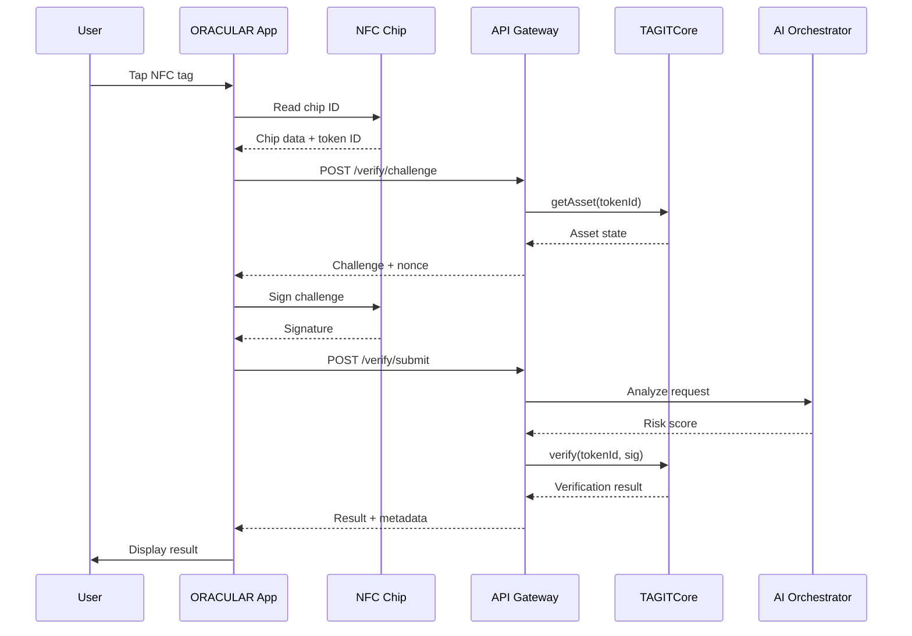
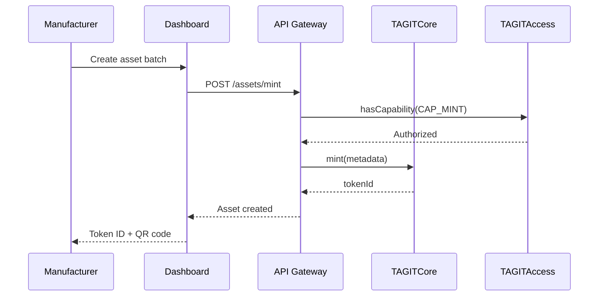
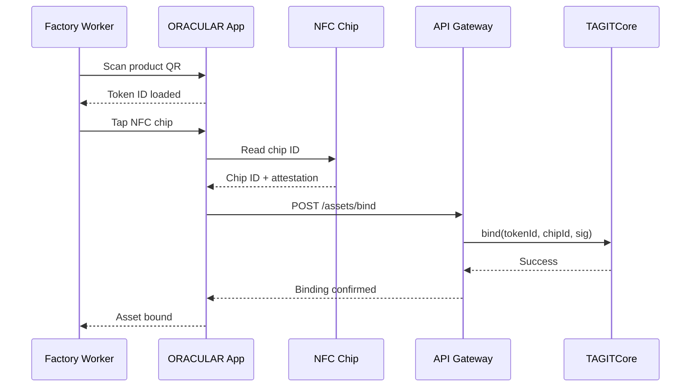
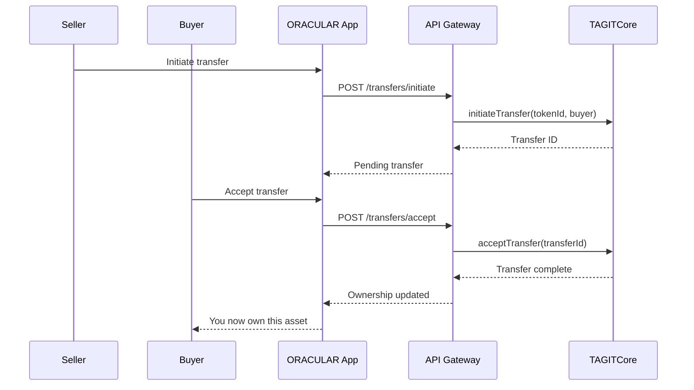
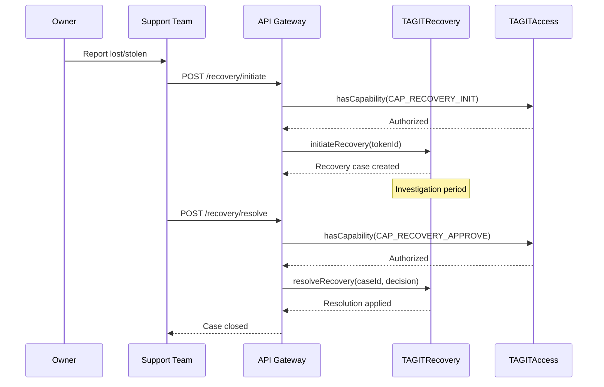
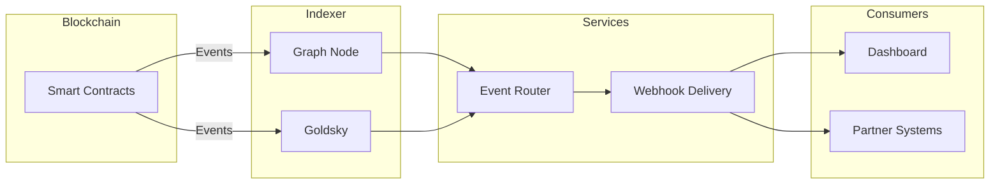

# Data Flow Diagrams

Detailed request and data flows for TAG IT Network operations.

## Asset Verification Flow

## Asset Minting Flow

## Asset Binding Flow

## Ownership Transfer Flow

## AIRP Recovery Flow

## Event Processing Flow

## Next Steps

- [Architecture Overview](./overview.md) — System components
- [ORACULS Stack](./oraculs-stack.md) — Technology deep dive
- [API Reference](../api/overview.md) — REST API documentation
