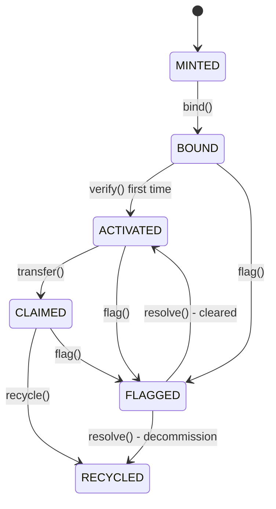
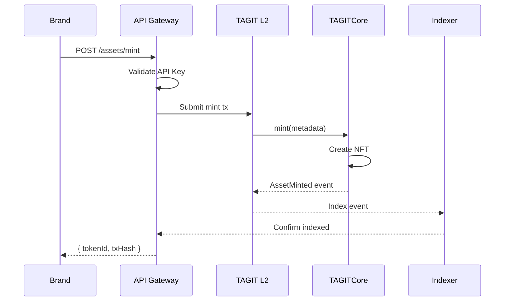
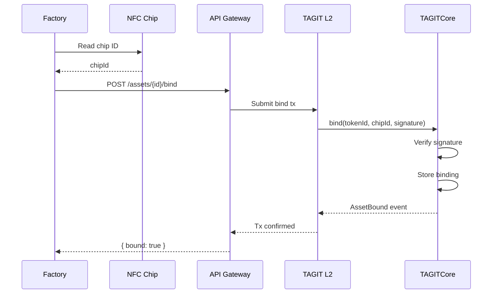
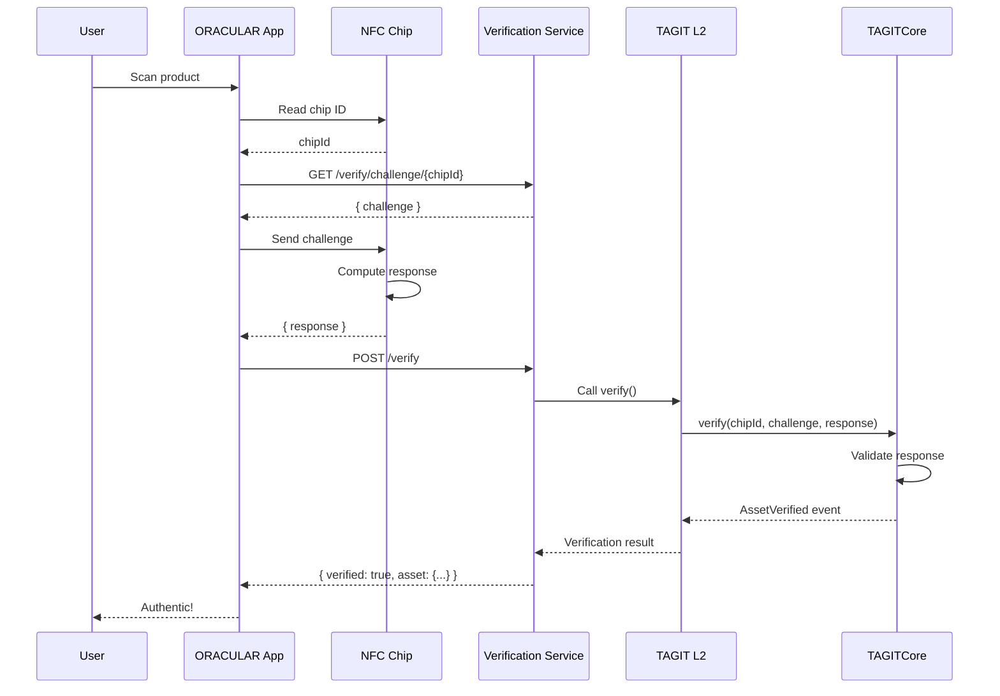
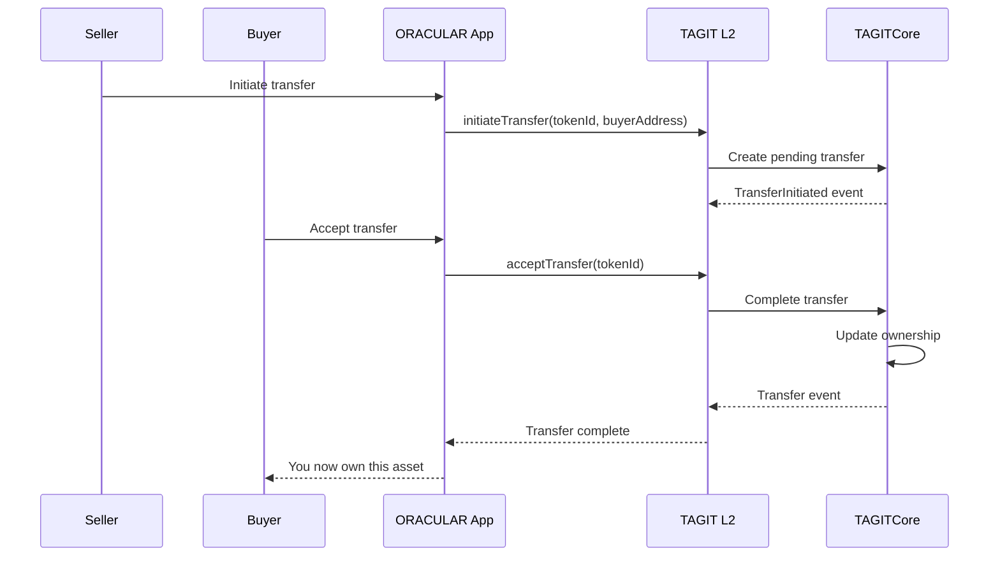
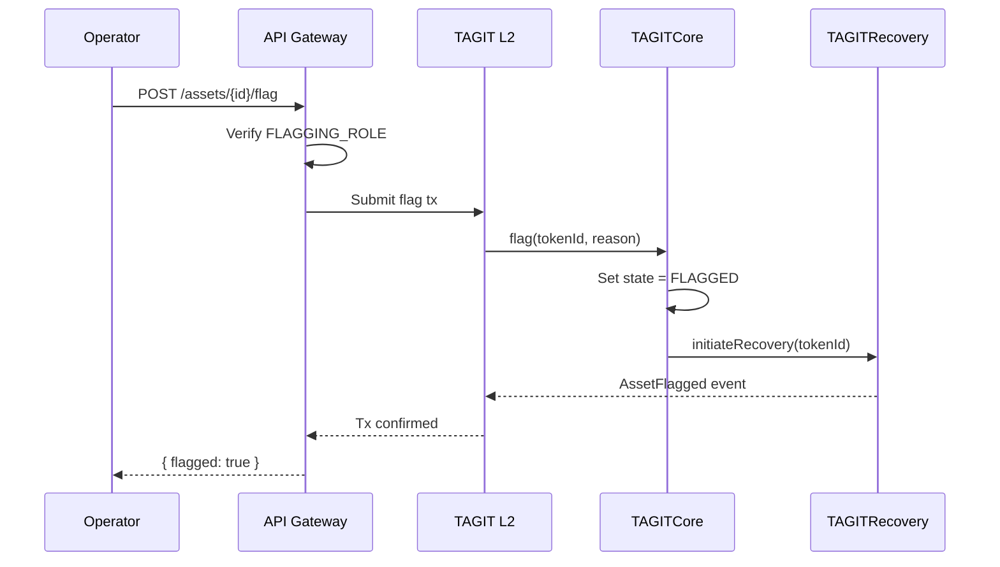

# Data Flow

This document describes how data flows through the TAG IT Network system for key operations.

## Asset Lifecycle Flow



## 1. Minting Flow

Creating a new Digital Twin NFT.



### Request

```json
POST /api/v1/assets/mint
{
  "metadata": {
    "name": "Product XYZ",
    "sku": "SKU-12345",
    "manufacturer": "Brand Co",
    "manufactureDate": "2025-01-15"
  }
}
```

### Response

```json
{
  "tokenId": "12345",
  "txHash": "0x...",
  "state": "MINTED",
  "createdAt": "2025-01-15T10:30:00Z"
}
```

## 2. Binding Flow

Linking a physical NFC chip to a Digital Twin.



### Binding Signature

```solidity
// Generate binding signature
const message = ethers.solidityPackedKeccak256(
    ["uint256", "bytes32", "uint256"],
    [tokenId, chipId, nonce]
);
const signature = await signer.signMessage(ethers.getBytes(message));
```

## 3. Verification Flow

Authenticating an asset via NFC scan.



### Challenge-Response Protocol

```
1. App requests challenge from API
2. API generates random challenge (32 bytes)
3. App sends challenge to NFC chip
4. Chip computes: response = HMAC(chipSecret, challenge)
5. App sends response to API
6. Contract verifies response against stored binding
```

## 4. Transfer Flow

Transferring ownership of an asset.



## 5. Flagging Flow

Flagging an asset for fraud/dispute.



## Event Types

| Event | Emitted By | Data |
|-------|------------|------|
| `AssetMinted` | TAGITCore | tokenId, metadata, timestamp |
| `AssetBound` | TAGITCore | tokenId, chipId, timestamp |
| `AssetVerified` | TAGITCore | tokenId, verifier, result, timestamp |
| `AssetTransferred` | TAGITCore | tokenId, from, to, timestamp |
| `AssetFlagged` | TAGITCore | tokenId, reason, flaggedBy, timestamp |
| `AssetRecycled` | TAGITCore | tokenId, recycledBy, timestamp |

## Related

- [Architecture Overview](./overview.md)
- [TAGITCore Contract](../contracts/tagit-core.md)
- [API Reference](../api/overview.md)
