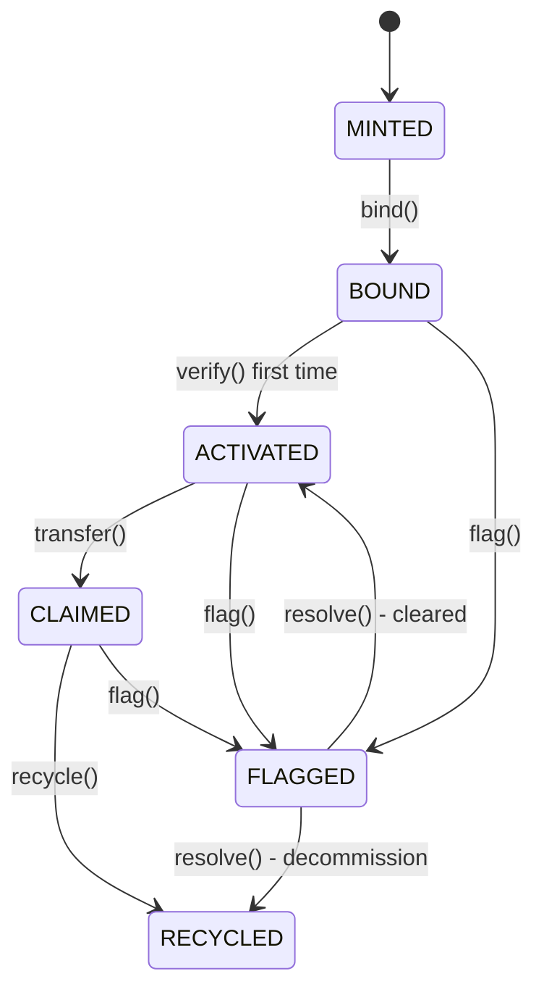
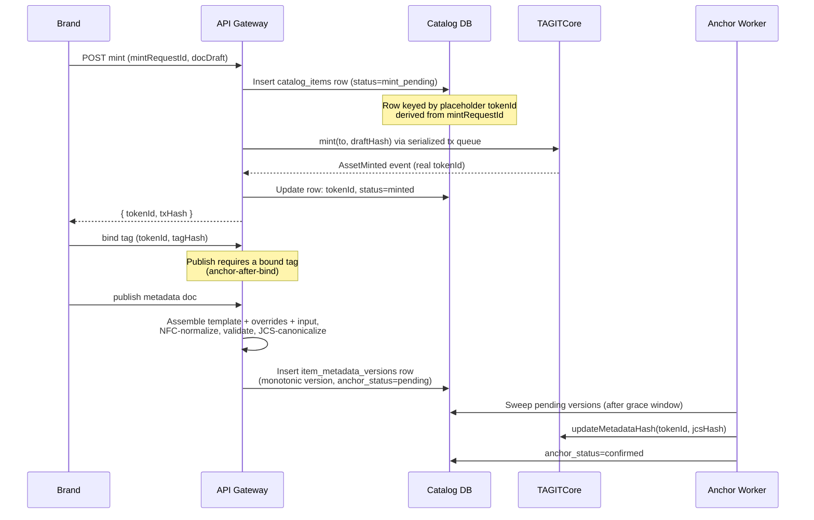
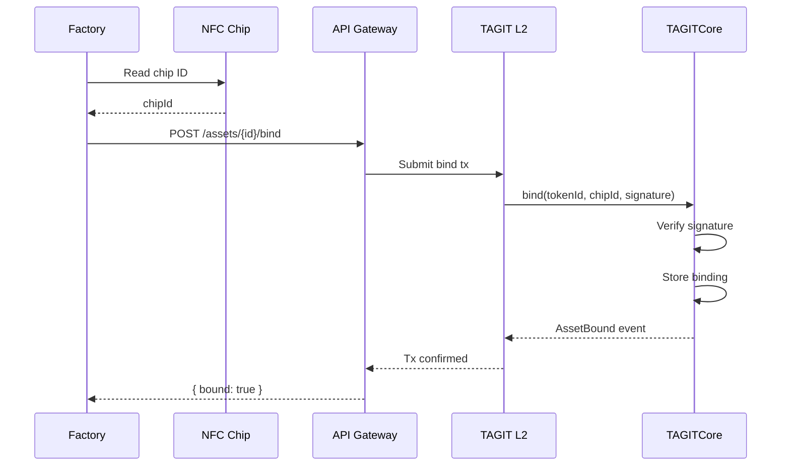
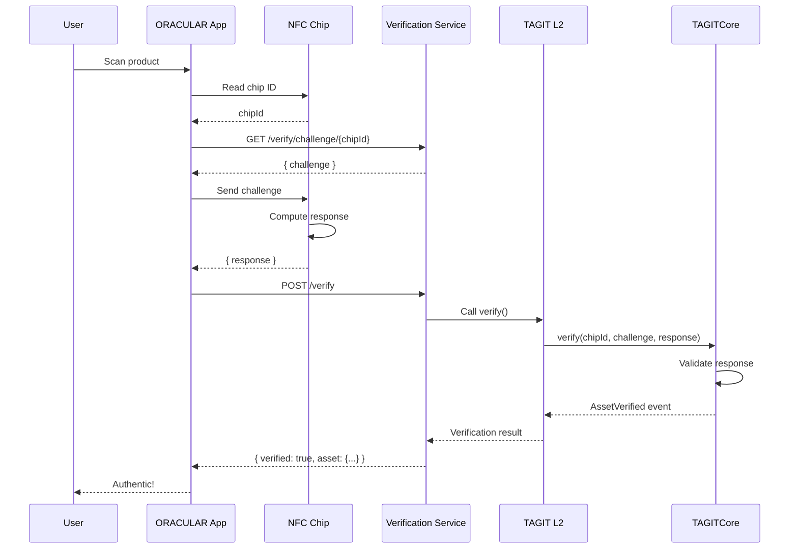
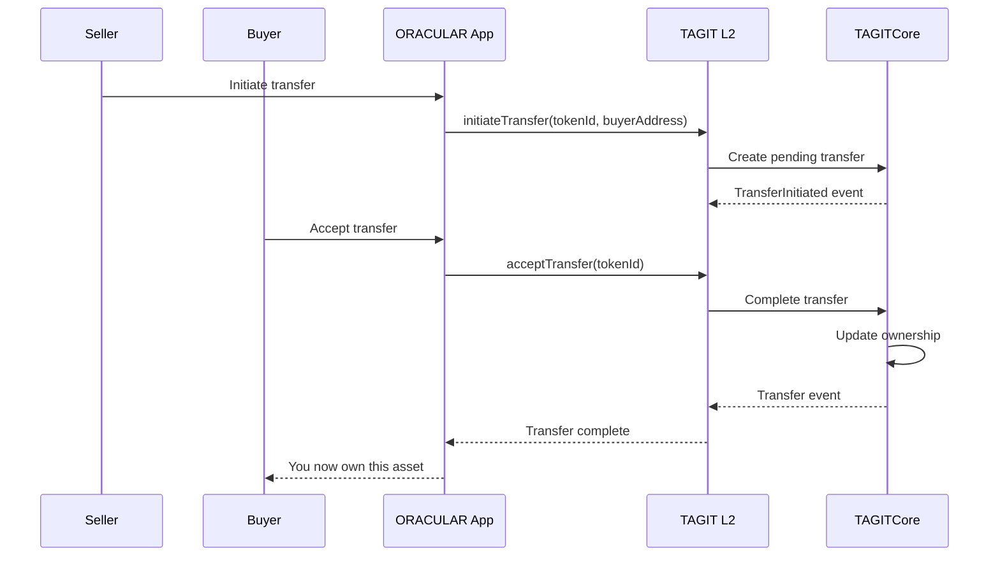
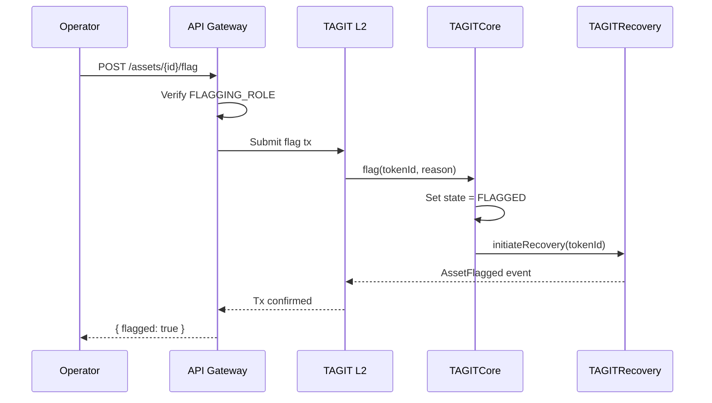
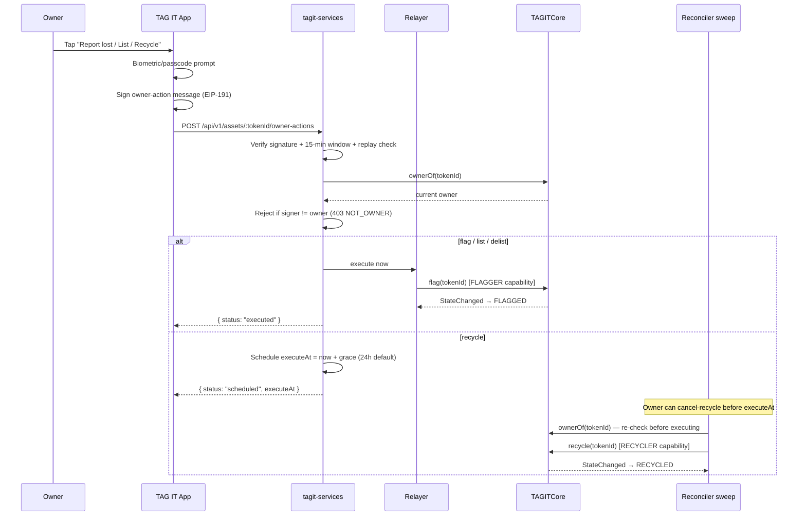
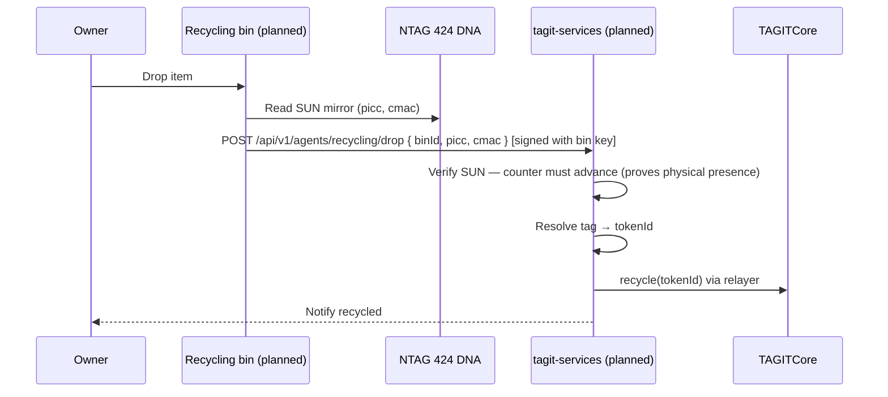

# Data Flow

This document describes how data flows through the TAG IT Network system for key operations.

## Asset Lifecycle Flow


```mermaid
stateDiagram-v2
    [*] --> MINTED
    MINTED --> BOUND: bind()
    BOUND --> ACTIVATED: verify() first time
    ACTIVATED --> CLAIMED: transfer()
    CLAIMED --> RECYCLED: recycle()
    BOUND --> FLAGGED: flag()
    ACTIVATED --> FLAGGED: flag()
    CLAIMED --> FLAGGED: flag()
    FLAGGED --> ACTIVATED: resolve() - cleared
    FLAGGED --> RECYCLED: resolve() - decommission
```

## 1. Minting & Metadata Flow

Creating a new Digital Twin is **DB-first**: the catalog row exists before any chain call, and the on-chain anchor comes last. The pipeline is mint → bind → publish → anchor, and reads are served from the last-anchored version.


```mermaid
sequenceDiagram
    participant Brand
    participant API as API Gateway
    participant DB as Catalog DB
    participant Core as TAGITCore
    participant Worker as Anchor Worker

    Brand->>API: POST mint (mintRequestId, docDraft)
    API->>DB: Insert catalog_items row (status=mint_pending)
    Note over DB: Row keyed by placeholder tokenId<br/>derived from mintRequestId
    API->>Core: mint(to, draftHash) via serialized tx queue
    Core-->>API: AssetMinted event (real tokenId)
    API->>DB: Update row: tokenId, status=minted
    API-->>Brand: { tokenId, txHash }

    Brand->>API: bind tag (tokenId, tagHash)
    Note over API: Publish requires a bound tag<br/>(anchor-after-bind)

    Brand->>API: publish metadata doc
    API->>API: Assemble template + overrides + input,<br/>NFC-normalize, validate, JCS-canonicalize
    API->>DB: Insert item_metadata_versions row<br/>(monotonic version, anchor_status=pending)
    Worker->>DB: Sweep pending versions (after grace window)
    Worker->>Core: updateMetadataHash(tokenId, jcsHash)
    Worker->>DB: anchor_status=confirmed
```

### Key properties

- **DB-first mint** — the `catalog_items` row (status `mint_pending`) is written before any chain interaction, keyed by a caller-supplied `mintRequestId`. Retries with the same id are idempotent; the reconciler finalizes rows whose tx outcome was unknown at submit time.
- **Anchor-after-bind** — publishing a metadata version requires the item to have a bound `tagHash` (a backfill escape hatch exists for legacy migration).
- **Publish pipeline** — each publish deep-merges template fields, item overrides, and the request doc, then NFC-normalizes, validates against the strict `tagit-meta/1` schema, JCS-canonicalizes (RFC 8785), and keccak256-hashes. Identical docs are idempotent; new docs insert a monotonic `item_metadata_versions` row with `anchor_status='pending'`.
- **Anchoring** — the anchor worker sends `updateMetadataHash(tokenId, newHash)` through the serialized relayer queue after a cancellable grace window (reassign support), with a periodic DB sweep as the source of truth across restarts. A reconciler drift sweep compares on-chain `metadataHash(tokenId)` with the latest confirmed version.
- **Last-anchored serving** — public reads serve the last *anchored* (confirmed) metadata version; a newer pending version is not served as verified until its hash is on-chain. See [Metadata Schema](./metadata-schema.md) for the tri-state verification semantics.

## 2. Binding Flow

Linking a physical NFC chip to a Digital Twin.


```mermaid
sequenceDiagram
    participant Factory
    participant NFC as NFC Chip
    participant API as API Gateway
    participant L2 as TAGIT L2
    participant Core as TAGITCore

    Factory->>NFC: Read chip ID
    NFC-->>Factory: chipId
    Factory->>API: POST /assets/{id}/bind
    API->>L2: Submit bind tx
    L2->>Core: bind(tokenId, chipId, signature)
    Core->>Core: Verify signature
    Core->>Core: Store binding
    Core-->>L2: AssetBound event
    L2-->>API: Tx confirmed
    API-->>Factory: { bound: true }
```

### Binding Signature

```solidity
// Generate binding signature
const message = ethers.solidityPackedKeccak256(
    ["uint256", "bytes32", "uint256"],
    [tokenId, chipId, nonce]
);
const signature = await signer.signMessage(ethers.getBytes(message));
```

## 3. Verification Flow

Authenticating an asset via NFC scan.


```mermaid
sequenceDiagram
    participant User
    participant App as ORACULAR App
    participant NFC as NFC Chip
    participant API as Verification Service
    participant L2 as TAGIT L2
    participant Core as TAGITCore

    User->>App: Scan product
    App->>NFC: Read chip ID
    NFC-->>App: chipId
    App->>API: GET /verify/challenge/{chipId}
    API-->>App: { challenge }
    App->>NFC: Send challenge
    NFC->>NFC: Compute response
    NFC-->>App: { response }
    App->>API: POST /verify
    API->>L2: Call verify()
    L2->>Core: verify(chipId, challenge, response)
    Core->>Core: Validate response
    Core-->>L2: AssetVerified event
    L2-->>API: Verification result
    API-->>App: { verified: true, asset: {...} }
    App-->>User: Authentic!
```

### Challenge-Response Protocol

```
1. App requests challenge from API
2. API generates random challenge (32 bytes)
3. App sends challenge to NFC chip
4. Chip computes: response = HMAC(chipSecret, challenge)
5. App sends response to API
6. Contract verifies response against stored binding
```

## 4. Transfer Flow

Transferring ownership of an asset.


```mermaid
sequenceDiagram
    participant Seller
    participant Buyer
    participant App as ORACULAR App
    participant L2 as TAGIT L2
    participant Core as TAGITCore

    Seller->>App: Initiate transfer
    App->>L2: initiateTransfer(tokenId, buyerAddress)
    L2->>Core: Create pending transfer
    Core-->>L2: TransferInitiated event
    Buyer->>App: Accept transfer
    App->>L2: acceptTransfer(tokenId)
    L2->>Core: Complete transfer
    Core->>Core: Update ownership
    Core-->>L2: Transfer event
    L2-->>App: Transfer complete
    App-->>Buyer: You now own this asset
```

## 5. Flagging Flow

Flagging an asset for fraud/dispute.


```mermaid
sequenceDiagram
    participant Operator
    participant API as API Gateway
    participant L2 as TAGIT L2
    participant Core as TAGITCore
    participant Recovery as TAGITRecovery

    Operator->>API: POST /assets/{id}/flag
    API->>API: Verify FLAGGING_ROLE
    API->>L2: Submit flag tx
    L2->>Core: flag(tokenId, reason)
    Core->>Core: Set state = FLAGGED
    Core->>Recovery: initiateRecovery(tokenId)
    Recovery-->>L2: AssetFlagged event
    L2-->>API: Tx confirmed
    API-->>Operator: { flagged: true }
```

## 6. Owner-Signed Action Flow (App → Services → Relayer → Chain)

New in September 2026: the person holding the physical item can flag, list,
delist, recycle, or cancel a scheduled recycle directly from the TAG IT app —
no gas, no separate transaction signed by the owner. The owner's wallet signs a
short message; a relayer executes on-chain on the owner's behalf after
checking that signature against the current on-chain owner.


```mermaid
sequenceDiagram
    participant Owner
    participant App as TAG IT App
    participant Services as tagit-services
    participant Relayer
    participant Core as TAGITCore
    participant Reconciler as Reconciler sweep

    Owner->>App: Tap "Report lost / List / Recycle"
    App->>App: Biometric/passcode prompt
    App->>App: Sign owner-action message (EIP-191)
    App->>Services: POST /api/v1/assets/:tokenId/owner-actions
    Services->>Services: Verify signature + 15-min window + replay check
    Services->>Core: ownerOf(tokenId)
    Core-->>Services: current owner
    Services->>Services: Reject if signer != owner (403 NOT_OWNER)

    alt flag / list / delist
        Services->>Relayer: execute now
        Relayer->>Core: flag(tokenId) [FLAGGER capability]
        Core-->>Relayer: StateChanged → FLAGGED
        Services-->>App: { status: "executed" }
    else recycle
        Services->>Services: Schedule executeAt = now + grace (24h default)
        Services-->>App: { status: "scheduled", executeAt }
        Note over Reconciler: Owner can cancel-recycle before executeAt
        Reconciler->>Core: ownerOf(tokenId) — re-check before executing
        Reconciler->>Core: recycle(tokenId) [RECYCLER capability]
        Core-->>Reconciler: StateChanged → RECYCLED
    end
```

The relayer's key — not the owner's — holds the on-chain `FLAGGER`/`RECYCLER`
capabilities; the owner's signature is what authorizes the relayer to act on
that specific token. See [TAGITCore](../contracts/tagit-core.md) and
[Threat Model](../security/threat-model.md).

Verified-owner ratings ([API Overview](../api/overview.md)) follow the same
signed-message pattern but never reach the chain — the signature only gates a
database write, checked once against `ownerOf` at submit time.

## 7. Recycling Bin Flow (Planned, Not Built)

Design for an unattended drop-off bin — **not implemented yet**. A Raspberry Pi
would run `tagit-nfc-bridge` headless against an ACS ACR1252U reader. When an
item is dropped in the bin, the bin daemon reads the chip's SUN URL (the same
`picc`/`cmac` mirror used by [NFC Binding](../hardware/nfc-binding.md)) and
posts it to services, signed with the bin's own agent key rather than an
owner's wallet.


```mermaid
sequenceDiagram
    participant Owner
    participant Bin as Recycling bin (planned)
    participant Chip as NTAG 424 DNA
    participant Services as tagit-services (planned)
    participant Core as TAGITCore

    Owner->>Bin: Drop item
    Bin->>Chip: Read SUN mirror (picc, cmac)
    Bin->>Services: POST /api/v1/agents/recycling/drop { binId, picc, cmac } [signed with bin key]
    Services->>Services: Verify SUN — counter must advance (proves physical presence)
    Services->>Services: Resolve tag → tokenId
    Services->>Core: recycle(tokenId) via relayer
    Services-->>Owner: Notify recycled
```

See [Recycling Bin (Planned)](../hardware/readers.md) and
[Recycling Bin Walkthrough (Planned)](../guides/recycling-bin.md).

## Event Types

| Event | Emitted By | Data |
|-------|------------|------|
| `AssetMinted` | TAGITCore | tokenId, metadata, timestamp |
| `AssetBound` | TAGITCore | tokenId, chipId, timestamp |
| `AssetVerified` | TAGITCore | tokenId, verifier, result, timestamp |
| `AssetTransferred` | TAGITCore | tokenId, from, to, timestamp |
| `AssetFlagged` | TAGITCore | tokenId, reason, flaggedBy, timestamp |
| `AssetRecycled` | TAGITCore | tokenId, recycledBy, timestamp |

## Related

- [Architecture Overview](./overview.md)
- [Metadata Schema (tagit-meta/1)](./metadata-schema.md)
- [TAGITCore Contract](../contracts/tagit-core.md)
- [API Reference](../api/overview.md)
