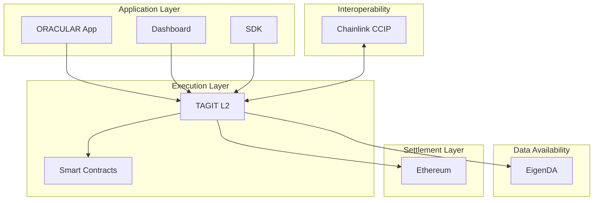
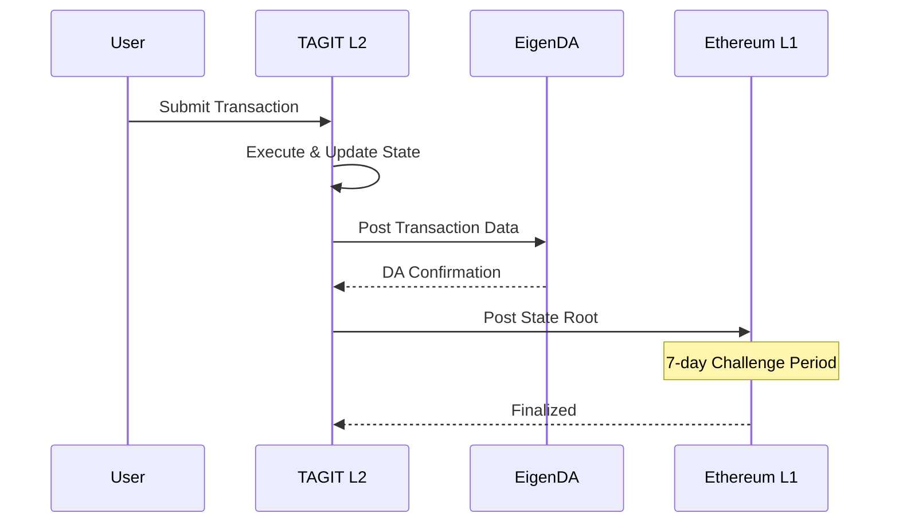
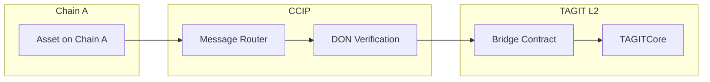

# ORACULS Stack

**ORACULS** = **O**racle-**A**ugmented **C**hain for **U**niversal **L**ogistics **S**ecurity

The ORACULS stack is TAG IT Network's modular blockchain architecture optimized for supply-chain authentication.

## Stack Layers

## Layer Details

### 1. Execution Layer: TAGIT L2

| Property | Value |
|----------|-------|
| **Base** | OP Stack (Optimism) |
| **Consensus** | Optimistic Rollup |
| **Block Time** | ~2 seconds |
| **Gas Token** | ETH |
| **Finality** | ~7 days (with L1 settlement) |

**Why OP Stack?**
- Battle-tested security model
- Superchain ecosystem compatibility
- Low transaction costs
- Fast confirmations

### 2. Data Availability: EigenDA

| Property | Value |
|----------|-------|
| **Provider** | EigenLayer |
| **Model** | Dispersed DA with erasure coding |
| **Cost** | ~10x cheaper than Ethereum calldata |
| **Security** | Restaked ETH economic security |

**Why EigenDA?**
- Cost-effective data availability
- Ethereum-aligned security
- Scalable throughput

### 3. Settlement Layer: Ethereum

| Property | Value |
|----------|-------|
| **Role** | Final settlement & dispute resolution |
| **Bridge** | Native OP Stack bridge |
| **Security** | Full Ethereum L1 security |

### 4. Interoperability: Chainlink CCIP

| Property | Value |
|----------|-------|
| **Protocol** | Cross-Chain Interoperability Protocol |
| **Use Cases** | Cross-chain asset verification, bridge messages |
| **Security** | Decentralized Oracle Network (DON) |

**Why CCIP?**
- Industry-standard cross-chain messaging
- Programmable token transfers
- Defense-in-depth security

## Transaction Flow

## Security Model

### Optimistic Security

1. **Assumption**: Transactions are valid unless challenged
2. **Challenge Period**: 7 days for fraud proofs
3. **Dispute Resolution**: On Ethereum L1

### Economic Security

| Component | Security Source |
|-----------|----------------|
| TAGIT L2 | Ethereum L1 + sequencer bond |
| EigenDA | Restaked ETH ($X billion) |
| CCIP | DON stake + reputation |

## Cross-Chain Operations

### Supported Operations

| Operation | Direction | Use Case |
|-----------|-----------|----------|
| **Verify** | Inbound | Verify asset from another chain |
| **Attest** | Outbound | Send verification proof to another chain |
| **Transfer** | Bidirectional | Cross-chain ownership transfer |

## Performance Characteristics

| Metric | Value |
|--------|-------|
| **TPS** | ~2,000 (theoretical max) |
| **Block Time** | ~2 seconds |
| **Tx Finality** | ~2 seconds (soft), 7 days (hard) |
| **Gas Cost** | ~$0.001 per verification |

## Related

- [Architecture Overview](./overview.md)
- [Data Flow](./data-flow.md)
- [Deployment Guide](../getting-started/installation.md)
