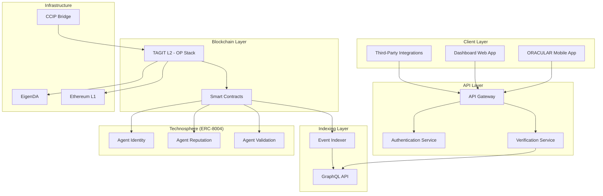
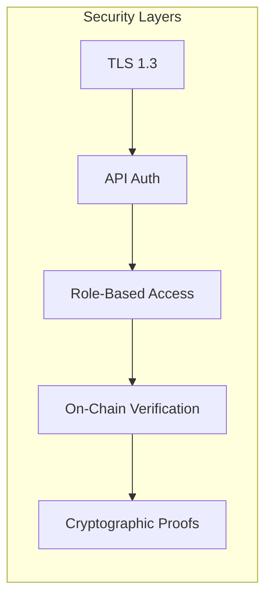

# Architecture Overview

TAG IT Network is built on the **ORACULS stack** — a modular architecture designed for secure, scalable supply-chain authentication.

## System Architecture



## Core Components

### 1. Client Layer

| Component | Purpose | Technology |
|-----------|---------|------------|
| **ORACULAR App** | Mobile NFC scanner for verification | React Native, Kotlin, Swift |
| **Dashboard** | Admin console & governance UI | Next.js, React |
| **SDK** | Developer integrations | TypeScript, Kotlin, Swift |

### 2. API Layer

| Service | Purpose | Endpoints |
|---------|---------|-----------|
| **API Gateway** | Request routing, rate limiting | `/api/v1/*` |
| **Auth Service** | API keys, JWT tokens | `/auth/*` |
| **Verification Service** | NFC challenge-response | `/verify/*` |

### 3. Blockchain Layer

| Component | Purpose | Network |
|-----------|---------|---------|
| **TAGIT L2** | OP Stack rollup | OP Sepolia (testnet), OP Mainnet (prod) |
| **Smart Contracts** | 6 core + 3 agent modules | Solidity, Foundry |
| **EigenDA** | Data availability | EigenLayer |

### 4. Technosphere (AI Agent Layer)

| Component | Purpose | Standard |
|-----------|---------|----------|
| **AgentIdentity** | Soulbound ERC-721 agent registry | ERC-8004 |
| **AgentReputation** | Time-weighted feedback scoring | ERC-8004 |
| **AgentValidation** | Multi-party proof verification (3-of-5) | ERC-8004 |

See [Technosphere Architecture](./technosphere.md) for the full ERC-8004 deep-dive.

### 5. Indexing Layer

| Component | Purpose | Technology |
|-----------|---------|------------|
| **Event Indexer** | Chain event processing | The Graph / Goldsky |
| **GraphQL API** | Queryable asset data | GraphQL |

## Security Architecture



### Security Principles

1. **Defense in Depth** — Multiple security layers
2. **Zero Trust** — Verify everything, trust nothing
3. **Principle of Least Privilege** — Minimal access by default
4. **Cryptographic Proof** — All claims are verifiable on-chain

### Key Security Features

| Feature | Implementation |
|---------|---------------|
| **NFC Binding** | Challenge-response protocol |
| **Custody Transfer** | Multi-party cryptographic proofs |
| **Fraud Detection** | On-chain verification events |
| **Private Registry** | Segregated defense/gov data |
| **PQC Roadmap** | Post-quantum cryptography ready |
| **Agent Validation** | Multi-party consensus (3-of-5) for AI agents |

## Network Topology

### Testnet (Current)

```
┌─────────────────────────────────────────────────┐
│                   OP Sepolia                    │
│  ┌─────────────┐  ┌─────────────┐               │
│  │ TAGITCore   │  │ TAGITAccess │  ...          │
│  └─────────────┘  └─────────────┘               │
├─────────────────────────────────────────────────┤
│              EigenDA (Testnet)                  │
├─────────────────────────────────────────────────┤
│            Ethereum Sepolia (L1)                │
└─────────────────────────────────────────────────┘
```

### Mainnet (Future)

```
┌─────────────────────────────────────────────────┐
│                   OP Mainnet                    │
│  ┌─────────────┐  ┌─────────────┐               │
│  │ TAGITCore   │  │ TAGITAccess │  ...          │
│  └─────────────┘  └─────────────┘               │
├─────────────────────────────────────────────────┤
│              EigenDA (Mainnet)                  │
├─────────────────────────────────────────────────┤
│            Ethereum Mainnet (L1)                │
└─────────────────────────────────────────────────┘
```

## Data Flow

See [Data Flow](./data-flow.md) for detailed transaction flows.

## Related

- [Technosphere Architecture](./technosphere.md)
- [ORACULS Stack Deep-Dive](./oraculs-stack.md)
- [Smart Contracts Overview](../contracts/index.md)
- [API Reference](../api/overview.md)
