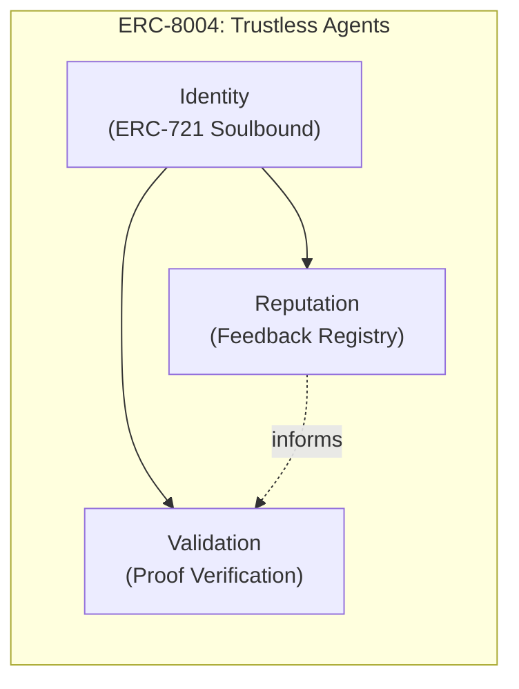
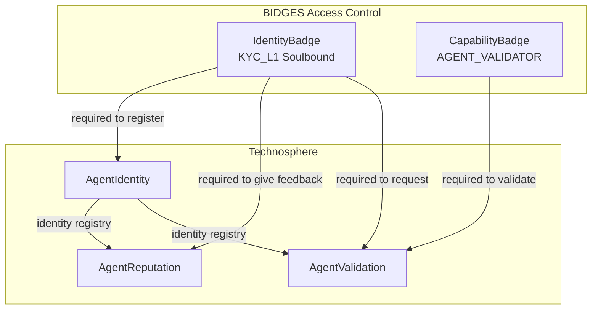
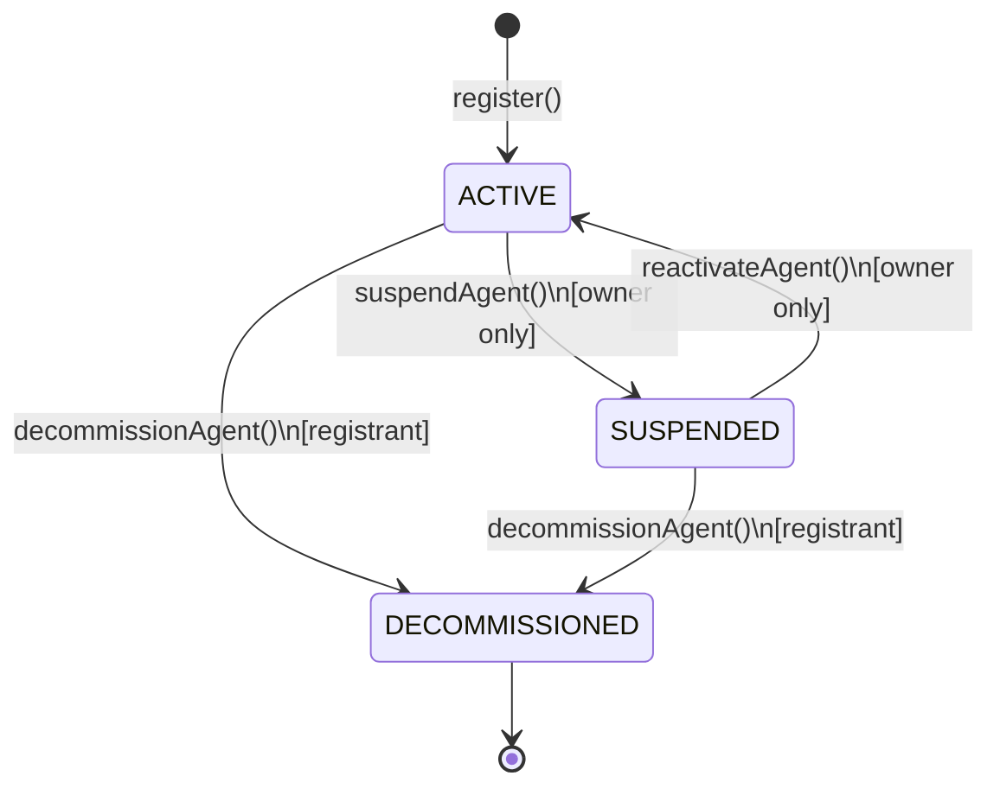
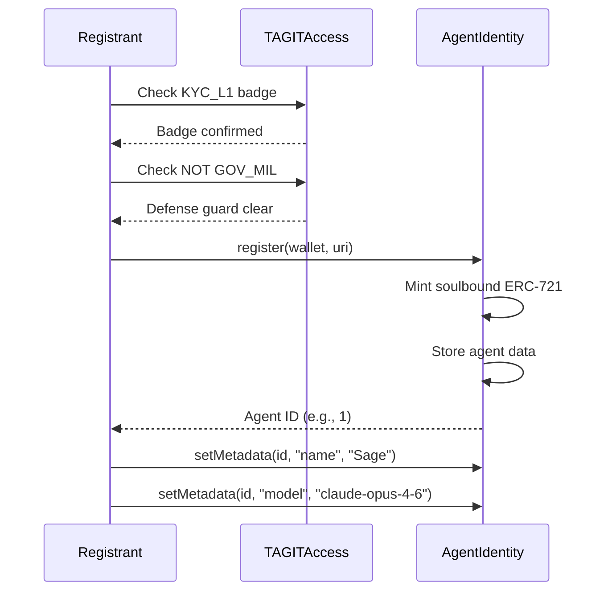
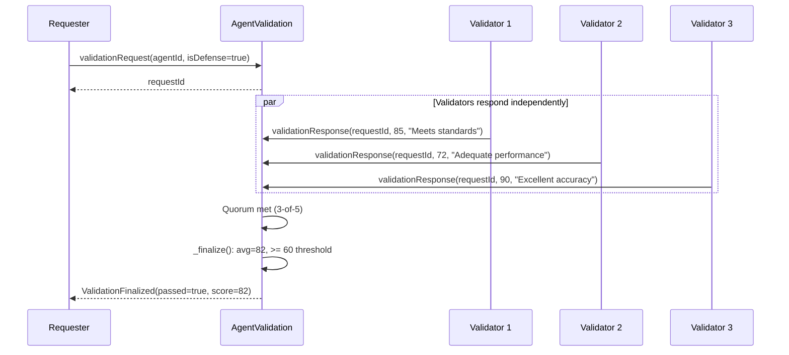

# Technosphere

TAG IT's **Technosphere** is an AI agent infrastructure layer built on the **ERC-8004** standard. It enables AI agents to operate as first-class on-chain citizens with verifiable identity, trackable reputation, and multi-party validation.

## Vision

Traditional AI agents operate as opaque black boxes — users must trust the operator, not the agent. Technosphere changes this by anchoring agent identity, performance history, and validation proofs directly on-chain.

Every AI agent in the TAG IT ecosystem:

- **Has a soulbound identity** — an ERC-721 NFT that cannot be transferred, sold, or duplicated
- **Earns reputation on-chain** — verifiable feedback with time-weighted scoring
- **Passes multi-party validation** — defense-grade agents require 3-of-5 consensus

## ERC-8004 Standard

ERC-8004 defines three pillars for trustless agent infrastructure:



| Pillar | Contract | Purpose |
|--------|----------|---------|
| **Identity** | [TAGITAgentIdentity](../contracts/agent-identity.md) | Soulbound ERC-721 agent registry with EIP-712 wallet verification |
| **Reputation** | [TAGITAgentReputation](../contracts/agent-reputation.md) | Feedback system with time-weighted scoring (90-day decay) |
| **Validation** | [TAGITAgentValidation](../contracts/agent-validation.md) | Multi-party proof verification with 3-of-5 consensus |

## Integration with BIDGES

Technosphere leverages the existing [BIDGES access control](../contracts/tagit-access.md) system:



| Action | Required Badge |
|--------|---------------|
| Register an agent | KYC_L1 identity badge |
| Give feedback | KYC_L1 identity badge |
| Request validation | KYC_L1 identity badge |
| Submit validation response | AGENT_VALIDATOR capability badge |

**Defense Guard**: Addresses holding a `GOV_MIL` capability badge are blocked from registering agents. This prevents military/government clearance holders from creating autonomous agents without additional authorization.

## Agent Lifecycle

Each registered agent progresses through a defined status lifecycle:



| Status | Description | Can Receive Feedback | Can Be Validated |
|--------|-------------|---------------------|-----------------|
| **ACTIVE** | Operating normally | Yes | Yes |
| **SUSPENDED** | Temporarily disabled by owner | No | No |
| **DECOMMISSIONED** | Permanently retired (irreversible) | No | No |

### Registration Flow



### Soulbound Enforcement

Agent identity tokens are **non-transferable** (soulbound). The `_update()` function override blocks all transfers while allowing minting. This ensures:

- Agent identity cannot be sold or traded
- No agent impersonation via token transfer
- Decommissioning is the only way to retire an agent

### EIP-712 Wallet Verification

When updating an agent's operational wallet, EIP-712 typed data signatures prevent unauthorized wallet binding:

1. Registrant calls `setAgentWallet(agentId, newWallet, signature)`
2. Contract verifies the signature was produced by `newWallet`
3. Nonce increments to prevent replay attacks
4. Old wallet is freed for reuse

## Reputation Scoring

The reputation system uses **time-weighted scoring** to ensure recent feedback matters more than old feedback.

### Scoring Formula

```
weight = DECAY_PERIOD / (DECAY_PERIOD + age)
```

Where:
- `DECAY_PERIOD` = 90 days
- `age` = time since feedback was given (in seconds)
- Scores are scaled by 100 for precision (e.g., 450 = 4.50 stars)

### Decay Curve

| Feedback Age | Weight | Contribution |
|-------------|--------|-------------|
| Same day | ~100% | Full weight |
| 30 days | ~75% | Strong influence |
| 90 days | ~50% | Half weight |
| 180 days | ~33% | Diminished |
| 1 year | ~20% | Minimal |

### Anti-Sybil Protections

- **KYC_L1 required** — Only verified identities can leave feedback
- **Anti-self-review** — Registrants and agent wallets cannot rate their own agents
- **One review per user per agent** — Must revoke before re-reviewing

## Validation Flow

Validation proves an agent meets quality standards through independent review.

### Standard vs Defense-Grade

| Mode | Quorum | Use Case |
|------|--------|----------|
| **Standard** | 1-of-1 | General-purpose agents |
| **Defense** | 3-of-5 | Military, government, critical infrastructure |

### Validation Process



### Scoring & Finalization

- Validators submit scores from **0 to 100**
- Passing threshold: **60** (average of all responses)
- Requests expire after **30 days** if quorum is not met
- Validator accuracy is tracked — scores aligned with final outcome count as "accurate"

## Deployed Contracts

### OP Sepolia (Testnet) — Chain ID: 11155420

| Contract | Address | Status |
|----------|---------|--------|
| TAGITAgentIdentity | `0xA7f34FD595eBc397Fe04DcE012dbcf0fbbD2A78D` | Verified |
| TAGITAgentReputation | `0x57CCa1974DFE29593FBD24fdAEE1cD614Bfd6E4a` | Verified |
| TAGITAgentValidation | `0x9806919185F98Bd07a64F7BC7F264e91939e86b7` | Verified |

### Sage — Agent #1

The first registered agent in the Technosphere:

| Property | Value |
|----------|-------|
| Agent ID | 1 |
| Name | Sage |
| Type | Analysis |
| Model | claude-opus-4-6 |
| Wallet | `0xDb8ACD440Ef32a4D23AD685Dd64aC386b0d3d63F` |
| Status | Active |

## Related

- [TAGITAgentIdentity](../contracts/agent-identity.md) — Agent registry contract reference
- [TAGITAgentReputation](../contracts/agent-reputation.md) — Reputation contract reference
- [TAGITAgentValidation](../contracts/agent-validation.md) — Validation contract reference
- [TAGITAccess / BIDGES](../contracts/tagit-access.md) — Access control system
- [Architecture Overview](./overview.md) — System architecture
