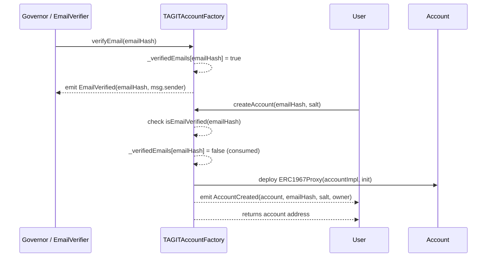
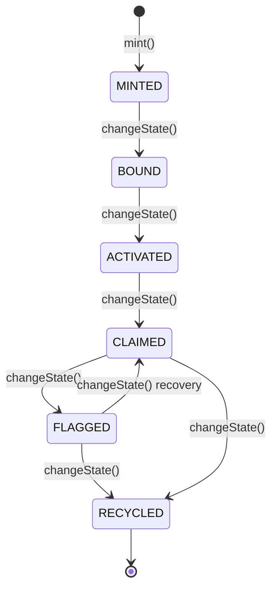

# Account Factory & Core Demo — Test Suites

> **Task**: 4E. Write tests for ALL other new contracts SUDO created (Agent, Pause, Anchoring, etc.)
> (ID: `3334e3e9-a2d3-81e1-9b59-d3440b762b19`)
> **Contracts PR**: [tagit-contracts #22](https://github.com/TAG-IT-NETWORK/tagit-contracts/pull/22)
> **Docs PR**: [tagit-docs #12](https://github.com/TAG-IT-NETWORK/tagit-docs/pull/12)
> **Notion Wiki**: [Account Factory & Core Demo — Test Suite Overview](https://www.notion.so/3334e3e9a2d381e19b59d3440b762b19)
> **GitHub Wiki**: [TAGITAccountFactory-Core-Test-Suite](https://github.com/TAG-IT-NETWORK/tagit-docs/wiki/TAGITAccountFactory-Core-Test-Suite)

---

## Overview

This document covers the Foundry unit test suites added in `tagit-contracts` PR #22 for two contracts:

| Contract | Test File | Lines | Tests |
|---|---|---|---|
| `TAGITAccountFactory` | `test/unit/TAGITAccountFactory.t.sol` | 581 | 35+ |
| `TAGITCoreDemo` | `test/unit/TAGITCoreDemo.t.sol` | 320 | 25+ |

**Total**: 901 lines of Foundry tests covering initialization, email verification (PATCH-15), deterministic addressing, lifecycle state transitions, access control, fuzz testing, and edge cases.

---

## TAGITAccountFactory

**Source**: `src/account/TAGITAccountFactory.sol`
**Interface**: `src/interfaces/ITAGITAccountFactory.sol`
**Solidity**: `^0.8.23` | **Proxy**: UUPS (`ERC1967Proxy`) | **Version**: `1.0.0`

### Contract Interface

```solidity
interface ITAGITAccountFactory {
    // ── Errors ─────────────────────────────────────────
    error ZeroAddress();
    error InvalidEmailHash();
    error EmailNotVerified(bytes32 emailHash);
    error NotAuthorized(address caller);

    // ── Events ─────────────────────────────────────────
    event AccountCreated(
        address indexed account,
        bytes32 indexed emailHash,
        uint256 salt,
        address indexed owner
    );
    event ImplementationUpdated(
        address indexed oldImplementation,
        address indexed newImplementation
    );
    event ProtocolGuardianUpdated(
        address indexed oldGuardian,
        address indexed newGuardian
    );
    event GovernorUpdated(
        address indexed oldGovernor,
        address indexed newGovernor
    );
    event EmailVerified(bytes32 indexed emailHash, address indexed verifier);
    event EmailVerifierUpdated(
        address indexed oldVerifier,
        address indexed newVerifier
    );

    // ── Initialization ─────────────────────────────────
    function initialize(
        address entryPoint_,
        address accountImpl_,
        address protocolGuardian_,
        address tagitCore_,
        address governor_,
        address owner_
    ) external;

    // ── Email Verification (PATCH-15) ──────────────────
    function verifyEmail(bytes32 emailHash) external;
    function isEmailVerified(bytes32 emailHash) external view returns (bool);

    // ── Account Creation ───────────────────────────────
    function createAccount(
        bytes32 emailHash,
        uint256 salt
    ) external returns (address account);

    function createAccountWithOwner(
        bytes32 emailHash,
        uint256 salt,
        address owner_
    ) external returns (address account);

    // ── Deterministic Addressing ───────────────────────
    function getAddress(
        bytes32 emailHash,
        uint256 salt
    ) external view returns (address);

    function getAccountByEmail(
        bytes32 emailHash
    ) external view returns (address);

    // ── View ───────────────────────────────────────────
    function entryPoint() external view returns (address);
    function accountImplementation() external view returns (address);
    function protocolGuardian() external view returns (address);
    function tagitCore() external view returns (address);
    function governor() external view returns (address);
    function emailVerifier() external view returns (address);
    function totalAccounts() external view returns (uint256);
    function isAccount(address account) external view returns (bool);
    function version() external view returns (string memory);

    // ── Admin (governor-only) ──────────────────────────
    function setImplementation(address newImpl) external;
    function setEmailVerifier(address newVerifier) external;

    // ── Admin (owner-only) ─────────────────────────────
    function setGovernor(address newGovernor) external;
    function setProtocolGuardian(address newGuardian) external;
}
```

### Email Verification Flow (PATCH-15)



> **Note**: Email verification is **one-time use** — the verification slot is consumed on account creation.

### Access Control Matrix

| Function | `owner` | `governor` | `emailVerifier` | Anyone |
|---|:---:|:---:|:---:|:---:|
| `initialize` | ✓ (once) | | | |
| `verifyEmail` | | ✓ | ✓ | |
| `createAccount` | | | | ✓ (verified email required) |
| `createAccountWithOwner` | | | | ✓ (verified email required) |
| `setImplementation` | | ✓ | | |
| `setEmailVerifier` | | ✓ | | |
| `setGovernor` | ✓ | | | |
| `setProtocolGuardian` | ✓ | | | |
| `upgradeTo` (UUPS) | ✓ | | | |

### Test Suite Breakdown

```
TAGITAccountFactoryTest (test/unit/TAGITAccountFactory.t.sol)
│
├── Initialization (8 tests)
│   ├── test_initialize_setsStateCorrectly        — all 6 state vars
│   ├── test_initialize_setsOwner
│   ├── test_initialize_revertsZeroEntryPoint     — ZeroAddress error
│   ├── test_initialize_revertsZeroAccountImpl    — ZeroAddress error
│   ├── test_initialize_revertsZeroGovernor       — ZeroAddress error
│   ├── test_initialize_revertsZeroOwner          — ZeroAddress error
│   ├── test_initialize_cannotReinitialize        — proxy guard
│   └── test_version                              — "1.0.0"
│
├── Email Verification — PATCH-15 (5 tests)
│   ├── test_verifyEmail_byGovernor               — event + storage
│   ├── test_verifyEmail_byEmailVerifier          — via setEmailVerifier
│   ├── test_verifyEmail_revertsNotAuthorized     — NotAuthorized(caller)
│   ├── test_verifyEmail_revertsZeroHash          — InvalidEmailHash
│   └── test_isEmailVerified_defaultFalse
│
├── createAccount (6 tests)
│   ├── test_createAccount_success                — address, isAccount, totalAccounts
│   ├── test_createAccount_emitsEvent             — AccountCreated
│   ├── test_createAccount_consumesEmailVerification — one-time use
│   ├── test_createAccount_returnsExistingIfDeployed — idempotent
│   ├── test_createAccount_revertsZeroEmailHash   — InvalidEmailHash
│   └── test_createAccount_revertsUnverifiedEmail — EmailNotVerified
│
├── createAccountWithOwner (5 tests)
│   ├── test_createAccountWithOwner_success
│   ├── test_createAccountWithOwner_emitsEvent    — owner is specified addr
│   ├── test_createAccountWithOwner_revertsZeroOwner
│   ├── test_createAccountWithOwner_revertsZeroEmailHash
│   └── test_createAccountWithOwner_returnsExistingIfDeployed
│
├── Deterministic Addressing (4 tests)
│   ├── test_getAddress_deterministicAcrossCalls
│   ├── test_getAddress_differentEmailsYieldDifferentAddresses
│   ├── test_getAddress_differentSaltsYieldDifferentAddresses
│   └── test_isAccount_defaultFalse
│
├── Admin Functions (setImplementation, setGovernor,
│                   setProtocolGuardian, setEmailVerifier — 8 tests)
│   └── each: success path + access control revert
│
├── View — getAccountByEmail (2 tests)
│   ├── test_getAccountByEmail_returnsZeroIfNotDeployed
│   └── test_getAccountByEmail_returnsCorrectAccount
│
├── Multiple Accounts (1 test)
│   └── test_multipleAccounts_incrementsTotalAccounts
│
└── Fuzz Tests (2 tests, 1,000 runs each by default)
    ├── testFuzz_getAddress_deterministic(bytes32 emailHash, uint256 salt)
    └── testFuzz_differentInputsProduceDifferentAddresses(bytes32, bytes32, uint256)
```

### Custom Errors

| Error | Selector | When Thrown |
|---|---|---|
| `ZeroAddress()` | `0xd92e233d` | Null address passed to init or admin setters |
| `InvalidEmailHash()` | — | `bytes32(0)` passed as email hash |
| `EmailNotVerified(bytes32)` | — | `createAccount` called before `verifyEmail` |
| `NotAuthorized(address)` | — | Unauthorized caller to `verifyEmail` or admin setters |

---

## TAGITCoreDemo

**Source**: `src/core/TAGITCoreDemo.sol`
**Solidity**: `^0.8.20` | **Access**: Admin-only pattern

`TAGITCoreDemo` is a lightweight demonstration contract for the TAG IT asset lifecycle, used in hackathon and integration demos. It provides a simplified, non-upgradeable implementation of the 7-state asset lifecycle.

### Contract Interface

```solidity
contract TAGITCoreDemo {
    // ── Errors ─────────────────────────────────────────
    error NotAdmin();
    error AlreadyExists();
    error DoesNotExist();

    // ── Lifecycle States ────────────────────────────────
    enum State {
        NONE,       // 0 — default / non-existent
        MINTED,     // 1 — asset created, no physical binding
        BOUND,      // 2 — NFC tag cryptographically bound
        ACTIVATED,  // 3 — QA verified, market-ready
        CLAIMED,    // 4 — owned by end consumer
        FLAGGED,    // 5 — lost / stolen / under investigation
        RECYCLED    // 6 — end of life (terminal)
    }

    // ── Data Structures ────────────────────────────────
    struct Asset {
        string  name;
        State   state;
        address owner;
        uint256 mintedAt;
        uint256 lastUpdated;
    }

    // ── Events ─────────────────────────────────────────
    event AssetMinted(uint256 indexed tokenId, string name, address owner);
    event StateChanged(
        uint256 indexed tokenId,
        State   oldState,
        State   newState,
        address changedBy
    );

    // ── State ──────────────────────────────────────────
    address public admin;
    mapping(uint256 => Asset) public assets;
    uint256[] public tokenIds;

    // ── View ───────────────────────────────────────────
    function totalAssets() external view returns (uint256);
    function getAsset(uint256 tokenId) external view returns (Asset memory);
    function getTokenIds() external view returns (uint256[] memory);

    // ── Mutative (admin-only) ──────────────────────────
    function mint(uint256 tokenId, string calldata name) external;
    function changeState(uint256 tokenId, State newState) external;
}
```

### Asset Lifecycle State Machine



> **Note**: `TAGITCoreDemo` does not enforce transition ordering — any state can be set by the admin. The canonical lifecycle guards live in `TAGITCore.sol` (production contract).

### Test Suite Breakdown

```
TAGITCoreDemoTest (test/unit/TAGITCoreDemo.t.sol)
│
├── Constructor (2 tests)
│   ├── test_constructor_setsAdmin
│   └── test_constructor_startsWithZeroAssets
│
├── mint() (6 tests)
│   ├── test_mint_success               — name, state=MINTED, owner, timestamps
│   ├── test_mint_emitsEvent            — AssetMinted
│   ├── test_mint_incrementsTotalAssets
│   ├── test_mint_addsToTokenIds
│   ├── test_mint_revertsNotAdmin       — NotAdmin
│   └── test_mint_revertsAlreadyExists  — AlreadyExists
│
├── changeState() (5 tests)
│   ├── test_changeState_success
│   ├── test_changeState_emitsEvent     — StateChanged(old, new)
│   ├── test_changeState_updatesLastUpdated — mintedAt unchanged
│   ├── test_changeState_revertsNotAdmin
│   └── test_changeState_revertsDoesNotExist
│
├── Full Lifecycle (2 tests)
│   ├── test_fullLifecycle_mintThroughRecycled
│   │   MINTED → BOUND → ACTIVATED → CLAIMED → FLAGGED → RECYCLED
│   └── test_lifecycle_flaggedToClaimedRecovery
│       FLAGGED → CLAIMED (recovery path)
│
├── View Functions (5 tests)
│   ├── test_getAsset_returnsDefaultForNonExistent  — state=NONE
│   ├── test_getTokenIds_emptyInitially
│   ├── test_totalAssets_matchesTokenIds
│   ├── test_assets_publicGetter         — tuple destructuring
│   └── test_tokenIds_publicGetter
│
├── Edge Cases (3 tests)
│   ├── test_mint_withTokenIdZero
│   ├── test_mint_withEmptyName
│   └── test_changeState_toSameState    — no-op is valid
│
└── Fuzz Tests (2 tests)
    ├── testFuzz_mint_arbitraryTokenId(uint256 tokenId)
    └── testFuzz_changeState_allValidStates(uint8 stateRaw)
        — bound(stateRaw, 1, 6) covers all 6 non-NONE states
```

---

## Running the Tests

```bash
# Run all new test suites from this PR
cd tagit-contracts
forge test --match-path "test/unit/TAGITAccountFactory.t.sol" -vvv
forge test --match-path "test/unit/TAGITCoreDemo.t.sol" -vvv

# Run both together
forge test --match-path "test/unit/TAGIT*" -vvv

# Coverage report
forge coverage --report lcov

# Fuzz with higher run count
forge test --fuzz-runs 10000 --match-test "testFuzz"
```

---

## Test Fixtures

Both suites use minimal mocks to isolate the contracts under test:

| Mock | Used By | Purpose |
|---|---|---|
| `MockEntryPointForFactory` | `TAGITAccountFactoryTest` | Stubs ERC-4337 EntryPoint (`depositTo`, `balanceOf`, `getNonce`, staking functions) |
| `MockTAGITCoreForFactory` | `TAGITAccountFactoryTest` | Stubs `ownerOf(uint256)` for TAGITCore reference |

`TAGITCoreDemoTest` requires no mocks — the contract has no external dependencies.

---

## Related Documentation

- [TAGITAccountFactory](./tagit-account-factory.md) — Contract overview
- [TAGITAccount](./tagit-account.md) — Smart wallet implementation (ERC-4337)
- [TAGITCore](./tagit-core.md) — Production lifecycle state machine
- [GitHub Wiki](https://github.com/TAG-IT-NETWORK/tagit-docs/wiki/TAGITAccountFactory-Core-Test-Suite) — Developer reference with architecture diagrams
- [Notion](https://www.notion.so/3334e3e9a2d381e19b59d3440b762b19) — Task page
