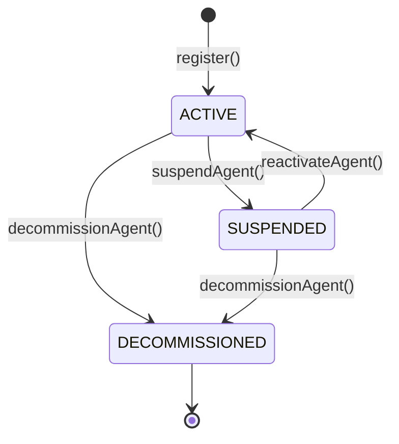

# TAGITAgentIdentity

Soulbound ERC-721 registry for AI agent identity. Part of the [Technosphere](../architecture/technosphere.md) ERC-8004 infrastructure.

## Contract Address

| Network | Address | Status |
|---------|---------|--------|
| OP Sepolia | `0xA7f34FD595eBc397Fe04DcE012dbcf0fbbD2A78D` | Verified |
| OP Mainnet | TBD | Pending |

## Overview

TAGITAgentIdentity manages AI agent registration as non-transferable (soulbound) ERC-721 NFTs. Each agent receives a unique token containing its metadata URI, operational wallet, and lifecycle status. Registration is gated by BIDGES KYC_L1 identity badges.

## Contract Details

| Property | Value |
|----------|-------|
| **Standard** | ERC-721 + ERC-721URIStorage (Soulbound) |
| **Inherits** | ERC721, ERC721URIStorage, Ownable, Pausable, ReentrancyGuard, EIP712 |
| **License** | MIT |
| **Solidity** | ^0.8.20 |
| **Token Name** | TAGIT Agent Identity |
| **Token Symbol** | TAGIT-AGENT |

## Agent Lifecycle



| Status | Value | Description |
|--------|-------|-------------|
| `INACTIVE` | 0 | Default (unused) |
| `ACTIVE` | 1 | Agent is operational |
| `SUSPENDED` | 2 | Temporarily disabled by owner |
| `DECOMMISSIONED` | 3 | Permanently retired (irreversible) |

## Functions

### register

Registers a new AI agent. Mints a soulbound ERC-721 token.

#### Parameters

| Name | Type | Description |
|------|------|-------------|
| `wallet` | `address` | Agent's operational wallet address |
| `uri` | `string` | IPFS URI for agent metadata |

#### Returns

| Type | Description |
|------|-------------|
| `uint256` | The new agent ID |

#### Access Control

- Requires **KYC_L1** identity badge (via BIDGES)
- Blocked if caller holds **GOV_MIL** capability (defense guard)
- Payable — registration fee may apply

#### Solidity

```solidity
function register(address wallet, string calldata uri) external payable returns (uint256);
```

#### SDK Example

```typescript
const agentId = await agentIdentity.register(walletAddress, "ipfs://QmAgentMetadata");
```

---

### setAgentURI

Updates the agent's metadata URI.

#### Parameters

| Name | Type | Description |
|------|------|-------------|
| `agentId` | `uint256` | Agent ID to update |
| `newURI` | `string` | New IPFS URI |

#### Access Control

Only the agent's registrant. Agent must not be DECOMMISSIONED.

#### Solidity

```solidity
function setAgentURI(uint256 agentId, string calldata newURI) external;
```

---

### setMetadata

Sets arbitrary key-value metadata on an agent.

#### Parameters

| Name | Type | Description |
|------|------|-------------|
| `agentId` | `uint256` | Agent ID |
| `key` | `string` | Metadata key (e.g., "name", "model", "version") |
| `value` | `string` | Metadata value |

#### Access Control

Only the agent's registrant. Agent must not be DECOMMISSIONED.

#### Solidity

```solidity
function setMetadata(uint256 agentId, string calldata key, string calldata value) external;
```

#### SDK Example

```typescript
await agentIdentity.setMetadata(agentId, "name", "Sage");
await agentIdentity.setMetadata(agentId, "model", "claude-opus-4-6");
await agentIdentity.setMetadata(agentId, "version", "1.0.0");
```

---

### setAgentWallet

Updates the agent's operational wallet with EIP-712 signature verification.

#### Parameters

| Name | Type | Description |
|------|------|-------------|
| `agentId` | `uint256` | Agent ID |
| `newWallet` | `address` | New wallet address |
| `signature` | `bytes` | EIP-712 signature from `newWallet` proving ownership |

#### Access Control

Only the agent's registrant. Requires valid EIP-712 signature from the new wallet. Nonce increments after each call to prevent replay attacks.

#### EIP-712 TypeHash

```solidity
keccak256("AgentWallet(uint256 agentId,address wallet,uint256 nonce)")
```

#### Solidity

```solidity
function setAgentWallet(uint256 agentId, address newWallet, bytes calldata signature) external;
```

---

### suspendAgent

Temporarily disables an agent.

#### Parameters

| Name | Type | Description |
|------|------|-------------|
| `agentId` | `uint256` | Agent ID to suspend |

#### Access Control

Owner only. Agent must be ACTIVE.

#### Solidity

```solidity
function suspendAgent(uint256 agentId) external;
```

---

### reactivateAgent

Reactivates a suspended agent.

#### Parameters

| Name | Type | Description |
|------|------|-------------|
| `agentId` | `uint256` | Agent ID to reactivate |

#### Access Control

Owner only. Agent must be SUSPENDED.

#### Solidity

```solidity
function reactivateAgent(uint256 agentId) external;
```

---

### decommissionAgent

Permanently retires an agent. This is **irreversible** — the agent's wallet is freed for reuse.

#### Parameters

| Name | Type | Description |
|------|------|-------------|
| `agentId` | `uint256` | Agent ID to decommission |

#### Access Control

Only the agent's registrant.

#### Solidity

```solidity
function decommissionAgent(uint256 agentId) external;
```

---

### View Functions

#### getAgent

```solidity
function getAgent(uint256 agentId) external view
    returns (address registrant, address wallet, uint64 registeredAt, bool active);
```

Returns the core agent data.

#### getAgentStatus

```solidity
function getAgentStatus(uint256 agentId) external view returns (AgentStatus);
```

Returns the current agent status enum value.

#### getMetadata

```solidity
function getMetadata(uint256 agentId, string calldata key) external view returns (string memory);
```

Returns the metadata value for a given key. Empty string if not set.

#### getAgentByWallet

```solidity
function getAgentByWallet(address wallet) external view returns (uint256);
```

Returns the agent ID bound to a wallet address. Returns 0 if not found.

#### getAgentsByRegistrant

```solidity
function getAgentsByRegistrant(address registrant) external view returns (uint256[] memory);
```

Returns all agent IDs registered by an address.

#### totalAgents

```solidity
function totalAgents() external view returns (uint256);
```

Returns the total number of registered agents.

#### isActiveAgent

```solidity
function isActiveAgent(uint256 agentId) external view returns (bool);
```

Returns true if the agent exists and is in ACTIVE status.

#### walletNonce

```solidity
function walletNonce(uint256 agentId) external view returns (uint256);
```

Returns the current EIP-712 nonce for wallet update signatures.

---

### Admin Functions

| Function | Access | Description |
|----------|--------|-------------|
| `setAccessController(address)` | Owner | Set the BIDGES access controller |
| `setRegistrationFee(uint256)` | Owner | Set registration fee in wei |
| `withdrawFees(address)` | Owner | Withdraw accumulated fees |
| `pause()` | Owner | Emergency pause |
| `unpause()` | Owner | Resume operations |

## Events

| Event | Parameters | Description |
|-------|------------|-------------|
| `AgentRegistered` | `agentId, registrant, wallet, uri` | New agent registered |
| `AgentURIUpdated` | `agentId, newURI` | Agent URI changed |
| `AgentWalletUpdated` | `agentId, oldWallet, newWallet` | Agent wallet changed |
| `AgentMetadataSet` | `agentId, key, value` | Metadata key-value set |
| `AgentStatusChanged` | `agentId, oldStatus, newStatus` | Status transition |
| `AccessControllerUpdated` | `previousController, newController` | Access controller changed |
| `RegistrationFeeUpdated` | `oldFee, newFee` | Fee updated |

## Errors

```solidity
error AgentNotFound(uint256 agentId);
error NotRegistrant(address caller, uint256 agentId);
error ZeroAddress();
error InvalidURI();
error WalletAlreadyRegistered(address wallet);
error DefenseGuardBlocked(address caller);
error MissingKYCIdentity(address caller);
error InvalidSignature();
error SoulboundTransferDisabled();
error InvalidMetadataKey();
error AccessControllerNotSet();
error AgentNotActive(uint256 agentId);
error AgentAlreadyInStatus(uint256 agentId, AgentStatus status);
```

## Access Control Matrix

| Function | KYC_L1 | GOV_MIL Block | Registrant | Owner |
|----------|--------|---------------|------------|-------|
| `register` | Required | Yes | — | — |
| `setAgentURI` | — | — | Required | — |
| `setMetadata` | — | — | Required | — |
| `setAgentWallet` | — | — | Required | — |
| `suspendAgent` | — | — | — | Required |
| `reactivateAgent` | — | — | — | Required |
| `decommissionAgent` | — | — | Required | — |
| Admin functions | — | — | — | Required |

## Security Considerations

- **Soulbound** — `_update()` override blocks all token transfers after minting
- **EIP-712 signatures** — Wallet updates require cryptographic proof from the new wallet
- **Defense guard** — GOV_MIL holders cannot register agents
- **Wallet uniqueness** — Each wallet can only be bound to one active agent
- **CEI pattern** — All state-changing functions follow Checks-Effects-Interactions
- **ReentrancyGuard** — Protection on all mutating functions
- **Pausable** — Emergency circuit breaker on registration and updates

## Related

- [TAGITAgentReputation](./agent-reputation.md) — Agent feedback and scoring
- [TAGITAgentValidation](./agent-validation.md) — Agent proof verification
- [TAGITAccess](./tagit-access.md) — BIDGES access control
- [Technosphere Architecture](../architecture/technosphere.md) — System overview
- [Contracts Overview](./index.md) — All contracts
