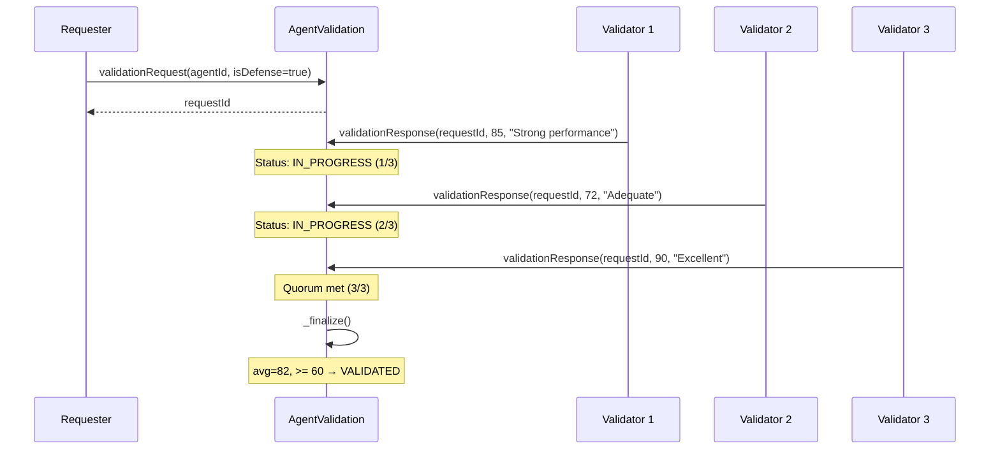
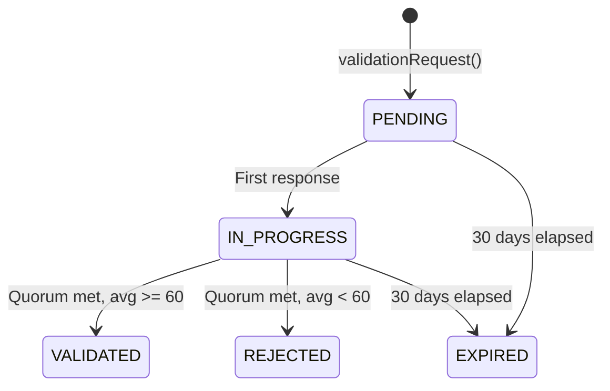

# TAGITAgentValidation

Multi-party proof verification for AI agents. Part of the [Technosphere](../architecture/technosphere.md) ERC-8004 infrastructure.

## Contract Address

| Network | Address | Status |
|---------|---------|--------|
| OP Sepolia | `0x9806919185F98Bd07a64F7BC7F264e91939e86b7` | Verified |
| OP Mainnet | TBD | Pending |

## Overview

TAGITAgentValidation enables independent review of AI agents through a structured request-response flow. Validators with `AGENT_VALIDATOR` capability submit scores (0-100) with justifications. Standard agents require a single validator; defense-grade agents require 3-of-5 multi-party consensus. Validator accuracy is tracked over time.

## Contract Details

| Property | Value |
|----------|-------|
| **Standard** | Custom (Validation Registry) |
| **Inherits** | Ownable, Pausable, ReentrancyGuard |
| **License** | MIT |
| **Solidity** | ^0.8.20 |

## Constants

| Constant | Value | Description |
|----------|-------|-------------|
| `DEFAULT_QUORUM` | 1 | Standard validation quorum |
| `DEFENSE_QUORUM` | 3 | Defense-grade quorum (3-of-5) |
| `MAX_VALIDATORS` | 5 | Maximum validators per request |
| `MAX_SCORE` | 100 | Maximum validation score |
| `PASSING_THRESHOLD` | 60 | Minimum average score to pass |
| `MAX_JUSTIFICATION_LENGTH` | 2048 bytes | Justification size limit |
| `REQUEST_EXPIRY` | 30 days | Time before unfulfilled request expires |

## Validation Flow



### Standard vs Defense-Grade

| Mode | Quorum | Max Validators | Use Case |
|------|--------|----------------|----------|
| **Standard** | 1-of-1 | 5 | General-purpose agents |
| **Defense** | 3-of-5 | 5 | Military, government, critical infrastructure |

### Request Lifecycle



| Status | Value | Description |
|--------|-------|-------------|
| `PENDING` | 0 | Request created, no responses yet |
| `IN_PROGRESS` | 1 | At least one response received |
| `VALIDATED` | 2 | Quorum met, passed threshold |
| `REJECTED` | 3 | Quorum met, below threshold |
| `EXPIRED` | 4 | 30 days elapsed without quorum |

## Data Structures

### ValidationRequest

```solidity
struct ValidationRequest {
    uint256       agentId;        // Agent being validated
    address       requester;      // Who requested validation
    uint8         quorum;         // Required response count
    uint8         responseCount;  // Responses received so far
    uint64        createdAt;      // Request timestamp
    RequestStatus status;         // Current status
    bool          isDefense;      // Defense-grade flag
}
```

### ValidatorResponse

```solidity
struct ValidatorResponse {
    address validator;      // Validator address
    uint8   score;          // 0-100 score
    string  justification;  // Reasoning text
    uint64  timestamp;      // Response timestamp
}
```

### ValidationSummary

```solidity
struct ValidationSummary {
    uint256 totalRequests;     // Total validation requests
    uint256 passedCount;       // Passed validations
    uint256 failedCount;       // Failed validations
    uint256 latestScore;       // Most recent validation score
    uint64  lastValidatedAt;   // Last successful validation
    bool    isValidated;       // Currently validated
}
```

### ValidatorStats

```solidity
struct ValidatorStats {
    uint256 totalResponses;     // Total responses submitted
    uint256 accurateResponses;  // Aligned with final outcome
    uint64  lastResponseAt;     // Most recent response
}
```

## Functions

### validationRequest

Creates a new validation request for an agent.

#### Parameters

| Name | Type | Description |
|------|------|-------------|
| `agentId` | `uint256` | Agent to validate |
| `isDefense` | `bool` | Whether defense-grade (3-of-5) or standard (1-of-1) |

#### Returns

| Type | Description |
|------|-------------|
| `uint256` | The new request ID |

#### Access Control

Requires **KYC_L1** identity badge. Agent must exist and be ACTIVE.

#### Solidity

```solidity
function validationRequest(uint256 agentId, bool isDefense) external returns (uint256);
```

#### SDK Example

```typescript
// Standard validation (1-of-1)
const requestId = await agentValidation.validationRequest(agentId, false);

// Defense-grade validation (3-of-5)
const defenseRequestId = await agentValidation.validationRequest(agentId, true);
```

---

### validationResponse

Submits a validator's assessment for a validation request.

#### Parameters

| Name | Type | Description |
|------|------|-------------|
| `requestId` | `uint256` | Request ID to respond to |
| `score` | `uint8` | Validation score (0-100) |
| `justification` | `string` | Reasoning for score (max 2048 bytes) |

#### Access Control

- Requires **AGENT_VALIDATOR** capability badge
- Request must be PENDING or IN_PROGRESS
- Request must not be expired (30 days)
- Validator must not have already responded to this request

#### Behavior

- First response transitions request from PENDING to IN_PROGRESS
- When quorum is met, `_finalize()` is called automatically
- Validator stats (totalResponses, lastResponseAt) are updated

#### Solidity

```solidity
function validationResponse(
    uint256 requestId,
    uint8 score,
    string calldata justification
) external;
```

#### SDK Example

```typescript
await agentValidation.validationResponse(
    requestId,
    85,
    "Agent demonstrates strong analysis accuracy. Response latency within acceptable bounds."
);
```

---

### Finalization Logic

When quorum is met, `_finalize()` runs automatically:

1. **Compute average score** — Sum all response scores, divide by response count
2. **Determine outcome** — Pass if average >= 60 (PASSING_THRESHOLD)
3. **Update request status** — VALIDATED or REJECTED
4. **Update agent summary** — Increment passedCount/failedCount, set latestScore
5. **Track validator accuracy** — For each validator, compare their individual pass/fail assessment against the final outcome

### Accuracy Tracking

A validator's response is considered "accurate" if their score's pass/fail alignment matches the final outcome:

| Validator Score | Final Outcome | Accurate? |
|----------------|--------------|-----------|
| 75 (pass) | VALIDATED (pass) | Yes |
| 45 (fail) | REJECTED (fail) | Yes |
| 80 (pass) | REJECTED (fail) | No |
| 30 (fail) | VALIDATED (pass) | No |

---

### View Functions

#### getRequest

```solidity
function getRequest(uint256 requestId) external view returns (ValidationRequest memory);
```

Returns the complete ValidationRequest struct.

#### getResponses

```solidity
function getResponses(uint256 requestId) external view returns (ValidatorResponse[] memory);
```

Returns all validator responses for a request.

#### getSummary

```solidity
function getSummary(uint256 agentId) external view returns (ValidationSummary memory);
```

Returns the agent's validation summary with pass/fail counts and current status.

#### SDK Example

```typescript
const summary = await agentValidation.getSummary(agentId);
console.log(`Validated: ${summary.isValidated}`);
console.log(`Score: ${summary.latestScore}/100`);
console.log(`Pass rate: ${summary.passedCount}/${summary.totalRequests}`);
```

#### getValidationStatus

```solidity
function getValidationStatus(uint256 agentId) external view
    returns (bool isValidated, uint256 latestScore, uint64 lastValidatedAt);
```

Returns a compact validation status tuple.

#### getAgentRequests

```solidity
function getAgentRequests(uint256 agentId) external view returns (uint256[] memory);
```

Returns all request IDs for an agent.

#### getValidatorStats

```solidity
function getValidatorStats(address validator) external view returns (ValidatorStats memory);
```

Returns a validator's response count and accuracy tracking.

#### hasValidatorResponded

```solidity
function hasValidatorResponded(uint256 requestId, address validator) external view returns (bool);
```

Returns whether a validator has already responded to a specific request.

---

### Admin Functions

| Function | Access | Description |
|----------|--------|-------------|
| `setAccessController(address)` | Owner | Set the BIDGES access controller |
| `setIdentityRegistry(address)` | Owner | Set the TAGITAgentIdentity registry |
| `pause()` | Owner | Emergency pause |
| `unpause()` | Owner | Resume operations |

## Events

| Event | Parameters | Description |
|-------|------------|-------------|
| `ValidationRequested` | `requestId, agentId, requester, isDefense` | New validation request created |
| `ValidationResponseSubmitted` | `requestId, agentId, validator, score` | Validator submitted response |
| `ValidationFinalized` | `requestId, agentId, passed, finalScore` | Validation concluded |
| `AccessControllerUpdated` | `previousController, newController` | Access controller changed |
| `IdentityRegistryUpdated` | `previousRegistry, newRegistry` | Identity registry changed |

## Errors

```solidity
error InvalidScore(uint8 score);
error RequestNotFound(uint256 requestId);
error InvalidRequestStatus(uint256 requestId, RequestStatus current, RequestStatus expected);
error NotValidator(address caller);
error AlreadyResponded(address validator, uint256 requestId);
error AgentNotFound(uint256 agentId);
error AgentNotActive(uint256 agentId);
error JustificationTooLong(uint256 length);
error RequestExpired(uint256 requestId);
error AccessControllerNotSet();
error IdentityRegistryNotSet();
error MissingKYCIdentity(address caller);
error NotRequester(address caller, uint256 requestId);
```

## Access Control Matrix

| Function | KYC_L1 | AGENT_VALIDATOR | Owner |
|----------|--------|-----------------|-------|
| `validationRequest` | Required | — | — |
| `validationResponse` | — | Required | — |
| Admin functions | — | — | Required |

## Security Considerations

- **Multi-party consensus** — Defense-grade validation requires 3 independent validators, preventing single-point manipulation
- **Validator independence** — Each validator can only respond once per request
- **Request expiry** — 30-day timeout prevents stale requests from blocking agents
- **Accuracy tracking** — Validators are accountable; accuracy history is public and permanent
- **CEI pattern** — All state-changing functions follow Checks-Effects-Interactions
- **ReentrancyGuard** — Protection on all mutating functions
- **Pausable** — Emergency circuit breaker
- **Identity registry dependency** — Requires TAGITAgentIdentity to verify agent existence

## Related

- [TAGITAgentIdentity](./agent-identity.md) — Agent registry (identity dependency)
- [TAGITAgentReputation](./agent-reputation.md) — Agent feedback and scoring
- [TAGITAccess](./tagit-access.md) — BIDGES access control
- [Technosphere Architecture](../architecture/technosphere.md) — System overview
- [Contracts Overview](./index.md) — All contracts
