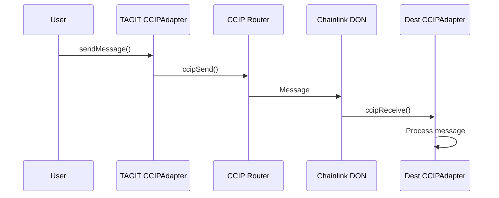

# CCIPAdapter

Chainlink Cross-Chain Interoperability Protocol (CCIP) adapter for cross-chain asset verification and messaging.

## Overview

CCIPAdapter enables TAG IT Network to communicate with other blockchains, allowing cross-chain asset verification, ownership proofs, and token transfers.

## Supported Operations

| Operation | Direction | Description |
|-----------|-----------|-------------|
| Verify Request | Inbound | Request verification from another chain |
| Verify Response | Outbound | Send verification proof to another chain |
| Ownership Proof | Outbound | Prove asset ownership cross-chain |
| Token Bridge | Bidirectional | Bridge TAGIT tokens |

## Supported Chains

| Chain | Chain Selector | Status |
|-------|----------------|--------|
| Ethereum | `5009297550715157269` | Active |
| Polygon | `4051577828743386545` | Active |
| Arbitrum | `4949039107694359620` | Active |
| Base | `15971525489660198786` | Coming Soon |

## Contract Interface

```solidity
interface ICCIPAdapter {
    // Message sending
    function sendMessage(
        uint64 destinationChainSelector,
        address receiver,
        bytes calldata data
    ) external payable returns (bytes32 messageId);

    // Verification requests
    function requestVerification(
        uint64 destinationChainSelector,
        uint256 tokenId
    ) external payable returns (bytes32 messageId);

    // Token bridging
    function bridgeTokens(
        uint64 destinationChainSelector,
        address receiver,
        uint256 amount
    ) external payable returns (bytes32 messageId);

    // Fee estimation
    function estimateFee(
        uint64 destinationChainSelector,
        bytes calldata data
    ) external view returns (uint256);

    // CCIP receiver (called by Router)
    function ccipReceive(Client.Any2EVMMessage calldata message) external;
}
```

## Message Flow



## Key Functions

### sendMessage

Sends an arbitrary message to another chain.

```solidity
function sendMessage(
    uint64 destinationChainSelector,
    address receiver,
    bytes calldata data
) external payable returns (bytes32 messageId);
```

### requestVerification

Requests asset verification from the destination chain.

```solidity
function requestVerification(
    uint64 destinationChainSelector,
    uint256 tokenId
) external payable returns (bytes32 messageId);
```

### bridgeTokens

Bridges TAGIT tokens to another chain.

```solidity
function bridgeTokens(
    uint64 destinationChainSelector,
    address receiver,
    uint256 amount
) external payable returns (bytes32 messageId);
```

## Events

```solidity
event MessageSent(bytes32 indexed messageId, uint64 indexed destinationChainSelector, address receiver);
event MessageReceived(bytes32 indexed messageId, uint64 indexed sourceChainSelector, address sender);
event VerificationRequested(bytes32 indexed messageId, uint256 indexed tokenId);
event TokensBridged(bytes32 indexed messageId, address indexed receiver, uint256 amount);
```

## Security

- Only accepts messages from verified CCIP Router
- Rate limiting on inbound messages
- Message validation before processing
- Emergency pause functionality

## Related

- [Architecture Overview](../architecture/overview.md) — System design
- [ORACULS Stack](../architecture/oraculs-stack.md) — Interoperability layer
- [TAGITCore](./tagit-core.md) — Asset verification
