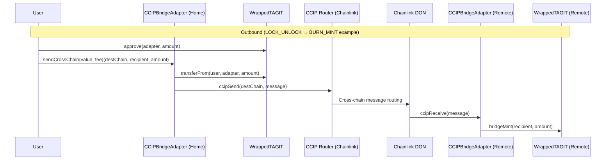

# CCIPBridgeAdapter

Cross-chain wTAG token bridge adapter using [Chainlink CCIP](https://chain.link/cross-chain). Enables wTAG transfers between Base, Arbitrum, and OP Mainnet with dual-mode operation, replay protection, and emergency pause.

> **Related docs**:
> [Notion Wiki](https://www.notion.so/3314e3e9a2d3811d8e51ecace686d4a8) ·
> [GitHub Wiki](https://github.com/TAG-IT-NETWORK/tagit-bridge/wiki/CCIP-Bridge-Adapter) ·
> [tagit-bridge PR #1](https://github.com/TAG-IT-NETWORK/tagit-bridge/pull/1)

---

## Overview

`CCIPBridgeAdapter` implements the Chainlink CCIP message receiver interface to move wTAG across EVM chains. Each deployment operates in one of two modes:

| Mode | Chain Role | On Send | On Receive |
|------|-----------|---------|------------|
| `LOCK_UNLOCK` | Home chain (OP Mainnet) | Locks wTAG in adapter | Unlocks wTAG to recipient |
| `BURN_MINT` | Remote chains (Base, Arbitrum) | Burns wTAG from sender | Mints wTAG to recipient |

`WrappedTAGIT` (wTAG) is the ERC-20 token bridged by this adapter. Its `bridgeMint` / `bridgeBurn` entry points are gated to `onlyBridge` — the one-time-configured adapter address.

---

## Contracts

| File | Description |
|------|-------------|
| `src/CCIPBridgeAdapter.sol` | Main bridge adapter (379 lines) |
| `src/WrappedTAGIT.sol` | ERC-20 wTAG with bridge-controlled mint/burn |
| `src/interfaces/ICCIPBridgeAdapter.sol` | Full interface + NatSpec |
| `script/Deploy_CCIPBridgeAdapter.s.sol` | Foundry deploy script (OP Sepolia) |
| `test/CCIPBridgeAdapterOutbound.t.sol` | 19 outbound Forge tests (1000 fuzz runs) |
| `test/CCIPBridgeAdapterInbound.t.sol` | 13 inbound Forge tests (1000 fuzz runs) |
| `test/mocks/MockCCIPRouter.sol` | Isolated test harness |

---

## Interface Reference (`ICCIPBridgeAdapter`)

### Enumerations

```solidity
enum BridgeMode {
    LOCK_UNLOCK, // Home chain: lock on send, unlock on receive
    BURN_MINT    // Remote chain: burn on send, mint on receive
}
```

### Structs

```solidity
struct DestChainConfig {
    uint64  chainSelector;   // Chainlink CCIP chain selector
    address remoteAdapter;   // CCIPBridgeAdapter address on destination
    uint256 gasLimit;        // Override gas for ccipReceive (0 = DEFAULT_GAS_LIMIT)
    bool    enabled;         // Whether this destination is active
}

struct TransferRecord {
    bytes32 transferId;  // keccak256(abi.encode(srcChain, nonce))
    address sender;
    address recipient;
    uint256 amount;
    uint64  destChain;
    uint256 timestamp;
    bool    processed;   // Replay protection flag
}
```

### Core Functions

#### `sendCrossChain`

Initiates an outbound bridge transfer to a configured destination chain.

```solidity
function sendCrossChain(
    uint64  destChain,   // CCIP chain selector for destination
    address recipient,   // Token recipient on destination
    uint256 amount       // Amount of wTAG (18 decimals)
) external payable returns (bytes32 transferId);
```

- **LOCK_UNLOCK mode**: transfers `amount` wTAG from caller into the adapter (locked).
- **BURN_MINT mode**: calls `wTAG.bridgeBurn(caller, amount)`.
- Reverts with `UnsupportedChain`, `ZeroAmount`, or `InsufficientFee` if preconditions fail.

#### `ccipReceive`

Called by the CCIP Router when a cross-chain message arrives. Not for direct invocation.

```solidity
function ccipReceive(
    Client.Any2EVMMessage calldata message
) external; // onlyRouter
```

- Validates source chain selector and sender address against allowlist.
- Checks `transferId` for replay (`TransferAlreadyProcessed` revert if duplicate).
- **LOCK_UNLOCK mode**: transfers locked wTAG to recipient.
- **BURN_MINT mode**: calls `wTAG.bridgeMint(recipient, amount)`.

#### `estimateFee`

Returns the CCIP fee (in native ETH) for a given transfer.

```solidity
function estimateFee(
    uint64  destChain,
    address recipient,
    uint256 amount
) external view returns (uint256 fee);
```

### Admin Functions

```solidity
// Configure a new destination chain (onlyOwner)
function configureDestChain(DestChainConfig calldata config) external;

// Disable a destination chain (onlyOwner)
function removeDestChain(uint64 chainSelector) external;

// Emergency halt — blocks new outbound transfers (onlyOwner)
function pause() external;

// Resume transfers (onlyOwner)
function unpause() external;
```

### View Functions

```solidity
function getTransfer(bytes32 transferId) external view returns (TransferRecord memory);
function isDestChainSupported(uint64 chainSelector) external view returns (bool);
function getDestChainConfig(uint64 chainSelector) external view returns (DestChainConfig memory);
function bridgeMode()      external view returns (BridgeMode);
function wTag()            external view returns (address);
function router()          external view returns (address);
function isPaused()        external view returns (bool);
function lockedBalance()   external view returns (uint256); // LOCK_UNLOCK only
function version()         external pure returns (string memory);
```

---

## WrappedTAGIT (wTAG)

```solidity
// One-time bridge adapter configuration (onlyOwner)
function setBridgeAdapter(address bridge) external;

// Mint new wTAG — callable only by the configured bridge adapter
function bridgeMint(address to, uint256 amount) external; // onlyBridge

// Burn wTAG — callable only by the configured bridge adapter
function bridgeBurn(address from, uint256 amount) external; // onlyBridge

// Check if bridge adapter has been set
function isBridgeConfigured() external view returns (bool);
```

---

## Events

```solidity
// Emitted on every outbound transfer
event CrossChainSent(
    bytes32 indexed transferId,
    address indexed sender,
    address indexed recipient,
    uint64           destChain,
    uint256          amount,
    bytes32          ccipMessageId
);

// Emitted on every successful inbound delivery
event CrossChainReceived(
    bytes32 indexed transferId,
    address indexed recipient,
    uint64           sourceChain,
    uint256          amount
);

// Admin events
event DestChainConfigured(uint64 indexed chainSelector, address indexed remoteAdapter, uint256 gasLimit);
event DestChainRemoved(uint64 indexed chainSelector);
event BridgePaused(address indexed by);
event BridgeUnpaused(address indexed by);

// wTAG events
event BridgeAdapterSet(address indexed bridge, address indexed setter);
event BridgeMinted(address indexed to, uint256 amount);
event BridgeBurned(address indexed from, uint256 amount);
```

---

## Custom Errors

```solidity
error ZeroAddress();
error ZeroAmount();
error UnsupportedChain(uint64 chainSelector);
error UnknownSender(uint64 chainSelector, address sender);
error InsufficientFee(uint256 required, uint256 provided);
error TransferAlreadyProcessed(bytes32 transferId);
error ContractPaused();
error NotRouter(address caller);
error NotOwner(address caller);
error InsufficientLockedBalance(uint256 available, uint256 requested);
error ChainAlreadyConfigured(uint64 chainSelector);

// wTAG errors
error NotBridge(address caller);
error BridgeAlreadySet();
```

---

## Architecture: Cross-Chain Transfer Flow



---

## Constants

| Constant | Value | Description |
|----------|-------|-------------|
| `DEFAULT_GAS_LIMIT` | `300_000` | Default gas for `ccipReceive` |
| `MAX_TRANSFER_AMOUNT` | `100_000_000 ether` | Per-tx cap (100M wTAG) |

---

## Supported Chains (Testnet)

| Chain | CCIP Selector | Router Address |
|-------|--------------|----------------|
| OP Sepolia (home) | `5224473277236331295` | `0x114A20A10b43D4115e5aeef7345a1A71d2a60C57` |
| Arbitrum Sepolia | `3478487238524512106` | — |
| Base Sepolia | `10344971235874465080` | — |

---

## Deployment

```bash
forge script script/Deploy_CCIPBridgeAdapter.s.sol \
  --rpc-url $OP_SEPOLIA_RPC_URL \
  --private-key $DEPLOYER_KEY \
  --broadcast --verify
```

**Environment variables:**

| Variable | Description |
|----------|-------------|
| `OP_SEPOLIA_RPC_URL` | OP Sepolia RPC endpoint |
| `DEPLOYER_KEY` | Deployer private key (uint256) |
| `BRIDGE_OWNER` | Admin address (defaults to deployer) |

**Post-deploy steps:**
1. Call `configureDestChain()` for each destination
2. Deploy remote adapters on Arbitrum / Base Sepolia in `BURN_MINT` mode
3. Fund adapter with ETH for CCIP fees

---

## Testing

```bash
forge test -vvv                        # Run all 32 tests
forge test --match-contract Outbound   # 19 outbound tests
forge test --match-contract Inbound    # 13 inbound tests
```

All tests run with **1000 fuzz iterations** (`foundry.toml` `[fuzz] runs = 1000`).

---

## Security Notes

- **Replay protection**: Every transfer tracked by `transferId = keccak256(abi.encode(sourceChainSelector, nonce))`. Duplicate IDs revert with `TransferAlreadyProcessed`.
- **Sender allowlist**: `ccipReceive` validates source chain selector + sender address against `DestChainConfig.remoteAdapter`. Unknown senders revert with `UnknownSender`.
- **Reentrancy**: `ReentrancyGuard` (`nonReentrant`) on both `sendCrossChain` and `ccipReceive`.
- **Slither**: 0 high / 0 medium findings in project code (OZ library informational notes only).

> **Pre-mainnet advisory items** (see [PR #1](https://github.com/TAG-IT-NETWORK/tagit-bridge/pull/1)):
> 1. Silent ETH refund failure on excess CCIP fee (line 191)
> 2. Wrong revert type on `MAX_TRANSFER_AMOUNT` guard (line 122)
> 3. No emergency ETH withdrawal for owner (line 379)

---

## Related

- [CCIPAdapter (legacy messaging)](./ccip-adapter.md) — Cross-chain verification messages
- [Architecture Overview](../architecture/overview.md) — ORACULS stack
- [Token Overview](../token/tokenomics.md) — wTAG economics
- [tagit-bridge PR #1](https://github.com/TAG-IT-NETWORK/tagit-bridge/pull/1) — Implementation PR
