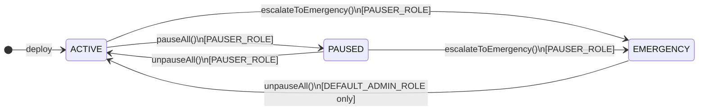

# EmergencyPauseCoordinator

Unified emergency pause coordinator for all TAG IT PRD-017 protocol contracts. A single admin call atomically pauses every registered contract; a role-based circuit-breaker with three lifecycle states governs escalation and recovery.

- **Contracts PR**: [tagit-contracts #8](https://github.com/TAG-IT-NETWORK/tagit-contracts/pull/8)
- **Docs PR**: [tagit-docs #7](https://github.com/TAG-IT-NETWORK/tagit-docs/pull/7)
- **Notion**: [Emergency Pause Coordinator — Feature Overview](https://www.notion.so/3334e3e9a2d3813384bdfb20b410409d)
- **GitHub Wiki**: [EmergencyPauseCoordinator Developer Reference](https://github.com/TAG-IT-NETWORK/tagit-docs/blob/main/wiki/EmergencyPauseCoordinator.md)

## Contract Address

| Network | Address | Status |
|---------|---------|--------|
| OP Sepolia | TBD | Pending deployment |
| OP Mainnet | TBD | Pending |

## Overview

`EmergencyPauseCoordinator` maintains a registry of `IEmergencyPauseable` contracts (all PRD-017 participants: wTAG, Voucher, AgentRegistry, AgentWallet, AgentEscrow, VoucherMigrator) and provides atomic batch pause/unpause with a three-state circuit-breaker.

A single `PAUSER_ROLE` call to `pauseAll()` iterates the registry and invokes `coordinatorPause()` on each contract. Individual failures are swallowed and surfaced as `ContractPauseFailed` events, ensuring a single misbehaving contract never blocks the batch. Escalation to `EMERGENCY` state locks recovery behind `DEFAULT_ADMIN_ROLE`, providing a multi-sig-only kill switch.

## Contract Details

| Property | Value |
|----------|-------|
| **File** | `src/emergency/EmergencyPauseCoordinator.sol` |
| **Interface** | `src/interfaces/IEmergencyPauseCoordinator.sol` |
| **Inherits** | AccessControl (OpenZeppelin), IEmergencyPauseCoordinator |
| **License** | MIT |
| **Solidity** | `^0.8.20` |
| **Author** | TAG IT Network `<dev@tagit.network>` |

## Circuit-Breaker Lifecycle States



| State | Description | Who Can Clear |
|-------|-------------|---------------|
| `ACTIVE` | Protocol operating normally | — |
| `PAUSED` | All registered contracts paused; recoverable | `PAUSER_ROLE` |
| `EMERGENCY` | Emergency lockdown; admin-only recovery | `DEFAULT_ADMIN_ROLE` |

## Constructor

```solidity
constructor(address admin, address pauser)
```

| Parameter | Type | Description |
|-----------|------|-------------|
| `admin` | `address` | Receives `DEFAULT_ADMIN_ROLE` |
| `pauser` | `address` | Receives `PAUSER_ROLE` for initial operator |

Reverts `ZeroAddress()` if either argument is `address(0)`. Initialises system state to `ACTIVE`.

## Role Summary

| Role | Constant | Capabilities |
|------|----------|-------------|
| `DEFAULT_ADMIN_ROLE` | `0x00` | Register/deregister contracts; clear `EMERGENCY` state via `unpauseAll()` |
| `PAUSER_ROLE` | `keccak256("PAUSER_ROLE")` | `pauseAll()`, `unpauseAll()` (from `PAUSED`), `escalateToEmergency()` |

## Functions

### Registry Management

#### `registerContract`

```solidity
function registerContract(address contractAddress) external onlyRole(DEFAULT_ADMIN_ROLE)
```

Register a contract for coordinated pause management. The contract must implement `IEmergencyPauseable`.

| Reverts | Condition |
|---------|-----------|
| `ZeroAddress()` | `contractAddress == address(0)` |
| `NotAContract(address)` | `contractAddress.code.length == 0` |
| `AlreadyRegistered(address)` | Contract already in registry |

#### `deregisterContract`

```solidity
function deregisterContract(address contractAddress) external onlyRole(DEFAULT_ADMIN_ROLE)
```

Remove a contract from coordinated pause management.

| Reverts | Condition |
|---------|-----------|
| `ZeroAddress()` | `contractAddress == address(0)` |
| `NotRegistered(address)` | Contract not in registry |

### Pause / Unpause

#### `pauseAll`

```solidity
function pauseAll() external onlyRole(PAUSER_ROLE)
```

Atomically pause all registered contracts. Transitions system state from `ACTIVE` to `PAUSED`. Individual contract failures emit `ContractPauseFailed` and do not revert the batch.

| Reverts | Condition |
|---------|-----------|
| `AlreadyPaused()` | System state is not `ACTIVE` |

#### `unpauseAll`

```solidity
function unpauseAll() external
```

Atomically unpause all registered contracts. Transitions state to `ACTIVE`.

| Caller | Required State |
|--------|---------------|
| `PAUSER_ROLE` | `PAUSED` |
| `DEFAULT_ADMIN_ROLE` | `EMERGENCY` |

| Reverts | Condition |
|---------|-----------|
| `NotPaused()` | System state is already `ACTIVE` |
| `EmergencyRequiresAdmin()` | Caller lacks `DEFAULT_ADMIN_ROLE` when in `EMERGENCY` |

#### `escalateToEmergency`

```solidity
function escalateToEmergency() external onlyRole(PAUSER_ROLE)
```

Escalate to `EMERGENCY` state. If called from `ACTIVE`, first executes the full batch pause before setting state. Once in `EMERGENCY`, only `DEFAULT_ADMIN_ROLE` can call `unpauseAll()`.

| Reverts | Condition |
|---------|-----------|
| `InvalidSystemState(current, required)` | Already in `EMERGENCY` |

### View Functions

#### `getRegistry`

```solidity
function getRegistry() external view returns (address[] memory)
```

Returns the full list of registered contract addresses.

#### `isRegistered`

```solidity
function isRegistered(address contractAddress) external view returns (bool)
```

Returns `true` if the address is in the pause registry.

#### `systemState`

```solidity
function systemState() external view returns (SystemState)
```

Returns the current circuit-breaker state (`ACTIVE`, `PAUSED`, or `EMERGENCY`).

#### `registeredCount`

```solidity
function registeredCount() external view returns (uint256)
```

Returns the count of registered contracts.

## IEmergencyPauseable Interface

Any contract participating in coordinated pauses must implement:

```solidity
interface IEmergencyPauseable {
    event CoordinatorUpdated(address indexed oldCoordinator, address indexed newCoordinator);

    error OnlyCoordinator(address caller, address coordinator);
    error CoordinatorZeroAddress();

    function coordinatorPause() external;
    function coordinatorUnpause() external;
    function setCoordinator(address coordinator) external;
    function coordinator() external view returns (address);
}
```

> Only the registered `EmergencyPauseCoordinator` address can call `coordinatorPause()` / `coordinatorUnpause()`.

## Events

| Event | Signature | Emitted When |
|-------|-----------|-------------|
| `ContractRegistered` | `(address indexed contractAddress, address indexed registeredBy)` | Admin registers a contract |
| `ContractDeregistered` | `(address indexed contractAddress, address indexed deregisteredBy)` | Admin deregisters a contract |
| `PauseTriggered` | `(address indexed triggeredBy, uint256 contractCount, uint256 timestamp)` | `pauseAll()` or `escalateToEmergency()` from `ACTIVE` |
| `UnpauseTriggered` | `(address indexed triggeredBy, uint256 contractCount, uint256 timestamp)` | `unpauseAll()` completes |
| `SystemStateChanged` | `(SystemState indexed oldState, SystemState indexed newState, address indexed changedBy)` | Any state transition |
| `ContractPauseFailed` | `(address indexed contractAddress, bytes reason)` | A batch target reverts; does not halt batch |

## Custom Errors

| Error | Parameters | Meaning |
|-------|-----------|---------|
| `AlreadyRegistered` | `address contractAddress` | Duplicate registration attempt |
| `NotRegistered` | `address contractAddress` | Deregister/pause target not found |
| `ZeroAddress` | — | Zero address provided |
| `NotAContract` | `address addr` | EOA passed as contract |
| `AlreadyPaused` | — | `pauseAll()` called when not `ACTIVE` |
| `NotPaused` | — | `unpauseAll()` called when `ACTIVE` |
| `InvalidSystemState` | `SystemState current, SystemState required` | State machine invariant violated |
| `EmergencyRequiresAdmin` | — | Non-admin tried to clear `EMERGENCY` |

## Integration: Registering a PRD-017 Contract

```solidity
// Deploy coordinator (typically done once via multisig)
EmergencyPauseCoordinator coordinator = new EmergencyPauseCoordinator(
    multisig,   // admin
    guardian    // initial pauser (multisig or monitoring bot)
);

// Register each PRD-017 contract (admin only)
coordinator.registerContract(address(wTAG));
coordinator.registerContract(address(voucher));
coordinator.registerContract(address(agentRegistry));
// ... etc.

// Each contract must set the coordinator address
wTAG.setCoordinator(address(coordinator));
```

## Security Notes

- The circuit-breaker pattern ensures `EMERGENCY` state can only be cleared by multi-sig `DEFAULT_ADMIN_ROLE`.
- Individual contract pause failures are isolated — they emit `ContractPauseFailed` and never abort the batch, preventing a DoS on the emergency system itself.
- Registry mutations (register/deregister) are admin-only and validated against EOA addresses.
- All lifecycle state transitions emit `SystemStateChanged`, providing a complete on-chain audit trail.

## Test Coverage

| File | Tests | Notes |
|------|-------|-------|
| `test/EmergencyPauseCoordinator.t.sol` | 473 lines | Unit tests: registration, state transitions, role checks, error paths |
| `test/EmergencyPauseIntegration.t.sol` | 245 lines | Integration: pause-all → verify-all-revert → selective-unpause flow |
| `test/mocks/MockPauseableContract.sol` | 55 lines | `IEmergencyPauseable` mock for harness |
