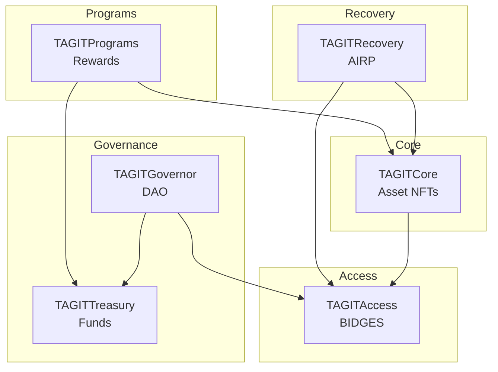

# Smart Contracts Overview

TAG IT Network smart contract architecture and documentation.

## Contract Modules

TAG IT Network consists of 6 core smart contract modules:

| Module | Purpose | Documentation |
|--------|---------|---------------|
| **TAGITCore** | Asset NFTs, lifecycle, verification | [View](./tagit-core.md) |
| **TAGITAccess** | BIDGES badges, role management | [View](./tagit-access.md) |
| **TAGITRecovery** | AIRP, quarantine, dispute resolution | [View](./tagit-recovery.md) |
| **TAGITGovernor** | Multi-house DAO governance | [View](./tagit-governor.md) |
| **TAGITTreasury** | Protocol funds, fee distribution | [View](./tagit-treasury.md) |
| **TAGITPrograms** | Rewards, customs, recalls | [View](./tagit-programs.md) |

## Architecture Diagram

## Deployment Addresses

### OP Sepolia (Testnet)

| Contract | Address |
|----------|---------|
| TAGITCore | `0x...` |
| TAGITAccess | `0x...` |
| TAGITRecovery | `0x...` |
| TAGITGovernor | `0x...` |
| TAGITTreasury | `0x...` |
| TAGITPrograms | `0x...` |

### OP Mainnet (Production)

*Coming soon*

## Security

All contracts follow these security requirements:

- **ReentrancyGuard** on all state-changing functions
- **Checks-Effects-Interactions** pattern
- **Custom errors** (no string reverts)
- **Input validation** on all parameters
- **Events** for all state changes
- **BIDGES capability checks** for access control

See [Security Documentation](https://github.com/tagit-network/tagit-security) for audit reports.

## Gas Optimization

| Operation | Max Gas |
|-----------|---------|
| `mint()` | < 150,000 |
| `bind()` | < 80,000 |
| `verify()` | < 50,000 |
| `transfer()` | < 100,000 |

## Next Steps

- [TAGITCore](./tagit-core.md) — Asset management
- [TAGITAccess](./tagit-access.md) — Permission system
- [Architecture](../architecture/overview.md) — System design
