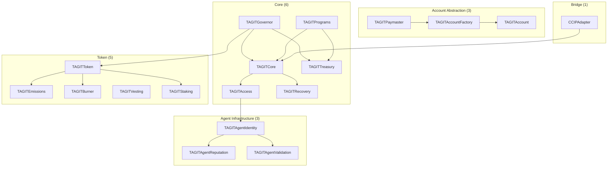
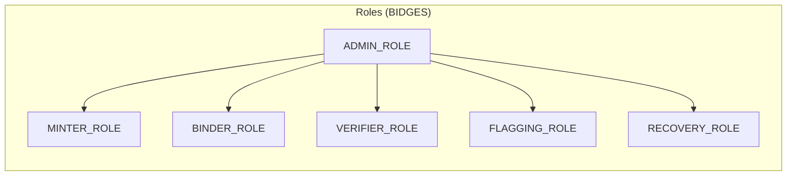

# Smart Contracts

TAG IT Network's on-chain logic is organized into **18 contract modules** across 5 categories.

## Module Overview



## Core Contracts (6)

| Module | Purpose | Key Functions |
|--------|---------|---------------|
| [**TAGITCore**](./tagit-core.md) | Asset NFT, lifecycle, verification | `mint`, `bind`, `verify`, `transfer` |
| [**TAGITAccess**](./tagit-access.md) | BIDGES badges, role-based access | `grantRole`, `revokeRole`, `hasRole` |
| [**TAGITRecovery**](./tagit-recovery.md) | AIRP protocol, quarantine | `initiateRecovery`, `quarantine`, `release` |
| [**TAGITGovernor**](./tagit-governor.md) | Multi-house DAO governance | `propose`, `vote`, `execute` |
| [**TAGITTreasury**](./tagit-treasury.md) | Protocol funds management | `deposit`, `withdraw`, `allocate` |
| [**TAGITPrograms**](./tagit-programs.md) | Rewards, customs, recalls | `createProgram`, `enroll`, `claim` |

## Token Contracts (5)

| Module | Purpose | Key Functions |
|--------|---------|---------------|
| [**TAGITToken**](./tagit-token.md) | ERC-20 governance token | `transfer`, `delegate`, `getVotes` |
| [**TAGITEmissions**](./tagit-emissions.md) | Inflation schedule, rewards | `emit`, `claimRewards`, `setRate` |
| [**TAGITBurner**](./tagit-burner.md) | Deflationary burns | `burn`, `burnFrom`, `totalBurned` |
| [**TAGITVesting**](./tagit-vesting.md) | Token vesting schedules | `createVest`, `release`, `revoke` |
| [**TAGITStaking**](./tagit-staking.md) | Stake tokens, earn rewards | `stake`, `unstake`, `claimRewards` |

## Account Abstraction (3)

| Module | Purpose | Key Functions |
|--------|---------|---------------|
| [**TAGITPaymaster**](./tagit-paymaster.md) | ERC-4337 gas sponsorship | `validatePaymasterUserOp`, `postOp` |
| [**TAGITAccountFactory**](./tagit-account-factory.md) | Create smart wallets | `createAccount`, `getAddress` |
| [**TAGITAccount**](./tagit-account.md) | ERC-4337 smart wallet | `execute`, `validateUserOp` |

## Agent Infrastructure (3) — ERC-8004

| Module | Purpose | Key Functions |
|--------|---------|---------------|
| [**TAGITAgentIdentity**](./agent-identity.md) | Soulbound agent registry | `register`, `setMetadata`, `setAgentWallet` |
| [**TAGITAgentReputation**](./agent-reputation.md) | Feedback & time-weighted scoring | `giveFeedback`, `revokeFeedback`, `getSummary` |
| [**TAGITAgentValidation**](./agent-validation.md) | Multi-party proof verification | `validationRequest`, `validationResponse` |

See [Technosphere Architecture](../architecture/technosphere.md) for the ERC-8004 deep-dive.

## Bridge Contract (1)

| Module | Purpose | Key Functions |
|--------|---------|---------------|
| [**CCIPAdapter**](./ccip-adapter.md) | Chainlink CCIP bridge | `sendMessage`, `receiveMessage` |

## Deployment Addresses

### OP Sepolia (Testnet) — Chain ID: 11155420

> **Last Updated:** February 24, 2026 | All contracts verified on [Blockscout](https://optimism-sepolia.blockscout.com)

#### Core Contracts

| Contract | Address | Status |
|----------|---------|--------|
| TAGITCore | `0x8bde22da889306d422802728cb98b6da42ed8e1a` | ✅ LIVE (UUPS Proxy) |
| TAGITAccess | `0x0611FE60f6E37230bDaf04c5F2Ac2dc9012130a9` | ✅ LIVE |
| IdentityBadge | `0x26F2EBb84664EF1eF8554e15777EBEc6611256A6` | ✅ LIVE |
| CapabilityBadge | `0x5e190F6Ebde4BD1e11a5566a1e81a933cdDf3505` | ✅ LIVE |

#### NIST Phase 3 Contracts (ERC-1967 Proxies)

| Contract | Address | Status |
|----------|---------|--------|
| TAGITRecovery | `0x6138a80c06A5e6a3CB6cc491A3a2c4DF4adD1600` | ✅ LIVE |
| TAGITPaymaster | `0x4339c46D63231063250834D9b3fa4E51FdB8026e` | ✅ LIVE |
| TAGITTreasury | `0xf6f5e2e03f6e28aE9Dc17bCc814a0cf758c887c9` | ✅ LIVE |
| TAGITPrograms | `0xe78DB7702FF5190DAc2F3E09213Ff84bF9efE32b` | ✅ LIVE |
| TAGITStaking | `0x12EE464e32a683f813fDb478e6C8e68E3d63d781` | ✅ LIVE |

#### Account Abstraction (ERC-4337)

| Contract | Address | Status |
|----------|---------|--------|
| TAGITAccount | `0xC159FDec7a8fDc0d98571C89c342e28bB405e682` | ✅ LIVE |
| TAGITAccountFactory | `0x8D27B612a9D3e45d51D2234B2f4e03dCC5ca844b` | ✅ LIVE |

#### Cross-Chain Bridge

| Contract | Address | Status |
|----------|---------|--------|
| CCIPAdapter | `0x8dA6D7ffCD4cc0F2c9FfD6411CeD7C9c573C9E88` | ✅ LIVE |

#### Agent Infrastructure (ERC-8004)

| Contract | Address | Status |
|----------|---------|--------|
| TAGITAgentIdentity | `0xA7f34FD595eBc397Fe04DcE012dbcf0fbbD2A78D` | ✅ LIVE |
| TAGITAgentReputation | `0x57CCa1974DFE29593FBD24fdAEE1cD614Bfd6E4a` | ✅ LIVE |
| TAGITAgentValidation | `0x9806919185F98Bd07a64F7BC7F264e91939e86b7` | ✅ LIVE |

#### Token Contracts (Pending Deployment)

| Contract | Address | Status |
|----------|---------|--------|
| TAGITToken | TBD | 🔜 Pending |
| TAGITEmissions | TBD | 🔜 Pending |
| TAGITBurner | TBD | 🔜 Pending |
| TAGITVesting | TBD | 🔜 Pending |
| TAGITGovernor | TBD | 🔜 Pending |

### OP Mainnet (Production)

> Coming soon

## Access Control Model



| Role | Permissions |
|------|-------------|
| `ADMIN_ROLE` | Full system administration |
| `MINTER_ROLE` | Create new asset NFTs |
| `BINDER_ROLE` | Bind NFC chips to assets |
| `VERIFIER_ROLE` | Submit verification proofs |
| `FLAGGING_ROLE` | Flag assets for disputes |
| `RECOVERY_ROLE` | Execute AIRP recovery |

## Development

### Prerequisites

- [Foundry](https://book.getfoundry.sh/)
- Node.js 18+
- Git

### Clone & Build

```bash
git clone https://github.com/tagit-network/tagit-contracts
cd tagit-contracts
forge install
forge build
```

### Run Tests

```bash
forge test
```

### Deploy to Testnet

```bash
forge script script/Deploy.s.sol --rpc-url op-sepolia --broadcast
```

## Security

All contracts follow these security requirements:

- **ReentrancyGuard** on all state-changing functions
- **Checks-Effects-Interactions** pattern
- **Custom errors** (no string reverts)
- **Input validation** on all parameters
- **Events** for all state changes
- **BIDGES capability checks** for access control

See [Security Documentation](../security/threat-model.md) for threat analysis.

## Gas Optimization

| Operation | Max Gas |
|-----------|---------|
| `mint()` | < 150,000 |
| `bind()` | < 80,000 |
| `verify()` | < 50,000 |
| `transfer()` | < 100,000 |

## Related

- [Technosphere Architecture](../architecture/technosphere.md)
- [Architecture Overview](../architecture/overview.md)
- [Token Documentation](../token/tokenomics.md)
- [API Reference](../api/overview.md)
- [SDK Documentation](../sdk/overview.md)
