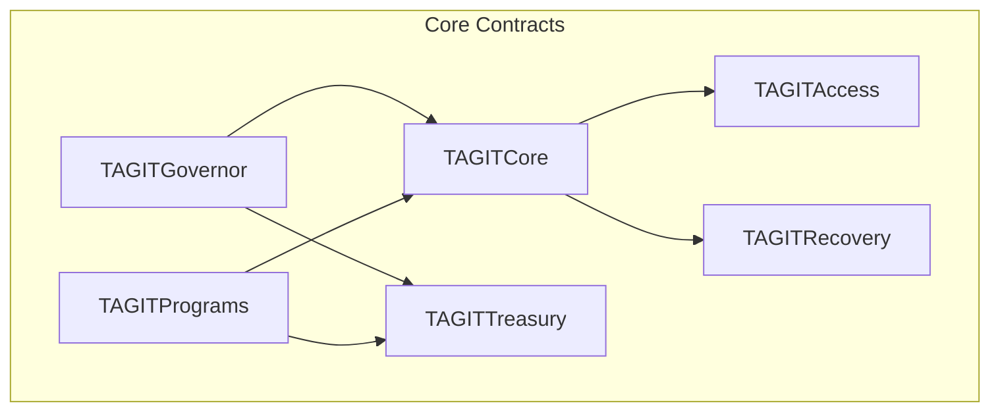
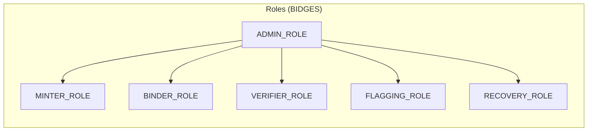

# Smart Contracts

TAG IT Network's on-chain logic is organized into **6 core contract modules**.

## Module Overview



## Modules

| Module | Purpose | Key Functions |
|--------|---------|---------------|
| [**TAGITCore**](./tagit-core.md) | Asset NFT, lifecycle, verification | `mint`, `bind`, `verify`, `transfer` |
| [**TAGITAccess**](./tagit-access.md) | BIDGES badges, role-based access | `grantRole`, `revokeRole`, `hasRole` |
| [**TAGITRecovery**](./tagit-recovery.md) | AIRP protocol, quarantine | `initiateRecovery`, `quarantine`, `release` |
| [**TAGITGovernor**](./tagit-governor.md) | Multi-house DAO governance | `propose`, `vote`, `execute` |
| [**TAGITTreasury**](./tagit-treasury.md) | Protocol funds management | `deposit`, `withdraw`, `allocate` |
| [**TAGITPrograms**](./tagit-programs.md) | Rewards, customs, recalls | `createProgram`, `enroll`, `claim` |

## Access Control Model



| Role | Permissions |
|------|-------------|
| `ADMIN_ROLE` | Full system administration |
| `MINTER_ROLE` | Create new asset NFTs |
| `BINDER_ROLE` | Bind NFC chips to assets |
| `VERIFIER_ROLE` | Submit verification proofs |
| `FLAGGING_ROLE` | Flag assets for disputes |
| `RECOVERY_ROLE` | Execute AIRP recovery |

## Deployment Addresses

### OP Sepolia (Testnet)

| Contract | Address |
|----------|---------|
| TAGITCore | `0x...` (TBD) |
| TAGITAccess | `0x...` (TBD) |
| TAGITRecovery | `0x...` (TBD) |
| TAGITGovernor | `0x...` (TBD) |
| TAGITTreasury | `0x...` (TBD) |
| TAGITPrograms | `0x...` (TBD) |

### OP Mainnet (Production)

> Coming soon

## Development

### Prerequisites

- [Foundry](https://book.getfoundry.sh/)
- Node.js 18+
- Git

### Clone & Build

```bash
git clone https://github.com/tagit-network/tagit-contracts
cd tagit-contracts
forge install
forge build
```

### Run Tests

```bash
forge test
```

### Deploy to Testnet

```bash
forge script script/Deploy.s.sol --rpc-url op-sepolia --broadcast
```

## Security

All contracts follow these security requirements:

- **ReentrancyGuard** on all state-changing functions
- **Checks-Effects-Interactions** pattern
- **Custom errors** (no string reverts)
- **Input validation** on all parameters
- **Events** for all state changes
- **BIDGES capability checks** for access control

See [Security Documentation](https://github.com/tagit-network/tagit-security) for audit reports.

## Gas Optimization

| Operation | Max Gas |
|-----------|---------|
| `mint()` | < 150,000 |
| `bind()` | < 80,000 |
| `verify()` | < 50,000 |
| `transfer()` | < 100,000 |

## Related

- [Architecture Overview](../architecture/overview.md)
- [API Reference](../api/overview.md)
- [SDK Documentation](../sdk/overview.md)
