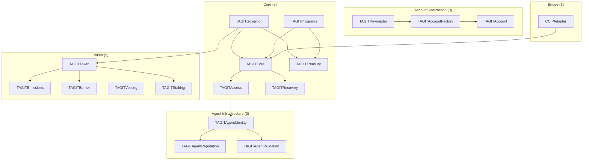
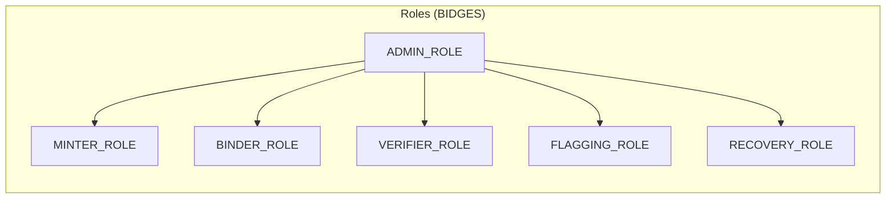

# Smart Contracts

TAG IT Network's on-chain logic is organized into **18 contract modules** across 5 categories.

## Module Overview


```mermaid
flowchart TB
    subgraph "Core (6)"
        A[TAGITCore]
        B[TAGITAccess]
        C[TAGITRecovery]
        D[TAGITGovernor]
        E[TAGITTreasury]
        F[TAGITPrograms]
    end

    subgraph "Token (5)"
        G[TAGITToken]
        H[TAGITEmissions]
        I[TAGITBurner]
        J[TAGITVesting]
        K[TAGITStaking]
    end

    subgraph "Account Abstraction (3)"
        L[TAGITPaymaster]
        M[TAGITAccountFactory]
        N[TAGITAccount]
    end

    subgraph "Agent Infrastructure (3)"
        P[TAGITAgentIdentity]
        Q[TAGITAgentReputation]
        R[TAGITAgentValidation]
    end

    subgraph "Bridge (1)"
        O[CCIPAdapter]
    end

    A --> B
    A --> C
    D --> A & E
    F --> A & E
    G --> H & I & K
    D --> G
    L --> M --> N
    O --> A
    B --> P
    P --> Q & R
```

## Core Contracts (6)

| Module | Purpose | Key Functions |
|--------|---------|---------------|
| [**TAGITCore**](./tagit-core.md) | Asset NFT, lifecycle, verification | `mint`, `bind`, `verify`, `transfer` |
| [**TAGITAccess**](./tagit-access.md) | BIDGES badges, role-based access | `grantRole`, `revokeRole`, `hasRole` |
| [**TAGITRecovery**](./tagit-recovery.md) | AIRP protocol, quarantine | `initiateRecovery`, `quarantine`, `release` |
| [**TAGITGovernor**](./tagit-governor.md) | Multi-house DAO governance | `propose`, `vote`, `execute` |
| [**TAGITTreasury**](./tagit-treasury.md) | Protocol funds management | `deposit`, `withdraw`, `allocate` |
| [**TAGITPrograms**](./tagit-programs.md) | Rewards, customs, recalls | `createProgram`, `enroll`, `claim` |

## Token Contracts (5)

| Module | Purpose | Key Functions |
|--------|---------|---------------|
| [**TAGITToken**](./tagit-token.md) | ERC-20 governance token | `transfer`, `delegate`, `getVotes` |
| [**TAGITEmissions**](./tagit-emissions.md) | Inflation schedule, rewards | `emit`, `claimRewards`, `setRate` |
| [**TAGITBurner**](./tagit-burner.md) | Deflationary burns | `burn`, `burnFrom`, `totalBurned` |
| [**TAGITVesting**](./tagit-vesting.md) | Token vesting schedules | `createVest`, `release`, `revoke` |
| [**TAGITStaking**](./tagit-staking.md) | Stake tokens, earn rewards | `stake`, `unstake`, `claimRewards` |

## Account Abstraction (3)

| Module | Purpose | Key Functions |
|--------|---------|---------------|
| [**TAGITPaymaster**](./tagit-paymaster.md) | ERC-4337 gas sponsorship | `validatePaymasterUserOp`, `postOp` |
| [**TAGITAccountFactory**](./tagit-account-factory.md) | Create smart wallets | `createAccount`, `getAddress` |
| [**TAGITAccount**](./tagit-account.md) | ERC-4337 smart wallet | `execute`, `validateUserOp` |

## Agent Infrastructure (3) — ERC-8004

| Module | Purpose | Key Functions |
|--------|---------|---------------|
| [**TAGITAgentIdentity**](./agent-identity.md) | Soulbound agent registry | `register`, `setMetadata`, `setAgentWallet` |
| [**TAGITAgentReputation**](./agent-reputation.md) | Feedback & time-weighted scoring | `giveFeedback`, `revokeFeedback`, `getSummary` |
| [**TAGITAgentValidation**](./agent-validation.md) | Multi-party proof verification | `validationRequest`, `validationResponse` |

See [Technosphere Architecture](../architecture/technosphere.md) for the ERC-8004 deep-dive.

## Bridge Contract (1)

| Module | Purpose | Key Functions |
|--------|---------|---------------|
| [**CCIPAdapter**](./ccip-adapter.md) | Chainlink CCIP bridge | `sendMessage`, `receiveMessage` |

## Deployment Addresses

### OP Sepolia (Testnet) — Chain ID: 11155420

> **Last Updated:** February 27, 2026 | SEC-AUD-001 fully remediated | [Blockscout](https://optimism-sepolia.blockscout.com)

#### Core Contracts

| Contract | Address | Status |
|----------|---------|--------|
| TAGITCore | `0x8bde22da889306d422802728cb98b6da42ed8e1a` | ✅ LIVE (UUPS Proxy) |
| TAGITAccess | `0x0611FE60f6E37230bDaf04c5F2Ac2dc9012130a9` | ✅ LIVE |
| IdentityBadge | `0x26F2EBb84664EF1eF8554e15777EBEc6611256A6` | ✅ LIVE |
| CapabilityBadge | `0x5e190F6Ebde4BD1e11a5566a1e81a933cdDf3505` | ✅ LIVE |

#### NIST Phase 3 Contracts (ERC-1967 Proxies)

| Contract | Proxy | Implementation | Status |
|----------|-------|----------------|--------|
| TAGITRecovery | `0x17c0af6B37aBD06587303f1695a06A668F8A5A8c` | `0x8d8a5300e8c5E8BaBebd73175954ce01a427CDCe` | ✅ LIVE (v1.1.0) |
| TAGITPaymaster | `0x670DC1C7821E0A717CFf5Cc949B05EC01b532104` | `0x4339c46D63231063250834D9b3fa4E51FdB8026e` | ✅ LIVE |
| TAGITTreasury | `0x018b5c4b5550Bcc0ffe53e2FD0a5D9d1046cad78` | `0xf6f5e2e03f6e28aE9Dc17bCc814a0cf758c887c9` | ✅ LIVE (redeployed) |
| TAGITPrograms | `0x4d1007eB4823a5a13905A0361478C339421ce4C9` | `0x066FB866C0345115FA27a27cC704e8eaC61A565f` | ✅ LIVE (v1.1.0) |
| TAGITStaking | `0xe500CDfbA693CE1f39A6F05CfB4614971370Ee93` | `0x12EE464e32a683f813fDb478e6C8e68E3d63d781` | ✅ LIVE |

#### Account Abstraction (ERC-4337)

| Contract | Address | Status |
|----------|---------|--------|
| TAGITAccount | `0xC159FDec7a8fDc0d98571C89c342e28bB405e682` | ✅ LIVE |
| TAGITAccountFactory | `0x8D27B612a9D3e45d51D2234B2f4e03dCC5ca844b` | ✅ LIVE |

#### Cross-Chain Bridge

| Contract | Address | Status |
|----------|---------|--------|
| CCIPAdapter | `0x8dA6D7ffCD4cc0F2c9FfD6411CeD7C9c573C9E88` | ✅ LIVE |

#### Agent Infrastructure (ERC-8004)

| Contract | Address | Status |
|----------|---------|--------|
| TAGITAgentIdentity | `0xA7f34FD595eBc397Fe04DcE012dbcf0fbbD2A78D` | ✅ LIVE |
| TAGITAgentReputation | `0x57CCa1974DFE29593FBD24fdAEE1cD614Bfd6E4a` | ✅ LIVE |
| TAGITAgentValidation | `0x9806919185F98Bd07a64F7BC7F264e91939e86b7` | ✅ LIVE |

#### Token & Governance Contracts

| Contract | Proxy | Implementation | Status |
|----------|-------|----------------|--------|
| TAGITToken | `0xEe8f9544f0fC0be05408F4d0fa557be99a1cED94` | `0xa6620502d99e00b65dB65daea5bf6fb29B937BC9` | ✅ LIVE (UUPS) |
| TAGITGovernor | `0x53F88a7fa2A7F2062A74c5FeB2Bab1Df29348DD8` | `0xFBbae8ED8EE66CDCf7b528106D66f5254d28E192` | ✅ LIVE (UUPS) |
| TAGITEmissions | TBD | — | 🔜 Pending |
| TAGITBurner | TBD | — | 🔜 Pending |
| TAGITVesting | TBD | — | 🔜 Pending |

### Base Sepolia (Testnet) — Chain ID: 84532

> **Last Updated:** March 30, 2026 | Full 24-contract stack | [Basescan](https://sepolia.basescan.org)

#### Core & Access Control

| Contract | Proxy / Address | Implementation | Status |
|----------|----------------|----------------|--------|
| TAGITCore | `0xAdBAc728205c91F2FfF3194Bf0cAf13457e32b68` | `0x2cb1E0ecE274217F214057c0a829582834Aeaf7f` | UUPS |
| TimelockController | `0xe06e058e1ff18a17a0940C5a0202971bB0feB02a` | — | |
| TAGITAccess | `0x0A729a8D75b896B30a34f96F2e6b7827523826D8` | — | |
| IdentityBadge | `0xa8BbC7f95f5D979e8E9208bc627194384b257c24` | — | |
| CapabilityBadge | `0x676f593c451E4dF2345026af891Acc92c4344455` | — | |

#### Token & Governance

| Contract | Proxy | Implementation | Status |
|----------|-------|----------------|--------|
| TAGITToken | `0x8D4486152f6C8ff24B4e5a1ACF71d05755983a5E` | `0xa14a34dd9D51C5DADC526EC9d95B86dBda8a3D30` | UUPS |
| TAGITGovernor | `0x853848d52d6325f62799412A5aa866be15dfd711` | `0xa51f975F096814DBC1C33E8Ad3aBAa4C52032feB` | UUPS |
| TAGITStaking | `0x40629Cf37077105576d9C53fa909Fd199e0A1285` | `0x3D0d271B8d99BFcb8EC76f2ef0cCB4916f7FA13b` | UUPS |

#### NIST Contracts

| Contract | Proxy | Implementation | Status |
|----------|-------|----------------|--------|
| TAGITRecovery | `0x5bA8335Daa18A8C1e531f96BB498A2d817Feab85` | `0x9de54f758326fE31ae98301F70620FD4a97D8753` | UUPS |
| TAGITTreasury | `0xcA9c7FAD8c4FCFc342Ead99E1354633a9a8F8D42` | `0x48b5238600e6cc7fE05D806b978f059241b6472b` | ERC1967 |
| TAGITPrograms | `0xc359B42ebbEE5Ab1A6f733972A14e82342A0B53D` | `0xDcB9CA7fEb9a4E9ce93E4eF9f46b65c0F9457Cec` | UUPS |
| TAGITPaymaster | `0x065F3eD12D151DCE28E47964c19034b29DBb7ee2` | `0x683A530154468A9E830C47636acaC1A29570115F` | UUPS |

#### Account Abstraction (ERC-4337)

| Contract | Proxy / Address | Implementation | Status |
|----------|----------------|----------------|--------|
| TAGITAccount | `0xB3f757FCa307a7FebA5CA210Cd7D840EC69990e8` | — (singleton) | |
| TAGITAccountFactory | `0xf7eFefc59EB154040Db4C9c2aD9417Ddb10b4936` | `0xFa7E212eEc6E9214c9dDE5bd29C9E1e4eF0894B6` | UUPS |

#### Bridge & Agent Infrastructure

| Contract | Proxy / Address | Implementation | Status |
|----------|----------------|----------------|--------|
| CCIPAdapter | `0x62AFdac497F8b7e8D9365cd98C84c23592EA9471` | `0x6a58eE8f2d50D981b1793868C550727B9c58FbA6` | UUPS |
| TAGITAgentIdentity | `0x3fb24bb463e69cC7F64437B16CA872D08482c055` | — | |
| TAGITAgentReputation | `0x590C96DF31C5d991d22B91436ed100AE9F269965` | — | |
| TAGITAgentValidation | `0xeF4ED1b54501ed78b5f4E34c7ba416f012a14fB3` | — | |

#### Robotics

| Contract | Proxy | Implementation | Status |
|----------|-------|----------------|--------|
| RoboticAuthorizer | `0x38950034556e4DE9B9306b0d3d8563Bba7AcCeF0` | `0xe2E6e29fc99d13eb61fBE08f855814D5b4A549bc` | UUPS |

#### Token Economics (First-Ever Deployment)

| Contract | Proxy / Address | Implementation | Status |
|----------|----------------|----------------|--------|
| TAGITEmissions | `0xB07d2339CeA6aaCDC28582A513026f1E476878A5` | `0x8637905262196843bf669449C8846AF66ce124C0` | UUPS |
| TAGITBurner | `0x4c08cBeCDaef4FC3F3a493d668dd23acBc1f1f84` | `0xA234bc5b6a07FE1f206ce972cf2EE53B42b6AAF5` | UUPS |
| TAGITVesting | `0x52B77395Ebe1F805666F1278cdf121b816e7da8E` | — (non-upgradeable) | |
| IntegrationFactory | `0x10891bb4B541e2498B034A5D5CA1e4C8e5309711` | — (non-upgradeable) | |

#### Escrow (Previously Deployed)

| Contract | Address | Status |
|----------|---------|--------|
| VerificationEscrow | `0x4c9aACfcb64169E3BC187c227c4C0e0a5CFDA1cF` | ✅ Verified |

### OP Mainnet (Production)

> Coming soon

## Access Control Model


```mermaid
flowchart LR
    subgraph "Roles (BIDGES)"
        R1[ADMIN_ROLE]
        R2[MINTER_ROLE]
        R3[BINDER_ROLE]
        R4[VERIFIER_ROLE]
        R5[FLAGGING_ROLE]
        R6[RECOVERY_ROLE]
    end

    R1 --> R2 & R3 & R4 & R5 & R6
```

| Role | Permissions |
|------|-------------|
| `ADMIN_ROLE` | Full system administration |
| `MINTER_ROLE` | Create new asset NFTs |
| `BINDER_ROLE` | Bind NFC chips to assets |
| `VERIFIER_ROLE` | Submit verification proofs |
| `FLAGGING_ROLE` | Flag assets for disputes |
| `RECOVERY_ROLE` | Execute AIRP recovery |

## Development

### Prerequisites

- [Foundry](https://book.getfoundry.sh/)
- Node.js 18+
- Git

### Clone & Build

```bash
git clone https://github.com/tagit-network/tagit-contracts
cd tagit-contracts
forge install
forge build
```

### Run Tests

```bash
forge test
```

### Deploy to Testnet

```bash
forge script script/Deploy.s.sol --rpc-url op-sepolia --broadcast
```

## Security

All contracts follow these security requirements:

- **ReentrancyGuard** on all state-changing functions
- **Checks-Effects-Interactions** pattern
- **Custom errors** (no string reverts)
- **Input validation** on all parameters
- **Events** for all state changes
- **BIDGES capability checks** for access control

See [Security Documentation](../security/threat-model.md) for threat analysis.

## Gas Optimization

| Operation | Max Gas |
|-----------|---------|
| `mint()` | < 150,000 |
| `bind()` | < 80,000 |
| `verify()` | < 50,000 |
| `transfer()` | < 100,000 |

## Related

- [Technosphere Architecture](../architecture/technosphere.md)
- [Architecture Overview](../architecture/overview.md)
- [Token Documentation](../token/tokenomics.md)
- [API Reference](../api/overview.md)
- [SDK Documentation](../sdk/overview.md)
