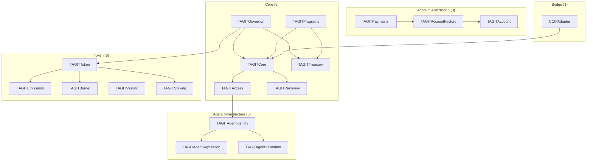
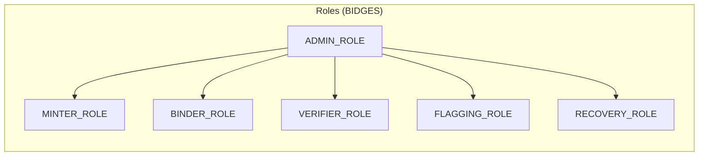

# Smart Contracts

TAG IT Network's on-chain logic is organized into **18 contract modules** across 5 categories.

## Module Overview


```mermaid
flowchart TB
    subgraph "Core (6)"
        A[TAGITCore]
        B[TAGITAccess]
        C[TAGITRecovery]
        D[TAGITGovernor]
        E[TAGITTreasury]
        F[TAGITPrograms]
    end

    subgraph "Token (5)"
        G[TAGITToken]
        H[TAGITEmissions]
        I[TAGITBurner]
        J[TAGITVesting]
        K[TAGITStaking]
    end

    subgraph "Account Abstraction (3)"
        L[TAGITPaymaster]
        M[TAGITAccountFactory]
        N[TAGITAccount]
    end

    subgraph "Agent Infrastructure (3)"
        P[TAGITAgentIdentity]
        Q[TAGITAgentReputation]
        R[TAGITAgentValidation]
    end

    subgraph "Bridge (1)"
        O[CCIPAdapter]
    end

    A --> B
    A --> C
    D --> A & E
    F --> A & E
    G --> H & I & K
    D --> G
    L --> M --> N
    O --> A
    B --> P
    P --> Q & R
```

## Core Contracts (6)

| Module | Purpose | Key Functions |
|--------|---------|---------------|
| [**TAGITCore**](./tagit-core.md) | Asset NFT, lifecycle, verification | `mint`, `bind`, `verify`, `transfer` |
| [**TAGITAccess**](./tagit-access.md) | BIDGES badges, role-based access | `grantRole`, `revokeRole`, `hasRole` |
| [**TAGITRecovery**](./tagit-recovery.md) | AIRP protocol, quarantine | `initiateRecovery`, `quarantine`, `release` |
| [**TAGITGovernor**](./tagit-governor.md) | Multi-house DAO governance | `propose`, `vote`, `execute` |
| [**TAGITTreasury**](./tagit-treasury.md) | Protocol funds management | `deposit`, `withdraw`, `allocate` |
| [**TAGITPrograms**](./tagit-programs.md) | Rewards, customs, recalls | `createProgram`, `enroll`, `claim` |

## Token Contracts (5)

| Module | Purpose | Key Functions |
|--------|---------|---------------|
| [**TAGITToken**](./tagit-token.md) | ERC-20 governance token | `transfer`, `delegate`, `getVotes` |
| [**TAGITEmissions**](./tagit-emissions.md) | Inflation schedule, rewards | `emit`, `claimRewards`, `setRate` |
| [**TAGITBurner**](./tagit-burner.md) | Deflationary burns | `burn`, `burnFrom`, `totalBurned` |
| [**TAGITVesting**](./tagit-vesting.md) | Token vesting schedules | `createVest`, `release`, `revoke` |
| [**TAGITStaking**](./tagit-staking.md) | Stake tokens, earn rewards | `stake`, `unstake`, `claimRewards` |

## Account Abstraction (3)

| Module | Purpose | Key Functions |
|--------|---------|---------------|
| [**TAGITPaymaster**](./tagit-paymaster.md) | ERC-4337 gas sponsorship | `validatePaymasterUserOp`, `postOp` |
| [**TAGITAccountFactory**](./tagit-account-factory.md) | Create smart wallets | `createAccount`, `getAddress` |
| [**TAGITAccount**](./tagit-account.md) | ERC-4337 smart wallet | `execute`, `validateUserOp` |

## Agent Infrastructure (3) — ERC-8004

| Module | Purpose | Key Functions |
|--------|---------|---------------|
| [**TAGITAgentIdentity**](./agent-identity.md) | Soulbound agent registry | `register`, `setMetadata`, `setAgentWallet` |
| [**TAGITAgentReputation**](./agent-reputation.md) | Feedback & time-weighted scoring | `giveFeedback`, `revokeFeedback`, `getSummary` |
| [**TAGITAgentValidation**](./agent-validation.md) | Multi-party proof verification | `validationRequest`, `validationResponse` |

See [Technosphere Architecture](../architecture/technosphere.md) for the ERC-8004 deep-dive.

## Bridge Contract (1)

| Module | Purpose | Key Functions |
|--------|---------|---------------|
| [**CCIPAdapter**](./ccip-adapter.md) | Chainlink CCIP bridge | `sendMessage`, `receiveMessage` |

## Deployment Addresses

### Base Sepolia (Testnet) — Chain ID: 84532

> **Last Updated:** June 27, 2026 | Canonical chain migrated to Base Sepolia | [Basescan](https://sepolia.basescan.org)
>
> Archived: OP Sepolia + Arbitrum Sepolia deployments deprecated 2026-06-27 (history in tagit-contracts).
>
> Proxies are the consumer-facing addresses. Implementation addresses for UUPS proxies are read on-chain via each proxy on [Basescan](https://sepolia.basescan.org).

#### Core Contracts

| Contract | Address | Status |
|----------|---------|--------|
| TAGITCore | `0x3adC7eFdB58Ae85483Eff5D4966D916185F31D1d` | ✅ LIVE (UUPS Proxy) |
| TAGITAccess | `0xb56A1D91995C212342FaA843468F03521340A1D6` | ✅ LIVE |
| IdentityBadge | `0xebdAC9A0663c02a7297681b078aaD893EF345030` | ✅ LIVE |
| CapabilityBadge | `0xb05d22706B08A3F6409601de520cf7A6dbCB573d` | ✅ LIVE |

#### NIST Phase 3 Contracts (ERC-1967 Proxies)

| Contract | Proxy | Implementation | Status |
|----------|-------|----------------|--------|
| TAGITRecovery | `0x6Bc3c69367E586810a3b317fA9F0406504E95866` | TBD (via proxy on Basescan) | ✅ LIVE |
| TAGITPaymaster | `0x6fFfA92eFb419e812d5c9C9D0c1b1A0F5C6FFd1c` | TBD (via proxy on Basescan) | ✅ LIVE |
| TAGITTreasury | `0xa4A3720d705334f409Dd24836Cc75D642125f759` | TBD (via proxy on Basescan) | ✅ LIVE |
| TAGITPrograms | `0x62a3CF048E66Be0119F0CcD97eC964B726B9A982` | TBD (via proxy on Basescan) | ✅ LIVE |
| TAGITStaking | `0xb22F5688559d07e3A12dBB89F0481B967407F267` | TBD (via proxy on Basescan) | ✅ LIVE |

#### Account Abstraction (ERC-4337)

| Contract | Address | Status |
|----------|---------|--------|
| TAGITAccount | `0x2160044C7c46B08a552361595E09e8C8DDD06E85` | ✅ LIVE |
| TAGITAccountFactory | `0x3eD2C0e92f0E52dC68D04172Ad37Df4724893AD3` | ✅ LIVE |

#### Cross-Chain Bridge

| Contract | Address | Status |
|----------|---------|--------|
| CCIPAdapter | `0x5e190F6Ebde4BD1e11a5566a1e81a933cdDf3505` | ✅ LIVE |

#### Agent Infrastructure (ERC-8004)

| Contract | Address | Status |
|----------|---------|--------|
| TAGITAgentIdentity | `0x0611FE60f6E37230bDaf04c5F2Ac2dc9012130a9` | ✅ LIVE |
| TAGITAgentReputation | `0x32be6C82A57d5bCe897538d7dA4109eA0eeB0aA1` | ✅ LIVE |
| TAGITAgentValidation | `0x34766dBa7040C2c8817f1Ee1e448209826DD607e` | ✅ LIVE |

#### Token & Governance Contracts

| Contract | Proxy | Implementation | Status |
|----------|-------|----------------|--------|
| TAGITToken | `0x5f98B83cD7Aef769cc51D2FB739BA49D561170DE` | `0xa412b5C203f74E88f434C405e694528F04cACf59` | ✅ LIVE (UUPS) |
| TAGITGovernor | `0xCF67Df870ECcbB7838c3Ab7876467c89d84DCe89` | TBD (via proxy on Basescan) | ✅ LIVE (UUPS) |
| TAGITEmissions | `0x0672fcc5B753786c2Cd1805494fF094CB5d6e579` | — | ✅ LIVE |
| TAGITBurner | `0xcB8abCe0770c499B789481f8C6c20fa0d6980D2A` | — | ✅ LIVE |
| TAGITVesting | `0x7dd4c98a2aFE60eE06bA5c136dBeb7f93DD2699D` | — | ✅ LIVE |

#### Wrapped Token (Base-only)

| Contract | Address | Status |
|----------|---------|--------|
| wTAG | `0x746385e59aCB225779D64e74200e464a3f1C23d0` | ✅ LIVE |
| wTAGStaking | `0xBd4c4848C9fF09B7955a193E3b96456344D9acBe` | ✅ LIVE |

#### Robotics & Integration

| Contract | Address | Status |
|----------|---------|--------|
| RoboticAuthorizer | `0x5c38684D87E826589eC5ED401d94C9671CAe9F40` | ✅ LIVE |
| IntegrationFactory | `0xd68919371c26700dDb8252aD1825Aa02a0381a86` | ✅ LIVE |

#### Verification & Agent Bond

| Contract | Address | Status |
|----------|---------|--------|
| VerificationEscrow | [`0x4c9aACfcb64169E3BC187c227c4C0e0a5CFDA1cF`](https://sepolia.basescan.org/address/0x4c9aACfcb64169E3BC187c227c4C0e0a5CFDA1cF) | ✅ LIVE |
| ReputationStaking (Agent Credibility Bond) | [`0x4154af74DA2B3a98096317100296966Ade15574A`](https://sepolia.basescan.org/address/0x4154af74DA2B3a98096317100296966Ade15574A) | ✅ LIVE |

### Base Mainnet (Production)

> Planned (post-DAO) — not yet deployed.

## Access Control Model


```mermaid
flowchart LR
    subgraph "Roles (BIDGES)"
        R1[ADMIN_ROLE]
        R2[MINTER_ROLE]
        R3[BINDER_ROLE]
        R4[VERIFIER_ROLE]
        R5[FLAGGING_ROLE]
        R6[RECOVERY_ROLE]
    end

    R1 --> R2 & R3 & R4 & R5 & R6
```

| Role | Permissions |
|------|-------------|
| `ADMIN_ROLE` | Full system administration |
| `MINTER_ROLE` | Create new asset NFTs |
| `BINDER_ROLE` | Bind NFC chips to assets |
| `VERIFIER_ROLE` | Submit verification proofs |
| `FLAGGING_ROLE` | Flag assets for disputes |
| `RECOVERY_ROLE` | Execute AIRP recovery |

## Development

### Prerequisites

- [Foundry](https://book.getfoundry.sh/)
- Node.js 18+
- Git

### Clone & Build

```bash
git clone https://github.com/tagit-network/tagit-contracts
cd tagit-contracts
forge install
forge build
```

### Run Tests

```bash
forge test
```

### Deploy to Testnet

```bash
forge script script/Deploy.s.sol --rpc-url base-sepolia --broadcast
```

## Security

All contracts follow these security requirements:

- **ReentrancyGuard** on all state-changing functions
- **Checks-Effects-Interactions** pattern
- **Custom errors** (no string reverts)
- **Input validation** on all parameters
- **Events** for all state changes
- **BIDGES capability checks** for access control

See [Security Documentation](../security/threat-model.md) for threat analysis.

## Gas Optimization

| Operation | Max Gas |
|-----------|---------|
| `mint()` | < 150,000 |
| `bind()` | < 80,000 |
| `verify()` | < 50,000 |
| `transfer()` | < 100,000 |

## Related

- [Technosphere Architecture](../architecture/technosphere.md)
- [Architecture Overview](../architecture/overview.md)
- [Token Documentation](../token/tokenomics.md)
- [API Reference](../api/overview.md)
- [SDK Documentation](../sdk/overview.md)
