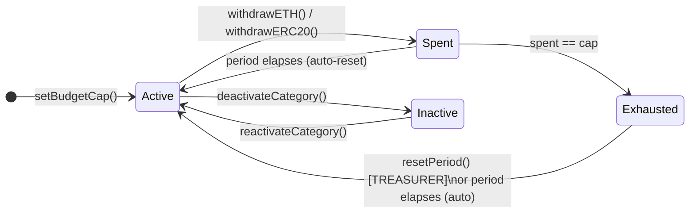

# TAGITOperationalTreasury

Operational treasury for TAG IT Network's day-to-day fund disbursements. Enforces per-category spending caps within configurable time periods. Designed to complement `TAGITTreasury` (governance-level timelocked allocations) with lower-latency operational spending at the Operator / Treasurer tier.

- **Contracts PR**: [tagit-contracts #14](https://github.com/TAG-IT-NETWORK/tagit-contracts/pull/14) · [#13 (initial)](https://github.com/TAG-IT-NETWORK/tagit-contracts/pull/13)
- **Docs PR**: [tagit-docs #11](https://github.com/TAG-IT-NETWORK/tagit-docs/pull/11) · [#10 (initial)](https://github.com/TAG-IT-NETWORK/tagit-docs/pull/10)
- **Notion**: [TAGITOperationalTreasury — Feature Overview](https://www.notion.so/3334e3e9a2d38193ab20cd5975b937c2)
- **GitHub Wiki**: [TAGITOperationalTreasury Developer Reference](https://github.com/TAG-IT-NETWORK/tagit-docs/blob/main/wiki/TAGITOperationalTreasury.md)

## Contract Address

| Network | Address | Status |
|---------|---------|--------|
| OP Sepolia | TBD | Pending deployment |
| OP Mainnet | TBD | Pending |

## Overview

`TAGITOperationalTreasury` holds ETH and ERC-20 tokens used for TAG IT Network operations (payroll, infrastructure, marketing, etc.). Every withdrawal must specify a **budget category** (a `bytes32` key such as `keccak256("OPERATIONS")`). Each category carries a maximum spend cap that resets automatically on a configurable period cadence (default: 30 days).

The contract enforces a three-role hierarchy — OPERATOR, TREASURER, ADMIN — built on OpenZeppelin `AccessControl`. All withdrawal paths are protected by `ReentrancyGuard`, `Pausable`, and the Checks-Effects-Interactions pattern. An emergency sweep function gives `ADMIN_ROLE` full fund evacuation in a single call.

**NIST CSF 2.0 alignment:**

| Control | Mechanism |
|---------|-----------|
| AC-6 Least Privilege | Three-role hierarchy: `OPERATOR_ROLE`, `TREASURER_ROLE`, `ADMIN_ROLE` |
| AU-6 Audit Record Review | Indexed events on all fund movements, cap changes, and period resets |
| CM-3 Configuration Change Control | Cap and period changes restricted to `TREASURER_ROLE` / `ADMIN_ROLE` |

## Contract Details

| Property | Value |
|----------|-------|
| **File** | `src/treasury/TAGITOperationalTreasury.sol` |
| **Interface** | `src/interfaces/ITAGITOperationalTreasury.sol` |
| **Test file** | `test/treasury/TAGITOperationalTreasury.t.sol` (890 lines) |
| **Inherits** | AccessControl, ReentrancyGuard, Pausable, ITAGITOperationalTreasury |
| **License** | MIT |
| **Solidity** | `^0.8.20` |
| **Version** | `1.0.0` |
| **Author** | TAG IT Network `<dev@tagit.network>` |

## Budget Cap Model



- Each category is a `bytes32` key (convention: `keccak256("CATEGORY_NAME")`).
- `setBudgetCap()` creates the category if it doesn't exist; sets its cap and starts the period clock.
- On every withdrawal, `_enforceAndRecordSpend()` auto-resets the period if `block.timestamp >= periodStart + periodDuration`, then checks the remaining allowance.
- `remainingBudget()` is a **view** that respects the auto-reset logic — it returns `cap` in full if the period has elapsed even before any write.

## Role Hierarchy

| Role | `bytes32` | Permissions |
|------|-----------|-------------|
| `OPERATOR_ROLE` | `keccak256("OPERATOR_ROLE")` | Deposit ETH/ERC-20; withdraw within caps |
| `TREASURER_ROLE` | `keccak256("TREASURER_ROLE")` | Set/deactivate/reactivate budget caps; reset periods |
| `ADMIN_ROLE` | `keccak256("ADMIN_ROLE")` | Pause/unpause; set period duration; emergency sweep |
| `DEFAULT_ADMIN_ROLE` | `0x00` | Grant/revoke all roles (deployer initially) |

## Constructor

```solidity
constructor(address admin, address treasurer, address operator)
```

| Parameter | Type | Description |
|-----------|------|-------------|
| `admin` | `address` | Receives `DEFAULT_ADMIN_ROLE` + `ADMIN_ROLE` |
| `treasurer` | `address` | Receives `TREASURER_ROLE` |
| `operator` | `address` | Receives `OPERATOR_ROLE` |

Reverts with `ZeroAddress()` if any argument is `address(0)`. Sets `_periodDuration` to `DEFAULT_PERIOD_DURATION` (30 days).

## Data Structures

### BudgetCap

```solidity
struct BudgetCap {
    uint256 cap;          // Maximum spend per period (wei / token units)
    uint256 spent;        // Amount spent in current period
    uint48  periodStart;  // Timestamp when current period started
    bool    active;       // Whether this category is active
}
```

Storage-packed for gas efficiency. `periodStart` is `uint48` (sufficient until year 2814).

## Function Reference

### Deposit Functions

#### `depositETH`

```solidity
function depositETH() external payable
```

Deposits ETH from `OPERATOR_ROLE`. Reverts `ZeroAmount()` if `msg.value == 0`. Emits `ETHDeposited`.

> The bare `receive()` fallback also accepts ETH from any sender (e.g., protocol contract transfers) and emits `ETHDeposited` without role enforcement.

#### `depositERC20`

```solidity
function depositERC20(address token, uint256 amount) external
```

| Parameter | Type | Description |
|-----------|------|-------------|
| `token` | `address` | ERC-20 token contract address |
| `amount` | `uint256` | Token amount (token decimals) |

Pulls tokens from `msg.sender` via `safeTransferFrom`. Requires prior `approve`. Reverts `ZeroAddress()` / `ZeroAmount()`. Emits `ERC20Deposited`.

### Withdrawal Functions

#### `withdrawETH`

```solidity
function withdrawETH(bytes32 category, address to, uint256 amount) external
```

| Parameter | Type | Description |
|-----------|------|-------------|
| `category` | `bytes32` | Budget category key |
| `to` | `address` | Recipient address |
| `amount` | `uint256` | ETH amount in wei |

Enforces budget cap, records spend, then transfers ETH via low-level `call`. CEI pattern: effects (`_enforceAndRecordSpend`) before interactions (ETH transfer). Requires `OPERATOR_ROLE`. Reverts when paused. Emits `ETHWithdrawn`.

**Possible reverts:** `ZeroAddress`, `ZeroAmount`, `CategoryNotFound`, `CategoryNotActive`, `WithdrawalExceedsCap`, `ETHTransferFailed`.

#### `withdrawERC20`

```solidity
function withdrawERC20(bytes32 category, address token, address to, uint256 amount) external
```

| Parameter | Type | Description |
|-----------|------|-------------|
| `category` | `bytes32` | Budget category key |
| `token` | `address` | ERC-20 contract address |
| `to` | `address` | Recipient address |
| `amount` | `uint256` | Token amount |

Identical cap enforcement flow to `withdrawETH`; uses `SafeERC20.safeTransfer`. Requires `OPERATOR_ROLE`. Emits `ERC20Withdrawn`.

### Admin Functions

#### `setBudgetCap`

```solidity
function setBudgetCap(bytes32 category, uint256 cap) external  // TREASURER_ROLE
```

Creates or updates the budget cap for `category`. Initializes `periodStart` to `block.timestamp` on first call. Reverts `ZeroCap()` if `cap == 0`. Emits `BudgetCapUpdated(category, oldCap, newCap)`.

#### `deactivateCategory`

```solidity
function deactivateCategory(bytes32 category) external  // TREASURER_ROLE
```

Blocks all withdrawals for `category`. Reverts `CategoryNotFound` if category doesn't exist; `CategoryNotActive` if already inactive. Emits `CategoryDeactivated`.

#### `reactivateCategory`

```solidity
function reactivateCategory(bytes32 category) external  // TREASURER_ROLE
```

Re-enables withdrawals for `category`. Reverts `CategoryAlreadyExists` if already active. Emits `CategoryReactivated`.

#### `resetPeriod`

```solidity
function resetPeriod(bytes32 category) external  // TREASURER_ROLE
```

Zeroes `spent` and restarts `periodStart` for `category`. Use to grant a mid-period budget refresh without waiting for the auto-reset. Emits `PeriodReset`.

#### `setPeriodDuration`

```solidity
function setPeriodDuration(uint48 newDuration) external  // ADMIN_ROLE
```

Updates the global period duration. Must be within `[MIN_PERIOD_DURATION, MAX_PERIOD_DURATION]` (1–365 days). Emits `PeriodDurationUpdated`.

#### `pause` / `unpause`

```solidity
function pause()   external  // ADMIN_ROLE
function unpause() external  // ADMIN_ROLE
```

Pauses / unpauses all withdrawal functions. Deposits are unaffected. Uses OpenZeppelin `Pausable`.

#### `emergencySweep`

```solidity
function emergencySweep(address token, address to) external  // ADMIN_ROLE
```

Sweeps the contract's entire balance of `token` to `to`. Pass `address(0)` for `token` to sweep ETH. Intended for emergency fund recovery. Emits `EmergencySweep`.

### View Functions

#### `getBudgetCap`

```solidity
function getBudgetCap(bytes32 category) external view returns (BudgetCap memory)
```

Returns the `BudgetCap` struct. If the current period has elapsed, the returned struct reflects `spent = 0` and an updated `periodStart` (the on-chain storage is not mutated by this view).

#### `remainingBudget`

```solidity
function remainingBudget(bytes32 category) external view returns (uint256)
```

Returns the amount still available for withdrawal in the current period. Returns `cap` in full if the period has elapsed; `0` if category is inactive or has no cap.

#### `periodDuration`

```solidity
function periodDuration() external view returns (uint48)
```

Returns the global period duration in seconds.

#### `version`

```solidity
function version() external pure returns (string memory)
```

Returns `"1.0.0"`.

## Event Schemas

| Event | Signature | Indexed Fields |
|-------|-----------|----------------|
| `ETHDeposited` | `(address from, uint256 amount)` | `from` |
| `ERC20Deposited` | `(address token, address from, uint256 amount)` | `token`, `from` |
| `ETHWithdrawn` | `(bytes32 category, address to, uint256 amount)` | `category`, `to` |
| `ERC20Withdrawn` | `(bytes32 category, address token, address to, uint256 amount)` | `category`, `token`, `to` |
| `BudgetCapUpdated` | `(bytes32 category, uint256 oldCap, uint256 newCap)` | `category` |
| `CategoryDeactivated` | `(bytes32 category)` | `category` |
| `CategoryReactivated` | `(bytes32 category)` | `category` |
| `PeriodReset` | `(bytes32 category, uint48 newPeriodStart)` | `category` |
| `PeriodDurationUpdated` | `(uint48 oldDuration, uint48 newDuration)` | — |
| `EmergencySweep` | `(address token, address to, uint256 amount)` | `token`, `to` |

## Custom Errors

| Error | Trigger |
|-------|---------|
| `ZeroAddress()` | `address(0)` passed where forbidden |
| `ZeroAmount()` | `amount == 0` passed to deposit/withdraw |
| `Unauthorized(address caller, bytes32 role)` | Caller missing required role |
| `WithdrawalExceedsCap(bytes32 category, uint256 requested, uint256 remaining)` | Withdrawal would exceed budget cap |
| `CategoryNotActive(bytes32 category)` | Withdrawal on deactivated category |
| `CategoryAlreadyExists(bytes32 category)` | `reactivateCategory` on already-active category |
| `CategoryNotFound(bytes32 category)` | Operation on non-existent category |
| `ETHTransferFailed(address to, uint256 amount)` | Low-level ETH transfer reverted |
| `InvalidPeriodDuration(uint48 duration)` | Duration outside `[1 day, 365 days]` |
| `ZeroCap()` | `setBudgetCap` called with `cap == 0` |

## Constants

| Constant | Value | Description |
|----------|-------|-------------|
| `DEFAULT_PERIOD_DURATION` | `30 days` | Period duration on deploy |
| `MIN_PERIOD_DURATION` | `1 days` | Minimum allowed period |
| `MAX_PERIOD_DURATION` | `365 days` | Maximum allowed period |

## Security Model

- **Checks-Effects-Interactions**: `_enforceAndRecordSpend` (storage write) always runs before the ETH/token transfer call.
- **ReentrancyGuard**: All deposit and withdrawal functions are `nonReentrant`.
- **Pausable**: Emergency circuit breaker on all withdrawal paths via `ADMIN_ROLE`.
- **SafeERC20**: All ERC-20 transfers use OpenZeppelin's `safeTransfer` / `safeTransferFrom`.
- **Role separation**: Operators cannot change caps; Treasurers cannot pause or sweep; Admins cannot withdraw (they would need `OPERATOR_ROLE` separately).

## Integration Example

```solidity
// 1. Deploy
TAGITOperationalTreasury treasury = new TAGITOperationalTreasury(
    adminAddr,
    treasurerAddr,
    operatorAddr
);

// 2. Treasurer sets up budget categories
bytes32 OPS   = keccak256("OPERATIONS");
bytes32 INFRA = keccak256("INFRASTRUCTURE");

vm.prank(treasurer);
treasury.setBudgetCap(OPS,   2_800 ether);   // $2,800 equivalent / 30 days
treasury.setBudgetCap(INFRA, 1_000 ether);

// 3. Operator deposits ETH
vm.prank(operator);
treasury.depositETH{value: 5_000 ether}();

// 4. Operator withdraws for operational spend
vm.prank(operator);
treasury.withdrawETH(OPS, vendor, 500 ether);

// 5. Check remaining budget
uint256 remaining = treasury.remainingBudget(OPS);
// remaining == 2_300 ether
```

## Test Suite Summary

`test/treasury/TAGITOperationalTreasury.t.sol` — **890 lines**, Foundry (`forge-std`).

| Category | Coverage |
|----------|---------|
| Initialization | Role assignments, version, default period duration |
| Constructor reverts | `ZeroAddress` for all three constructor args |
| Deposits (ETH + ERC-20) | Happy path, zero amount revert, role enforcement, `receive()` fallback |
| Withdrawals (ETH + ERC-20) | Cap enforcement, auto-period reset, paused revert, role enforcement, zero args |
| Budget cap management | `setBudgetCap`, `deactivateCategory`, `reactivateCategory`, `resetPeriod` — all paths |
| Period duration | `setPeriodDuration`, boundary values, `InvalidPeriodDuration` |
| Pause / unpause | `pause`, `unpause`, role enforcement |
| Emergency sweep | ETH sweep, ERC-20 sweep, zero-recipient revert |
| View functions | `getBudgetCap` period-elapsed projection, `remainingBudget` all states |
| Fuzz | Withdrawal amounts, cap values, period durations |

Test actors: `admin`, `treasurer`, `operator`, `alice`, `bob`, `unauthorized`.
Budget categories under test: `OPERATIONS`, `MARKETING`, `INFRASTRUCTURE`.
