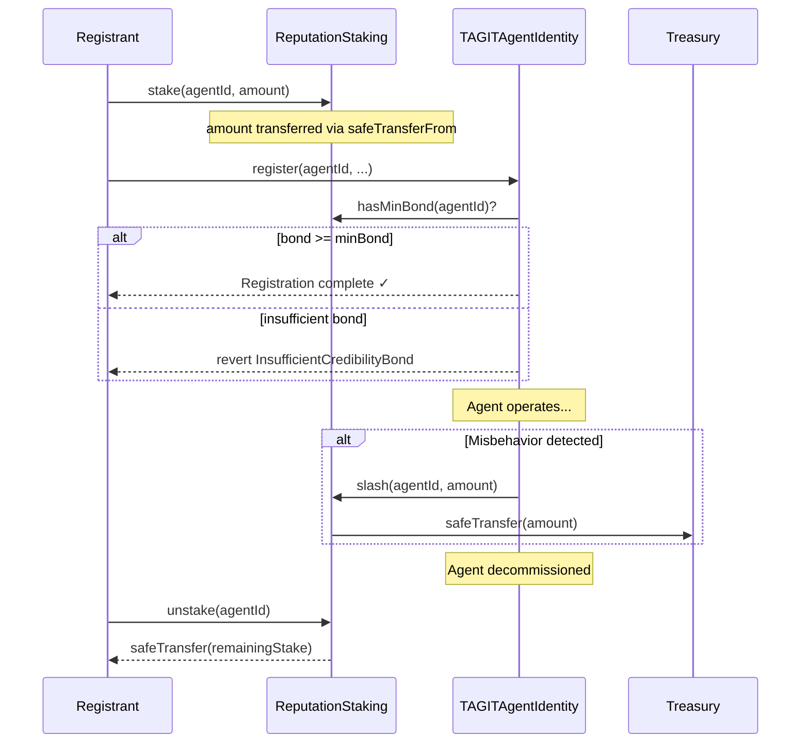

# ReputationStaking

On-chain credibility bond mechanism for AI agents registered via ERC-8004. Agents must stake TAGIT tokens as economic skin-in-the-game before completing registration. Part of the [Technosphere](../architecture/technosphere.md) ERC-8004 infrastructure.

- **GitHub PR**: [tagit-contracts #7](https://github.com/TAG-IT-NETWORK/tagit-contracts/pull/7)
- **Notion**: [AI Agent Ambassador + Pre-Token System](https://www.notion.so/3304e3e9a2d3813a92a9dd5a154c6582)
- **GitHub Wiki**: [ReputationStaking Developer Reference](https://github.com/TAG-IT-NETWORK/tagit-contracts/wiki/ReputationStaking)

## Contract Address

| Network | Address | Status |
|---------|---------|--------|
| OP Sepolia | TBD | Pending deployment |
| OP Mainnet | TBD | Pending |

## Overview

`ReputationStaking` enforces a **credibility bond**: an agent registrant must stake a minimum amount of TAGIT tokens before registration can complete in `TAGITAgentIdentity`. If an agent misbehaves, governance can **slash** the bond — transferring tokens to the treasury. Once an agent reaches the `DECOMMISSIONED` lifecycle state, the original staker may **unstake** and reclaim their remaining bond.

The staking contract is optional and can be enabled or disabled per deployment by setting it on `TAGITAgentIdentity`.

## Contract Details

| Property | Value |
|----------|-------|
| **Inherits** | Ownable, Pausable, ReentrancyGuard |
| **License** | MIT |
| **Solidity** | ^0.8.20 |
| **Token** | TAGIT ERC-20 |
| **Default Min Bond** | 100 TAGIT (`DEFAULT_MIN_BOND = 100 * 1e18`) |

## Credibility Bond Lifecycle



### Lifecycle State Requirement

Unstaking is gated on the agent's lifecycle state:

| Lifecycle State | Can Unstake? |
|-----------------|-------------|
| `ACTIVE` | No — `AgentStillActive` |
| `SUSPENDED` | No — `AgentStillActive` |
| `DECOMMISSIONED` | **Yes** |

## Functions

### stake

Deposits TAGIT tokens as a credibility bond for a specific agent. The caller must be the agent's registrant (verified via `TAGITAgentIdentity`).

Follows Checks-Effects-Interactions pattern. Guarded by `nonReentrant` and `whenNotPaused`.

#### Parameters

| Name | Type | Description |
|------|------|-------------|
| `agentId` | `uint256` | Agent ID to stake for |
| `amount` | `uint256` | TAGIT token amount (18 decimals) |

#### Access Control

Caller must be the agent's registrant address as recorded in `TAGITAgentIdentity.getAgent(agentId)`.

#### Solidity

```solidity
function stake(uint256 agentId, uint256 amount) external;
```

#### SDK Example

```typescript
// Approve the staking contract first
await tagitToken.approve(reputationStakingAddress, parseUnits("100", 18));

// Stake 100 TAGIT as credibility bond
await reputationStaking.stake(agentId, parseUnits("100", 18));
```

---

### unstake

Withdraws the full remaining staked balance for an agent. Only callable by the original staker (registrant). Agent **must** be in `DECOMMISSIONED` lifecycle state.

Follows Checks-Effects-Interactions pattern. Guarded by `nonReentrant` and `whenNotPaused`.

#### Parameters

| Name | Type | Description |
|------|------|-------------|
| `agentId` | `uint256` | Agent ID to unstake from |

#### Solidity

```solidity
function unstake(uint256 agentId) external;
```

#### SDK Example

```typescript
await reputationStaking.unstake(agentId);
// Full remaining stake returned to registrant
```

---

### slash

Slashes a portion of an agent's staked bond for misbehavior. Slashed tokens are transferred to the treasury. Only callable by the contract owner (governance or `TAGITAgentIdentity` deployer).

Follows Checks-Effects-Interactions pattern. Guarded by `nonReentrant` and `onlyOwner`.

#### Parameters

| Name | Type | Description |
|------|------|-------------|
| `agentId` | `uint256` | Agent ID to slash |
| `amount` | `uint256` | Token amount to slash (must not exceed current stake) |

#### Access Control

`onlyOwner` — governance multisig or `TAGITAgentIdentity` deployer.

#### Solidity

```solidity
function slash(uint256 agentId, uint256 amount) external;
```

---

### View Functions

#### getStake

```solidity
function getStake(uint256 agentId) external view returns (uint256);
```

Returns the current staked token amount for an agent.

#### getMinBond

```solidity
function getMinBond() external view returns (uint256);
```

Returns the minimum bond amount required for registration. Defaults to `DEFAULT_MIN_BOND` (100 TAGIT).

#### hasMinBond

```solidity
function hasMinBond(uint256 agentId) external view returns (bool);
```

Returns `true` if the agent's stake meets or exceeds `minBond`. Called by `TAGITAgentIdentity` during registration.

#### getStaker

```solidity
function getStaker(uint256 agentId) external view returns (address);
```

Returns the staker (registrant) address for an agent. Returns `address(0)` if no stake exists.

---

### Admin Functions

| Function | Access | Description |
|----------|--------|-------------|
| `setAgentIdentity(address)` | Owner | Set `TAGITAgentIdentity` contract reference |
| `setMinBond(uint256)` | Owner | Update minimum bond requirement |
| `setTreasury(address)` | Owner | Update treasury address for slashed tokens |
| `pause()` | Owner | Emergency pause (blocks stake/unstake) |
| `unpause()` | Owner | Resume operations |

## TAGITAgentIdentity Integration

`TAGITAgentIdentity` was updated in this PR to enforce credibility bonds during agent registration:

### New State Variable

```solidity
/// @notice Optional reputation staking contract for credibility bond enforcement
IReputationStaking public reputationStaking;
```

### New Admin Function

```solidity
/**
 * @notice Set the ReputationStaking contract for credibility bond enforcement
 * @param stakingContract Address of the ReputationStaking contract (address(0) to disable)
 */
function setReputationStaking(address stakingContract) external onlyOwner;
```

### Registration Gate

When `reputationStaking` is set, `TAGITAgentIdentity.register()` calls `hasMinBond(agentId)` and reverts with `InsufficientCredibilityBond(agentId)` if the stake is insufficient:

```solidity
if (address(reputationStaking) != address(0)) {
    if (!reputationStaking.hasMinBond(agentId)) {
        revert InsufficientCredibilityBond(agentId);
    }
}
```

### New Error

```solidity
error InsufficientCredibilityBond(uint256 agentId);
```

### New Event

```solidity
event ReputationStakingUpdated(address indexed previousStaking, address indexed newStaking);
```

## Events

| Event | Parameters | Description |
|-------|------------|-------------|
| `StakeDeposited` | `agentId (indexed), staker (indexed), amount` | Bond deposited for an agent |
| `StakeWithdrawn` | `agentId (indexed), staker (indexed), amount` | Bond reclaimed after decommission |
| `StakeSlashed` | `agentId (indexed), amount, slashedBy (indexed)` | Bond slashed for misbehavior |
| `MinBondUpdated` | `oldMinBond, newMinBond` | Minimum bond threshold changed |
| `TreasuryUpdated` | `oldTreasury (indexed), newTreasury (indexed)` | Treasury address changed |

## Errors

```solidity
error ZeroAddress();
error ZeroAmount();
error Unauthorized();
error NoStakeToWithdraw(uint256 agentId);
error SlashExceedsStake(uint256 agentId, uint256 slashAmount, uint256 currentStake);
error AgentStillActive(uint256 agentId);
error InsufficientBond(uint256 agentId, uint256 current, uint256 required);
error NotAgentRegistrant(address caller, uint256 agentId);
error AgentIdentityNotSet();
```

## Constants

| Constant | Value | Description |
|----------|-------|-------------|
| `DEFAULT_MIN_BOND` | `100 * 1e18` | Default minimum bond (100 TAGIT) |

## Security Considerations

- **CEI pattern** — All state-changing functions follow Checks-Effects-Interactions order
- **ReentrancyGuard** — `nonReentrant` on `stake`, `unstake`, and `slash`
- **SafeERC20** — All token transfers use OpenZeppelin `SafeERC20`
- **Pausable** — Emergency circuit breaker on `stake` and `unstake` (slash is unaffected to ensure governance can always act)
- **Caller verification** — `stake` verifies caller is the registrant via `TAGITAgentIdentity.getAgent()`
- **Lifecycle gate** — `unstake` is blocked until agent reaches `DECOMMISSIONED` lifecycle state
- **Slash cap** — `slash` reverts with `SlashExceedsStake` if amount exceeds current stake

## Test Coverage

| Suite | Tests | Description |
|-------|-------|-------------|
| `test/unit/agent/ReputationStaking.t.sol` | 545 lines | Unit tests: stake, unstake, slash, admin, edge cases |
| `test/integration/Phase3Integration.t.sol` | 284 lines | Integration tests with TAGITAgentIdentity |

## Related

- [TAGITAgentIdentity](./agent-identity.md) — Agent registry with credibility bond enforcement
- [TAGITAgentReputation](./agent-reputation.md) — Time-weighted feedback scoring
- [TAGITAgentValidation](./agent-validation.md) — Agent proof verification
- [wTAG](../token/wtag.mdx) — Governance pre-token (Token House voting)
- [Voucher](../token/voucher.mdx) — Non-transferable reward token
- [Contracts Overview](./index.md) — All contracts
