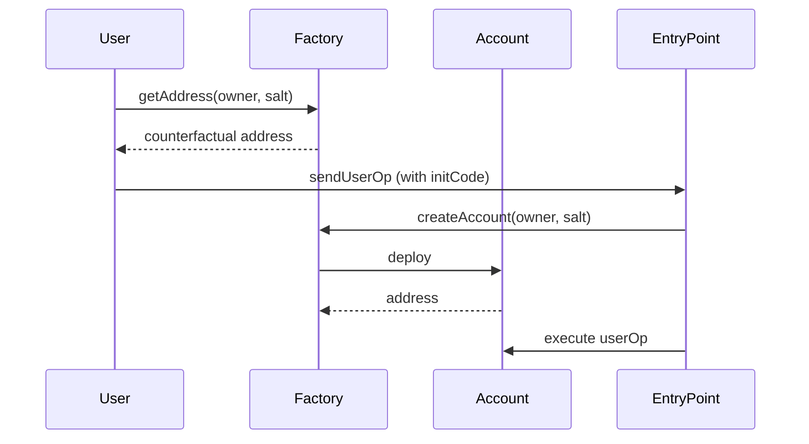

# TAGITAccountFactory

Factory contract for deploying TAGITAccount smart wallets.

## Overview

TAGITAccountFactory creates deterministic smart wallet addresses for users, enabling gasless onboarding and account abstraction features.

## Contract Interface

```solidity
interface ITAGITAccountFactory {
    // Account creation
    function createAccount(
        address owner,
        uint256 salt
    ) external returns (address account);

    // Address computation
    function getAddress(
        address owner,
        uint256 salt
    ) external view returns (address);

    // View functions
    function accountImplementation() external view returns (address);
    function entryPoint() external view returns (address);
}
```

## Key Functions

### createAccount

Creates a new smart wallet for the specified owner.

```solidity
function createAccount(
    address owner,
    uint256 salt
) external returns (address account);
```

### getAddress

Computes the counterfactual address for a wallet.

```solidity
function getAddress(
    address owner,
    uint256 salt
) external view returns (address);
```

## Deployment Flow



## Events

```solidity
event AccountCreated(address indexed account, address indexed owner);
```

## Related

- [TAGITAccount](./tagit-account.md) — Smart wallet implementation
- [TAGITPaymaster](./tagit-paymaster.md) — Gas sponsorship
