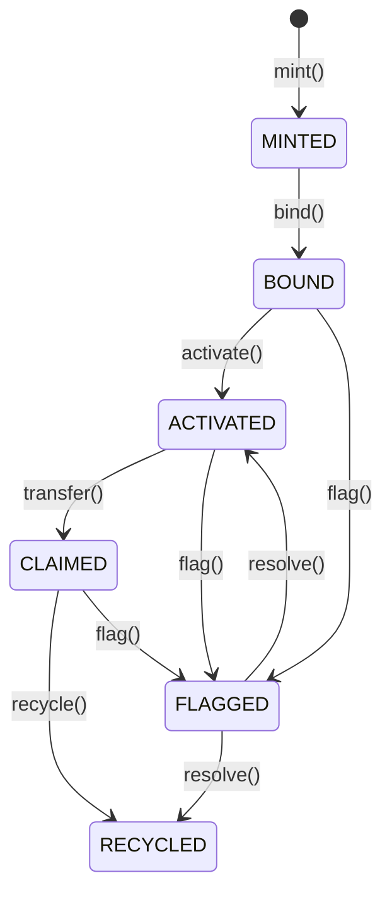

# TAGITCore

Core asset management contract for Digital Twin NFTs.

## Overview

TAGITCore is the central contract managing asset NFTs, their lifecycle states, and verification logic. It implements ERC-721 with extensions for the TAG IT lifecycle state machine.

## Contract Details

| Property | Value |
|----------|-------|
| **Standard** | ERC-721 + Extensions |
| **Inherits** | ERC721, ReentrancyGuard, Pausable |
| **License** | MIT |
| **Solidity** | ^0.8.20 |

## Asset Lifecycle



## Functions

### mint

Creates a new asset NFT.

#### Parameters

| Name | Type | Description |
|------|------|-------------|
| `to` | `address` | Recipient address |
| `metadata` | `bytes` | Asset metadata (IPFS hash, etc.) |

#### Returns

| Type | Description |
|------|-------------|
| `uint256` | The new token ID |

#### Access Control

Requires `CAP_MINT` capability.

#### Solidity

```solidity
function mint(address to, bytes calldata metadata) external returns (uint256);
```

#### SDK Example

```typescript
const tokenId = await tagit.core.mint(recipientAddress, metadata);
```

---

### bind

Binds an NFC chip to an asset NFT.

#### Parameters

| Name | Type | Description |
|------|------|-------------|
| `tokenId` | `uint256` | Asset token ID |
| `chipId` | `bytes32` | NFC chip identifier hash |
| `signature` | `bytes` | Chip attestation signature |

#### Access Control

Requires `CAP_BIND` capability.

#### Solidity

```solidity
function bind(uint256 tokenId, bytes32 chipId, bytes calldata signature) external;
```

#### SDK Example

```typescript
await tagit.core.bind(tokenId, chipId, signature);
```

---

### verify

Verifies an asset's authenticity.

#### Parameters

| Name | Type | Description |
|------|------|-------------|
| `tokenId` | `uint256` | Asset token ID |
| `challenge` | `bytes32` | Verification challenge |
| `response` | `bytes` | Chip signature response |

#### Returns

| Type | Description |
|------|-------------|
| `bool` | Verification result |

#### Solidity

```solidity
function verify(
    uint256 tokenId,
    bytes32 challenge,
    bytes calldata response
) external view returns (bool);
```

#### SDK Example

```typescript
const isValid = await tagit.core.verify(tokenId, challenge, response);
```

---

### transfer

Transfers asset ownership.

#### Parameters

| Name | Type | Description |
|------|------|-------------|
| `tokenId` | `uint256` | Asset token ID |
| `to` | `address` | New owner address |

#### Access Control

Must be current owner or approved.

#### Solidity

```solidity
function transfer(uint256 tokenId, address to) external;
```

---

### flag

Flags an asset as suspicious/stolen.

#### Parameters

| Name | Type | Description |
|------|------|-------------|
| `tokenId` | `uint256` | Asset token ID |
| `reason` | `bytes32` | Flag reason code |

#### Access Control

Requires `CAP_FLAG` capability.

#### Solidity

```solidity
function flag(uint256 tokenId, bytes32 reason) external;
```

---

## Events

### AssetMinted

```solidity
event AssetMinted(uint256 indexed tokenId, address indexed to, bytes metadata);
```

### AssetBound

```solidity
event AssetBound(uint256 indexed tokenId, bytes32 indexed chipId, uint256 timestamp);
```

### AssetVerified

```solidity
event AssetVerified(uint256 indexed tokenId, address indexed verifier, bool result);
```

### StateChanged

```solidity
event StateChanged(uint256 indexed tokenId, State from, State to, address indexed actor);
```

## Errors

```solidity
error TokenNotFound(uint256 tokenId);
error InvalidState(uint256 tokenId, State current, State required);
error ChipAlreadyBound(bytes32 chipId);
error Unauthorized(address caller, uint256 capability);
error ZeroAddress();
```

## Security Considerations

- All state-changing functions use `nonReentrant`
- Chip binding is **irreversible**
- Only `CAP_FLAG` holders can flag assets
- Flagged assets cannot be transferred

## Next Steps

- [TAGITAccess](./tagit-access.md) — Permission management
- [TAGITRecovery](./tagit-recovery.md) — Recovery protocol
- [Contracts Overview](./index.md) — All contracts
