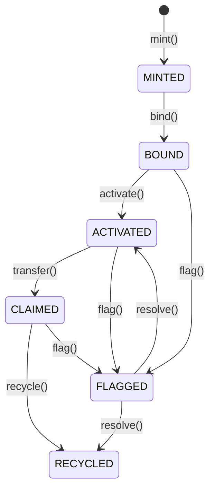

# TAGITCore

Core asset management contract for Digital Twin NFTs.

## Contract Address

| Network | Address | Status |
|---------|---------|--------|
| Base Sepolia | `0x3aDc7EFDb58Ae85483eFf5D4966D916185f31d1D` | ✅ LIVE (UUPS Proxy) |
| Base Mainnet | TBD | 🔜 Planned (post-DAO) |

> Archived: OP Sepolia + Arbitrum Sepolia deployments deprecated 2026-06-27 (history in tagit-contracts).

## Overview

TAGITCore is the central contract managing asset NFTs, their lifecycle states, and verification logic. It implements ERC-721 with extensions for the TAG IT lifecycle state machine.

As of T20 (February 24, 2026), TAGITCore uses a **UUPS proxy pattern** (ERC-1967) for upgradeability. The proxy is governed by a TimelockController owned by a Gnosis Safe multisig.

## Contract Details

| Property | Value |
|----------|-------|
| **Standard** | ERC-721 + Extensions (UUPS Proxy) |
| **Inherits** | ERC721Upgradeable, UUPSUpgradeable, Initializable, ReentrancyGuardUpgradeable, PausableUpgradeable |
| **Proxy** | `0x3aDc7EFDb58Ae85483eFf5D4966D916185f31d1D` |
| **Implementation** | `0x2377B7f33aFf34c58DDF6DeA7eD4dCaD616CA14C` |
| **TimelockController** | `0xfdA2478dB73064eF770f4e5E5b97BC83801126e1` |
| **Gnosis Safe** | TBD (Base governance multisig pending) |
| **License** | MIT |
| **Solidity** | ^0.8.20 |

### Upgrade Architecture

```
Gnosis Safe (multisig) → TimelockController (48h delay) → UUPS Proxy → Implementation
```

- `initialize(address initialOwner)` replaces the constructor
- Upgrades require `upgradeToAndCall()` through the TimelockController
- The proxy emits `Upgraded(address implementation)` on each upgrade

## Asset Lifecycle


```mermaid
stateDiagram-v2
    [*] --> MINTED: mint()
    MINTED --> BOUND: bind()
    BOUND --> ACTIVATED: activate()
    ACTIVATED --> CLAIMED: transfer()
    CLAIMED --> RECYCLED: recycle()
    BOUND --> FLAGGED: flag()
    ACTIVATED --> FLAGGED: flag()
    CLAIMED --> FLAGGED: flag()
    FLAGGED --> ACTIVATED: resolve()
    FLAGGED --> RECYCLED: resolve()
```

## Functions

### mint

Creates a new asset NFT.

#### Parameters

| Name | Type | Description |
|------|------|-------------|
| `to` | `address` | Recipient address |
| `metadata` | `bytes` | Asset metadata (IPFS hash, etc.) |

#### Returns

| Type | Description |
|------|-------------|
| `uint256` | The new token ID |

#### Access Control

Requires `CAP_MINT` capability.

#### Solidity

```solidity
function mint(address to, bytes calldata metadata) external returns (uint256);
```

#### SDK Example

```typescript
const tokenId = await tagit.core.mint(recipientAddress, metadata);
```

---

### bind

Binds an NFC chip to an asset NFT.

#### Parameters

| Name | Type | Description |
|------|------|-------------|
| `tokenId` | `uint256` | Asset token ID |
| `chipId` | `bytes32` | NFC chip identifier hash |
| `signature` | `bytes` | Chip attestation signature |

#### Access Control

Requires `CAP_BIND` capability.

#### Solidity

```solidity
function bind(uint256 tokenId, bytes32 chipId, bytes calldata signature) external;
```

#### SDK Example

```typescript
await tagit.core.bind(tokenId, chipId, signature);
```

---

### verify

Verifies an asset's authenticity.

#### Parameters

| Name | Type | Description |
|------|------|-------------|
| `tokenId` | `uint256` | Asset token ID |
| `challenge` | `bytes32` | Verification challenge |
| `response` | `bytes` | Chip signature response |

#### Returns

| Type | Description |
|------|-------------|
| `bool` | Verification result |

#### Solidity

```solidity
function verify(
    uint256 tokenId,
    bytes32 challenge,
    bytes calldata response
) external view returns (bool);
```

#### SDK Example

```typescript
const isValid = await tagit.core.verify(tokenId, challenge, response);
```

---

### transfer

Transfers asset ownership.

#### Parameters

| Name | Type | Description |
|------|------|-------------|
| `tokenId` | `uint256` | Asset token ID |
| `to` | `address` | New owner address |

#### Access Control

Must be current owner or approved.

#### Solidity

```solidity
function transfer(uint256 tokenId, address to) external;
```

> **Note (September 2026):** the deployed function is `transferAsset(uint256
> tokenId, address to)`, not `transfer`. It stays **owner-gated, not
> capability-gated** — any owner can resell their own `CLAIMED` asset directly,
> with no relayer or capability badge involved. This is separate from the
> owner-actions app flow below (flag / list / delist / recycle), which routes
> through the relayer — direct resale is the one owner action that does not.

---

### flag

Flags an asset as suspicious/stolen.

#### Parameters

| Name | Type | Description |
|------|------|-------------|
| `tokenId` | `uint256` | Asset token ID |
| `reason` | `bytes32` | Flag reason code |

#### Access Control

Requires `CAP_FLAG` capability.

#### Solidity

```solidity
function flag(uint256 tokenId, bytes32 reason) external;
```

> **Note (September 2026):** when an owner reports an item lost or stolen from
> the TAG IT app, this is the function the relayer calls on their behalf — the
> app owner never calls `flag` directly. The relayer's key holds
> `FLAGGER_CAPABILITY` (and `RECYCLER_CAPABILITY`, `RESOLVER_CAPABILITY`); the
> owner's off-chain signature is what authorizes it to act on that specific
> token. See [API Overview](../api/overview.md) and
> [Data Flow](../architecture/data-flow.md).

---

### recycle

Permanently deactivates an asset. Terminal — cannot be undone.

#### Parameters

| Name | Type | Description |
|------|------|-------------|
| `tokenId` | `uint256` | Asset token ID |

#### Access Control

Requires `RECYCLER_CAPABILITY`.

#### Solidity

```solidity
function recycle(uint256 tokenId) external;
```

#### Calling it

As of September 2026, the owner-actions app flow is the main caller: an owner
requests recycling from the app, it is scheduled with a grace period
(`OWNER_RECYCLE_GRACE_MS`, default 24h, cancellable), and the relayer calls
this function once the grace period elapses, after re-checking on-chain
ownership. See [API Overview](../api/overview.md).

---

## Events

### AssetMinted

```solidity
event AssetMinted(uint256 indexed tokenId, address indexed to, bytes metadata);
```

### AssetBound

```solidity
event AssetBound(uint256 indexed tokenId, bytes32 indexed chipId, uint256 timestamp);
```

### AssetVerified

```solidity
event AssetVerified(uint256 indexed tokenId, address indexed verifier, bool result);
```

### StateChanged

```solidity
event StateChanged(uint256 indexed tokenId, State from, State to, address indexed actor);
```

## Errors

```solidity
error TokenNotFound(uint256 tokenId);
error InvalidState(uint256 tokenId, State current, State required);
error ChipAlreadyBound(bytes32 chipId);
error Unauthorized(address caller, uint256 capability);
error ZeroAddress();
```

## Security Considerations

- All state-changing functions use `nonReentrant`
- Chip binding is **irreversible**
- Only `CAP_FLAG` holders can flag assets
- Flagged assets cannot be transferred
- UUPS upgrades gated by TimelockController (48h delay) owned by Gnosis Safe multisig
- `_authorizeUpgrade()` restricted to TimelockController address

## Next Steps

- [TAGITAccess](./tagit-access.md) — Permission management
- [TAGITRecovery](./tagit-recovery.md) — Recovery protocol
- [Contracts Overview](./index.md) — All contracts
