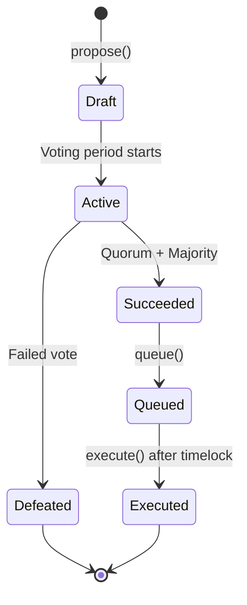

# TAGITGovernor

Multi-house DAO governance contract for TAG IT Network.

## Overview

TAGITGovernor implements a multi-house governance system where different stakeholder groups vote on proposals. This ensures balanced decision-making across the ecosystem.

## Governance Houses

| House | Description | Voting Weight |
|-------|-------------|---------------|
| **Manufacturers** | Brand partners, factories | 30% |
| **Validators** | Verification service providers | 25% |
| **Token Holders** | TAGIT token holders | 25% |
| **Community** | General participants | 20% |

## Proposal Lifecycle



## Functions

### propose

Creates a new governance proposal.

#### Parameters

| Name | Type | Description |
|------|------|-------------|
| `targets` | `address[]` | Target contract addresses |
| `values` | `uint256[]` | ETH values to send |
| `calldatas` | `bytes[]` | Function call data |
| `description` | `string` | Proposal description |

#### Returns

| Type | Description |
|------|-------------|
| `uint256` | Proposal ID |

#### Solidity

```solidity
function propose(
    address[] memory targets,
    uint256[] memory values,
    bytes[] memory calldatas,
    string memory description
) external returns (uint256 proposalId);
```

---

### castVote

Casts a vote on a proposal.

#### Parameters

| Name | Type | Description |
|------|------|-------------|
| `proposalId` | `uint256` | Proposal ID |
| `support` | `uint8` | Vote type (0=Against, 1=For, 2=Abstain) |

#### Solidity

```solidity
function castVote(uint256 proposalId, uint8 support) external;
```

---

### queue

Queues a successful proposal for execution.

#### Parameters

| Name | Type | Description |
|------|------|-------------|
| `proposalId` | `uint256` | Proposal ID |

#### Solidity

```solidity
function queue(uint256 proposalId) external;
```

---

### execute

Executes a queued proposal.

#### Parameters

| Name | Type | Description |
|------|------|-------------|
| `proposalId` | `uint256` | Proposal ID |

#### Solidity

```solidity
function execute(uint256 proposalId) external;
```

---

## Governance Parameters

| Parameter | Value |
|-----------|-------|
| Voting Delay | 1 day |
| Voting Period | 7 days |
| Proposal Threshold | 100,000 TAGIT |
| Quorum | 4% of total supply |
| Timelock | 2 days |

## Events

```solidity
event ProposalCreated(uint256 indexed proposalId, address proposer, string description);
event VoteCast(address indexed voter, uint256 indexed proposalId, uint8 support, uint256 weight);
event ProposalQueued(uint256 indexed proposalId, uint256 eta);
event ProposalExecuted(uint256 indexed proposalId);
```

## Next Steps

- [TAGITTreasury](./tagit-treasury.md) — Protocol funds
- [TAGITAccess](./tagit-access.md) — Permission system
- [Contracts Overview](./index.md) — All contracts
