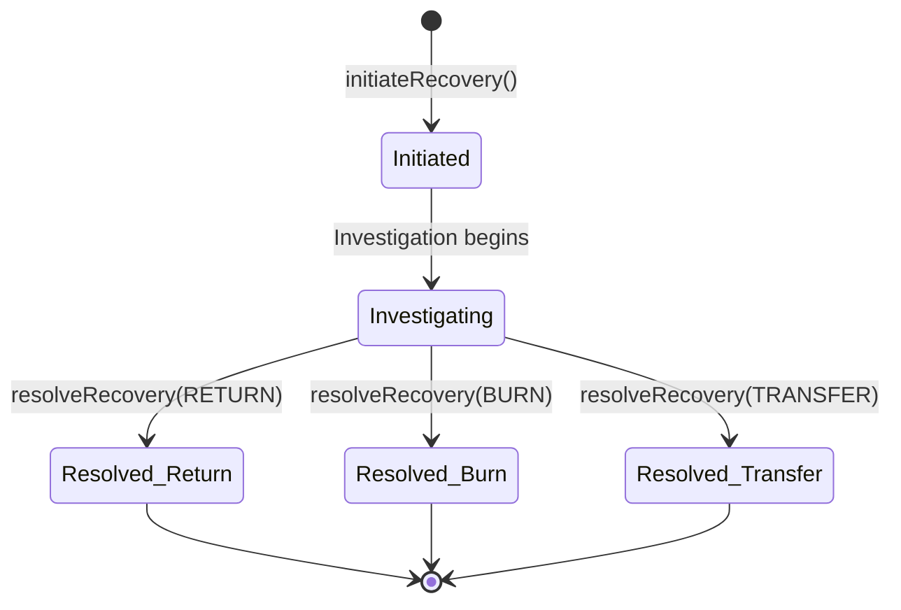

# TAGITRecovery

AIRP (Asset Identity Recovery Protocol) contract for handling lost, stolen, and disputed assets.

## Overview

TAGITRecovery manages the recovery process for assets that have been flagged. It handles quarantine, investigation, and resolution workflows.

## Recovery Flow



## Functions

### initiateRecovery

Starts a recovery case for a flagged asset.

#### Parameters

| Name | Type | Description |
|------|------|-------------|
| `tokenId` | `uint256` | Asset token ID |
| `reason` | `bytes32` | Recovery reason code |
| `evidence` | `bytes` | Supporting evidence (IPFS hash) |

#### Returns

| Type | Description |
|------|-------------|
| `uint256` | Recovery case ID |

#### Access Control

Requires `CAP_RECOVERY_INIT` capability.

#### Solidity

```solidity
function initiateRecovery(
    uint256 tokenId,
    bytes32 reason,
    bytes calldata evidence
) external returns (uint256 caseId);
```

---

### quarantine

Places an asset in quarantine state.

#### Parameters

| Name | Type | Description |
|------|------|-------------|
| `tokenId` | `uint256` | Asset token ID |

#### Access Control

Requires `CAP_FLAG` capability.

#### Solidity

```solidity
function quarantine(uint256 tokenId) external;
```

---

### resolveRecovery

Resolves a recovery case with a decision.

#### Parameters

| Name | Type | Description |
|------|------|-------------|
| `caseId` | `uint256` | Recovery case ID |
| `decision` | `Decision` | Resolution decision |
| `newOwner` | `address` | New owner (if TRANSFER) |

#### Decision Enum

```solidity
enum Decision {
    RETURN,   // Return to original owner
    BURN,     // Permanently deactivate
    TRANSFER  // Transfer to new owner
}
```

#### Access Control

Requires `CAP_RECOVERY_APPROVE` capability.

#### Solidity

```solidity
function resolveRecovery(
    uint256 caseId,
    Decision decision,
    address newOwner
) external;
```

---

### getCaseStatus

Gets the current status of a recovery case.

#### Parameters

| Name | Type | Description |
|------|------|-------------|
| `caseId` | `uint256` | Recovery case ID |

#### Returns

| Name | Type | Description |
|------|------|-------------|
| `status` | `Status` | Case status |
| `tokenId` | `uint256` | Asset token ID |
| `initiator` | `address` | Who initiated |
| `createdAt` | `uint64` | Creation timestamp |

#### Solidity

```solidity
function getCaseStatus(uint256 caseId) external view returns (
    Status status,
    uint256 tokenId,
    address initiator,
    uint64 createdAt
);
```

---

## Events

```solidity
event RecoveryInitiated(uint256 indexed caseId, uint256 indexed tokenId, bytes32 reason);
event AssetQuarantined(uint256 indexed tokenId, address indexed by);
event RecoveryResolved(uint256 indexed caseId, Decision decision, address newOwner);
```

## Reason Codes

| Code | Description |
|------|-------------|
| `LOST` | Asset reported lost |
| `STOLEN` | Asset reported stolen |
| `DISPUTE` | Ownership dispute |
| `RECALL` | Manufacturer recall |
| `FRAUD` | Fraudulent activity detected |

## Security

- Only authorized personnel can initiate recovery
- Resolution requires separate approval capability
- All actions logged on-chain for audit
- Timelock on critical decisions

## Next Steps

- [TAGITCore](./tagit-core.md) — Asset management
- [TAGITAccess](./tagit-access.md) — Permission system
- [Contracts Overview](./index.md) — All contracts
