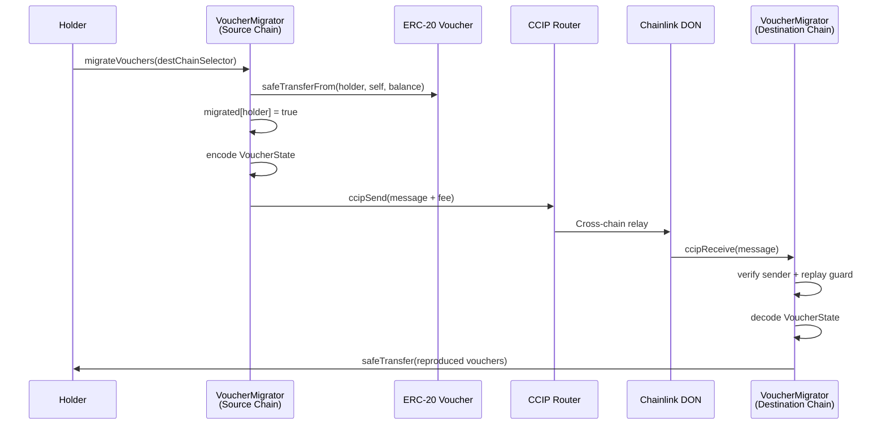

# VoucherMigrator

CCIP-powered cross-chain state bridge that migrates voucher lifecycle states (tier, vesting state, claimed amount) from a source chain to a destination chain. Built on Chainlink CCIP using the same dual-adapter patterns established by [`CCIPBridgeAdapter`](./ccip-adapter.md).

**Implementation PR:** [tagit-bridge#3](https://github.com/TAG-IT-NETWORK/tagit-bridge/pull/3) · **Notion:** [Task 3314e3e9](https://www.notion.so/3314e3e9a2d381db9f97d0ffeaab3c3a) · **GitHub Wiki:** [Voucher Migrator](https://github.com/TAG-IT-NETWORK/tagit-bridge/wiki/Voucher-Migrator)

---

## Overview

| Property | Value |
|----------|-------|
| File | `src/VoucherMigrator.sol` |
| Interface | `src/interfaces/IVoucherMigrator.sol` |
| CCIP transport | Chainlink CCIP (`ccipSend` / `ccipReceive`) |
| Migration guard | One-shot per holder (`migrated[holder] => bool`) |
| Chains | Base → Arbitrum → OP Mainnet (configurable) |
| Access control | `Ownable` + `Pausable` |
| Test coverage | 33 unit tests, 1,000-run fuzz — all pass |
| Static analysis | Slither scan: 0 high / 0 medium findings |

---

## Architecture



---

## Data Structures

### `VoucherState`

Snapshot of a holder's voucher lifecycle state, encoded into the CCIP message payload.

```solidity
struct VoucherState {
    address holder;        // Original voucher holder
    uint256 balance;       // Total voucher balance at snapshot
    uint8   tier;          // Voucher tier (reward tier classification)
    uint256 vestedAmount;  // Amount unlocked by vesting schedule
    uint256 claimedAmount; // Amount already redeemed
}
```

### `DestConfig`

Per-destination-chain configuration registered by the owner.

```solidity
struct DestConfig {
    address migrator; // VoucherMigrator on destination chain
    bool    enabled;  // Chain is allowlisted for migration
}
```

---

## Interface

```solidity
interface IVoucherMigrator {

    // ─────────── Events ───────────

    event VoucherMigrationSent(
        bytes32 indexed messageId,
        uint64  indexed destChainSelector,
        address indexed holder,
        uint256 balance
    );

    event VoucherMigrationReceived(
        bytes32 indexed messageId,
        uint64  indexed sourceChainSelector,
        address indexed holder,
        uint256 balance
    );

    event DestinationConfigured(
        uint64  indexed chainSelector,
        address indexed migrator,
        bool    enabled
    );

    // ─────────── Errors ───────────

    error AlreadyMigrated(address holder);
    error ZeroBalance(address holder);
    error UnsupportedChain(uint64 chainSelector);
    error InsufficientFee(uint256 required, uint256 provided);
    error CallerNotRouter(address caller);
    error UnknownSender(uint64 chainSelector, address sender);
    error ReplayAttack(bytes32 messageId);
    error ZeroAddress();
    error ZeroAmount();

    // ─────────── Functions ───────────

    /// @notice Migrate caller's entire voucher balance to the destination chain.
    /// @dev    Snapshots balance, locks tokens, encodes VoucherState, sends CCIP message.
    ///         Migration guard prevents double-migration per holder.
    /// @param  destChainSelector  CCIP chain selector for the target chain.
    function migrateVouchers(uint64 destChainSelector) external payable;

    /// @notice CCIP receive entrypoint (called by the registered CCIP Router only).
    /// @dev    Validates source chain + sender, enforces replay protection,
    ///         decodes VoucherState, and safeTransfers reproduced vouchers to holder.
    function ccipReceive(Client.Any2EVMMessage calldata message) external;

    /// @notice Estimate the CCIP fee for migrating to a given destination chain.
    /// @param  destChainSelector  Target chain selector.
    /// @return fee  Native-token fee in wei.
    function estimateFee(uint64 destChainSelector) external view returns (uint256 fee);

    /// @notice Register or update a destination chain migrator. Owner only.
    /// @param  chainSelector  CCIP chain selector.
    /// @param  migrator       VoucherMigrator address on the destination chain.
    /// @param  enabled        Whether this chain is open for migration.
    function setDestinationMigrator(
        uint64  chainSelector,
        address migrator,
        bool    enabled
    ) external;

    /// @notice Pause all migrations (source and destination). Owner only.
    function pause() external;

    /// @notice Resume migrations. Owner only.
    function unpause() external;

    /// @notice Returns whether a given holder has already migrated.
    function hasMigrated(address holder) external view returns (bool);

    /// @notice Returns destination configuration for a chain selector.
    function destConfig(uint64 chainSelector) external view returns (DestConfig memory);
}
```

---

## Key Functions

### `migrateVouchers`

Initiates a cross-chain migration for the caller's entire voucher balance.

```solidity
function migrateVouchers(uint64 destChainSelector) external payable;
```

| Step | Action |
|------|--------|
| 1 | Revert if `migrated[msg.sender]` is already `true` (`AlreadyMigrated`) |
| 2 | Revert if caller's voucher balance is zero (`ZeroBalance`) |
| 3 | Revert if `destChainSelector` not configured + enabled (`UnsupportedChain`) |
| 4 | Snapshot `VoucherState` from current on-chain voucher data |
| 5 | `safeTransferFrom(msg.sender, address(this), balance)` — locks vouchers |
| 6 | Set `migrated[msg.sender] = true` — one-shot guard |
| 7 | Encode `VoucherState` as CCIP message payload |
| 8 | Call `router.ccipSend{value: fee}(...)` |
| 9 | Refund excess `msg.value` to caller |
| 10 | Emit `VoucherMigrationSent` |

> **Note:** `msg.value` must be ≥ `estimateFee(destChainSelector)`. Excess is refunded.

### `ccipReceive`

Destination-side receiver — only callable by the registered CCIP Router.

```solidity
function ccipReceive(Client.Any2EVMMessage calldata message) external;
```

| Guard | Check |
|-------|-------|
| Router-only | `msg.sender != router` → `CallerNotRouter` |
| Source chain | `message.sourceChainSelector` not allowlisted → `UnsupportedChain` |
| Known sender | `message.sender` not matching registered migrator → `UnknownSender` |
| Replay | `processedMessages[message.messageId]` already `true` → `ReplayAttack` |

On success: decodes `VoucherState`, calls `safeTransfer(state.holder, state.balance)` on the destination voucher token, emits `VoucherMigrationReceived`.

### `setDestinationMigrator`

Admin function to register or update destination chains.

```solidity
function setDestinationMigrator(
    uint64  chainSelector,
    address migrator,
    bool    enabled
) external;  // onlyOwner
```

### `estimateFee`

```solidity
function estimateFee(uint64 destChainSelector)
    external view returns (uint256 fee);
```

Returns the native-token cost for a `migrateVouchers` call via `router.getFee(...)`.

---

## Events

```solidity
// Emitted on source chain when migration message is dispatched
event VoucherMigrationSent(
    bytes32 indexed messageId,
    uint64  indexed destChainSelector,
    address indexed holder,
    uint256 balance
);

// Emitted on destination chain when vouchers are successfully reproduced
event VoucherMigrationReceived(
    bytes32 indexed messageId,
    uint64  indexed sourceChainSelector,
    address indexed holder,
    uint256 balance
);

// Emitted when owner registers a destination chain
event DestinationConfigured(
    uint64  indexed chainSelector,
    address indexed migrator,
    bool    enabled
);
```

---

## Custom Errors

| Error | Trigger |
|-------|---------|
| `AlreadyMigrated(address holder)` | Holder has already migrated once |
| `ZeroBalance(address holder)` | Holder's voucher balance is zero at time of migration |
| `UnsupportedChain(uint64 chainSelector)` | Destination chain not registered or `enabled = false` |
| `InsufficientFee(uint256 required, uint256 provided)` | `msg.value` below CCIP fee estimate |
| `CallerNotRouter(address caller)` | `ccipReceive` called by address other than registered router |
| `UnknownSender(uint64 chainSelector, address sender)` | CCIP message from unregistered migrator address |
| `ReplayAttack(bytes32 messageId)` | Destination has already processed this CCIP message ID |
| `ZeroAddress()` | Admin passed `address(0)` for migrator |

---

## Deployment

The `_router` and `_voucher` addresses are set once at construction and declared `immutable`.

```solidity
constructor(
    address router,  // Chainlink CCIP Router for this chain
    address voucher, // ERC-20 voucher token contract
    address owner    // Initial contract owner
)
```

### Chain Selectors (Testnet)

| Chain | CCIP Selector |
|-------|---------------|
| OP Sepolia | `5224473277236331295` |
| Arbitrum Sepolia | `3478487238524512106` |
| Base Sepolia | `10344971235874465080` |

---

## Test Coverage

| Suite | Tests | Method | Status |
|-------|-------|--------|--------|
| `VoucherMigratorSource.t.sol` | 19 | Forge unit + fuzz (1,000 runs) | ✅ All pass |
| `VoucherMigratorDestination.t.sol` | 14 | Forge unit + ERC165 checks | ✅ All pass |
| **Total** | **33** | | ✅ |

Key scenarios covered: already-migrated revert, zero-balance revert, unsupported-chain revert, paused revert, insufficient-fee revert, balance lock and migration guard on success, CCIP message encoding, fee refund, wrong-router revert, unknown-sender revert, replay-attack revert, state reproduction, multi-holder migrations, interface compliance.

---

## Related

- [CCIP Adapter](./ccip-adapter.md) — wTAG bridge adapter (same CCIP patterns)
- [Architecture Overview](../architecture/overview.md) — ORACULS stack context
- [GitHub Wiki — Voucher Migrator](https://github.com/TAG-IT-NETWORK/tagit-bridge/wiki/Voucher-Migrator) — Developer reference with chain diagrams
- [Notion — VoucherMigrator Task](https://www.notion.so/3314e3e9a2d381db9f97d0ffeaab3c3a) — Task context and acceptance criteria
