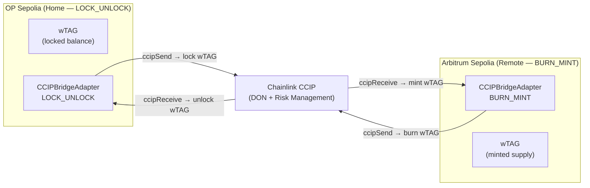

# wTAG Bridge — Arbitrum Sepolia (Phase 2)

Phase 2 completes the **OP Sepolia ↔ Arbitrum Sepolia** bridge lane for WrappedTAGIT (wTAG), adding the Arbitrum Sepolia receiver deployment, bidirectional lane configuration, and a full integration test suite.

> **Related:** [CCIP Bridge Adapter reference](./ccip-adapter.md) · [GitHub PR](https://github.com/TAG-IT-NETWORK/tagit-bridge/pull/2) · [GitHub Wiki](https://github.com/TAG-IT-NETWORK/tagit-bridge/wiki/CCIP-Bridge-Adapter-Arbitrum-Sepolia)

---

## What Changed in Phase 2

| Item | Detail |
|------|--------|
| New deployment script | `DeployWTAGReceiverArbitrum.s.sol` — deploys wTAG + `CCIPBridgeAdapter` (BURN_MINT) on Arbitrum Sepolia |
| New config script | `ConfigureOpSepoliaDestination.s.sol` — allowlists Arbitrum Sepolia on existing OP Sepolia adapter |
| Arbitrum Sepolia network | Added to `foundry.toml` with Arbiscan verification endpoint |
| Integration tests | `WTAGBridgeArbitrum.t.sol` — 25 new tests covering both bridge directions |
| Total test suite | **57 tests** (32 unit + 25 integration), all passing |
| CI | `test.yml` Foundry CI + `ci-failure-to-notion.yml` SUDO AI feedback loop |

---

## Architecture: Two-Lane Bridge



**Bridge modes:**
- **LOCK_UNLOCK (home chain — OP Sepolia):** tokens are locked on send, unlocked on receive
- **BURN_MINT (remote chains — Arbitrum Sepolia, Base Sepolia):** tokens are burned on send, minted on receive

---

## Chain Selectors & Addresses

| Chain | Chain Selector | CCIP Router |
|-------|---------------|-------------|
| OP Sepolia | `5224473277236331295` | `0x114A20A10b43D4115e5aeef7345a1A71d2a60C57` |
| Arbitrum Sepolia | `3478487238524512106` | `0x2a9C5afB0d0e4BAb2BCdaE109EC4b0c4Be15a165` |
| Base Sepolia | `10344971235874465080` | `0xD3b06cEbF099CE7DA4AcCf578aaebFDBd6e88a93` |

---

## Deployment: Arbitrum Sepolia Receiver

### Prerequisites

```bash
cp .env.example .env
# Fill in: DEPLOYER_KEY, ARBITRUM_SEPOLIA_RPC_URL, ARBISCAN_API_KEY
# Optionally: OP_SEPOLIA_ADAPTER (auto-configures source chain)
```

### Step 1 — Deploy wTAG + Bridge Adapter on Arbitrum Sepolia

```bash
forge script script/DeployWTAGReceiverArbitrum.s.sol \
  --rpc-url $ARBITRUM_SEPOLIA_RPC_URL \
  --private-key $DEPLOYER_KEY \
  --broadcast --verify \
  --etherscan-api-key $ARBISCAN_API_KEY
```

**Deploys:**
1. `WrappedTAGIT` (wTAG) ERC-20 token
2. `CCIPBridgeAdapter` in `BURN_MINT` mode
3. Binds bridge adapter to wTAG (one-time, irreversible)
4. Optionally configures OP Sepolia as known dest chain

### Step 2 — Allowlist Arbitrum Sepolia on OP Sepolia

Set `ARB_SEPOLIA_ADAPTER` to the address from Step 1, then:

```bash
forge script script/ConfigureOpSepoliaDestination.s.sol \
  --rpc-url $OP_SEPOLIA_RPC_URL \
  --private-key $DEPLOYER_KEY \
  --broadcast
```

### Step 3 — Post-Deployment Verification

```bash
# Fund OP Sepolia adapter with ETH for CCIP fees
cast send $OP_SEPOLIA_ADAPTER --value 0.01ether --rpc-url $OP_SEPOLIA_RPC_URL

# Test bridge transfer OP → Arb
cast call $OP_SEPOLIA_ADAPTER "estimateFee(uint64,address,uint256)" \
  3478487238524512106 $RECIPIENT $AMOUNT \
  --rpc-url $OP_SEPOLIA_RPC_URL

# Monitor: https://ccip.chain.link
```

---

## Script Reference

### `DeployWTAGReceiverArbitrum.s.sol`

```solidity
contract DeployWTAGReceiverArbitrum is Script {
    address public constant ARB_SEPOLIA_CCIP_ROUTER = 0x2a9C5afB0d0e4BAb2BCdaE109EC4b0c4Be15a165;
    uint64  public constant ARB_SEPOLIA_CHAIN_SELECTOR = 3478487238524512106;
    uint64  public constant OP_SEPOLIA_CHAIN_SELECTOR  = 5224473277236331295;
    uint64  public constant BASE_SEPOLIA_CHAIN_SELECTOR = 10344971235874465080;

    function run() external;
    // Env vars: DEPLOYER_KEY, BRIDGE_OWNER (optional), OP_SEPOLIA_ADAPTER (optional)
}
```

### `ConfigureOpSepoliaDestination.s.sol`

```solidity
contract ConfigureOpSepoliaDestination is Script {
    uint64 public constant ARB_SEPOLIA_CHAIN_SELECTOR = 3478487238524512106;

    function run() external;
    // Env vars: DEPLOYER_KEY, OP_SEPOLIA_ADAPTER, ARB_SEPOLIA_ADAPTER
}
```

---

## Test Suite

| File | Tests | Coverage |
|------|-------|----------|
| `CCIPBridgeAdapterOutbound.t.sol` | 19 | Lock/burn, fee estimation, event emission, encoding, fuzz |
| `CCIPBridgeAdapterInbound.t.sol` | 13 | Unlock/mint, replay protection, sender/chain validation, fuzz |
| `WTAGBridgeArbitrum.t.sol` | 25 | Full two-way integration: OP→Arb, Arb→OP, round-trip, fuzz |
| **Total** | **57** | All passing |

### Integration Test: Round-Trip

```solidity
// WTAGBridgeArbitrum.t.sol — covers:
// 1. OP Sepolia → Arb Sepolia (lock on home, mint on remote)
// 2. Arb Sepolia → OP Sepolia (burn on remote, unlock on home)
// 3. Fee estimation across both lanes
// 4. Round-trip integrity (lock → mint → burn → unlock)
// 5. Revert cases: replay, unknown sender, bad chain, paused, not router
// 6. Fuzz: arbitrary amounts (1000 runs each)
```

---

## Environment Variables

See `.env.example` for the full list. Key variables:

```bash
DEPLOYER_KEY=               # Private key (no 0x prefix)
OP_SEPOLIA_RPC_URL=https://sepolia.optimism.io
ARBITRUM_SEPOLIA_RPC_URL=https://sepolia-rollup.arbitrum.io/rpc
ETHERSCAN_API_KEY=          # OP Sepolia
ARBISCAN_API_KEY=           # Arbitrum Sepolia
OP_SEPOLIA_WTAG=            # wTAG on OP Sepolia (after Phase 1 deploy)
OP_SEPOLIA_ADAPTER=         # CCIPBridgeAdapter on OP Sepolia
ARB_SEPOLIA_WTAG=           # wTAG on Arbitrum Sepolia (after Phase 2 deploy)
ARB_SEPOLIA_ADAPTER=        # CCIPBridgeAdapter on Arbitrum Sepolia
```

---

## Related Pages

- [CCIP Bridge Adapter](./ccip-adapter.md) — full interface reference
- [GitHub Wiki — Technical Reference](https://github.com/TAG-IT-NETWORK/tagit-bridge/wiki/CCIP-Bridge-Adapter-Arbitrum-Sepolia)
- [Notion — wTAG Cross-Chain Bridge](https://www.notion.so/3324e3e9a2d381849dead70e1a11b10e)
- [tagit-bridge PR #2](https://github.com/TAG-IT-NETWORK/tagit-bridge/pull/2)
