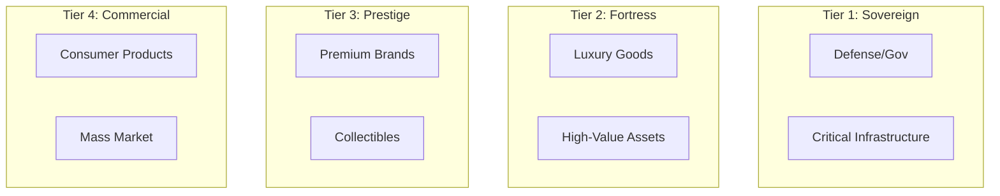
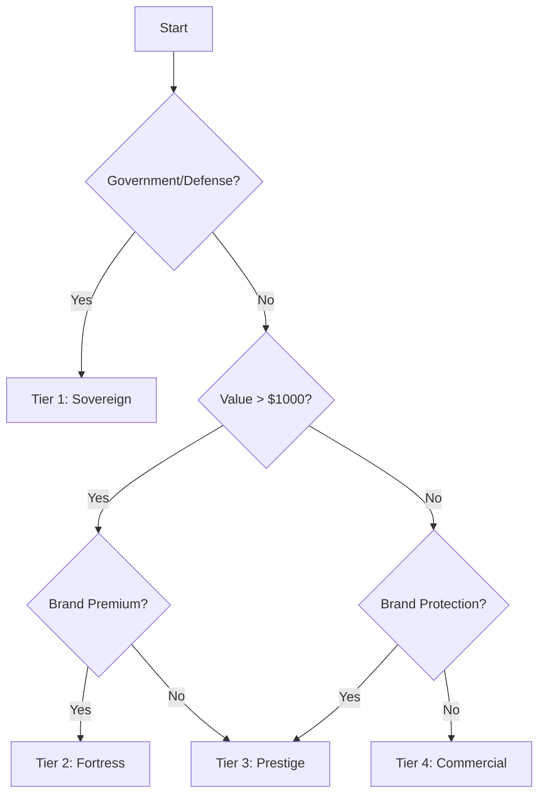

# Chip Classification

TAG IT Network uses a 4-tier chip classification system based on security level and use case.

## Tier Overview

## Tier 1: Sovereign

**Use Cases:** Defense, government, critical infrastructure

| Property | Specification |
|----------|---------------|
| Chip | Custom secure element |
| Cryptography | PQC-ready (CRYSTALS-Dilithium) |
| Tamper Detection | Active + passive |
| Data Storage | Encrypted, air-gapped backup |
| Compliance | FIPS 140-3, Common Criteria |

**Features:**
- Post-quantum cryptography ready
- Hardware security module (HSM) integration
- Air-gapped verification capability
- Multi-party authentication
- U.S. sovereign cloud requirement

## Tier 2: Fortress

**Use Cases:** Luxury goods, high-value assets, pharmaceuticals

| Property | Specification |
|----------|---------------|
| Chip | NXP NTAG 424 DNA |
| Cryptography | AES-128 + HMAC-SHA256 |
| Tamper Detection | Passive |
| Data Storage | Encrypted on-chip |
| Compliance | ISO 14443, NFC Forum |

**Features:**
- SUN (Secure Unique NFC) authentication
- Rolling counter anti-replay
- Optional tamper-evident seal
- Brand-specific key derivation

## Tier 3: Prestige

**Use Cases:** Premium brands, collectibles, limited editions

| Property | Specification |
|----------|---------------|
| Chip | NXP NTAG 424 DNA |
| Cryptography | AES-128 |
| Tamper Detection | Optional |
| Data Storage | Standard NFC |
| Compliance | ISO 14443 |

**Features:**
- Standard NTAG authentication
- Cloud-verified signatures
- Brand customization
- Batch provisioning

## Tier 4: Commercial

**Use Cases:** Consumer products, mass market, retail

| Property | Specification |
|----------|---------------|
| Chip | NTAG 213/215/216 |
| Cryptography | None (UID only) |
| Tamper Detection | None |
| Data Storage | URL + metadata |
| Compliance | ISO 14443 |

**Features:**
- UID-based identification
- Cloud verification
- Low cost per unit
- High volume provisioning

## Comparison Matrix

| Feature | Sovereign | Fortress | Prestige | Commercial |
|---------|-----------|----------|----------|------------|
| Cryptography | PQC | AES-128 | AES-128 | UID |
| On-chip Auth | Yes | Yes | Yes | No |
| Tamper Detect | Active | Passive | Optional | No |
| Compliance | FIPS | ISO | ISO | ISO |
| Cost/Unit | $$$$$ | $$$ | $$ | $ |
| Volume | Low | Medium | High | Very High |

## Selection Guide

## Related

- [NTAG 424 DNA Specifications](./ntag-424-dna.md)
- [NFC Binding Protocol](./nfc-binding.md)
- [Reader Ecosystem](./readers.md)
