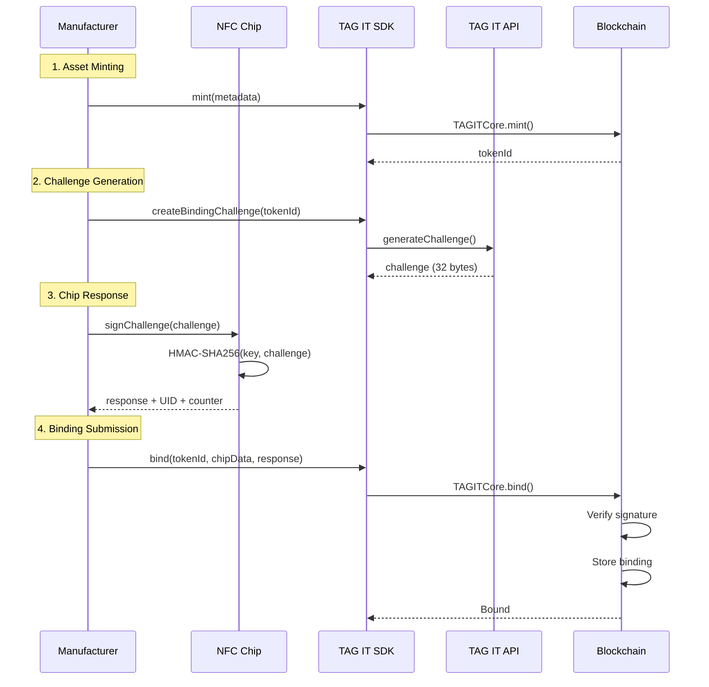

# NFC Binding Protocol

The binding protocol cryptographically links physical NFC chips to on-chain Digital Twin NFTs.

## Overview

Binding creates an immutable link between:
- **Physical:** NFC chip with unique cryptographic identity
- **Digital:** On-chain NFT representing the asset

## Protocol Flow



## Challenge-Response

### Challenge Structure

```
challenge = keccak256(
    tokenId ||
    chainId ||
    timestamp ||
    nonce
)
```

| Field | Size | Description |
|-------|------|-------------|
| tokenId | 32 bytes | Asset token ID |
| chainId | 32 bytes | Blockchain chain ID |
| timestamp | 8 bytes | Unix timestamp |
| nonce | 16 bytes | Random nonce |

### Response Structure

```
response = HMAC-SHA256(chipKey, challenge)
```

| Field | Size | Description |
|-------|------|-------------|
| signature | 32 bytes | HMAC-SHA256 signature |
| uid | 7 bytes | Chip unique identifier |
| counter | 3 bytes | Rolling counter value |

## On-Chain Verification

```solidity
function bind(
    uint256 tokenId,
    bytes32 chipId,      // Chip UID
    bytes32 challenge,   // Original challenge
    bytes calldata signature  // Chip response
) external {
    // 1. Verify caller has BINDER_ROLE
    require(hasRole(BINDER_ROLE, msg.sender), "Not authorized");

    // 2. Verify asset is in MINTED state
    require(assets[tokenId].state == State.MINTED, "Invalid state");

    // 3. Verify chip not already bound
    require(chipToToken[chipId] == 0, "Chip already bound");

    // 4. Verify signature (off-chain oracle or zkSNARK)
    require(verifyChipSignature(chipId, challenge, signature), "Invalid signature");

    // 5. Create binding
    assets[tokenId].chipId = chipId;
    assets[tokenId].state = State.BOUND;
    chipToToken[chipId] = tokenId;

    emit AssetBound(tokenId, chipId);
}
```

## Security Considerations

### Anti-Cloning

| Protection | Description |
|------------|-------------|
| Rolling Counter | Prevents replay of captured responses |
| Chip UID | Hardware-fused unique identifier |
| Key Derivation | Per-chip unique keys |
| Challenge Expiry | 5-minute validity window |

### Tamper Detection

For Tier 1/2 chips:
- Physical tamper-evident seals
- Active tamper detection circuits
- Irreversible binding (chip disabled on removal)

## SDK Integration

### JavaScript

```typescript
import { TagIt, NfcReader } from '@tagit/sdk';

const tagit = new TagIt({ apiKey: process.env.TAGIT_API_KEY });
const nfc = new NfcReader();

// 1. Mint asset
const { tokenId } = await tagit.assets.create({
    to: manufacturerAddress,
    metadata: { name: 'Product', sku: 'SKU-001' }
});

// 2. Generate challenge
const challenge = await tagit.binding.createChallenge(tokenId);

// 3. Get chip response
const chipData = await nfc.scan();
const response = await nfc.signChallenge(challenge.data);

// 4. Submit binding
const result = await tagit.assets.bind(tokenId, {
    chipId: chipData.uid,
    challenge: challenge.data,
    response: response.signature
});

console.log('Bound:', result.state === 'BOUND');
```

### Kotlin (Android)

```kotlin
val tagit = TagIt.Builder()
    .apiKey(BuildConfig.TAGIT_API_KEY)
    .build()

// 1. Mint asset
val mintResult = tagit.assets.create(
    to = manufacturerAddress,
    metadata = mapOf("name" to "Product")
)

// 2. Generate challenge
val challenge = tagit.binding.createChallenge(mintResult.tokenId)

// 3. Get chip response (on NFC tag discovered)
override fun onTagDiscovered(tag: Tag) {
    val chipData = tagit.nfc.readTag(tag)
    val response = tagit.nfc.signChallenge(tag, challenge.data)

    // 4. Submit binding
    val result = tagit.assets.bind(
        tokenId = mintResult.tokenId,
        chipId = chipData.uid,
        challenge = challenge.data,
        response = response.signature
    )
}
```

## Related

- [Chip Classification](./chip-classification.md)
- [NTAG 424 DNA](./ntag-424-dna.md)
- [TAGITCore Contract](../contracts/tagit-core.md)
- [First Verification Guide](../getting-started/first-verification.md)
