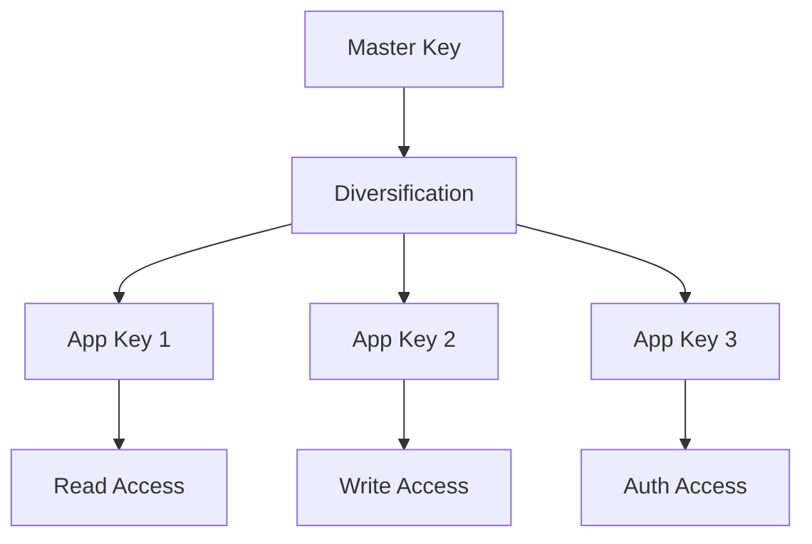
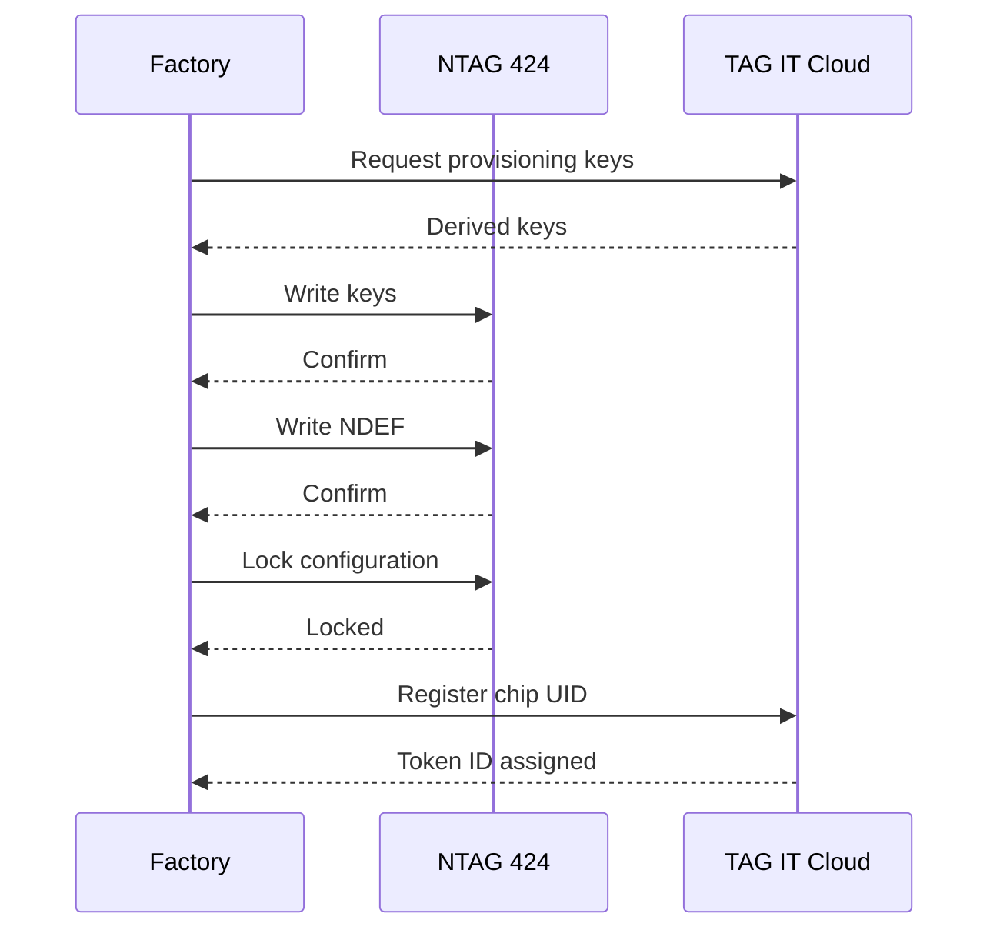
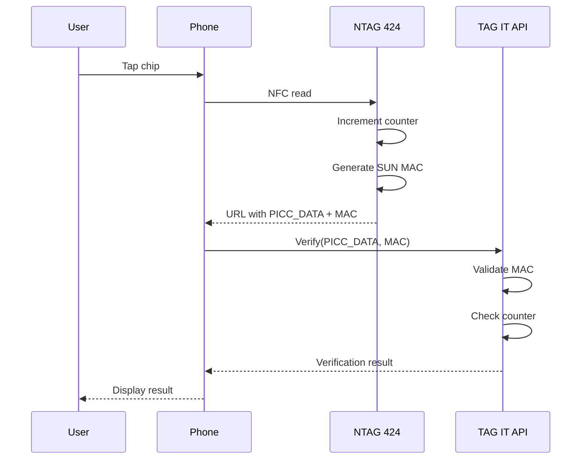

# NTAG 424 DNA

NXP NTAG 424 DNA is the primary chip for Tier 2 (Fortress) and Tier 3 (Prestige) deployments.

## Overview

| Property | Value |
|----------|-------|
| Manufacturer | NXP Semiconductors |
| Standard | ISO/IEC 14443-3A |
| Memory | 416 bytes user memory |
| UID | 7-byte unique identifier |
| Operating Frequency | 13.56 MHz |
| Communication | NFC Forum Type 4 Tag |

## Security Features

### SUN Authentication

Secure Unique NFC (SUN) provides dynamic authentication:

```
URL = https://verify.tagit.network/v/{PICC_DATA}/{MAC}

PICC_DATA = UID || Counter (encrypted)
MAC = HMAC-SHA256(key, PICC_DATA)
```

### Key Hierarchy



| Key | Purpose | Access |
|-----|---------|--------|
| Key 0 | Master | Full access |
| Key 1 | Read | NDEF read |
| Key 2 | Write | NDEF write |
| Key 3 | Auth | SUN authentication |
| Key 4 | Change | Key management |

### Counter Protection

- 24-bit rolling counter
- Increments on each read
- Prevents replay attacks
- Cannot be reset

## Memory Layout

```
+------------------+
| UID (7 bytes)    | Read-only
+------------------+
| Counter (3 bytes)| Read-only, auto-increment
+------------------+
| NDEF File        | Configurable access
| (416 bytes)      |
+------------------+
| Key Storage      | Secure element
| (5 keys × 16 B)  |
+------------------+
```

## NDEF Configuration

### Standard Layout

```
+------------------+
| NDEF Header      |
+------------------+
| URL Record       |
| Type: U          |
| Payload: verify/ |
|   {PICC}/{MAC}   |
+------------------+
| Metadata Record  |
| Type: text/json  |
| Payload: {...}   |
+------------------+
```

### Example NDEF

```json
{
  "tokenId": 12345,
  "brand": "Example Brand",
  "sku": "SKU-001",
  "mfgDate": "2025-01-15"
}
```

## Provisioning Flow



## Verification Flow



## Specifications

| Parameter | Value |
|-----------|-------|
| Read Range | Up to 10 cm |
| Data Rate | 106 kbit/s |
| Write Endurance | 1,000,000 cycles |
| Data Retention | 10 years |
| Operating Temp | -25°C to +85°C |
| ESD Protection | 4 kV HBM |

## Related

- [Chip Classification](./chip-classification.md)
- [NFC Binding Protocol](./nfc-binding.md)
- [TAGITCore Contract](../contracts/tagit-core.md)
