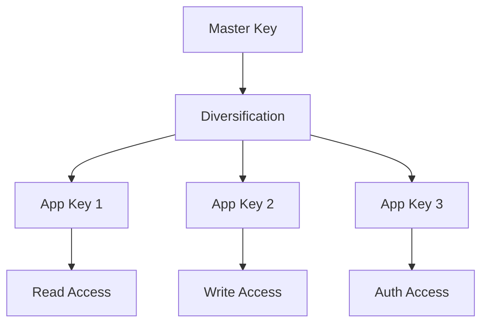
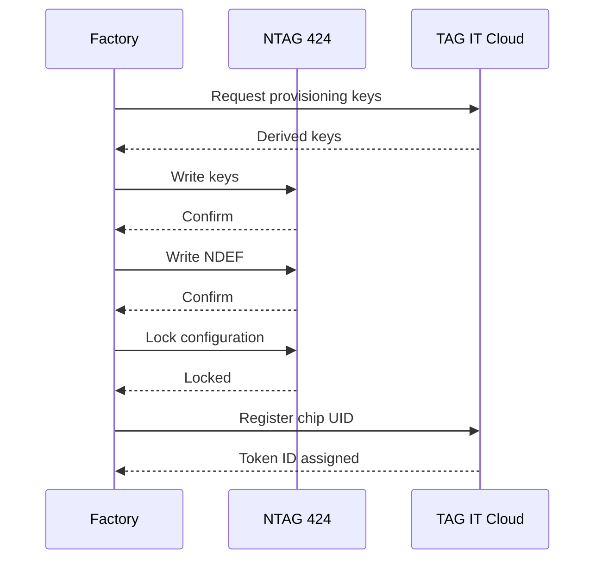
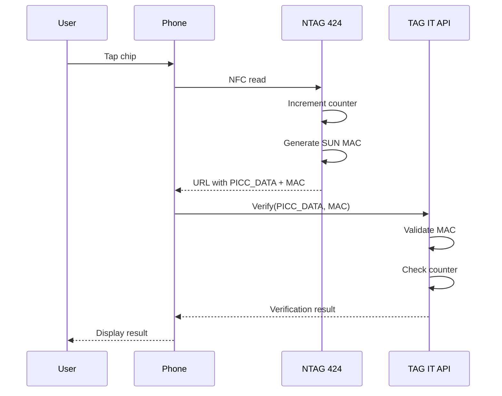

# NTAG 424 DNA

NXP NTAG 424 DNA is the primary chip for Tier 2 (Fortress) and Tier 3 (Prestige) deployments.

## Overview

| Property | Value |
|----------|-------|
| Manufacturer | NXP Semiconductors |
| Standard | ISO/IEC 14443-3A |
| Memory | 416 bytes user memory |
| UID | 7-byte unique identifier |
| Operating Frequency | 13.56 MHz |
| Communication | NFC Forum Type 4 Tag |

## Security Features

### SUN Authentication

Secure Unique NFC (SUN) provides dynamic authentication:

```
URL = https://verify.tagit.network/v/{PICC_DATA}/{MAC}

PICC_DATA = UID || Counter (encrypted)
MAC = HMAC-SHA256(key, PICC_DATA)
```

### Key Hierarchy


```mermaid
flowchart TB
    A[Master Key] --> B[Diversification]
    B --> C[App Key 1]
    B --> D[App Key 2]
    B --> E[App Key 3]

    C --> F[Read Access]
    D --> G[Write Access]
    E --> H[Auth Access]
```

| Key | Purpose | Access |
|-----|---------|--------|
| Key 0 | Master | Full access |
| Key 1 | Read | NDEF read |
| Key 2 | Write | NDEF write |
| Key 3 | Auth | SUN authentication |
| Key 4 | Change | Key management |

### Counter Protection

- 24-bit rolling counter
- Increments on each read
- Prevents replay attacks
- Cannot be reset

## Memory Layout

```
+------------------+
| UID (7 bytes)    | Read-only
+------------------+
| Counter (3 bytes)| Read-only, auto-increment
+------------------+
| NDEF File        | Configurable access
| (416 bytes)      |
+------------------+
| Key Storage      | Secure element
| (5 keys × 16 B)  |
+------------------+
```

## NDEF Configuration

### Standard Layout

```
+------------------+
| NDEF Header      |
+------------------+
| URL Record       |
| Type: U          |
| Payload: verify/ |
|   {PICC}/{MAC}   |
+------------------+
| Metadata Record  |
| Type: text/json  |
| Payload: {...}   |
+------------------+
```

### Example NDEF

```json
{
  "tokenId": 12345,
  "brand": "Example Brand",
  "sku": "SKU-001",
  "mfgDate": "2025-01-15"
}
```

## Provisioning Flow


```mermaid
sequenceDiagram
    participant Factory
    participant Chip as NTAG 424
    participant Cloud as TAG IT Cloud

    Factory->>Cloud: Request provisioning keys
    Cloud-->>Factory: Derived keys

    Factory->>Chip: Write keys
    Chip-->>Factory: Confirm

    Factory->>Chip: Write NDEF
    Chip-->>Factory: Confirm

    Factory->>Chip: Lock configuration
    Chip-->>Factory: Locked

    Factory->>Cloud: Register chip UID
    Cloud-->>Factory: Token ID assigned
```

## Verification Flow


```mermaid
sequenceDiagram
    participant User
    participant Phone
    participant Chip as NTAG 424
    participant API as TAG IT API

    User->>Phone: Tap chip
    Phone->>Chip: NFC read
    Chip->>Chip: Increment counter
    Chip->>Chip: Generate SUN MAC
    Chip-->>Phone: URL with PICC_DATA + MAC
    Phone->>API: Verify(PICC_DATA, MAC)
    API->>API: Validate MAC
    API->>API: Check counter
    API-->>Phone: Verification result
    Phone-->>User: Display result
```

## Specifications

| Parameter | Value |
|-----------|-------|
| Read Range | Up to 10 cm |
| Data Rate | 106 kbit/s |
| Write Endurance | 1,000,000 cycles |
| Data Retention | 10 years |
| Operating Temp | -25°C to +85°C |
| ESD Protection | 4 kV HBM |

## AES-128-CMAC SUN Message Format

The NTAG 424 DNA uses **AES-128-CMAC** to generate a Secure Unique NFC (SUN) authentication message on every tap. This is the cryptographic core of TAG IT verification.

### Message Structure

```
SUN Message (32 bytes)
┌──────────────────────────────────────────────────────────────┐
│  Encrypted PICC Data (16 bytes)  │  MAC (8 bytes)            │
├──────────────────────────────────┼───────────────────────────┤
│  AES-128-CBC(Key3, IV, payload)  │  CMAC(Key4, PICC_DATA)   │
└──────────────────────────────────┴───────────────────────────┘
```

### PICC Data Payload (before encryption)

```
PICC Data (16 bytes)
┌──────────┬──────────┬──────────┐
│ UID      │ Counter  │ Padding  │
│ (7 bytes)│ (3 bytes)│ (6 bytes)│
└──────────┴──────────┴──────────┘
```

| Field | Size | Description |
|-------|------|-------------|
| **UID** | 7 bytes | Unique chip identifier (read-only, factory-set) |
| **Counter** | 3 bytes | 24-bit rolling counter, increments on each read |
| **Padding** | 6 bytes | Zero-padded to 16-byte AES block |

### Cryptographic Operations

1. **Encryption**: `PICC_ENC = AES-128-CBC(Key3, IV=0, UID || Counter || Padding)`
2. **MAC Generation**: `MAC = CMAC(Key4, PICC_ENC)[0:8]` (first 8 bytes of the full CMAC)
3. **URL Assembly**: `https://verify.tagit.network/v/{hex(PICC_ENC)}/{hex(MAC)}`

### Key Derivation

Keys are diversified per chip from a master key:

```
MasterKey (128-bit)
    │
    ├── CMAC(MasterKey, 0x01 || UID || 0x0080) → Key3 (Encryption)
    └── CMAC(MasterKey, 0x02 || UID || 0x0080) → Key4 (MAC)
```

## NDEF Record Structure

The chip stores an NDEF message with two records:

### Record Layout

```
NDEF Message
├── Record 1: URI Record (TNF=0x01, Type="U")
│   ├── ID: 0x00
│   ├── Type: "U" (URI)
│   ├── Payload Prefix: 0x04 (https://)
│   └── Payload: verify.tagit.network/v/{PICC_ENC}/{MAC}
│       └── Dynamic: PICC_ENC and MAC are filled by the chip on each read
│
└── Record 2: External Record (TNF=0x04, Type="text/json")
    ├── ID: 0x01
    └── Payload: {"tokenId": 12345, "brand": "...", "sku": "..."}
```

### SDM (Secure Dynamic Messaging) Configuration

The NDEF URI record uses SDM mirror to inject the SUN data dynamically:

| Parameter | Value | Description |
|-----------|-------|-------------|
| SDM Enabled | Yes | Dynamic SUN data insertion |
| PICC Data Offset | Byte 42 | Start of PICC_ENC mirror in URI |
| MAC Offset | Byte 74 | Start of MAC mirror in URI |
| MAC Input Offset | Byte 42 | MAC covers data from this offset |
| Read Counter Limit | 0 (unlimited) | No read limit |
| UID Mirror | Enabled | UID included in PICC data |
| Counter Mirror | Enabled | Counter included in PICC data |

## SDK Decode API Usage

The `@tagit/sdk` package provides utilities to decode and validate SUN messages:

```typescript
import { decodeSunMessage, validateSunMac } from '@tagit/sdk/nfc';
import type { SunMessage } from '@tagit/sdk';

// Decode the SUN message from an NFC URL
const url = 'https://verify.tagit.network/v/A1B2C3D4E5F6A1B2C3D4E5F6A1B2C3D4/E5F6A1B2C3D4E5F6';

const sunMessage: SunMessage = decodeSunMessage(url);

console.log('Encrypted PICC:', sunMessage.piccEnc);  // hex string
console.log('MAC:', sunMessage.mac);                   // hex string
console.log('UID:', sunMessage.uid);                   // after decryption
console.log('Counter:', sunMessage.counter);            // after decryption
```

### Validate MAC Server-Side

```typescript
import { validateSunMac } from '@tagit/sdk/nfc';

const isValid = validateSunMac({
  piccEnc: sunMessage.piccEnc,
  mac: sunMessage.mac,
  masterKey: process.env.NFC_MASTER_KEY!,
});

if (isValid) {
  console.log('MAC is valid — chip is authentic');
} else {
  console.log('MAC validation failed — possible counterfeit');
}
```

### Full Decode and Verify Flow

```typescript
import { TagIt } from '@tagit/sdk';
import { decodeSunMessage } from '@tagit/sdk/nfc';

const tagit = new TagIt({
  apiKey: process.env.TAGIT_API_KEY,
  network: 'testnet',
});

async function verifyFromNfcUrl(nfcUrl: string) {
  // 1. Decode the SUN message from the URL
  const sun = decodeSunMessage(nfcUrl);

  // 2. Look up the token by chip UID
  const asset = await tagit.assets.getByChipId(sun.uid);

  // 3. Submit for on-chain verification
  const result = await tagit.verify.submit({
    tokenId: asset.tokenId,
    response: {
      piccEnc: sun.piccEnc,
      mac: sun.mac,
    },
  });

  return result;
}
```

## Integration with bindTag() On-Chain

After provisioning an NFC chip, bind it to a minted Digital Twin on-chain:

### Using the SDK

```typescript
import { TagIt } from '@tagit/sdk';

const tagit = new TagIt({
  apiKey: process.env.TAGIT_API_KEY,
  network: 'testnet',
});

// The chipId is the 7-byte UID read from the NTAG 424 DNA
const result = await tagit.assets.bind(tokenId, {
  chipId: '0x04A2B3C4D5E6F7',     // 7-byte UID
  signature: '0x...',               // SUN MAC proving physical possession
});

console.log('Bound:', result.state === 'BOUND');
```

### Using viem Directly

```typescript
import { createWalletClient, http, keccak256, encodePacked } from 'viem';
import { optimismSepolia } from 'viem/chains';
import { tagitCoreAbi } from '@tagit/sdk/abis';

const TAGIT_CORE = '0x8bde22da889306d422802728cb98b6da42ed8e1a' as const;

// Generate the tag hash from the chip UID
const chipUid = '0x04A2B3C4D5E6F7';
const tagHash = keccak256(encodePacked(['bytes'], [chipUid]));

const hash = await walletClient.writeContract({
  address: TAGIT_CORE,
  abi: tagitCoreAbi,
  functionName: 'bindTag',
  args: [tokenId, tagHash],
});

const receipt = await publicClient.waitForTransactionReceipt({ hash });
console.log('Bound in block:', receipt.blockNumber);
```

> **Security**: The `bindTag()` function requires `BINDER_ROLE` (capability badge ID 101). The caller must hold this badge in the TAGITAccess contract.

## Security Considerations

### Cryptographic Security

| Consideration | Mitigation |
|---------------|------------|
| **Key extraction** | AES keys stored in secure element; not readable via NFC interface |
| **Replay attacks** | 24-bit rolling counter increments on every read; backend rejects stale counters |
| **Cloning** | UID is factory-set and read-only; SUN MAC depends on secret keys |
| **Brute force** | AES-128 provides 2^128 key space; CMAC prevents MAC forgery |
| **Side-channel** | NXP chips include DPA countermeasures in the secure element |

### Operational Security

- **Master key storage**: Store the master derivation key in an HSM or secure vault. Never expose it in client-side code.
- **Counter validation**: Always verify the counter is strictly greater than the last known value for that chip. Store the last-seen counter per UID.
- **HTTPS only**: SUN URLs must be transmitted over HTTPS to prevent interception.
- **Key rotation**: The NTAG 424 DNA supports key change commands. Plan for periodic rotation of application keys.
- **Chip locking**: After provisioning, lock the configuration to prevent unauthorized key or NDEF changes.

### Post-Quantum Readiness

The current AES-128-CMAC scheme is considered quantum-resistant for symmetric operations (Grover's algorithm reduces effective strength to 64-bit, still computationally infeasible). However, TAG IT Network maintains a [PQC roadmap](../security/pqc-roadmap.md) for future migration of asymmetric components.

## Related

- [Chip Classification](./chip-classification.md)
- [NFC Binding Protocol](./nfc-binding.md)
- [TAGITCore Contract](../contracts/tagit-core.md)
- [Contract Integration — bindTag()](../guides/contract-integration.md)
- [SDK Integration — Verification Flow](../guides/sdk-integration.md)
- [Deployment Reference](../contracts/deployment-reference.md)
