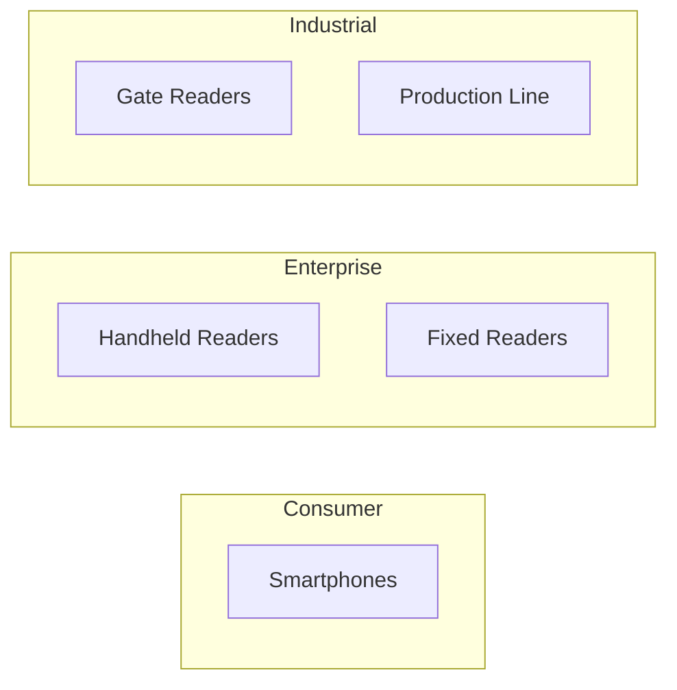

# Reader Ecosystem

Overview of NFC readers compatible with TAG IT Network verification.

## Reader Categories



## Smartphone Compatibility

### iOS

| Requirement | Minimum |
|-------------|---------|
| Device | iPhone 7 or later |
| iOS Version | iOS 13+ |
| NFC Capability | Core NFC |
| Background Reading | iOS 14+ |

**Supported Operations:**
- NDEF reading
- Tag detection
- SUN authentication (via NDEF URL)

### Android

| Requirement | Minimum |
|-------------|---------|
| NFC Hardware | NFC-A (ISO 14443-3A) |
| Android Version | 4.4+ (API 19) |
| Recommended | Android 10+ |

**Supported Operations:**
- NDEF reading/writing
- Tag detection
- IsoDep communication
- Direct APDU commands

## Enterprise Readers

### Handheld Readers

| Model | Interface | Range | Use Case |
|-------|-----------|-------|----------|
| Zebra RFD40 | Bluetooth/USB | 15cm | Warehouse |
| Nordic ID EXA21 | Bluetooth | 10cm | Retail |
| Chainway C72 | Android | 5cm | Field service |

### Fixed Readers

| Model | Interface | Range | Use Case |
|-------|-----------|-------|----------|
| Impinj Speedway | Ethernet | 1m+ | Gate control |
| Zebra FX7500 | Ethernet | 30cm | POS integration |
| ACR1252U | USB | 5cm | Desktop |

## Integration Guide

### Mobile SDK Integration

```typescript
// React Native example
import { TagItNFC } from '@tagit/react-native-sdk';

const scanner = new TagItNFC();

// Start scanning
scanner.startScan({
    onTagDiscovered: async (tag) => {
        const result = await tagit.verify(tag.tokenId, tag.challenge, tag.response);
        console.log('Verified:', result.verified);
    },
    onError: (error) => {
        console.error('NFC Error:', error);
    }
});
```

### Enterprise Reader Integration

```typescript
// TCP/IP reader integration
import { ReaderClient } from '@tagit/enterprise-sdk';

const reader = new ReaderClient({
    host: '192.168.1.100',
    port: 4001,
    protocol: 'LLRP' // or 'proprietary'
});

reader.on('tag', async (tagData) => {
    const verification = await tagit.verify({
        tokenId: tagData.tokenId,
        chipId: tagData.uid,
        response: tagData.sunMac
    });

    // Trigger action (gate, conveyor, etc.)
    if (verification.verified) {
        await triggerAction('allow');
    }
});
```

## Reader Requirements

### Minimum Requirements

| Feature | Requirement |
|---------|-------------|
| NFC Standard | ISO 14443-3A |
| Communication | NDEF Type 4 |
| URL Parsing | Automatic |

### Recommended Features

| Feature | Benefit |
|---------|---------|
| IsoDep Support | Direct chip communication |
| Extended APDU | Large data transfers |
| SDK Available | Easier integration |

## Certification

### TAG IT Certified Readers

Certified readers have been tested for:
- ✅ Full protocol compliance
- ✅ Performance benchmarks
- ✅ Security requirements
- ✅ SDK compatibility

Contact [partners@tagit.network](mailto:partners@tagit.network) for certification.

## Related

- [NFC Binding Protocol](./nfc-binding.md)
- [NTAG 424 DNA](./ntag-424-dna.md)
- [SDK Documentation](../sdk/overview.md)
