# PROJECT SIGMA BOY — Next-Generation NFC Superchip

```
  _____ _____ _____ __  __          ____   ______     __
 / ____|_   _/ ____|  \/  |   /\   |  _ \ / __ \ \   / /
| (___   | || |  __| \  / |  /  \  | |_) | |  | \ \_/ /
 \___ \  | || | |_ | |\/| | / /\ \ |  _ <| |  | |\   /
 ____) |_| || |__| | |  | |/ ____ \| |_) | |__| | | |
|_____/|_____\_____|_|  |_/_/    \_\____/ \____/  |_|

    ███╗   ██╗███████╗ ██████╗    ███████╗██╗   ██╗██████╗ ███████╗██████╗  ██████╗██╗  ██╗██╗██████╗
    ████╗  ██║██╔════╝██╔════╝    ██╔════╝██║   ██║██╔══██╗██╔════╝██╔══██╗██╔════╝██║  ██║██║██╔══██╗
    ██╔██╗ ██║█████╗  ██║         ███████╗██║   ██║██████╔╝█████╗  ██████╔╝██║     ███████║██║██████╔╝
    ██║╚██╗██║██╔══╝  ██║         ╚════██║██║   ██║██╔═══╝ ██╔══╝  ██╔══██╗██║     ██╔══██║██║██╔═══╝
    ██║ ╚████║██║     ╚██████╗    ███████║╚██████╔╝██║     ███████╗██║  ██║╚██████╗██║  ██║██║██║
    ╚═╝  ╚═══╝╚═╝      ╚═════╝    ╚══════╝ ╚═════╝ ╚═╝     ╚══════╝╚═╝  ╚═╝ ╚═════╝╚═╝  ╚═╝╚═╝╚═╝

                   🛡️ QUANTUM-HARDENED • RADIATION-PROOF • SPACE-RATED 🚀
```

> **CONFIDENTIAL — DO NOT SHARE**
>
> This document contains forward-looking product specifications under active development.
> Distribution outside TAG IT Network partners requires written authorization.
>
> **Classification:** Internal / Partner NDA
> **Status:** R&D Phase

---

## Executive Summary

PROJECT SIGMA BOY is TAG IT Network's next-generation custom NFC chip designed for extreme environments where COTS (Commercial Off-The-Shelf) solutions fail. Target markets: defense, aerospace, nuclear, and critical infrastructure.

---

## 🌌 The Technosphere Vision: From Orbit to Everywhere

> *"Military-grade technology doesn't stay military. It becomes the foundation of civilization."*

### Space as the Ultimate Proving Ground

PROJECT SIGMA BOY isn't just an NFC chip — it's TAG IT Network's contribution to the **Technosphere**: the expanding sphere of human technology extending from Earth's surface into deep space.

The most hostile environments demand the most resilient technology:

| Environment | Challenge | SIGMA BOY Solution |
|-------------|-----------|-------------------|
| **Low Earth Orbit** | Radiation, thermal cycling | 1 Mrad TID, -269°C to +300°C |
| **Lunar Surface** | 14-day darkness, regolith | Quad-source harvest, sealed package |
| **Mars Transit** | 9-month journey, no repair | 50-year retention, self-diagnostics |
| **Deep Space** | Extreme isolation | HIBERNATE mode, autonomous operation |

### Military → Commercial Technology Transfer

Every transformative commercial technology began as a military requirement:

```mermaid
flowchart LR
    subgraph MILITARY["🎖️ MILITARY ORIGIN"]
        GPS["GPS\n(Navigation)"]
        INTERNET["ARPANET\n(Internet)"]
        CRYPTO["AES/RSA\n(Encryption)"]
    end

    subgraph SIGMA["🛡️ SIGMA BOY"]
        PQC["PQC Crypto"]
        RAD["Radiation Hardening"]
        HARVEST["Energy Harvesting"]
    end

    subgraph COMMERCIAL["🏪 COMMERCIAL FUTURE"]
        SPACE_TOURISM["Space Tourism\nAsset Tracking"]
        NUCLEAR["Nuclear Plant\nInventory"]
        PHARMA["Pharma\nCold Chain"]
        LUXURY["Ultra-Premium\nAuthentication"]
    end

    MILITARY --> SIGMA
    SIGMA --> COMMERCIAL

    style MILITARY fill:#1e3a5f,color:#fff
    style SIGMA fill:#7c3aed,color:#fff
    style COMMERCIAL fill:#059669,color:#fff
```



### Why Space-Grade Matters on Earth

When you design for:

- **-269°C** → Your chip works in every freezer on Earth
- **1 Mrad radiation** → Your chip survives any industrial environment
- **50-year retention** → Your chip outlasts the assets it protects
- **Quad-source power** → Your chip works where batteries can't go

**The future of supply chain authentication will be built on technology forged for the stars.**

> 🚀 *"We're not just building chips. We're building the infrastructure for humanity's expansion into the solar system — and bringing that reliability back to every warehouse, every hospital, every retail shelf on Earth."*

---

## Why Custom Silicon?

| Limitation (COTS) | SIGMA BOY Solution |
|-------------------|-------------------|
| Temperature: -25°C to +70°C | **-269°C to +300°C** (cryogenic to reentry) |
| No radiation hardness | **1 Mrad TID** radiation tolerance |
| Passive only | **Quad-source energy harvesting** |
| No PQC | **Kyber/Dilithium hybrid** cryptography |
| Single verification | **Active beacon mode** (PING) |
| Static identity | **Multi-factor attestation** |

---

## Technical Specifications (Target)

### Environmental Hardening

| Parameter | Specification |
|-----------|---------------|
| Operating Temp | -269°C to +300°C |
| Radiation (TID) | 1 Mrad minimum |
| SEL Immunity | LET > 60 MeV·cm²/mg |
| Shock | 20,000g |
| Vibration | 20g RMS, 20-2000 Hz |
| Humidity | 0-100% RH, condensing |
| Pressure | Vacuum to 100 atm |

### Cryptographic Suite

| Algorithm | Purpose | Standard |
|-----------|---------|----------|
| **Kyber-1024** | Key encapsulation | NIST PQC |
| **Dilithium-5** | Digital signatures | NIST PQC |
| **AES-256-GCM** | Symmetric encryption | FIPS 197 |
| **SHA-3-512** | Hashing | FIPS 202 |
| **ECDSA P-384** | Legacy compatibility | FIPS 186-5 |

### Energy Harvesting (Quad-Source)

```mermaid
flowchart TB
    subgraph HARVEST["⚡ QUAD-SOURCE ENERGY HARVESTING"]
        RF["📡 RF\n13.56MHz"]
        SOLAR["☀️ Solar\n0.1-10μW"]
        THERMAL["🌡️ Thermal\nΔT > 5°C"]
        KINETIC["🔄 Kinetic\nPiezo"]
    end

    subgraph POWER["🔋 POWER MANAGEMENT"]
        MGMT["Power Controller"]
        CAP["Supercapacitor\n100μF"]
    end

    subgraph CORE["🛡️ SECURE CORE"]
        SIGMA["SIGMA BOY\nPQC Engine"]
    end

    RF --> MGMT
    SOLAR --> MGMT
    THERMAL --> MGMT
    KINETIC --> MGMT
    MGMT --> CAP
    CAP --> SIGMA

    style HARVEST fill:#1e3a5f,color:#fff
    style POWER fill:#2d5a3d,color:#fff
    style CORE fill:#5c1a5c,color:#fff
    style SIGMA fill:#7c3aed,color:#fff,stroke:#fff,stroke-width:2px
```



---

## Operating Modes


### 1. PASSIVE Mode (Default)

Standard NFC operation — responds to reader interrogation.

| Property | Value |
|----------|-------|
| Power | RF harvested |
| Range | 0-10cm |
| Latency | <100ms |

### 2. PING Mode (Active Beacon)

Periodic broadcast for asset tracking without reader proximity.

| Property | Value |
|----------|-------|
| Power | Harvested + supercap |
| Interval | Configurable (1min - 24hr) |
| Range | Up to 30m (BLE sideband) |

### 3. FORTRESS Mode (Tamper Response)

Active monitoring with tamper mesh.

| Property | Value |
|----------|-------|
| Detects | Physical intrusion, X-ray, voltage glitching |
| Response | Key zeroization in <10μs |
| Alert | Silent or audible (configurable) |

### 4. HIBERNATE Mode (Deep Sleep)

Extreme low-power for long-duration storage.

| Property | Value |
|----------|-------|
| Power | <10nA |
| Wake | RF field or timer |
| Duration | 50+ years data retention |

---

## Target Applications

| Sector | Use Case | Key Requirement |
|--------|----------|-----------------|
| **Defense** | Weapon system tracking | Radiation hardness, PQC |
| **Aerospace** | Satellite components | Temp range, vacuum |
| **Nuclear** | Fuel rod tracking | Radiation, tamper detection |
| **Pharma** | Cold chain biologics | Cryogenic temps |
| **Critical Infra** | Grid equipment | Long-term reliability |

---

## Development Timeline

| Phase | Milestone | Target |
|-------|-----------|--------|
| 1 | Architecture freeze | Q2 2026 |
| 2 | FPGA prototype | Q3 2026 |
| 3 | First silicon (MPW) | Q1 2027 |
| 4 | Qualification samples | Q3 2027 |
| 5 | Volume production | 2028 |

---

## Comparison: COTS vs SIGMA BOY

| Capability | NTAG 424 DNA | SIGMA BOY |
|------------|--------------|-----------|
| Authentication | AES-128 | PQC Hybrid |
| Tamper detect | TagTamper only | Active mesh |
| Temperature | -25°C to +70°C | -269°C to +300°C |
| Radiation | None | 1 Mrad TID |
| Energy harvest | RF only | Quad-source |
| Active beacon | No | PING mode |
| Price (volume) | $0.50-2 | $15-50 (est.) |


---

## Security Considerations

> **OPSEC NOTICE**
>
> Do not disclose:
> - Specific silicon foundry partnerships
> - Detailed tamper response mechanisms
> - Government customer identities
> - Exact radiation test results
> - Classified application details

---

## Contact

For partnership inquiries or technical deep-dives under NDA:

**hardware@tagit.network**

---

*This document contains forward-looking statements about products under development. Specifications subject to change. Not for public distribution.*

---

## Document Control

| Field | Value |
|-------|-------|
| Version | 0.3 (Draft) |
| Classification | Confidential |
| Owner | TAG IT Hardware Team |
| Last Updated | January 2026 |
