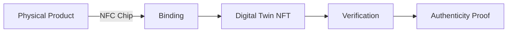

# TAG IT Network Documentation

Welcome to the official documentation for **TAG IT Network** — a Web3 platform for authenticating physical assets through NFC-bound Digital Twins.

## What is TAG IT Network?

TAG IT Network enables **verifiable authenticity, ownership, and status tracking** for physical products by binding them to cryptographic Digital Twins on the blockchain.

## Quick Links

### Getting Started
- [Quickstart Guide](./getting-started/quickstart.md) — Up and running in 5 minutes
- [Installation](./getting-started/installation.md) — Full setup instructions
- [First Verification](./getting-started/first-verification.md) — Verify your first asset

### Core Concepts
- [Architecture Overview](./architecture/overview.md) — System design
- [ORACULS Stack](./architecture/oraculs-stack.md) — Technology deep-dive
- [Asset Lifecycle](./architecture/data-flow.md) — State transitions

### Developer Reference
- [Smart Contracts](./contracts/index.md) — 6 core contract modules
- [REST API](./api/overview.md) — Backend API reference
- [SDKs](./sdk/overview.md) — JavaScript, Kotlin, Swift

## The ORACULS Stack

| Layer | Component | Purpose |
|-------|-----------|---------|
| **L2** | TAGIT L2 (OP Stack) | Fast, low-cost transactions |
| **DA** | EigenDA | Data availability |
| **Settlement** | Ethereum | Security & finality |
| **Interop** | Chainlink CCIP | Cross-chain messaging |
| **Registry** | Private + Public | Data segregation |

## Asset Lifecycle

Assets progress through these states:

| State | Description |
|-------|-------------|
| `MINTED` | NFT created, not yet bound |
| `BOUND` | Linked to physical NFC chip |
| `ACTIVATED` | Chip verified, asset active |
| `CLAIMED` | Owned by end user |
| `FLAGGED` | Frozen (dispute/fraud) |
| `RECYCLED` | End of life (terminal) |

## Smart Contract Modules

| Module | Purpose |
|--------|---------|
| [TAGITCore](./contracts/tagit-core.md) | Asset NFT + Lifecycle + Verification |
| [TAGITAccess](./contracts/tagit-access.md) | BIDGES badges + role-based access |
| [TAGITRecovery](./contracts/tagit-recovery.md) | AIRP + quarantine |
| [TAGITGovernor](./contracts/tagit-governor.md) | Multi-house DAO governance |
| [TAGITTreasury](./contracts/tagit-treasury.md) | Protocol funds management |
| [TAGITPrograms](./contracts/tagit-programs.md) | Rewards, Customs, Recalls |

## SDKs & Tools

| Platform | Package | Status |
|----------|---------|--------|
| JavaScript/TypeScript | `@tagit/sdk` | Available |
| Kotlin (Android) | `network.tagit:sdk` | Available |
| Swift (iOS) | `TAGITKit` | Available |
| CLI | `@tagit/cli` | Available |

## Resources

- [GitHub Organization](https://github.com/tagit-network)
- [OP Sepolia Testnet](https://sepolia-optimism.etherscan.io)
- [Glossary](./glossary.md)

---

*Built by TAG IT Network*
