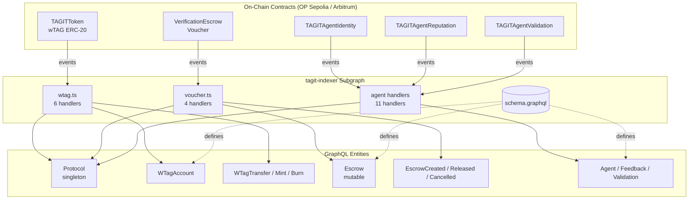

# wTAG & Voucher Subgraph Schema

Extends the **tagit-indexer** subgraph with two new data sources — wTAG (`TAGITToken`) and Voucher (`VerificationEscrow`) — while preserving all three existing Agent data sources unchanged.

> **Related docs**:
> [Notion Wiki](https://www.notion.so/3314e3e9a2d381208b05e973a7ab7b5d) ·
> [GitHub Wiki](https://github.com/TAG-IT-NETWORK/tagit-indexer/wiki/wTAG-Voucher-Subgraph) ·
> [tagit-indexer PR #1](https://github.com/TAG-IT-NETWORK/tagit-indexer/pull/1)

---

## Overview

| Data Source | Contract | Events Indexed | Network |
|-------------|----------|---------------|---------|
| `TAGITToken` (wTAG) | TAGITToken (ERC-20 UUPS) | 6 | OP Sepolia, Arbitrum |
| `VerificationEscrow` (Voucher) | VerificationEscrow | 4 | OP Sepolia, Arbitrum |
| `TAGITAgentIdentity` | Agent Identity | 5 | _(unchanged)_ |
| `TAGITAgentReputation` | Agent Reputation | 3 | _(unchanged)_ |
| `TAGITAgentValidation` | Agent Validation | 3 | _(unchanged)_ |

> **Note:** Contract addresses for TAGITToken and VerificationEscrow are currently `0x0000…0000` (placeholder). Update `subgraph.yaml` and `networks.json` after deployment and re-index.

---

## GraphQL Schema

### Protocol Singleton (extended)

The global `Protocol` entity (id `"1"`) gains wTAG and Voucher aggregate fields:

```graphql
type Protocol @entity {
  id: ID!

  # --- Agent aggregates (existing) ---
  totalAgents: Int!
  totalActiveAgents: Int!
  totalFeedback: Int!
  averageRating: BigDecimal!
  totalValidationRequests: Int!
  totalValidationsPassed: Int!
  totalValidationsFailed: Int!

  # --- wTAG aggregates (new) ---
  wtagTotalSupply: BigInt!
  wtagTotalTransfers: Int!
  wtagTotalBurned: BigInt!

  # --- Voucher (escrow) aggregates (new) ---
  totalEscrows: Int!
  totalEscrowsReleased: Int!
  totalEscrowsCancelled: Int!
  totalEscrowVolume: BigInt!
}
```

---

### wTAG Entities (`TAGITToken`)

#### `WTagAccount`

Mutable per-address balance tracker for the wTAG ERC-20 token.

```graphql
type WTagAccount @entity {
  id: ID!                      # Account address (hex)
  address: Bytes!
  balance: BigInt!
  transfersSent: Int!
  transfersReceived: Int!

  transfersFrom: [WTagTransfer!]! @derivedFrom(field: "from")
  transfersTo:   [WTagTransfer!]! @derivedFrom(field: "to")
  approvals:     [WTagApproval!]! @derivedFrom(field: "owner")
}
```

#### `WTagTransfer` _(immutable)_

One record per ERC-20 `Transfer` event.

```graphql
type WTagTransfer @entity(immutable: true) {
  id: ID!                      # {txHash}-{logIndex}
  from: WTagAccount!
  to: WTagAccount!
  value: BigInt!
  timestamp: BigInt!
  blockNumber: BigInt!
  transactionHash: Bytes!
}
```

#### `WTagApproval` _(immutable)_

One record per ERC-20 `Approval` event.

```graphql
type WTagApproval @entity(immutable: true) {
  id: ID!
  owner: WTagAccount!
  spender: Bytes!
  value: BigInt!
  timestamp: BigInt!
  blockNumber: BigInt!
  transactionHash: Bytes!
}
```

#### `WTagMint` _(immutable)_

Emitted on `TokensMinted` — controlled mint by the emissions contract.

```graphql
type WTagMint @entity(immutable: true) {
  id: ID!
  to: WTagAccount!
  amount: BigInt!
  totalSupplyAfter: BigInt!
  timestamp: BigInt!
  blockNumber: BigInt!
  transactionHash: Bytes!
}
```

#### `WTagBurn` _(immutable)_

Emitted on `TokensBurned`.

```graphql
type WTagBurn @entity(immutable: true) {
  id: ID!
  from: WTagAccount!
  amount: BigInt!
  totalSupplyAfter: BigInt!
  timestamp: BigInt!
  blockNumber: BigInt!
  transactionHash: Bytes!
}
```

#### `WTagEmissionsConfig` _(immutable)_

Emitted on `EmissionsAddressSet` — configuration of the emissions address.

```graphql
type WTagEmissionsConfig @entity(immutable: true) {
  id: ID!
  emissions: Bytes!
  setter: Bytes!
  timestamp: BigInt!
  blockNumber: BigInt!
  transactionHash: Bytes!
}
```

#### `WTagUpgrade` _(immutable)_

Emitted on `ContractUpgraded` — UUPS proxy upgrade record.

```graphql
type WTagUpgrade @entity(immutable: true) {
  id: ID!
  newImplementation: Bytes!
  version: String!
  timestamp: BigInt!
  blockNumber: BigInt!
  transactionHash: Bytes!
}
```

---

### Voucher Entities (`VerificationEscrow`)

#### `Escrow`

Mutable record tracking the full lifecycle states of a buyer-seller USDC escrow for asset verification.

```graphql
type Escrow @entity {
  id: ID!                      # escrowId (string)
  escrowId: BigInt!
  assetId: BigInt!
  buyer: Bytes!
  seller: Bytes!
  amount: BigInt!
  status: String!              # "CREATED" | "RELEASED" | "CANCELLED"
  createdAt: BigInt!
  createdAtBlock: BigInt!
  releasedAt: BigInt           # null until released
  cancelledAt: BigInt          # null until cancelled
  oracle: Bytes                # null until oracle set
  transactionHash: Bytes!
}
```

**lifecycle states**: `CREATED` → `RELEASED` (verification passed) or `CANCELLED` (buyer refund)

#### `EscrowCreated` _(immutable)_

```graphql
type EscrowCreated @entity(immutable: true) {
  id: ID!
  escrow: Escrow!
  assetId: BigInt!
  buyer: Bytes!
  seller: Bytes!
  amount: BigInt!
  timestamp: BigInt!
  blockNumber: BigInt!
  transactionHash: Bytes!
}
```

#### `EscrowReleased` _(immutable)_

Verification passed; funds released to seller.

```graphql
type EscrowReleased @entity(immutable: true) {
  id: ID!
  escrow: Escrow!
  assetId: BigInt!
  seller: Bytes!
  amount: BigInt!
  oracle: Bytes!
  timestamp: BigInt!
  blockNumber: BigInt!
  transactionHash: Bytes!
}
```

#### `EscrowCancelled` _(immutable)_

Verification failed or cancelled; funds returned to buyer.

```graphql
type EscrowCancelled @entity(immutable: true) {
  id: ID!
  escrow: Escrow!
  assetId: BigInt!
  buyer: Bytes!
  amount: BigInt!
  timestamp: BigInt!
  blockNumber: BigInt!
  transactionHash: Bytes!
}
```

#### `OracleUpdate` _(immutable)_

Emitted on `TrustedOracleUpdated`.

```graphql
type OracleUpdate @entity(immutable: true) {
  id: ID!
  previousOracle: Bytes!
  newOracle: Bytes!
  timestamp: BigInt!
  blockNumber: BigInt!
  transactionHash: Bytes!
}
```

---

## Event Handlers

### `src/handlers/wtag.ts`

| Handler | Trigger Event | Action |
|---------|--------------|--------|
| `handleTransfer` | `Transfer(from, to, value)` | Upsert `WTagAccount` balances; write `WTagTransfer`; increment `Protocol.wtagTotalTransfers` |
| `handleApproval` | `Approval(owner, spender, value)` | Write `WTagApproval` |
| `handleTokensMinted` | `TokensMinted(to, amount, totalSupply)` | Write `WTagMint`; update `Protocol.wtagTotalSupply` |
| `handleTokensBurned` | `TokensBurned(from, amount, totalSupply)` | Write `WTagBurn`; update `Protocol.wtagTotalSupply` + `wtagTotalBurned` |
| `handleEmissionsAddressSet` | `EmissionsAddressSet(emissions, setter)` | Write `WTagEmissionsConfig` |
| `handleContractUpgraded` | `ContractUpgraded(impl, version)` | Write `WTagUpgrade` |

> **Known issue:** `wtagTotalTransfers` is incremented unconditionally, including mint/burn Transfer events. This is intentional but should be validated against downstream analytics consumers.

### `src/handlers/voucher.ts`

| Handler | Trigger Event | Action |
|---------|--------------|--------|
| `handleEscrowCreated` | `EscrowCreated(escrowId, assetId, buyer, seller, amount)` | Create `Escrow` (status `CREATED`); write `EscrowCreated`; increment `Protocol.totalEscrows` + `totalEscrowVolume` |
| `handleEscrowReleased` | `EscrowReleased(escrowId, assetId, seller, amount, oracle)` | Update `Escrow` → status `RELEASED`; write `EscrowReleased`; increment `Protocol.totalEscrowsReleased` |
| `handleEscrowCancelled` | `EscrowCancelled(escrowId, assetId, buyer, amount)` | Update `Escrow` → status `CANCELLED`; write `EscrowCancelled`; increment `Protocol.totalEscrowsCancelled` |
| `handleTrustedOracleUpdated` | `TrustedOracleUpdated(prev, next)` | Write `OracleUpdate` |

---

## Sample Queries

### wTAG: Top holders by balance

```graphql
{
  wTagAccounts(orderBy: balance, orderDirection: desc, first: 10) {
    address
    balance
    transfersSent
    transfersReceived
  }
}
```

### wTAG: Recent mints

```graphql
{
  wTagMints(orderBy: timestamp, orderDirection: desc, first: 5) {
    to { address }
    amount
    totalSupplyAfter
    transactionHash
    timestamp
  }
}
```

### Voucher: Open escrows

```graphql
{
  escrows(where: { status: "CREATED" }) {
    escrowId
    assetId
    buyer
    seller
    amount
    createdAt
  }
}
```

### Voucher: Escrow lifecycle for an asset

```graphql
{
  escrows(where: { assetId: "42" }) {
    escrowId
    status
    createdAt
    releasedAt
    cancelledAt
    oracle
  }
}
```

### Protocol aggregates

```graphql
{
  protocol(id: "1") {
    wtagTotalSupply
    wtagTotalTransfers
    wtagTotalBurned
    totalEscrows
    totalEscrowsReleased
    totalEscrowsCancelled
    totalEscrowVolume
  }
}
```

---

## Deployment

```bash
# 1. Codegen (must pass — all 5 WASM modules)
graph codegen

# 2. Build
graph build

# 3. Deploy to Goldsky (after updating 0x0 addresses)
goldsky subgraph deploy tagit-indexer/v2 --path .
```

> **Before deploying:** replace all `0x0000…0000` placeholder addresses in `subgraph.yaml` and `networks.json` with the deployed TAGITToken and VerificationEscrow addresses on OP Sepolia and Arbitrum. A CI guard is planned to reject all-zero addresses automatically.

---

## Architecture Diagram



---

## Pending

- [ ] Replace `0x0000…0000` addresses in `subgraph.yaml` / `networks.json` post-deployment
- [ ] Add `wtag.test.ts` and `voucher.test.ts` (Matchstick, Linux CI)
- [ ] Add CI guard to reject all-zero contract addresses before deploy
- [ ] Update `startBlock` per data source after first indexed block is known
