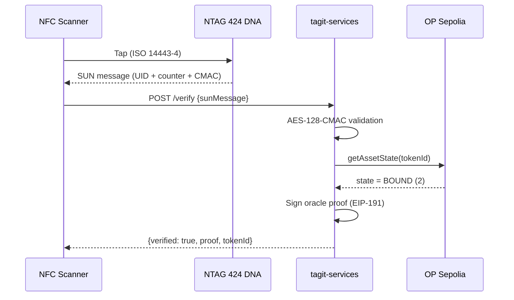

# SDK Quickstart — Escrow & Verification

Complete your first NFC-verified escrow settlement. The escrow steps use viem directly; `@tagit/sdk` is not published and is only needed for the agent-event step.

> **Prerequisites:**
>
> - Node.js ≥ 20
> - An OP Sepolia or Base Sepolia wallet with testnet ETH
> - USDC on Base Sepolia (get from [Circle faucet](https://faucet.circle.com/))

---

## 1. Install

> **`@tagit/sdk` is not published.** `npm install @tagit/sdk` fails — the registry returns
> 404, and the `@tagit` npm scope belongs to an unrelated third party. Build it from source.

```bash
git clone https://github.com/TAG-IT-NETWORK/tagit-sdk.git
cd tagit-sdk
npm install
npm run build
```

Then reference it from your project by path (`npm install /path/to/tagit-sdk`) or `npm link`.

The escrow steps below use **viem directly** and do not need the SDK at all — only the
agent-event section (step 8) does:

```bash
npm install viem
```

### Getting the escrow ABI

The samples below reference `verificationEscrowAbi`. The SDK does **not** export it — it
only exports `agentIdentityAbi`, `agentReputationAbi`, `agentValidationAbi`, `wtagAbi`, and
`voucherAbi`. Generate the escrow ABI from the contract source instead:

```bash
git clone https://github.com/TAG-IT-NETWORK/tagit-contracts.git
cd tagit-contracts
forge build
# ABI is at out/VerificationEscrow.sol/VerificationEscrow.json → .abi
```

---

## 2. Initialize the Client

```typescript
import { createAgentClient } from "@tagit/sdk"; // not published — build from source

// Read-only client (no private key needed)
const reader = createAgentClient({
  rpcUrl: "https://sepolia.optimism.io",
});

// Read + write client (requires private key)
const writer = createAgentClient({
  rpcUrl: "https://sepolia.optimism.io",
  privateKey: "0x...", // Never hardcode — use env vars
});
```

### Configuration Options

| Option | Type | Default | Description |
|--------|------|---------|-------------|
| `chain` | `Chain` | OP Sepolia | Viem chain definition |
| `rpcUrl` | `string` | — | JSON-RPC endpoint URL |
| `privateKey` | `` `0x${string}` `` | — | Private key for write ops |
| `publicClient` | `PublicClient` | — | Custom viem public client |
| `walletClient` | `WalletClient` | — | Custom viem wallet client |

---

## 3. Register an Agent

Before interacting with the verification system, register an agent identity:

```typescript
// Check the registration fee
const fee = await client.identity.registrationFee();
console.log("Registration fee:", fee, "wei");

// Register a new agent
const txHash = await client.identity.register(
  "0xYourOperationalWallet",  // Agent's operational wallet
  "ipfs://QmAgentMetadata",   // Metadata URI (IPFS recommended)
  fee,                        // Registration fee (if required)
);

console.log("Agent registered:", txHash);
```

---

## 4. NFC SUN Message Verification Flow

The NFC verification flow uses NTAG 424 DNA Secure Unique NFC (SUN) messages. Here is the complete end-to-end process:



### Step-by-Step

#### a. Parse the SUN Message

When a user taps an NTAG 424 DNA chip, the phone receives a URL containing the SUN message:

```typescript
// The tap opens a URL on https://verify.tagit.network/sun carrying two chip-generated
// query parameters — the same two the verification API takes:
//   picc = encrypted PICC data (UID + tap counter)
//   cmac = AES-128 CMAC over that data
//
// Both are produced by the NTAG 424 DNA chip at tap time and cannot be constructed
// by hand, so the placeholder values below will not verify.
const params = new URLSearchParams(window.location.search);

const sunMessage = {
  picc: params.get("picc"),
  cmac: params.get("cmac"),
};
```

#### b. Verify via Backend API

An escrow release needs a *signed* oracle proof, which comes from
`POST https://api.tagit.network/verify`. That endpoint is paywalled with
[x402](https://x402.org) — there is no API key. An unpaid request answers `402`
with the payment terms:

```typescript
const response = await fetch("https://api.tagit.network/verify", {
  method: "POST",
  headers: { "Content-Type": "application/json" },
  body: JSON.stringify({ sunMessage }),
});

if (response.status === 402) {
  const envelope = await response.json();
  // {
  //   "x402Version": 1,
  //   "error": "Payment required",
  //   "accepts": [{
  //     "scheme": "exact",
  //     "network": "base-sepolia",
  //     "maxAmountRequired": "10000",
  //     "resource": "https://api.tagit.network/verify",
  //     "description": "TAG IT Asset Verification — BOUND state proof + ECDSA signature",
  //     "mimeType": "application/json",
  //     "payTo": "0x458B4d0c3a55006965Fd13D6af7B8509De51Cb3D",
  //     "maxTimeoutSeconds": 30,
  //     "asset": "0x036CbD53842c5426634e7929541eC2318f3dCF7e"
  //   }]
  // }
  // asset = USDC on Base Sepolia (6 decimals), so 10000 = 0.01 USDC.
  // Settle, then retry the request with an X-PAYMENT header.
}
```

> **Not yet captured:** the body returned *after* a settled payment is not
> reproduced here, because we have not paid this endpoint and read it. The
> `OracleProof` struct consumed by the escrow contract below is defined in
> [tagit-contracts](https://github.com/TAG-IT-NETWORK/tagit-contracts); treat the
> live response and the contract ABI as authoritative over this guide.

If you only need a yes/no verdict rather than a signed proof, use the free
tap-gated endpoint instead — `GET https://verify.tagit.network/api/verify?picc=…&cmac=…`.
See [API Overview](../api/overview.md).

#### c. Use the Proof On-Chain

With the oracle proof, you can release an escrow:

```typescript
import { createPublicClient, createWalletClient, http } from "viem";
import { baseSepolia } from "viem/chains";
import { privateKeyToAccount } from "viem/accounts";

const account = privateKeyToAccount(process.env.PRIVATE_KEY as `0x${string}`);

const walletClient = createWalletClient({
  account,
  chain: baseSepolia,
  transport: http(),
});

// Release escrow with oracle proof
const txHash = await walletClient.writeContract({
  address: "0x4c9aACfcb64169E3BC187c227c4C0e0a5CFDA1cF",
  abi: verificationEscrowAbi,
  functionName: "releaseWithProof",
  args: [escrowId, result.proof],
});

console.log("Escrow released:", txHash);
```

---

## 5. Create an Escrow (Buyer Flow)

```typescript
import { parseUnits } from "viem";

const USDC_ADDRESS = "0x036CbD53842c5426634e7929541eC2318f3dCF7e";
const ESCROW_ADDRESS = "0x4c9aACfcb64169E3BC187c227c4C0e0a5CFDA1cF";

// Step 1: Approve USDC spending
await walletClient.writeContract({
  address: USDC_ADDRESS,
  abi: erc20Abi,
  functionName: "approve",
  args: [ESCROW_ADDRESS, parseUnits("10", 6)], // 10 USDC
});

// Step 2: Create escrow
const txHash = await walletClient.writeContract({
  address: ESCROW_ADDRESS,
  abi: verificationEscrowAbi,
  functionName: "createEscrow",
  args: [
    42n,             // TAGITCore asset token ID
    sellerAddress,   // Seller wallet
    parseUnits("10", 6), // 10 USDC
  ],
});

console.log("Escrow created:", txHash);
```

---

## 6. Cancel an Escrow (Buyer Only)

```typescript
const txHash = await walletClient.writeContract({
  address: ESCROW_ADDRESS,
  abi: verificationEscrowAbi,
  functionName: "cancelEscrow",
  args: [escrowId],
});

console.log("Escrow cancelled, USDC refunded:", txHash);
```

---

## 7. Watch for Events

```typescript
const publicClient = createPublicClient({
  chain: baseSepolia,
  transport: http(),
});

// Watch for new escrows
const unwatch = publicClient.watchContractEvent({
  address: ESCROW_ADDRESS,
  abi: verificationEscrowAbi,
  eventName: "EscrowCreated",
  onLogs: (logs) => {
    for (const log of logs) {
      console.log("New escrow:", {
        escrowId: log.args.escrowId,
        assetId: log.args.assetId,
        buyer: log.args.buyer,
        amount: log.args.amount,
      });
    }
  },
});

// Later: unwatch() to stop
```

---

## 8. Agent Event Watching

For agent-related events, use the SDK's built-in watchers:

```typescript
// Watch for agent registrations
const unsub = client.events.watchAgentRegistered((logs) => {
  for (const log of logs) {
    console.log("Agent registered:", log.args.agentId);
  }
});

// Watch for validation finalization
const unsub2 = client.events.watchValidationFinalized((logs) => {
  for (const log of logs) {
    console.log("Validation complete:", {
      agentId: log.args.agentId,
      passed: log.args.passed,
      score: log.args.finalScore,
    });
  }
});
```

---

## Next Steps

- [SDK API Reference](./sdk-api-reference.md) — Full method documentation
- [Agent Integration Tutorial](../guides/agent-integration-tutorial.md) — Complete NFC → escrow workflow
- [VerificationEscrow Contract](../contracts/verification-escrow.md) — On-chain reference
- [NTAG 424 DNA](../hardware/ntag-424-dna.md) — NFC chip specifications

---

## Troubleshooting

| Issue | Solution |
|-------|----------|
| `insufficient funds` | Fund the account with Base Sepolia testnet ETH from any Base Sepolia faucet |
| `ERC20InsufficientAllowance` | Call `approve()` on USDC before `createEscrow()` |
| `ProofTooStale` | Oracle proof is older than 1 hour — request a fresh scan |
| `AssetNotBound` | Asset must be in BOUND state (2) for escrow release |
| `InvalidOracleSignature` | Oracle signer doesn't match contract's `trustedOracle` |
