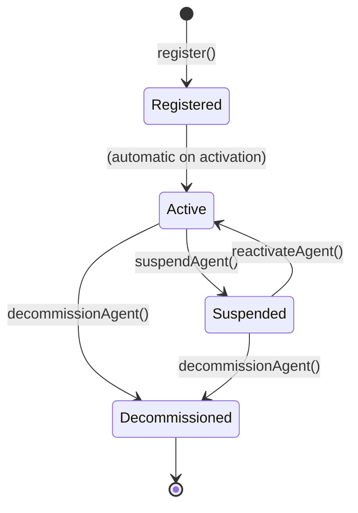
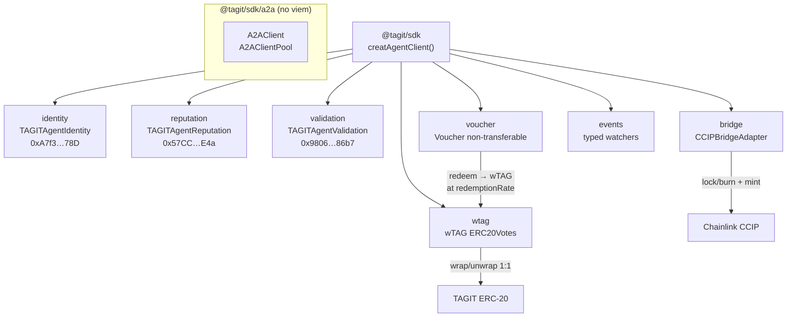

# TypeScript SDK — @tagit/sdk

Developer reference for the `@tagit/sdk` TypeScript SDK introduced in
[tagit-sdk PR #3](https://github.com/TAG-IT-NETWORK/tagit-sdk/pull/3).

> **See also:**
> [Notion Wiki](https://www.notion.so/3324e3e9a2d3812f9197cd6f4d8243e8) ·
> [tagit-docs MDX](https://github.com/TAG-IT-NETWORK/tagit-docs/blob/sudo/docs-3314e3e9/docs/sdk/typescript-sdk-agents.mdx) ·
> [tagit-docs PR #1](https://github.com/TAG-IT-NETWORK/tagit-docs/pull/1) ·
> [tagit-sdk PR #3](https://github.com/TAG-IT-NETWORK/tagit-sdk/pull/3)

---

## Overview

`@tagit/sdk` is a TypeScript-first SDK that provides typed wrappers for TAGIT's three ERC-8004 Agent contracts, the `wTAG` governance token, and the `Voucher` reward token. It also ships a typed A2A (Agent-to-Agent) JSON-RPC 2.0 client and a `tagit` CLI.

```
@tagit/sdk v0.1.0
├── src/
│   ├── client/          — createAgentClient() factory
│   ├── contracts/       — identity, reputation, validation, wtag, voucher, bridge
│   ├── abi/             — typed ABIs (as const satisfies Abi)
│   ├── addresses/       — per-chain contract address registry
│   ├── chains/          — OP Sepolia chain definition
│   ├── events/          — event watchers (identity, reputation, validation, bridge)
│   ├── types/           — TypeScript interface/enum definitions
│   ├── utils/           — zod validation schemas
│   ├── a2a/             — A2AClient, A2AClientPool (subpath: @tagit/sdk/a2a)
│   ├── bridge/          — CCIPBridgeAdapter client
│   └── cli/             — tagit CLI (commander)
└── test/
    ├── unit/            — vitest unit tests (contracts, a2a, cli, events)
    └── integration/     — agent auth-status integration test
```

**Stack:** TypeScript 5.7 · ESM (`"type": "module"`, Node16) · viem ^2.23 · zod ^3.24 · commander ^13.1 · vitest ^3.0

---

## Installation

```bash
npm install @tagit/sdk
# Node.js >= 20 required
```

---

## `createAgentClient(config?)`

Main entry point. Returns a `TagitAgentClient` containing all sub-clients.

```typescript
import { createAgentClient } from "@tagit/sdk";

const client = createAgentClient({
  rpcUrl:     "https://sepolia.optimism.io",
  privateKey: "0x...",   // omit for read-only
});
```

### Config

```typescript
interface AgentClientConfig {
  chain?:        Chain;           // default: OP Sepolia (11155420)
  rpcUrl?:       string;
  privateKey?:   `0x${string}`;
  publicClient?: PublicClient;    // inject custom viem client
  walletClient?: WalletClient;
}
```

### Return Type

```typescript
interface TagitAgentClient {
  identity:   IdentityClient;
  reputation: ReputationClient;
  validation: ValidationClient;
  wtag:       WTagClient;
  voucher:    VoucherClient;
  bridge:     BridgeClient;
  events:     EventsClient;
}
```

---

## Contract Addresses (OP Sepolia — chain ID 11155420)

| Contract | Address |
|----------|---------|
| `TAGITAgentIdentity` | `0xA7f34FD595eBc397Fe04DcE012dbcf0fbbD2A78D` |
| `TAGITAgentReputation` | `0x57CCa1974DFE29593FBD24fdAEE1cD614Bfd6E4a` |
| `TAGITAgentValidation` | `0x9806919185F98Bd07a64F7BC7F264e91939e86b7` |

```typescript
import { getAddresses } from "@tagit/sdk";
const addrs = getAddresses(11155420);
```

---

## Identity — `client.identity`

### Read Signatures

```typescript
getAgent(agentId: bigint): Promise<Agent>
getAgentStatus(agentId: bigint): Promise<AgentStatus>
getAgentByWallet(wallet: Address): Promise<bigint>
getAgentsByRegistrant(registrant: Address): Promise<bigint[]>
getMetadata(agentId: bigint, key: string): Promise<string>
isActiveAgent(agentId: bigint): Promise<boolean>
totalAgents(): Promise<bigint>
registrationFee(): Promise<bigint>
tokenURI(agentId: bigint): Promise<string>
```

### Write Signatures

```typescript
// All write methods return tx hash: Promise<`0x${string}`>
register(wallet: Address, uri: string, value?: bigint): Promise<`0x${string}`>
setAgentURI(agentId: bigint, uri: string): Promise<`0x${string}`>
setMetadata(agentId: bigint, key: string, value: string): Promise<`0x${string}`>
suspendAgent(agentId: bigint): Promise<`0x${string}`>
reactivateAgent(agentId: bigint): Promise<`0x${string}`>
decommissionAgent(agentId: bigint): Promise<`0x${string}`>
```

### Types

```typescript
interface Agent {
  registrant:   Address;
  wallet:       Address;
  registeredAt: bigint;
  active:       boolean;
}

enum AgentStatus {
  Registered     = 0,
  Active         = 1,
  Suspended      = 2,
  Decommissioned = 3,
}
```

### Agent Lifecycle States



---

## Reputation — `client.reputation`

### Read Signatures

```typescript
getSummary(agentId: bigint): Promise<ReputationSummary>
getFeedback(feedbackId: bigint): Promise<Feedback>
readAllFeedback(agentId: bigint): Promise<Feedback[]>
getAgentFeedbackIds(agentId: bigint): Promise<bigint[]>
getReviewerFeedback(reviewer: Address, agentId: bigint): Promise<bigint>
```

### Write Signatures

```typescript
giveFeedback(agentId: bigint, rating: number, comment: string): Promise<`0x${string}`>
revokeFeedback(feedbackId: bigint): Promise<`0x${string}`>
appendResponse(feedbackId: bigint, responseText: string): Promise<`0x${string}`>
```

### Types

```typescript
interface ReputationSummary {
  totalFeedback:  bigint;
  activeFeedback: bigint;
  averageRating:  bigint;    // ×100 scaled; 450 = 4.50 stars
  weightedScore:  bigint;
  lastFeedbackAt: bigint;
}

interface Feedback {
  reviewer:  Address;
  agentId:   bigint;
  rating:    number;         // 1–5
  comment:   string;
  response:  string;
  timestamp: bigint;
  revoked:   boolean;
}
```

---

## Validation — `client.validation`

### Read Signatures

```typescript
getRequest(requestId: bigint): Promise<ValidationRequest>
getSummary(agentId: bigint): Promise<ValidationSummary>
getValidationStatus(agentId: bigint): Promise<ValidationStatus>
getResponses(requestId: bigint): Promise<ValidatorResponse[]>
getAgentRequests(agentId: bigint): Promise<bigint[]>
getValidatorStats(validator: Address): Promise<ValidatorStats>
hasValidatorResponded(requestId: bigint, validator: Address): Promise<boolean>
```

### Write Signatures

```typescript
validationRequest(agentId: bigint, isDefense: boolean): Promise<`0x${string}`>
validationResponse(requestId: bigint, score: number, justification: string): Promise<`0x${string}`>
```

### Types

```typescript
enum RequestStatus {
  Pending = 0,
  Passed  = 1,
  Failed  = 2,
  Expired = 3,
}

interface ValidationRequest {
  agentId:       bigint;
  requester:     Address;
  quorum:        number;
  responseCount: number;
  createdAt:     bigint;
  status:        RequestStatus;
  isDefense:     boolean;
}

interface ValidationStatus {
  isValidated:     boolean;
  latestScore:     bigint;  // 0–100
  lastValidatedAt: bigint;
}

interface ValidatorResponse {
  validator:     Address;
  score:         number;   // 0–100
  justification: string;
  timestamp:     bigint;
}
```

---

## wTAG — `client.wtag`

Wraps the `wTAG` ERC20Votes governance token (TAGIT → wTAG 1:1 wrap).

### Read Signatures

```typescript
name(): Promise<string>
symbol(): Promise<string>
decimals(): Promise<number>
totalSupply(): Promise<bigint>
balanceOf(account: Address): Promise<bigint>
allowance(owner: Address, spender: Address): Promise<bigint>
underlyingToken(): Promise<Address>
isMinter(account: Address): Promise<boolean>
version(): Promise<string>
delegates(account: Address): Promise<Address>
getVotes(account: Address): Promise<bigint>
```

### Write Signatures

```typescript
wrap(amount: bigint): Promise<`0x${string}`>
unwrap(amount: bigint): Promise<`0x${string}`>
transfer(to: Address, amount: bigint): Promise<`0x${string}`>
approve(spender: Address, amount: bigint): Promise<`0x${string}`>
transferFrom(from: Address, to: Address, amount: bigint): Promise<`0x${string}`>
delegate(delegatee: Address): Promise<`0x${string}`>
```

### Event Schemas

```typescript
// WTagEvents
Wrapped:        { account: Address; amount: bigint }
Unwrapped:      { account: Address; amount: bigint }
MinterMinted:   { to: Address; amount: bigint; minter: Address }
MinterGranted:  { minter: Address; grantedBy: Address }
MinterRevoked:  { minter: Address; revokedBy: Address }
Transfer:       { from: Address; to: Address; value: bigint }
Approval:       { owner: Address; spender: Address; value: bigint }
```

---

## Voucher — `client.voucher`

Non-transferable ERC-20 reward tokens. Redeemable for wTAG at a configurable basis-point rate.

**Redemption formula:** `wTAG = (voucherAmount × redemptionRate) / 10000`

### Read Signatures

```typescript
name(): Promise<string>
symbol(): Promise<string>
decimals(): Promise<number>
totalSupply(): Promise<bigint>
balanceOf(account: Address): Promise<bigint>
core(): Promise<Address>               // TAGITCore issuer
wtag(): Promise<Address>               // wTAG payout
redemptionRate(): Promise<bigint>      // basis points
isRedemptionPaused(): Promise<boolean>
version(): Promise<string>
owner(): Promise<Address>
basisPoints(): Promise<bigint>         // constant: 10000
```

### Write Signatures

```typescript
issue(to: Address, amount: bigint, tokenId: bigint, reason: string): Promise<`0x${string}`>
burnFrom(from: Address, amount: bigint): Promise<`0x${string}`>
redeem(amount: bigint): Promise<`0x${string}`>
setRedemptionRate(newRate: bigint): Promise<`0x${string}`>
setRedemptionPaused(paused: boolean): Promise<`0x${string}`>
```

### Event Schemas

```typescript
// VoucherEvents
VoucherIssued:          { to: Address; amount: bigint; tokenId: bigint; reason: string }
VoucherRedeemed:        { account: Address; voucherAmount: bigint; wtagAmount: bigint }
VoucherBurned:          { from: Address; amount: bigint }
CoreUpdated:            { previousCore: Address; newCore: Address }
WtagUpdated:            { previousWtag: Address; newWtag: Address }
RedemptionRateUpdated:  { oldRate: bigint; newRate: bigint }
RedemptionPauseToggled: { paused: boolean }
```

---

## A2A Client (`@tagit/sdk/a2a`)

Zero-viem JSON-RPC 2.0 client for TAGIT A2A agent servers.

```typescript
import { A2AClient, A2AClientPool } from "@tagit/sdk/a2a";
```

### `A2AClient` Signatures

```typescript
constructor(config: {
  baseUrl:     string;
  authToken?:  string;
  timeout?:    number;   // default 30000 ms
  maxRetries?: number;   // default 3, exponential backoff
  fetch?:      typeof fetch; // injectable for testing
})

connect(opts?: { force?: boolean }): Promise<AgentCard>
sendTask(params: TaskParams): Promise<A2ATask>
getTask(params: { id: string }): Promise<A2ATask>
cancelTask(params: { id: string }): Promise<A2ATask>
subscribe(params: TaskParams): AsyncGenerator<SSEEvent>
```

### `A2AClientPool` Signatures

```typescript
constructor(defaults?: Partial<A2AClientConfig>)
get(baseUrl: string): A2AClient   // cached per baseUrl
remove(baseUrl: string): void
clear(): void
```

### Error Hierarchy

```
SdkError (base)
├── ContractError   — viem contract call failure
├── ValidationError — zod schema violation
└── A2AError        — JSON-RPC 2.0 / SSE error
```

`catch (e instanceof SdkError)` catches all three subtypes.

---

## Event Watchers

```typescript
// Returns unsubscribe function: () => void
client.events.watchAgentRegistered(cb: (logs) => void): () => void
client.events.watchAgentSuspended(cb: (logs) => void): () => void
client.events.watchFeedbackGiven(cb: (logs) => void): () => void
client.events.watchValidationRequested(cb: (logs) => void): () => void
client.events.watchValidationPassed(cb: (logs) => void): () => void
```

---

## CLI Reference

```
tagit agent info      --agent-id <n> [--json]
tagit agent register  --wallet <addr> --uri <uri> [--private-key <key>]
tagit agent feedback  --agent-id <n> --rating <1-5> --comment <str> [--private-key <key>]
tagit agent validate  --agent-id <n> [--defense] [--private-key <key>]
```

**Env vars:** `TAGIT_RPC_URL`, `TAGIT_PRIVATE_KEY`

---

## Architecture Diagram



---

## Source Files

| Path | Description |
|------|-------------|
| `src/client/create-agent-client.ts` | Main factory function |
| `src/contracts/identity.ts` | Identity read/write client |
| `src/contracts/reputation.ts` | Reputation read/write client |
| `src/contracts/validation.ts` | Validation read/write client |
| `src/contracts/wtag.ts` | wTAG read/write client |
| `src/contracts/voucher.ts` | Voucher read/write client |
| `src/contracts/bridge.ts` | CCIP bridge adapter client |
| `src/a2a/client.ts` | A2AClient (JSON-RPC + SSE) |
| `src/a2a/pool.ts` | A2AClientPool |
| `src/addresses/index.ts` | Per-chain address registry |
| `src/types/` | All TypeScript interfaces and enums |
| `src/abi/` | Typed ABI constants |
| `src/cli/` | CLI commands (commander) |
| `test/unit/` | Vitest unit test suite |
