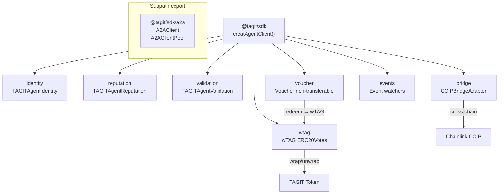

# @tagit/sdk — TypeScript SDK

Full-stack TypeScript SDK for interacting with TAGIT ERC-8004 Agent contracts, wTAG governance token, and Voucher reward tokens on OP Sepolia. Includes a typed A2A (Agent-to-Agent) client and a `tagit` CLI.

> **See also:**
> [Notion Wiki](https://www.notion.so/3324e3e9a2d3812f9197cd6f4d8243e8) ·
> [GitHub Wiki](https://github.com/TAG-IT-NETWORK/tagit-sdk/wiki/TypeScript-SDK-Agents) ·
> [tagit-sdk PR #3](https://github.com/TAG-IT-NETWORK/tagit-sdk/pull/3)

---

## Package Details

| Property | Value |
|----------|-------|
| **Package** | `@tagit/sdk` |
| **Version** | `0.1.0` |
| **Language** | TypeScript 5.7 (ESM, Node16 modules) |
| **Runtime** | Node.js ≥ 20 |
| **Blockchain** | [viem](https://viem.sh) ^2.23 |
| **Validation** | [zod](https://zod.dev) ^3.24 |
| **CLI** | [commander](https://github.com/tj/commander.js) ^13.1 |
| **Tests** | [vitest](https://vitest.dev) ^3.0 |
| **Network** | OP Sepolia (chain ID 11155420) |
| **License** | MIT |

---

## Installation

```bash
npm install @tagit/sdk
```

---

## Quick Start

```typescript
import { createAgentClient } from "@tagit/sdk";

// Read-only client — no private key required
const client = createAgentClient({
  rpcUrl: "https://sepolia.optimism.io",
});

// Identity
const agent = await client.identity.getAgent(1n);
console.log(agent.wallet, agent.active);

// Reputation
const rep = await client.reputation.getSummary(1n);
console.log(`Rating: ${rep.averageRating}`);

// Validation
const status = await client.validation.getValidationStatus(1n);
console.log(`Validated: ${status.isValidated}`);
```

---

## `createAgentClient(config?)`

Factory function that creates a `TagitAgentClient` wiring all three Agent contracts plus wTAG, Voucher, bridge, and events.

### Parameters

| Option | Type | Default | Description |
|--------|------|---------|-------------|
| `chain` | `Chain` | OP Sepolia | viem chain definition |
| `rpcUrl` | `string` | — | RPC endpoint URL |
| `privateKey` | `` `0x${string}` `` | — | Private key for write operations |
| `publicClient` | `PublicClient` | auto | Custom viem public client |
| `walletClient` | `WalletClient` | auto | Custom viem wallet client |

### Returns

```typescript
interface TagitAgentClient {
  identity:   IdentityClient;
  reputation: ReputationClient;
  validation: ValidationClient;
  wtag:       WTagClient;
  voucher:    VoucherClient;
  bridge:     BridgeClient;
  events:     EventsClient;
}
```

---

## Agent Identity

Wraps `TAGITAgentIdentity` (ERC-8004 soulbound agent registry).

**Contract address (OP Sepolia):** `0xA7f34FD595eBc397Fe04DcE012dbcf0fbbD2A78D`

### Read Methods

| Method | Signature | Returns |
|--------|-----------|---------|
| `getAgent` | `(agentId: bigint)` | `Agent` |
| `getAgentStatus` | `(agentId: bigint)` | `AgentStatus` |
| `getAgentByWallet` | `(wallet: Address)` | `bigint` |
| `getAgentsByRegistrant` | `(registrant: Address)` | `bigint[]` |
| `getMetadata` | `(agentId: bigint, key: string)` | `string` |
| `isActiveAgent` | `(agentId: bigint)` | `boolean` |
| `totalAgents` | `()` | `bigint` |
| `registrationFee` | `()` | `bigint` |
| `tokenURI` | `(agentId: bigint)` | `string` |

### Write Methods

All write methods return a transaction hash (`` `0x${string}` ``).

| Method | Signature | Description |
|--------|-----------|-------------|
| `register` | `(wallet: Address, uri: string, value?: bigint)` | Register a new agent; pays `registrationFee` |
| `setAgentURI` | `(agentId: bigint, uri: string)` | Update agent metadata URI |
| `setMetadata` | `(agentId: bigint, key: string, value: string)` | Set an arbitrary metadata key |
| `suspendAgent` | `(agentId: bigint)` | Move agent to `Suspended` lifecycle state |
| `reactivateAgent` | `(agentId: bigint)` | Move agent from `Suspended` to `Active` |
| `decommissionAgent` | `(agentId: bigint)` | Move agent to terminal `Decommissioned` lifecycle state |

### `Agent` Type

```typescript
interface Agent {
  registrant: Address;   // address that registered the agent
  wallet:     Address;   // agent's operational wallet
  registeredAt: bigint;  // block timestamp
  active:     boolean;   // convenience alias: status === Active
}
```

### `AgentStatus` Enum

```typescript
enum AgentStatus {
  Registered     = 0,
  Active         = 1,
  Suspended      = 2,
  Decommissioned = 3,
}
```

---

## Agent Reputation

Wraps `TAGITAgentReputation` (on-chain feedback and weighted scoring).

**Contract address (OP Sepolia):** `0x57CCa1974DFE29593FBD24fdAEE1cD614Bfd6E4a`

### Read Methods

| Method | Signature | Returns |
|--------|-----------|---------|
| `getSummary` | `(agentId: bigint)` | `ReputationSummary` |
| `getFeedback` | `(feedbackId: bigint)` | `Feedback` |
| `readAllFeedback` | `(agentId: bigint)` | `Feedback[]` |
| `getAgentFeedbackIds` | `(agentId: bigint)` | `bigint[]` |
| `getReviewerFeedback` | `(reviewer: Address, agentId: bigint)` | `bigint` |

### Write Methods

| Method | Signature | Description |
|--------|-----------|-------------|
| `giveFeedback` | `(agentId: bigint, rating: number, comment: string)` | Submit feedback (rating 1–5) |
| `revokeFeedback` | `(feedbackId: bigint)` | Soft-delete own feedback |
| `appendResponse` | `(feedbackId: bigint, responseText: string)` | Agent owner appends reply to feedback |

### Key Types

```typescript
interface ReputationSummary {
  totalFeedback:   bigint;
  activeFeedback:  bigint;
  averageRating:   bigint;   // scaled ×100; e.g. 450 = 4.50 stars
  weightedScore:   bigint;
  lastFeedbackAt:  bigint;
}

interface Feedback {
  reviewer:   Address;
  agentId:    bigint;
  rating:     number;        // 1–5
  comment:    string;
  response:   string;        // agent owner reply
  timestamp:  bigint;
  revoked:    boolean;
}
```

---

## Agent Validation

Wraps `TAGITAgentValidation` (multi-party consensus validation).

**Contract address (OP Sepolia):** `0x9806919185F98Bd07a64F7BC7F264e91939e86b7`

### Read Methods

| Method | Signature | Returns |
|--------|-----------|---------|
| `getRequest` | `(requestId: bigint)` | `ValidationRequest` |
| `getSummary` | `(agentId: bigint)` | `ValidationSummary` |
| `getValidationStatus` | `(agentId: bigint)` | `ValidationStatus` |
| `getResponses` | `(requestId: bigint)` | `ValidatorResponse[]` |
| `getAgentRequests` | `(agentId: bigint)` | `bigint[]` |
| `getValidatorStats` | `(validator: Address)` | `ValidatorStats` |
| `hasValidatorResponded` | `(requestId: bigint, validator: Address)` | `boolean` |

### Write Methods

| Method | Signature | Description |
|--------|-----------|-------------|
| `validationRequest` | `(agentId: bigint, isDefense: boolean)` | Submit standard or defense validation request |
| `validationResponse` | `(requestId: bigint, score: number, justification: string)` | Validator submits score (0–100) |

### Key Types

```typescript
enum RequestStatus {
  Pending = 0,
  Passed  = 1,
  Failed  = 2,
  Expired = 3,
}

interface ValidationRequest {
  agentId:       bigint;
  requester:     Address;
  quorum:        number;
  responseCount: number;
  createdAt:     bigint;
  status:        RequestStatus;
  isDefense:     boolean;
}

interface ValidationStatus {
  isValidated:      boolean;
  latestScore:      bigint;    // 0–100
  lastValidatedAt:  bigint;
}
```

---

## wTAG Client

Wraps the `wTAG` governance token contract. wTAG is an ERC-20Votes token wrapping TAGIT 1:1 and providing Token House voting power in TAGITGovernor.

> See also: [`docs/token/wtag.mdx`](../token/wtag.mdx)

### Read Methods

| Method | Signature | Returns |
|--------|-----------|---------|
| `name` | `()` | `string` |
| `symbol` | `()` | `string` |
| `decimals` | `()` | `number` |
| `totalSupply` | `()` | `bigint` |
| `balanceOf` | `(account: Address)` | `bigint` |
| `allowance` | `(owner: Address, spender: Address)` | `bigint` |
| `underlyingToken` | `()` | `Address` |
| `isMinter` | `(account: Address)` | `boolean` |
| `version` | `()` | `string` |
| `delegates` | `(account: Address)` | `Address` |
| `getVotes` | `(account: Address)` | `bigint` |

### Write Methods

| Method | Signature | Description |
|--------|-----------|-------------|
| `wrap` | `(amount: bigint)` | Lock TAGIT → mint wTAG 1:1 (requires prior approval) |
| `unwrap` | `(amount: bigint)` | Burn wTAG → release TAGIT 1:1 |
| `transfer` | `(to: Address, amount: bigint)` | Transfer wTAG |
| `approve` | `(spender: Address, amount: bigint)` | Approve spender |
| `transferFrom` | `(from: Address, to: Address, amount: bigint)` | Transfer with allowance |
| `delegate` | `(delegatee: Address)` | Delegate voting power |

### Events

| Event | Fields |
|-------|--------|
| `Wrapped` | `account: Address, amount: bigint` |
| `Unwrapped` | `account: Address, amount: bigint` |
| `MinterMinted` | `to: Address, amount: bigint, minter: Address` |
| `MinterGranted` | `minter: Address, grantedBy: Address` |
| `MinterRevoked` | `minter: Address, revokedBy: Address` |
| `Transfer` | `from: Address, to: Address, value: bigint` |
| `Approval` | `owner: Address, spender: Address, value: bigint` |

---

## Voucher Client

Wraps the `Voucher` contract — non-transferable ERC-20 reward tokens issued by `TAGITCore` on qualifying lifecycle actions. Redeemable for wTAG at a configurable basis-point rate.

> See also: [`docs/token/voucher.mdx`](../token/voucher.mdx)

### Read Methods

| Method | Signature | Returns |
|--------|-----------|---------|
| `name` | `()` | `string` |
| `symbol` | `()` | `string` |
| `decimals` | `()` | `number` |
| `totalSupply` | `()` | `bigint` |
| `balanceOf` | `(account: Address)` | `bigint` |
| `core` | `()` | `Address` — TAGITCore contract |
| `wtag` | `()` | `Address` — wTAG contract |
| `redemptionRate` | `()` | `bigint` — basis points (10000 = 1:1) |
| `isRedemptionPaused` | `()` | `boolean` |
| `version` | `()` | `string` |
| `owner` | `()` | `Address` |
| `basisPoints` | `()` | `bigint` — constant: 10000 |

### Write Methods

| Method | Signature | Description |
|--------|-----------|-------------|
| `issue` | `(to: Address, amount: bigint, tokenId: bigint, reason: string)` | Mint vouchers to an address (onlyCore) |
| `burnFrom` | `(from: Address, amount: bigint)` | Burn vouchers from an address (onlyCore) |
| `redeem` | `(amount: bigint)` | Convert vouchers → wTAG at current `redemptionRate` |
| `setRedemptionRate` | `(newRate: bigint)` | Update redemption rate in basis points (onlyOwner) |
| `setRedemptionPaused` | `(paused: boolean)` | Pause / unpause redemption (onlyOwner) |

### Redemption Formula

```
wTAG received = (voucherAmount × redemptionRate) / basisPoints
```

Example: `redemptionRate = 5000` (50%) → redeeming 100 vouchers yields 50 wTAG.

### `VoucherData` Type

```typescript
interface VoucherData {
  core:               Address;  // TAGITCore that issues/burns vouchers
  wtag:               Address;  // wTAG payout contract
  redemptionRate:     bigint;   // basis points
  isRedemptionPaused: boolean;
  owner:              Address;
}
```

### Events

| Event | Fields |
|-------|--------|
| `VoucherIssued` | `to: Address, amount: bigint, tokenId: bigint, reason: string` |
| `VoucherRedeemed` | `account: Address, voucherAmount: bigint, wtagAmount: bigint` |
| `VoucherBurned` | `from: Address, amount: bigint` |
| `CoreUpdated` | `previousCore: Address, newCore: Address` |
| `WtagUpdated` | `previousWtag: Address, newWtag: Address` |
| `RedemptionRateUpdated` | `oldRate: bigint, newRate: bigint` |
| `RedemptionPauseToggled` | `paused: boolean` |

---

## Event Watching

The `events` client exposes typed watchers for all contract events. Each watcher returns an unsubscribe function.

```typescript
// Watch agent registrations
const unsub = client.events.watchAgentRegistered((logs) => {
  for (const log of logs) {
    console.log(`Agent #${log.agentId} registered by ${log.registrant}`);
  }
});

// Stop watching
unsub();
```

---

## A2A Client

Typed JSON-RPC 2.0 client for TAGIT A2A agent servers. Ships as a dedicated subpath export — no viem dependency for A2A-only consumers.

```typescript
import { A2AClient } from "@tagit/sdk/a2a";

const client = new A2AClient({
  baseUrl:    "http://localhost:3000",
  authToken:  "optional-bearer-token",
  timeout:    30_000,   // ms (default)
  maxRetries: 3,        // exponential backoff (default)
});

// Discover agent capabilities
const card = await client.connect();

// Send a task
const task = await client.sendTask({ skill: "echo", input: { message: "hello" } });

// Get / cancel task
const fetched  = await client.getTask({ id: task.id });
const canceled = await client.cancelTask({ id: task.id });

// SSE streaming
for await (const event of client.subscribe({ skill: "echo", input: {} })) {
  console.log(event.event, event.data);
}
```

### `A2AClient` Methods

| Method | Returns | Description |
|--------|---------|-------------|
| `connect(opts?)` | `AgentCard` | Fetch and cache the agent card |
| `sendTask(params)` | `A2ATask` | Send `message/send` RPC |
| `getTask({ id })` | `A2ATask` | Retrieve task by ID |
| `cancelTask({ id })` | `A2ATask` | Cancel a running task |
| `subscribe(params)` | `AsyncGenerator<SSEEvent>` | SSE event stream |

### `A2AClientPool`

```typescript
import { A2AClientPool } from "@tagit/sdk/a2a";

const pool = new A2AClientPool({ timeout: 10_000 });
const client = pool.get("http://localhost:3000"); // cached per baseUrl
```

### Error Hierarchy

```
SdkError
  ├── ContractError   (viem contract call failures)
  ├── ValidationError (zod input validation failures)
  └── A2AError        (A2A JSON-RPC and SSE errors)
```

---

## CLI

```bash
# Install globally
npm install -g @tagit/sdk

# Agent info
tagit agent info --agent-id 1
tagit agent info --agent-id 1 --json

# Register
tagit agent register --wallet 0x... --uri ipfs://... --private-key 0x...

# Feedback
tagit agent feedback --agent-id 1 --rating 5 --comment "Excellent" --private-key 0x...

# Validation
tagit agent validate --agent-id 1 --private-key 0x...
tagit agent validate --agent-id 1 --defense --private-key 0x...
```

### Environment Variables

| Variable | Description |
|----------|-------------|
| `TAGIT_RPC_URL` | Default RPC endpoint |
| `TAGIT_PRIVATE_KEY` | Default private key for write operations |

---

## Contract Addresses (OP Sepolia)

| Contract | Address |
|----------|---------|
| `TAGITAgentIdentity` | `0xA7f34FD595eBc397Fe04DcE012dbcf0fbbD2A78D` |
| `TAGITAgentReputation` | `0x57CCa1974DFE29593FBD24fdAEE1cD614Bfd6E4a` |
| `TAGITAgentValidation` | `0x9806919185F98Bd07a64F7BC7F264e91939e86b7` |

Retrieve programmatically:

```typescript
import { getAddresses } from "@tagit/sdk";

const { TAGITAgentIdentity, TAGITAgentReputation, TAGITAgentValidation } =
  getAddresses(11155420); // OP Sepolia chain ID
```

---

## ABIs

All ABIs are exported as typed TypeScript constants (`as const satisfies Abi`):

```typescript
import { agentIdentityAbi, agentReputationAbi, agentValidationAbi, wtagAbi, voucherAbi } from "@tagit/sdk";
```

---

## Input Validation

Zod schemas for all contract method inputs are exported from the main entry point:

| Schema | Validates |
|--------|-----------|
| `addressSchema` | Ethereum address (`0x` + 40 hex chars) |
| `agentIdSchema` | Positive `bigint` |
| `ratingSchema` | Integer 1–5 |
| `scoreSchema` | Integer 0–100 |
| `uriSchema` | Non-empty string |
| `commentSchema` | String ≤ 1024 characters |

---

## Architecture



---

## Development

```bash
npm install
npm run typecheck   # type-check without emit
npm test            # run all tests (vitest)
npm run build       # compile to dist/
npm run clean       # remove dist/
```
