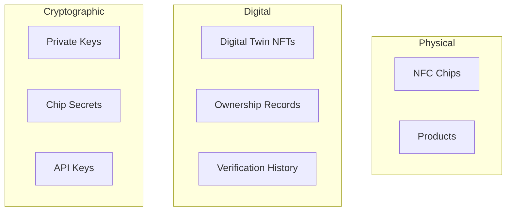

# Threat Model

Comprehensive STRIDE analysis for TAG IT Network security.

## STRIDE Overview

| Category | Description | Primary Concern |
|----------|-------------|-----------------|
| **S**poofing | Impersonating identity | Chip cloning |
| **T**ampering | Modifying data | On-chain manipulation |
| **R**epudiation | Denying actions | Ownership disputes |
| **I**nformation Disclosure | Exposing data | Privacy leakage |
| **D**enial of Service | Disrupting service | Network attacks |
| **E**levation of Privilege | Gaining access | Role escalation |

## Critical Assets



## Threat Analysis

### 1. Spoofing

#### S1: Chip Cloning

| Aspect | Detail |
|--------|--------|
| **Threat** | Attacker clones NFC chip to create fakes |
| **Likelihood** | Medium |
| **Impact** | High |
| **Mitigations** | Rolling counter, SUN authentication, tamper detection |

**Countermeasures:**
- Rolling counter prevents replay attacks
- Per-chip unique keys prevent batch cloning
- Tamper-evident seals for high-value items
- Tier 1/2 chips have anti-clone hardware

#### S2: Identity Impersonation

| Aspect | Detail |
|--------|--------|
| **Threat** | Attacker impersonates manufacturer/verifier |
| **Likelihood** | Low |
| **Impact** | High |
| **Mitigations** | BIDGES badges, multi-sig requirements |

### 2. Tampering

#### T1: On-Chain Data Manipulation

| Aspect | Detail |
|--------|--------|
| **Threat** | Attacker modifies asset state illegitimately |
| **Likelihood** | Very Low |
| **Impact** | Critical |
| **Mitigations** | Role-based access, immutable history |

**Countermeasures:**
- BIDGES capability-based access control
- All state changes emit events
- Immutable verification history
- Multi-sig for critical operations

#### T2: Off-Chain Data Tampering

| Aspect | Detail |
|--------|--------|
| **Threat** | Attacker modifies metadata or images |
| **Likelihood** | Medium |
| **Impact** | Medium |
| **Mitigations** | Content hashing, IPFS pinning |

### 3. Repudiation

#### R1: Ownership Denial

| Aspect | Detail |
|--------|--------|
| **Threat** | Party denies ownership transfer occurred |
| **Likelihood** | Medium |
| **Impact** | High |
| **Mitigations** | On-chain transfer records, event logs |

**Countermeasures:**
- All transfers recorded on-chain
- Cryptographic signatures required
- Event indexing for audit trail
- Legal framework integration

### 4. Information Disclosure

#### I1: Tracking/Privacy Leakage

| Aspect | Detail |
|--------|--------|
| **Threat** | Verification activity reveals user behavior |
| **Likelihood** | High |
| **Impact** | Medium |
| **Mitigations** | Anonymous verification, rate limiting |

**Countermeasures:**
- No wallet required for basic verification
- Aggregate statistics only
- Private registry for sensitive data
- GDPR-compliant data handling

#### I2: Key Exposure

| Aspect | Detail |
|--------|--------|
| **Threat** | Private keys or chip secrets exposed |
| **Likelihood** | Low |
| **Impact** | Critical |
| **Mitigations** | HSM storage, secure provisioning |

### 5. Denial of Service

#### D1: Network Congestion

| Aspect | Detail |
|--------|--------|
| **Threat** | Attacker floods network with transactions |
| **Likelihood** | Medium |
| **Impact** | Medium |
| **Mitigations** | Rate limiting, gas fees, L2 scaling |

**Countermeasures:**
- L2 for high throughput
- Rate limiting per address
- Paymaster sponsorship limits
- Emergency pause functionality

#### D2: Oracle Manipulation

| Aspect | Detail |
|--------|--------|
| **Threat** | Attacker manipulates off-chain oracles |
| **Likelihood** | Low |
| **Impact** | High |
| **Mitigations** | Multiple oracles, threshold signatures |

### 6. Elevation of Privilege

#### E1: Role Escalation

| Aspect | Detail |
|--------|--------|
| **Threat** | Attacker gains unauthorized roles |
| **Likelihood** | Low |
| **Impact** | Critical |
| **Mitigations** | Multi-sig admin, timelock, monitoring |

**Countermeasures:**
- Multi-sig for role grants
- 48-hour timelock on admin actions
- Real-time monitoring and alerts
- Capability-based (not hierarchical) access

## Risk Matrix

```
Impact
  ^
  │  ┌───────┬───────┬───────┐
  │  │ S1    │ T1    │ E1    │  Critical
  │  │       │       │       │
  │  ├───────┼───────┼───────┤
  │  │ R1    │ I2    │ D2    │  High
  │  │       │       │       │
  │  ├───────┼───────┼───────┤
  │  │ T2    │ I1    │ D1    │  Medium
  │  │       │       │       │
  │  └───────┴───────┴───────┘
  └──────────────────────────> Likelihood
       Low    Medium   High
```

## Security Controls

| Control | Implementation |
|---------|----------------|
| Access Control | BIDGES capability badges |
| Cryptography | AES-128, HMAC-SHA256, ECDSA |
| Monitoring | Event indexing, anomaly detection |
| Incident Response | 24/7 SOC, emergency pause |
| Audit | Annual third-party audits |

## Related

- [Compliance](./compliance.md)
- [Bug Bounty](./bounty.md)
- [TAGITAccess Contract](../contracts/tagit-access.md)
