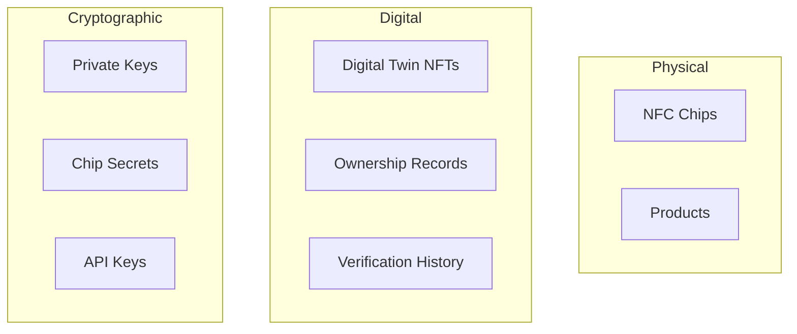

# Threat Model

Comprehensive STRIDE analysis for TAG IT Network security.

## STRIDE Overview

| Category | Description | Primary Concern |
|----------|-------------|-----------------|
| **S**poofing | Impersonating identity | Chip cloning |
| **T**ampering | Modifying data | On-chain manipulation |
| **R**epudiation | Denying actions | Ownership disputes |
| **I**nformation Disclosure | Exposing data | Privacy leakage |
| **D**enial of Service | Disrupting service | Network attacks |
| **E**levation of Privilege | Gaining access | Role escalation |

## Critical Assets


```mermaid
flowchart TB
    subgraph "Physical"
        A[NFC Chips]
        B[Products]
    end

    subgraph "Digital"
        C[Digital Twin NFTs]
        D[Ownership Records]
        E[Verification History]
    end

    subgraph "Cryptographic"
        F[Private Keys]
        G[Chip Secrets]
        H[API Keys]
    end
```

## Threat Analysis

### 1. Spoofing

#### S1: Chip Cloning

| Aspect | Detail |
|--------|--------|
| **Threat** | Attacker clones NFC chip to create fakes |
| **Likelihood** | Medium |
| **Impact** | High |
| **Mitigations** | Rolling counter, SUN authentication, tamper detection |

**Countermeasures:**
- Rolling counter prevents replay attacks
- Per-chip unique keys prevent batch cloning
- Tamper-evident seals for high-value items
- Tier 1/2 chips have anti-clone hardware

#### S2: Identity Impersonation

| Aspect | Detail |
|--------|--------|
| **Threat** | Attacker impersonates manufacturer/verifier |
| **Likelihood** | Low |
| **Impact** | High |
| **Mitigations** | BIDGES badges, multi-sig requirements |

### 2. Tampering

#### T1: On-Chain Data Manipulation

| Aspect | Detail |
|--------|--------|
| **Threat** | Attacker modifies asset state illegitimately |
| **Likelihood** | Very Low |
| **Impact** | Critical |
| **Mitigations** | Role-based access, immutable history |

**Countermeasures:**
- BIDGES capability-based access control
- All state changes emit events
- Immutable verification history
- Multi-sig for critical operations

#### T2: Off-Chain Data Tampering

| Aspect | Detail |
|--------|--------|
| **Threat** | Attacker modifies metadata or images |
| **Likelihood** | Medium |
| **Impact** | Medium |
| **Mitigations** | Content hashing, IPFS pinning |

### 3. Repudiation

#### R1: Ownership Denial

| Aspect | Detail |
|--------|--------|
| **Threat** | Party denies ownership transfer occurred |
| **Likelihood** | Medium |
| **Impact** | High |
| **Mitigations** | On-chain transfer records, event logs |

**Countermeasures:**
- All transfers recorded on-chain
- Cryptographic signatures required
- Event indexing for audit trail
- Legal framework integration

### 4. Information Disclosure

#### I1: Tracking/Privacy Leakage

| Aspect | Detail |
|--------|--------|
| **Threat** | Verification activity reveals user behavior |
| **Likelihood** | High |
| **Impact** | Medium |
| **Mitigations** | Anonymous verification, rate limiting |

**Countermeasures:**
- No wallet required for basic verification
- Aggregate statistics only
- Private registry for sensitive data
- GDPR-compliant data handling

#### I2: Key Exposure

| Aspect | Detail |
|--------|--------|
| **Threat** | Private keys or chip secrets exposed |
| **Likelihood** | Low |
| **Impact** | Critical |
| **Mitigations** | HSM storage, secure provisioning |

### 5. Denial of Service

#### D1: Network Congestion

| Aspect | Detail |
|--------|--------|
| **Threat** | Attacker floods network with transactions |
| **Likelihood** | Medium |
| **Impact** | Medium |
| **Mitigations** | Rate limiting, gas fees, L2 scaling |

**Countermeasures:**
- L2 for high throughput
- Rate limiting per address
- Paymaster sponsorship limits
- Emergency pause functionality

#### D2: Oracle Manipulation

| Aspect | Detail |
|--------|--------|
| **Threat** | Attacker manipulates off-chain oracles |
| **Likelihood** | Low |
| **Impact** | High |
| **Mitigations** | Multiple oracles, threshold signatures |

### 6. Elevation of Privilege

#### E1: Role Escalation

| Aspect | Detail |
|--------|--------|
| **Threat** | Attacker gains unauthorized roles |
| **Likelihood** | Low |
| **Impact** | Critical |
| **Mitigations** | Multi-sig admin, timelock, monitoring |

**Countermeasures:**
- Multi-sig for role grants
- 48-hour timelock on admin actions
- Real-time monitoring and alerts
- Capability-based (not hierarchical) access

### 7. Owner-Signed Actions (September 2026)

Threat model for the app flow that lets an owner flag, list, delist, or
recycle their asset without an API key — see
[API Overview](../api/overview.md) and
[Data Flow](../architecture/data-flow.md).

| STRIDE | Threat | Mitigation |
|--------|--------|------------|
| **S**poofing | Attacker submits an action as if from the owner | EIP-191 signature verified against the message, then the signer is checked against `ownerOf(tokenId)` on-chain — a valid signature from a non-owner is still rejected (`403 NOT_OWNER`) |
| **T**ampering | Attacker alters `params` after the owner signed (e.g. changes the resale price) | The signed message embeds `params-sha256`, a hash of the canonical params JSON; services rebuilds the message from the validated params before verifying, so a mismatched digest fails signature verification |
| **R**epudiation | Owner later denies requesting an action | The full signed message and signature are stored per action row, not just the outcome |
| Replay | Attacker resubmits a captured signed request | The signed `ts` must be within a 15-minute window, and `(tokenId, action, ts)` is unique — a duplicate or stale request is rejected |
| **D**enial of Service | Flooding the public endpoint | 10 requests/minute per IP on the public `POST` routes |
| Stolen phone | Whoever holds the device — not necessarily the true owner — can trigger a signed action | `recycle` is never immediate: it is scheduled with a grace period (default 24h) during which the true owner can `cancel-recycle`; a wrongful `flag` is cleared through the existing resolve quorum in the admin console, not through this endpoint |
| Message-shape confusion | A malicious page tricks the app's wallet into signing something else that gets replayed here | The app's signer only produces messages in the fixed owner-action shape (`TAG IT owner action` / `token:` / `action:` / `params-sha256:` / `ts:`) — it refuses to sign anything else |

**Countermeasures:**
- Signature + on-chain `ownerOf` check on every write
- Params digest inside the signed message (tamper-evident)
- Full message + signature retained per action (audit trail)
- 15-minute signing window and per-`(tokenId, action, ts)` replay uniqueness
- Per-IP rate limiting on the public endpoints
- Grace period + owner cancellation for the irreversible action (recycle)
- Signer scope fence in the mobile app restricts it to the owner-action message shape

## Risk Matrix

```
Impact
  ^
  │  ┌───────┬───────┬───────┐
  │  │ S1    │ T1    │ E1    │  Critical
  │  │       │       │       │
  │  ├───────┼───────┼───────┤
  │  │ R1    │ I2    │ D2    │  High
  │  │       │       │       │
  │  ├───────┼───────┼───────┤
  │  │ T2    │ I1    │ D1    │  Medium
  │  │       │       │       │
  │  └───────┴───────┴───────┘
  └──────────────────────────> Likelihood
       Low    Medium   High
```

## Security Controls

| Control | Implementation |
|---------|----------------|
| Access Control | BIDGES capability badges |
| Cryptography | AES-128, HMAC-SHA256, ECDSA |
| Monitoring | Event indexing, anomaly detection |
| Incident Response | 24/7 SOC, emergency pause |
| Audit | Annual third-party audits |

## Related

- [Compliance](./compliance.md)
- [Bug Bounty](./bounty.md)
- [TAGITAccess Contract](../contracts/tagit-access.md)
