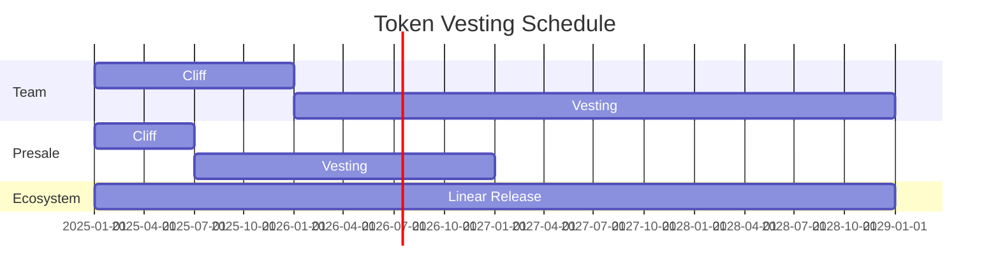

# Token Distribution

Detailed breakdown of TAGIT token allocation and vesting.

## Genesis Allocation

### Summary

| Category | Allocation | Amount | Vesting |
|----------|------------|--------|---------|
| Ecosystem & Grants | 35% | 2,722,222,067 | 4 years linear |
| Presale | 20% | 1,555,555,467 | 6mo cliff, 18mo linear |
| Team & Advisors | 15% | 1,166,666,600 | 1yr cliff, 4yr linear |
| Treasury | 15% | 1,166,666,600 | DAO controlled |
| Liquidity | 10% | 777,777,733 | Immediate |
| Community Airdrop | 5% | 388,888,867 | Immediate |

## Ecosystem & Grants (35%)

**Amount:** 2,722,222,067 TAGIT

Allocated for:
- Developer grants
- Partnership incentives
- Ecosystem growth initiatives
- Bug bounties
- Community programs

**Vesting:** 4-year linear release, managed by DAO

## Presale (20%)

**Amount:** 1,555,555,467 TAGIT

- 6-month cliff
- 18-month linear vesting after cliff
- Total vesting period: 24 months

## Team & Advisors (15%)

**Amount:** 1,166,666,600 TAGIT

| Group | Share | Cliff | Vesting |
|-------|-------|-------|---------|
| Core Team | 12% | 1 year | 4 years |
| Advisors | 3% | 6 months | 2 years |

## Treasury (15%)

**Amount:** 1,166,666,600 TAGIT

- DAO-controlled spending
- Requires governance vote
- Used for:
  - Protocol upgrades
  - Emergency reserves
  - Strategic initiatives

## Liquidity (10%)

**Amount:** 777,777,733 TAGIT

- Immediate availability
- DEX liquidity pools
- CEX listings
- Market making

## Community Airdrop (5%)

**Amount:** 388,888,867 TAGIT

- Immediate availability
- Early supporters
- Testnet participants
- Community contributors

## Vesting Schedule Visualization

## Circulating Supply Projection

| Date | Circulating | % of Genesis |
|------|-------------|--------------|
| Launch | 1,166,666,600 | 15% |
| +6 months | 1,800,000,000 | 23% |
| +1 year | 2,500,000,000 | 32% |
| +2 years | 4,000,000,000 | 51% |
| +4 years | 7,777,777,333 | 100% |

## Related

- [Tokenomics Overview](./tokenomics.md)
- [TAGITVesting Contract](../contracts/tagit-vesting.md)
