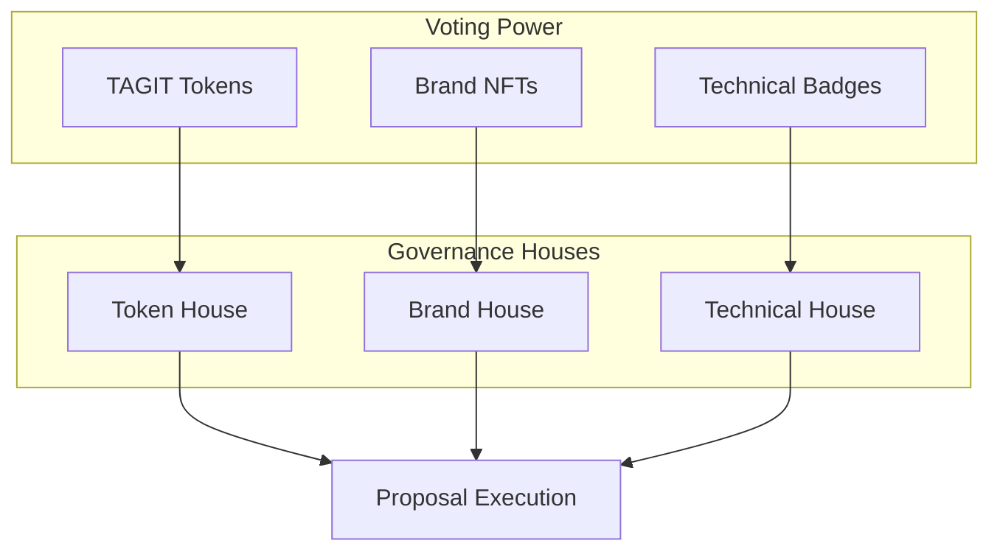
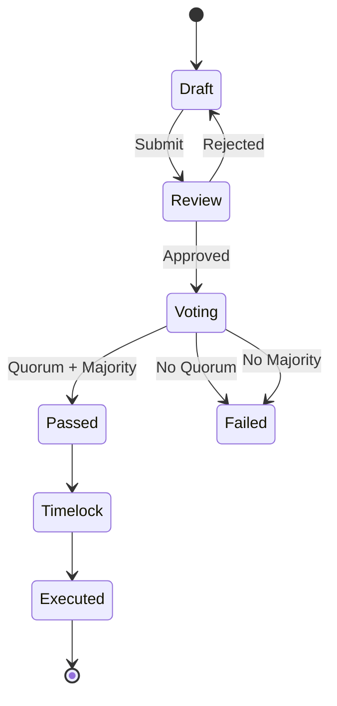

# Governance

TAG IT Network operates as a multi-house DAO with TAGIT tokens as the governance mechanism.

## Governance Structure



## Houses

### Token House

| Property | Value |
|----------|-------|
| Voting Power | TAGIT token balance |
| Staking Bonus | 1.5x for staked tokens |
| Delegation | Yes |
| Quorum | 4% of circulating supply |

### Brand House

| Property | Value |
|----------|-------|
| Voting Power | Brand verification volume |
| Membership | Verified brands only |
| Quorum | 10% of active brands |

### Technical House

| Property | Value |
|----------|-------|
| Voting Power | Technical badges (BIDGES) |
| Membership | Technical contributors |
| Quorum | 5 members |

## Proposal Types

| Type | Houses Required | Threshold |
|------|-----------------|-----------|
| Parameter Change | Token | Simple majority |
| Treasury Spend (<$100k) | Token | Simple majority |
| Treasury Spend (>$100k) | Token + Brand | 60% each |
| Protocol Upgrade | All three | 66% each |
| Emergency Action | Technical | 80% + 2/3 multisig |

## Proposal Lifecycle



### Timeframes

| Stage | Duration |
|-------|----------|
| Review | 3 days |
| Voting | 7 days |
| Timelock | 2 days |

## Voting Mechanics

### Voting Power Calculation

```
votingPower = tokenBalance + (stakedBalance * 1.5) + delegatedPower
```

### Delegation

Token holders can delegate their voting power:

```solidity
// Delegate to another address
tagitToken.delegate(delegatee);

// Self-delegate to activate voting
tagitToken.delegate(msg.sender);
```

### Quorum Requirements

| House | Quorum Calculation |
|-------|-------------------|
| Token | 4% of circulating supply |
| Brand | 10% of active brands |
| Technical | 5 badge holders |

## Creating a Proposal

1. **Draft** — Write proposal in governance forum
2. **Discussion** — Community feedback (min 3 days)
3. **Snapshot** — Create on-chain proposal
4. **Vote** — 7-day voting period
5. **Execute** — After timelock (if passed)

## Related

- [TAGITGovernor Contract](../contracts/tagit-governor.md)
- [TAGITToken Contract](../contracts/tagit-token.md)
- [Tokenomics](./tokenomics.md)
