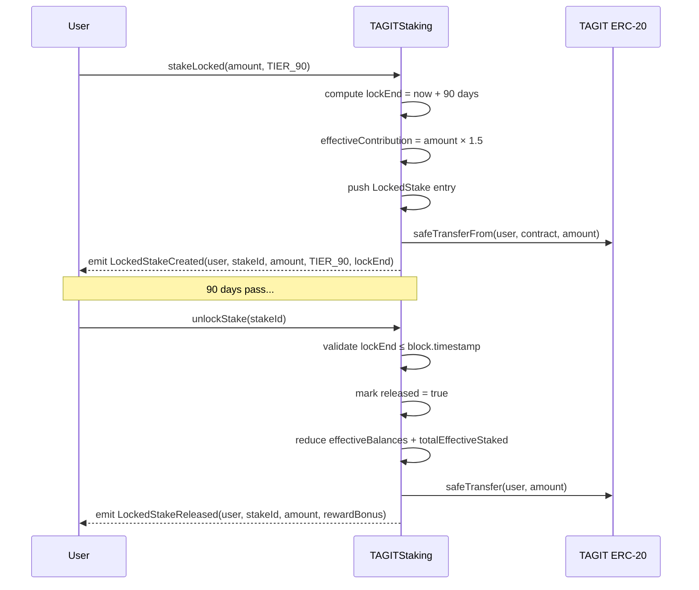

# TAGITStaking — Locked Staking

Locked staking extends `TAGITStaking.sol` with time-lock tiers that multiply a participant's effective staking weight in the Synthetix-style reward pool. Locking longer earns proportionally more of each reward distribution epoch.

- **Contracts PR**: [tagit-contracts #12](https://github.com/TAG-IT-NETWORK/tagit-contracts/pull/12)
- **Notion**: [TAGITStaking Locked — Feature Overview](https://www.notion.so/3334e3e9a2d3818d8a3ff730ba7451fd)
- **GitHub Wiki**: [TAGITStaking Locked Developer Reference](https://github.com/TAG-IT-NETWORK/tagit-docs/wiki/TAGITStakingLocked)

## Contract Details

| Property | Value |
|---|---|
| **File** | `src/token/TAGITStaking.sol` |
| **Interface** | `src/interfaces/ITAGITStaking.sol` |
| **Test file** | `test/token/TAGITStakingLocked.t.sol` (435 lines) |
| **Inherits** | OwnableUpgradeable, UUPSUpgradeable, ReentrancyGuard, Pausable |
| **Solidity** | `^0.8.20` |
| **Author** | TAG IT Network `<dev@tagit.network>` |

## Lock Tiers

| Tier | Duration | Multiplier | Basis Points |
|---|---|---|---|
| `TIER_30` | 30 days | 1.2× | 12 000 |
| `TIER_90` | 90 days | 1.5× | 15 000 |
| `TIER_180` | 180 days | 2.0× | 20 000 |

Multipliers are applied to a participant's **effective balance** in the Synthetix reward pool. Flex (non-locked) stakes contribute at 1× (10 000 basis points).

## Reward Math

Locked staking updates the Synthetix distribution formula to use `_totalEffectiveStaked` and per-user `_effectiveBalances`:

```
effectiveBalance(user) = flexStake + Σ( lockedAmount_i × tierMultiplier_i / 10 000 )

rewardPerToken = stored + ( rate × elapsed × 1e18 / totalEffectiveStaked )

earned(user)   = effectiveBalance(user) × ( rewardPerToken − userPaid ) / 1e18
               + accumulatedRewards
```

## Data Structures

### `LockTier` Enum

```solidity
enum LockTier {
    TIER_30,  // 30-day lock, 1.2× multiplier
    TIER_90,  // 90-day lock, 1.5× multiplier
    TIER_180  // 180-day lock, 2.0× multiplier
}
```

### `LockedStake` Struct

```solidity
struct LockedStake {
    uint256 amount;    // Tokens locked
    LockTier tier;     // Lock tier (determines duration + multiplier)
    uint256 lockEnd;   // Timestamp when lock expires
    bool released;     // Whether stake has been released
}
```

## Function Signatures

### `stakeLocked`

```solidity
function stakeLocked(uint256 amount, LockTier tier)
    external
    nonReentrant
    whenNotPaused
    rateLimited
    updateReward(msg.sender)
```

Stakes `amount` tokens with the specified `tier` lock. Tokens are transferred in and cannot be withdrawn until `lockEnd`. The caller's effective balance is immediately boosted by `amount × multiplier / 10 000`.

| Parameter | Type | Description |
|---|---|---|
| `amount` | `uint256` | Tokens to lock (must be > 0) |
| `tier` | `LockTier` | `TIER_30`, `TIER_90`, or `TIER_180` |

Reverts: `ZeroAmount`, `InvalidTier`, `RateLimitExceeded`, `EnforcedPause`

### `unlockStake`

```solidity
function unlockStake(uint256 stakeId)
    external
    nonReentrant
    updateReward(msg.sender)
```

Releases a locked stake after its lock period expires. Returns the original `amount` to the caller and settles boosted rewards. The entry is marked `released = true` (slot is preserved for audit history).

| Parameter | Type | Description |
|---|---|---|
| `stakeId` | `uint256` | Index in the caller's `LockedStake[]` array |

Reverts: `StakeNotFound(stakeId)`, `LockNotExpired(stakeId, lockEnd, currentTime)`

### `getLockedStakes`

```solidity
function getLockedStakes(address user)
    external view
    returns (LockedStake[] memory)
```

Returns all locked stake entries for `user`, including already-released entries.

### `lockedStakeCount`

```solidity
function lockedStakeCount(address user)
    external view
    returns (uint256)
```

Returns the total number of locked stake entries for `user` (including released).

### `effectiveBalance`

```solidity
function effectiveBalance(address user)
    external view
    returns (uint256)
```

Returns the current effective staking weight for `user` — flex stake at 1× plus all active locked positions at their tier multiplier.

### `totalEffectiveStaked`

```solidity
function totalEffectiveStaked()
    external view
    returns (uint256)
```

Returns the protocol-wide sum of all effective balances. Used as the denominator in `rewardPerToken()`.

## Events

### `LockedStakeCreated`

```solidity
event LockedStakeCreated(
    address indexed user,
    uint256 indexed stakeId,
    uint256 amount,
    LockTier tier,
    uint256 lockEnd
)
```

Emitted when a new locked stake is created via `stakeLocked`.

### `LockedStakeReleased`

```solidity
event LockedStakeReleased(
    address indexed user,
    uint256 indexed stakeId,
    uint256 amount,
    uint256 rewardBonus
)
```

Emitted when a locked stake is released via `unlockStake`. `rewardBonus` is the additional effective reward contribution attributable to the lock multiplier above 1×.

## Custom Errors

| Error | Signature | Description |
|---|---|---|
| `LockNotExpired` | `LockNotExpired(uint256 stakeId, uint256 lockEnd, uint256 currentTime)` | Lock period has not yet elapsed |
| `InvalidTier` | `InvalidTier(uint8 tier)` | Tier value outside `LockTier` enum range |
| `StakeNotFound` | `StakeNotFound(uint256 stakeId)` | `stakeId` out of bounds or already released |

## Constants

| Constant | Value | Description |
|---|---|---|
| `TIER_30_DURATION` | `30 days` | Lock duration for TIER_30 |
| `TIER_90_DURATION` | `90 days` | Lock duration for TIER_90 |
| `TIER_180_DURATION` | `180 days` | Lock duration for TIER_180 |
| `TIER_30_MULTIPLIER` | `12 000` | 1.2× in basis points |
| `TIER_90_MULTIPLIER` | `15 000` | 1.5× in basis points |
| `TIER_180_MULTIPLIER` | `20 000` | 2.0× in basis points |

## Locked Staking Lifecycle



## State Variables Added

| Variable | Type | Description |
|---|---|---|
| `_lockedStakes` | `mapping(address => LockedStake[])` | Per-user array of locked stake entries |
| `_totalEffectiveStaked` | `uint256` | Sum of all effective balances (global) |
| `_effectiveBalances` | `mapping(address => uint256)` | Per-user effective staking weight |

> **Storage gap**: `__gap` reduced from `uint256[38]` to `uint256[35]` to accommodate the 3 new storage slots.

## Security Model

- **CEI pattern** followed in both `stakeLocked` and `unlockStake`: state mutations precede token transfers.
- **`nonReentrant`** guard on both write functions.
- **`rateLimited`** applied to `stakeLocked` (NIST AC-7 compliance, same as flex `stake`).
- **Lock enforcement** via `LockNotExpired` revert — no early withdrawal path exists in this implementation.
- **Released-flag guard** prevents double-release of the same `stakeId`.
- Gas cost updated: `stake()` gas target raised to 230 000 to account for `_effectiveBalances` tracking overhead.

## Test Coverage

File: `test/token/TAGITStakingLocked.t.sol` (435 lines)

| Category | Coverage |
|---|---|
| Happy-path `stakeLocked` (all 3 tiers) | ✅ |
| Happy-path `unlockStake` after expiry | ✅ |
| Early unlock reverts (`LockNotExpired`) | ✅ |
| Double-release reverts (`StakeNotFound`) | ✅ |
| Invalid tier reverts (`InvalidTier`) | ✅ |
| Zero-amount reverts (`ZeroAmount`) | ✅ |
| Effective balance accounting | ✅ |
| `rewardPerToken` uses `totalEffectiveStaked` | ✅ |
| `earned()` uses `effectiveBalance` | ✅ |
| Multiple concurrent locked stakes | ✅ |
| Flex + locked stake coexistence | ✅ |
| Gas benchmarks (< 230 000 for `stakeLocked`) | ✅ |
