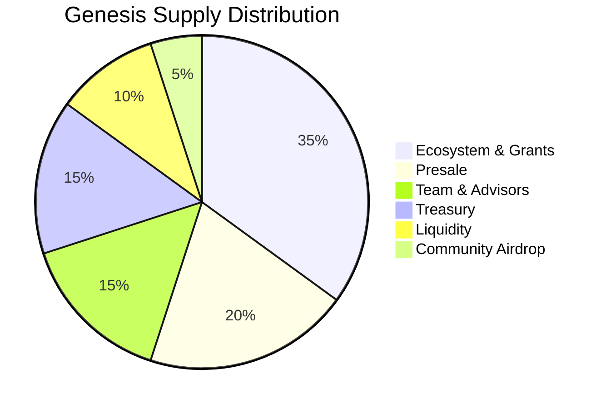
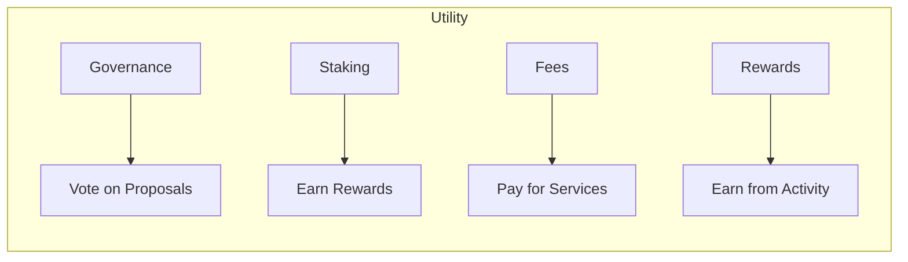

# Tokenomics

Comprehensive overview of TAGIT token economics.

## Token Overview

| Property | Value |
|----------|-------|
| Name | TAG IT Token |
| Symbol | TAGIT |
| Standard | ERC-20 |
| Decimals | 18 |
| Genesis Supply | 7,777,777,333 TAGIT |
| Inflation Rate | 3.33% annually |
| Burn Mechanism | 50% of fees |

## Supply Mechanics

### Genesis Distribution

| Allocation | Percentage | Amount | Vesting |
|------------|------------|--------|---------|
| Ecosystem & Grants | 35% | 2,722,222,067 | 4 years linear |
| Presale | 20% | 1,555,555,467 | 6 month cliff, 18 month linear |
| Team & Advisors | 15% | 1,166,666,600 | 1 year cliff, 4 year linear |
| Treasury | 15% | 1,166,666,600 | DAO controlled |
| Liquidity | 10% | 777,777,733 | Immediate |
| Community Airdrop | 5% | 388,888,867 | Immediate |

## Inflation & Emissions

### Annual Emission Schedule

| Year | Rate | New Supply | Total Supply |
|------|------|------------|--------------|
| 1 | 3.33% | 259,000,000 | 8,036,777,333 |
| 2 | 3.33% | 267,624,000 | 8,304,401,333 |
| 3 | 3.33% | 276,536,000 | 8,580,937,333 |
| 4 | 3.33% | 285,746,000 | 8,866,683,333 |
| 5 | 3.33% | 295,261,000 | 9,161,944,333 |

### Emission Distribution

| Recipient | Share | Purpose |
|-----------|-------|---------|
| Stakers | 50% | Staking rewards |
| Verifiers | 30% | Verification incentives |
| Treasury | 20% | Protocol development |

## Deflationary Mechanisms

### Fee Burns

50% of all protocol fees are permanently burned:

| Fee Type | Amount | Burn Rate |
|----------|--------|-----------|
| Verification | 0.001 TAGIT | 50% burned |
| Premium Features | Variable | 50% burned |
| Bridge Fees | Variable | 50% burned |

### Projected Net Inflation

With projected fee activity:

| Year | Gross Inflation | Burns | Net Inflation |
|------|-----------------|-------|---------------|
| 1 | 3.33% | ~1.0% | ~2.33% |
| 2 | 3.33% | ~1.5% | ~1.83% |
| 3 | 3.33% | ~2.0% | ~1.33% |

## Token Utility

| Utility | Description |
|---------|-------------|
| **Governance** | Vote on protocol changes, delegate power |
| **Staking** | Lock tokens, earn emissions |
| **Fees** | Pay for premium verification, minting |
| **Rewards** | Earn from verification, fraud reporting |

## Related

- [Distribution Details](./distribution.md)
- [Staking Guide](./staking.md)
- [Governance](./governance.md)
- [TAGITToken Contract](../contracts/tagit-token.md)
