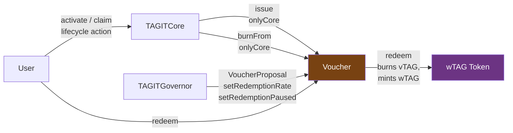

# Voucher (vTAG)

Non-transferable ERC-20 reward tokens. TAGITCore issues Vouchers to participants when qualifying lifecycle actions occur (asset activation, claiming). Users redeem Vouchers for wTAG governance tokens at a configurable rate.

> **Related docs**:
> [Notion Wiki](https://www.notion.so/3324e3e9a2d38179bec1d238eb0b7509) ·
> [GitHub Wiki](https://github.com/TAG-IT-NETWORK/tagit-contracts/wiki/Phase3-wTAG-Voucher) ·
> [tagit-contracts PR #4](https://github.com/TAG-IT-NETWORK/tagit-contracts/pull/4)

---

## Overview

Vouchers (symbol: `vTAG`) bridge physical asset lifecycle participation with on-chain governance. They represent earned participation rights — not tradeable assets — and are therefore **non-transferable** by design.

| Property | Behaviour |
|----------|-----------|
| **Transferable** | ❌ No — wallet-bound on issuance |
| **Minting** | TAGITCore only (`onlyCore` modifier) |
| **Burning** | TAGITCore only, or via `redeem()` |
| **Redeemable** | ✅ → wTAG at configurable redemption rate |
| **Governance** | Rate and pause controlled by TAGITGovernor (`VoucherProposal` type) |

---

## Contract Details

| Property | Value |
|----------|-------|
| **Symbol** | `vTAG` |
| **Name** | `TAG IT Voucher` |
| **Standard** | ERC-20 (non-transferable) |
| **Proxy Pattern** | UUPS (ERC-1967) |
| **Network** | OP Sepolia (Phase 3 testnet) |
| **Source** | `src/token/Voucher.sol` |
| **Interface** | `src/interfaces/IVoucher.sol` |
| **Solidity** | `^0.8.20` |
| **License** | MIT |

---

## Architecture



---

## Lifecycle Actions That Trigger Issuance

TAGITCore calls `voucher.issue()` when:

| Lifecycle Action | Reason String | Example |
|-----------------|---------------|---------|
| Asset activation | `"activation"` | BIDGES bound and activated |
| Asset claiming | `"claim"` | New owner claims authenticated asset |

The `tokenId` parameter links the voucher issuance to a specific asset on-chain.

---

## Initializer

```solidity
function initialize(
    address coreAddress,           // TAGITCore — sole mint/burn authority
    address wtagAddress,           // wTAG — redemption target
    address initialOwner,          // TimelockController (governance)
    uint256 initialRedemptionRate  // Basis points: 10000 = 1:1
) external initializer;
```

Bounds: `1 ≤ initialRedemptionRate ≤ 20000`.

---

## Core Functions (TAGITCore only)

### `issue`

Mint Vouchers to a recipient address. Restricted to TAGITCore.

```solidity
function issue(
    address to,              // Voucher recipient
    uint256 amount,          // Number of vTAG to issue
    uint256 tokenId,         // Associated asset token ID
    string calldata reason   // e.g. "activation", "claim"
) external; // onlyCore
```

Emits: `VoucherIssued(address indexed to, uint256 amount, uint256 indexed tokenId, string reason)`

---

### `burnFrom`

Burn Vouchers from an address. Restricted to TAGITCore.

```solidity
function burnFrom(
    address from,   // Address to burn from
    uint256 amount  // Amount to burn
) external; // onlyCore
```

Emits: `VoucherBurned(address indexed from, uint256 amount)`

---

## User Functions

### `redeem`

Exchange Vouchers for wTAG. Caller's Vouchers are burned; wTAG is minted at the current redemption rate.

```solidity
function redeem(uint256 amount) external returns (uint256 wtagAmount);
```

**Redemption formula:**
```
wtagAmount = (amount × redemptionRate) / 10000
```

At default rate `10000` (1:1): `1000 vTAG → 1000 wTAG`.
At rate `5000` (50%): `1000 vTAG → 500 wTAG`.

Emits: `VoucherRedeemed(address indexed account, uint256 voucherAmount, uint256 wtagAmount)`

Reverts with `RedemptionPaused()` if redemptions are paused by governance.

---

## Admin Functions (Governance)

### `setRedemptionRate`

Update the vTAG → wTAG conversion rate. Only callable by owner (TimelockController, via TAGITGovernor `VoucherProposal`).

```solidity
function setRedemptionRate(uint256 newRate) external; // onlyOwner
```

| Parameter | Range | Meaning |
|-----------|-------|---------|
| `newRate` | 1–20000 | Basis points. `10000` = 1:1, `5000` = 50%, `20000` = 2:1 |

Emits: `RedemptionRateUpdated(uint256 oldRate, uint256 newRate)`

---

### `setRedemptionPaused`

Pause or unpause all redemptions.

```solidity
function setRedemptionPaused(bool paused) external; // onlyOwner
```

Emits: `RedemptionPauseToggled(bool paused)`

---

## View Functions

```solidity
function core() external view returns (address);
function wtag() external view returns (address);
function redemptionRate() external view returns (uint256);  // basis points
function isRedemptionPaused() external view returns (bool);
function version() external pure returns (string memory);   // "1.0.0"
```

---

## Constants

| Constant | Value | Meaning |
|----------|-------|---------|
| `BASIS_POINTS` | `10000` | 100% denominator |
| `MAX_REDEMPTION_RATE` | `20000` | 200% — maximum 2:1 wTAG per vTAG |
| `MIN_REDEMPTION_RATE` | `1` | 0.01% — minimum rate |

---

## Non-Transferable Design

The `_update` internal function is overridden to block all transfers except mint and burn:

```solidity
function _update(address from, address to, uint256 amount) internal override {
    // Only mint (from == 0) and burn (to == 0) are allowed
    if (from != address(0) && to != address(0)) {
        revert("Voucher: non-transferable");
    }
    super._update(from, to, amount);
}
```

This prevents secondary market speculation and ensures Vouchers represent earned participation rights only.

---

## Event Reference

| Event | Signature | Description |
|-------|-----------|-------------|
| `VoucherIssued` | `(address indexed to, uint256 amount, uint256 indexed tokenId, string reason)` | Vouchers minted by TAGITCore |
| `VoucherRedeemed` | `(address indexed account, uint256 voucherAmount, uint256 wtagAmount)` | Vouchers burned, wTAG minted |
| `VoucherBurned` | `(address indexed from, uint256 amount)` | Vouchers burned by TAGITCore |
| `CoreUpdated` | `(address indexed previousCore, address indexed newCore)` | TAGITCore address updated |
| `WtagUpdated` | `(address indexed previousWtag, address indexed newWtag)` | wTAG address updated |
| `RedemptionRateUpdated` | `(uint256 oldRate, uint256 newRate)` | Rate changed by governance |
| `RedemptionPauseToggled` | `(bool paused)` | Pause state changed |

---

## Custom Errors

| Error | Condition |
|-------|-----------|
| `ZeroAddress()` | Address parameter is `address(0)` |
| `ZeroAmount()` | Amount parameter is `0` |
| `OnlyCore(address caller, address core)` | Caller is not TAGITCore |
| `InsufficientVouchers(address account, uint256 required, uint256 available)` | Balance too low to redeem/burn |
| `RedemptionPaused()` | Redemptions are currently paused |
| `InvalidRedemptionRate(uint256 rate)` | Rate outside `[1, 20000]` bounds |

---

## Security Notes

- `ReentrancyGuard` on all state-changing functions
- CEI pattern in `redeem()`: burns Vouchers before calling `wTAG.mint()`
- Voucher must hold `MINTER_ROLE` on wTAG for `redeem()` to succeed
- Redemption rate bounded between 1 and 20000 basis points (no zero-value exploits)
- Governance pause mechanism for emergency suspension

---

## Related Contracts

| Contract | Relationship |
|----------|-------------|
| [TAGITCore](../contracts/tagit-core.md) | Sole authority to `issue()` and `burnFrom()` |
| [wTAG](wtag.mdx) | Receives minted wTAG on redemption (Voucher holds `MINTER_ROLE`) |
| [TAGITGovernor](../contracts/tagit-governor.md) | Controls `redemptionRate` and pause via `VoucherProposal` |
