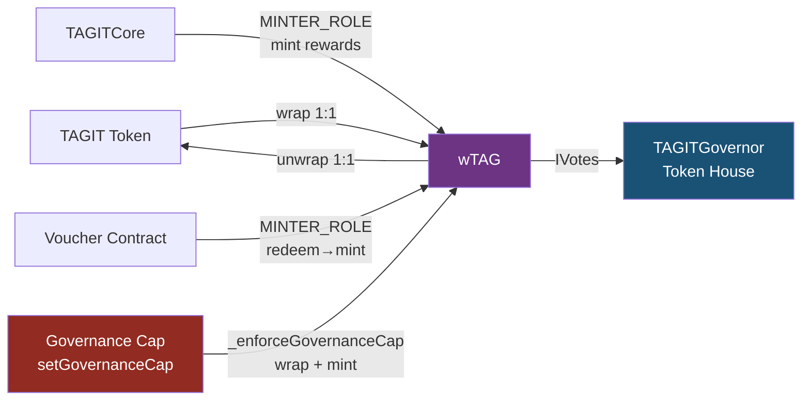

# wTAG (Wrapped TAG)

Wrapped governance token. Users lock TAGIT → receive wTAG at 1:1. wTAG implements ERC20Votes (IVotes) and is the sole voting token for the **Token House** in TAGITGovernor. As of PR #5, wTAG enforces an optional **governance cap** — a configurable ceiling on total supply applied at both `wrap()` and `mint()`.

> **Related docs**:
> [Notion Wiki](https://www.notion.so/3324e3e9a2d38179bec1d238eb0b7509) ·
> [GitHub Wiki](https://github.com/TAG-IT-NETWORK/tagit-contracts/wiki/Governance-Cap-wTAG) ·
> [tagit-contracts PR #4](https://github.com/TAG-IT-NETWORK/tagit-contracts/pull/4) ·
> [tagit-contracts PR #5 (governance cap)](https://github.com/TAG-IT-NETWORK/tagit-contracts/pull/5)

---

## Overview

`wTAG` is a UUPS-upgradeable ERC-20 that extends `ERC20VotesUpgradeable` (OpenZeppelin). It serves two roles in Phase 3:

| Role | Mechanism |
|------|-----------|
| **Governance token** | `IVotes` interface wired to TAGITGovernor for quorum and voting weight |
| **Reward token** | `MINTER_ROLE` authorized to TAGITCore and Voucher for reward minting |

Council House (BIDGES) governance remains completely isolated — wTAG only grants Token House voting power.

---

## Contract Details

| Property | Value |
|----------|-------|
| **Symbol** | `wTAG` |
| **Name** | `Wrapped TAG` |
| **Standard** | ERC-20 + ERC20Votes + ERC20Permit |
| **Proxy Pattern** | UUPS (ERC-1967) |
| **Network** | OP Sepolia (Phase 3 testnet) |
| **Source** | `src/token/wTAG.sol` |
| **Interface** | `src/interfaces/IwTAG.sol` |
| **Solidity** | `^0.8.20` |
| **License** | MIT |

---

## Architecture



---

## Initializer

```solidity
function initialize(
    address _tagitToken,   // Underlying TAGIT ERC-20 address
    address _initialOwner  // Owner (should be TimelockController)
) external initializer;
```

Initializes `ERC20`, `ERC20Permit`, `ERC20Votes`, `ERC20Burnable`, `Ownable`, and `UUPSUpgradeable`. Sets `tagitToken` storage.

---

## Core Functions

### `wrap`

Lock TAGIT into the contract and receive equal wTAG. Requires prior `approve()` of TAGIT.

```solidity
function wrap(uint256 amount) external;
```

| Parameter | Type | Description |
|-----------|------|-------------|
| `amount` | `uint256` | Amount of TAGIT to wrap (18 decimals) |

Emits: `Wrapped(address indexed account, uint256 amount)`

---

### `unwrap`

Burn wTAG and receive equal TAGIT back.

```solidity
function unwrap(uint256 amount) external;
```

| Parameter | Type | Description |
|-----------|------|-------------|
| `amount` | `uint256` | Amount of wTAG to unwrap |

Emits: `Unwrapped(address indexed account, uint256 amount)`

---

### `mint`

Mint wTAG without requiring underlying TAGIT deposit. Restricted to authorized minters (TAGITCore, Voucher contract).

```solidity
function mint(address to, uint256 amount) external; // onlyMinter
```

| Parameter | Type | Description |
|-----------|------|-------------|
| `to` | `address` | Recipient of minted wTAG |
| `amount` | `uint256` | Amount to mint |

Emits: `MinterMinted(address indexed to, uint256 amount, address indexed minter)`

---

## Admin Functions

### `grantMinter`

Grant `MINTER_ROLE` to an address. Only callable by owner (TimelockController).

```solidity
function grantMinter(address minter) external; // onlyOwner
```

Emits: `MinterGranted(address indexed minter, address indexed grantedBy)`

---

### `revokeMinter`

Revoke `MINTER_ROLE` from an address.

```solidity
function revokeMinter(address minter) external; // onlyOwner
```

Emits: `MinterRevoked(address indexed minter, address indexed revokedBy)`

---

### `setGovernanceCap` _(PR #5)_

Set the maximum allowed `totalSupply()` for wTAG. Any `wrap()` or `mint()` that would push supply past this ceiling reverts with `GovernanceCapExceeded`. Set to `0` to disable the cap (backward-compatible default).

```solidity
function setGovernanceCap(uint256 newCap) external; // onlyOwner
```

| Parameter | Type | Description |
|-----------|------|-------------|
| `newCap` | `uint256` | Governance cap in token units (18 decimals). `0` = no cap. |

Emits: `GovernanceCapUpdated(uint256 oldCap, uint256 newCap)`

> **Intent:** Enforces a 5% total TAG supply ceiling on circulating wTAG and caps per-wallet governance power from agent distributions at 1%. Token House only — Council House (BIDGES) is unaffected.

---

## View Functions

```solidity
function isMinter(address account) external view returns (bool);
function underlyingToken() external view returns (address);
function governanceCap() external view returns (uint256);  // 0 = uncapped (PR #5)
function version() external pure returns (string memory);  // "1.0.0"
```

---

## ERC20Votes Integration

wTAG inherits `ERC20VotesUpgradeable`. Voting power must be **self-delegated** before it counts in governance.

```solidity
// Activate voting power
wtag.delegate(msg.sender);

// Check voting power at current block
uint256 votes = wtag.getVotes(account);

// Check historical voting power (used by governor)
uint256 pastVotes = wtag.getPastVotes(account, blockNumber);

// Quorum calculation
uint256 pastSupply = wtag.getPastTotalSupply(blockNumber);
```

TAGITGovernor is initialized with `IVotes(address(wtag))` — it calls `getPastVotes` and `getPastTotalSupply` for proposal quorum and voting weight.

---

## Event Reference

| Event | Signature | Description |
|-------|-----------|-------------|
| `Wrapped` | `(address indexed account, uint256 amount)` | TAGIT wrapped to wTAG |
| `Unwrapped` | `(address indexed account, uint256 amount)` | wTAG unwrapped to TAGIT |
| `MinterMinted` | `(address indexed to, uint256 amount, address indexed minter)` | Reward mint by authorized minter |
| `MinterGranted` | `(address indexed minter, address indexed grantedBy)` | New minter authorized |
| `MinterRevoked` | `(address indexed minter, address indexed revokedBy)` | Minter removed |
| `GovernanceCapUpdated` _(PR #5)_ | `(uint256 oldCap, uint256 newCap)` | Governance cap changed by owner |

---

## Custom Errors

| Error | Condition |
|-------|-----------|
| `ZeroAddress()` | Address parameter is `address(0)` |
| `ZeroAmount()` | Amount parameter is `0` |
| `OnlyMinter(address caller)` | Caller lacks `MINTER_ROLE` |
| `InsufficientBalance(address account, uint256 required, uint256 available)` | Insufficient wTAG balance for unwrap |
| `GovernanceCapExceeded(uint256 requested, uint256 available)` _(PR #5)_ | `wrap()` or `mint()` would push `totalSupply` past the governance cap |

---

## Governance Cap _(PR #5)_

PR #5 adds an optional supply ceiling to wTAG. When set, no `wrap()` or `mint()` call can push `totalSupply()` past the cap.

### Intent

- Hard-cap circulating wTAG at **5% of total TAG supply**
- Limit per-wallet governance power from agent distribution to **1%**
- Token House only — Council House (BIDGES) lifecycle states remain fully isolated

### Enforcement

`_enforceGovernanceCap(uint256 amount)` runs at the top of both `wrap()` and `mint()`:

```solidity
function _enforceGovernanceCap(uint256 amount) internal view {
    uint256 cap = governanceCap;
    if (cap == 0) return;                           // 0 = uncapped
    uint256 supply = totalSupply();
    if (supply + amount > cap) {
        revert GovernanceCapExceeded(amount, cap - supply);
    }
}
```

### Fuzz Coverage (`test/unit/wTAG.t.sol` — 100k runs)

| Test | Scenario |
|------|----------|
| `test_governanceCap_defaultsToZero` | Cap defaults to `0` (uncapped) at deploy |
| `test_setGovernanceCap_success` | Owner sets cap → `GovernanceCapUpdated` emitted |
| `test_setGovernanceCap_updateEmitsOldAndNew` | Old and new values correctly emitted |
| `test_setGovernanceCap_reverts_notOwner` | Non-owner cannot set cap |
| `test_wrap_reverts_aboveCap` | `wrap()` reverts with `GovernanceCapExceeded` |
| `test_mint_reverts_aboveCap` | `mint()` reverts with `GovernanceCapExceeded` |
| `test_exactBoundary` | At `supply == cap`, next unit reverts |
| `test_setGovernanceCap_canDisableBySettingZero` | Setting cap to `0` re-enables uncapped minting |

---

## Security Notes

- `ReentrancyGuard` on all state-changing functions
- `SafeERC20` for underlying TAGIT transfers (prevents silent failures)
- CEI pattern in `unwrap`: burn before transfer
- UUPS upgrade authorization gated to owner (TimelockController)
- Governance cap enforced **before** state changes in `wrap()` and `mint()` — cannot be bypassed by privileged minters

---

## Related Contracts

| Contract | Relationship |
|----------|-------------|
| [TAGITGovernor](../contracts/tagit-governor.md) | Consumes `IVotes` for Token House voting power |
| [Voucher](voucher.mdx) | Calls `wTAG.mint()` on redemption (requires `MINTER_ROLE`) |
| [TAGITCore](../contracts/tagit-core.md) | Granted `MINTER_ROLE` for lifecycle reward minting |
