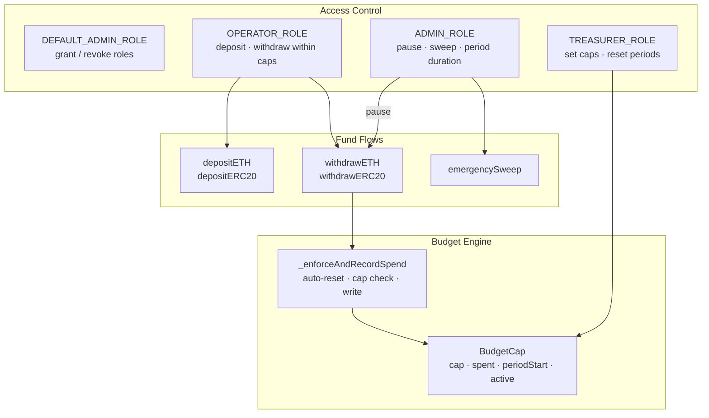
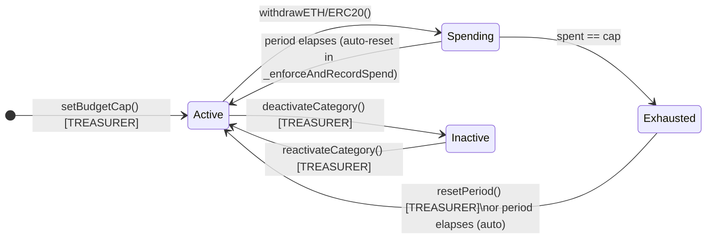

# TAGITOperationalTreasury — Developer Reference

> **Task**: 2D. Build treasury spend reporting dashboard (ID: `3314e3e9-a2d3-81ea-9636-df8cee04eb02`) — contracts layer; supersedes [`3314e3e9-a2d3-81d3`]
> **Contracts PR**: [tagit-contracts #14](https://github.com/TAG-IT-NETWORK/tagit-contracts/pull/14) · [#13 (initial)](https://github.com/TAG-IT-NETWORK/tagit-contracts/pull/13)
> **Docs PR**: [tagit-docs #11](https://github.com/TAG-IT-NETWORK/tagit-docs/pull/11) · [#10 (initial)](https://github.com/TAG-IT-NETWORK/tagit-docs/pull/10)
> **Notion Wiki**: [TAGITOperationalTreasury — Feature Overview](https://www.notion.so/3334e3e9a2d38193ab20cd5975b937c2)
> **tagit-docs MDX**: [Operational Treasury Reference](https://github.com/TAG-IT-NETWORK/tagit-docs/blob/main/docs/contracts/operational-treasury.mdx)

---

## Table of Contents

1. [Purpose](#purpose)
2. [Architecture Overview](#architecture-overview)
3. [Budget Cap Lifecycle](#budget-cap-lifecycle)
4. [Role Hierarchy](#role-hierarchy)
5. [Data Structures](#data-structures)
6. [Function Signatures](#function-signatures)
7. [Event Schemas](#event-schemas)
8. [Custom Errors](#custom-errors)
9. [Constants](#constants)
10. [Security Model](#security-model)
11. [Test Suite Summary](#test-suite-summary)
12. [Integration Guide](#integration-guide)

---

## Purpose

`TAGITOperationalTreasury` manages TAG IT Network's day-to-day fund disbursements (payroll, infrastructure, marketing, etc.) on-chain. It enforces **per-category spending caps** within configurable time periods, providing a lightweight operational spending layer that sits alongside the governance-level `TAGITTreasury`.

**File**: `src/treasury/TAGITOperationalTreasury.sol`
**Interface**: `src/interfaces/ITAGITOperationalTreasury.sol`
**Test file**: `test/treasury/TAGITOperationalTreasury.t.sol` (890 lines)
**Solidity**: `^0.8.20` | **License**: MIT | **Version**: `1.0.0`

---

## Architecture Overview



---

## Budget Cap Lifecycle



**Period auto-reset**: Every call to `_enforceAndRecordSpend` checks if `block.timestamp >= periodStart + periodDuration`. If so, it zeroes `spent`, updates `periodStart`, and emits `PeriodReset` — before enforcing the cap. This means caps are self-refreshing with no cron job required.

---

## Role Hierarchy

| Role | `bytes32` Key | Capabilities |
|------|--------------|--------------|
| `OPERATOR_ROLE` | `keccak256("OPERATOR_ROLE")` | `depositETH`, `depositERC20`, `withdrawETH`, `withdrawERC20` |
| `TREASURER_ROLE` | `keccak256("TREASURER_ROLE")` | `setBudgetCap`, `deactivateCategory`, `reactivateCategory`, `resetPeriod` |
| `ADMIN_ROLE` | `keccak256("ADMIN_ROLE")` | `pause`, `unpause`, `setPeriodDuration`, `emergencySweep` |
| `DEFAULT_ADMIN_ROLE` | `bytes32(0)` | Grant/revoke all roles (deployer initially) |

> Role separation: Operators cannot alter caps; Treasurers cannot pause; Admins cannot withdraw (they would need `OPERATOR_ROLE` explicitly).

---

## Data Structures

### BudgetCap

```solidity
struct BudgetCap {
    uint256 cap;          // Maximum spend per period (wei / token units)
    uint256 spent;        // Cumulative spend in current period
    uint48  periodStart;  // Timestamp when current period started (uint48 ≈ safe until 2814)
    bool    active;       // Withdrawals blocked when false
}
```

Storage-packed: `periodStart` (6 bytes) and `active` (1 byte) share the same 32-byte slot, saving one SLOAD/SSTORE per access.

---

## Function Signatures

### Constructor

```solidity
constructor(address admin, address treasurer, address operator)
```

Reverts `ZeroAddress()` if any argument is `address(0)`. Sets `_periodDuration = 30 days`.

### Deposit Functions

```solidity
// OPERATOR_ROLE — nonReentrant
function depositETH() external payable

// OPERATOR_ROLE — nonReentrant
function depositERC20(address token, uint256 amount) external

// Any sender — no role check (protocol transfers)
receive() external payable
```

### Withdrawal Functions

```solidity
// OPERATOR_ROLE — nonReentrant — whenNotPaused
function withdrawETH(
    bytes32 category,
    address to,
    uint256 amount
) external

// OPERATOR_ROLE — nonReentrant — whenNotPaused
function withdrawERC20(
    bytes32 category,
    address token,
    address to,
    uint256 amount
) external
```

### Budget Cap Management (TREASURER_ROLE)

```solidity
function setBudgetCap(bytes32 category, uint256 cap) external
function deactivateCategory(bytes32 category) external
function reactivateCategory(bytes32 category) external
function resetPeriod(bytes32 category) external
```

### Admin Functions (ADMIN_ROLE)

```solidity
function setPeriodDuration(uint48 newDuration) external   // [1 day, 365 days]
function pause() external
function unpause() external
function emergencySweep(address token, address to) external  // token=address(0) for ETH
```

### View Functions

```solidity
function getBudgetCap(bytes32 category) external view returns (BudgetCap memory)
function remainingBudget(bytes32 category) external view returns (uint256)
function periodDuration() external view returns (uint48)
function version() external pure returns (string memory)  // "1.0.0"
```

### Internal

```solidity
// Auto-resets period if elapsed; enforces cap; records spend (EFFECTS before INTERACTIONS)
function _enforceAndRecordSpend(bytes32 category, uint256 amount) internal
```

---

## Event Schemas

| Event | Parameters | Indexed |
|-------|-----------|---------|
| `ETHDeposited` | `address from, uint256 amount` | `from` |
| `ERC20Deposited` | `address token, address from, uint256 amount` | `token`, `from` |
| `ETHWithdrawn` | `bytes32 category, address to, uint256 amount` | `category`, `to` |
| `ERC20Withdrawn` | `bytes32 category, address token, address to, uint256 amount` | `category`, `token`, `to` |
| `BudgetCapUpdated` | `bytes32 category, uint256 oldCap, uint256 newCap` | `category` |
| `CategoryDeactivated` | `bytes32 category` | `category` |
| `CategoryReactivated` | `bytes32 category` | `category` |
| `PeriodReset` | `bytes32 category, uint48 newPeriodStart` | `category` |
| `PeriodDurationUpdated` | `uint48 oldDuration, uint48 newDuration` | — |
| `EmergencySweep` | `address token, address to, uint256 amount` | `token`, `to` |

---

## Custom Errors

```solidity
error ZeroAddress();
error ZeroAmount();
error Unauthorized(address caller, bytes32 role);
error WithdrawalExceedsCap(bytes32 category, uint256 requested, uint256 remaining);
error CategoryNotActive(bytes32 category);
error CategoryAlreadyExists(bytes32 category);    // thrown by reactivateCategory if already active
error CategoryNotFound(bytes32 category);
error ETHTransferFailed(address to, uint256 amount);
error InvalidPeriodDuration(uint48 duration);     // outside [1 day, 365 days]
error ZeroCap();
```

---

## Constants

```solidity
uint48 public constant DEFAULT_PERIOD_DURATION = 30 days;
uint48 public constant MIN_PERIOD_DURATION     = 1 days;
uint48 public constant MAX_PERIOD_DURATION     = 365 days;
```

---

## Security Model

| Property | Implementation |
|----------|----------------|
| **Checks-Effects-Interactions** | `_enforceAndRecordSpend` writes to storage before the ETH/token transfer on all withdrawal paths |
| **Reentrancy protection** | All deposit and withdrawal functions carry `nonReentrant` (OpenZeppelin `ReentrancyGuard`) |
| **Emergency circuit breaker** | `ADMIN_ROLE` can `pause()` → all withdrawal functions revert via `whenNotPaused`; deposits unaffected |
| **Safe token transfers** | All ERC-20 paths use `SafeERC20.safeTransfer` / `safeTransferFrom` |
| **Role isolation** | OPERATOR ≠ TREASURER ≠ ADMIN — compromise of one role does not cascade |
| **NIST CSF 2.0** | AC-6 (Least Privilege), AU-6 (Indexed events), CM-3 (Admin-only config changes) |

---

## Test Suite Summary

**File**: `test/treasury/TAGITOperationalTreasury.t.sol` | **Lines**: 890 | **Framework**: Foundry (`forge-std`)

Test actors: `admin`, `treasurer`, `operator`, `alice`, `bob`, `unauthorized`
Budget categories under test: `OPERATIONS` (`keccak256("OPERATIONS")`), `MARKETING`, `INFRASTRUCTURE`

| Test Group | What it covers |
|------------|----------------|
| Initialization | Role assignments, `version()`, default `periodDuration` |
| Constructor reverts | `ZeroAddress` for each of the three constructor args |
| ETH deposits | Happy path, `ZeroAmount` revert, `OPERATOR_ROLE` enforcement, `receive()` fallback |
| ERC-20 deposits | Happy path, zero amount/address reverts, role enforcement |
| ETH withdrawals | Cap enforcement, auto-period reset, pause revert, role enforcement, zero args |
| ERC-20 withdrawals | Same as ETH withdrawals; token-address validation |
| `setBudgetCap` | Create new category, update existing cap, `ZeroCap` revert |
| Category lifecycle | Deactivate → block withdrawals → reactivate → allow withdrawals |
| `resetPeriod` | Zeroes spend mid-period; `CategoryNotFound` revert |
| Period duration | `setPeriodDuration` bounds check, `InvalidPeriodDuration` |
| Pause / unpause | Withdrawal blocked when paused, deposits unaffected; role enforcement |
| Emergency sweep | Full ETH sweep, full ERC-20 sweep, `ZeroAddress` recipient revert |
| View functions | `getBudgetCap` with elapsed period, `remainingBudget` all states |
| Fuzz | Withdrawal amounts, cap values, period durations |

---

## Integration Guide

### 1. Deploy

```solidity
import {TAGITOperationalTreasury} from "src/treasury/TAGITOperationalTreasury.sol";

TAGITOperationalTreasury treasury = new TAGITOperationalTreasury(
    adminAddress,
    treasurerAddress,
    operatorAddress
);
```

### 2. Configure Budget Categories (Treasurer)

```solidity
bytes32 OPS   = keccak256("OPERATIONS");
bytes32 INFRA = keccak256("INFRASTRUCTURE");
bytes32 MKT   = keccak256("MARKETING");

// Phase 1 monthly caps (see Notion task 1D)
treasury.setBudgetCap(OPS,   2_800e18);   // $2,800 equivalent / period
treasury.setBudgetCap(INFRA, 1_000e18);
treasury.setBudgetCap(MKT,     500e18);
```

### 3. Fund the Treasury (Operator)

```solidity
// ETH
treasury.depositETH{value: 5_000 ether}();

// ERC-20 (e.g., USDC)
usdc.approve(address(treasury), 10_000e6);
treasury.depositERC20(address(usdc), 10_000e6);
```

### 4. Withdraw for Operations (Operator)

```solidity
// Pay a vendor from OPERATIONS budget
treasury.withdrawETH(keccak256("OPERATIONS"), vendorAddress, 500 ether);

// Pay in USDC from MARKETING budget
treasury.withdrawERC20(keccak256("MARKETING"), address(usdc), agencyAddress, 200e6);

// Check how much is left before next period resets
uint256 left = treasury.remainingBudget(keccak256("OPERATIONS"));
```

### 5. Indexing Events

All fund movements are fully indexed. Recommended subgraph handlers:

```typescript
// Withdrawal audit trail
treasury.on("ETHWithdrawn",   (category, to, amount) => { ... })
treasury.on("ERC20Withdrawn", (category, token, to, amount) => { ... })

// Cap / period change audit trail
treasury.on("BudgetCapUpdated",      (category, oldCap, newCap) => { ... })
treasury.on("PeriodReset",           (category, newPeriodStart) => { ... })
treasury.on("PeriodDurationUpdated", (old, next) => { ... })
```
