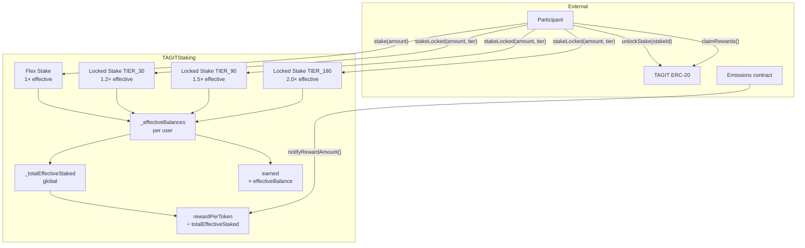

# TAGITStaking — Locked Staking Developer Reference

> **Task**: 2C. Build wTAGStaking.sol + tests (ID: `3314e3e9-a2d3-81d0-b825-fb08caba938b`)
> **Contracts PR**: [tagit-contracts #12](https://github.com/TAG-IT-NETWORK/tagit-contracts/pull/12)
> **Notion Wiki**: [TAGITStaking Locked — Investor Overview](https://www.notion.so/3334e3e9a2d3818d8a3ff730ba7451fd)
> **tagit-docs**: [TAGITStaking Locked MDX Reference](https://github.com/TAG-IT-NETWORK/tagit-docs/blob/main/docs/token/tagit-staking-locked.mdx)

---

## Table of Contents

1. [Purpose](#purpose)
2. [Architecture Overview](#architecture-overview)
3. [Reward Math with Multipliers](#reward-math-with-multipliers)
4. [Data Structures](#data-structures)
5. [Function Signatures](#function-signatures)
6. [Event Schemas](#event-schemas)
7. [Custom Errors](#custom-errors)
8. [Constants](#constants)
9. [State Variables Added](#state-variables-added)
10. [Security Model](#security-model)
11. [Test Suite Summary](#test-suite-summary)
12. [Integration Guide](#integration-guide)

---

## Purpose

Locked staking extends `TAGITStaking.sol` (Synthetix-style reward pool) with three time-lock tiers. A participant who locks tokens for a defined period receives a multiplied **effective balance** inside the reward pool, earning a larger share of each distribution epoch without changing the underlying reward emission rate.

**File**: `src/token/TAGITStaking.sol`
**Interface**: `src/interfaces/ITAGITStaking.sol`
**Test file**: `test/token/TAGITStakingLocked.t.sol` (435 lines)
**Solidity**: `^0.8.20` | **License**: MIT

---

## Architecture Overview



---

## Reward Math with Multipliers

### Effective Balance

```
effectiveBalance(user) = flexStake
                       + Σ( lockedAmount_i × tierMultiplier_i / BASIS_POINTS )
```

Where `BASIS_POINTS = 10 000`.

| Tier | `tierMultiplier` | Net multiplier |
|---|---|---|
| Flex stake | 10 000 | 1.0× |
| `TIER_30` | 12 000 | 1.2× |
| `TIER_90` | 15 000 | 1.5× |
| `TIER_180` | 20 000 | 2.0× |

### Reward Distribution (updated Synthetix formula)

```
rewardPerToken = stored
              + ( rewardRate × elapsed × 1e18 / totalEffectiveStaked )

earned(user)  = effectiveBalance(user)
              × ( rewardPerToken − userRewardPerTokenPaid ) / 1e18
              + accumulatedRewards
```

### Reward Bonus at Unlock

When `unlockStake` is called, `rewardBonus` is emitted for off-chain accounting:

```
bonusMultiplier = tierMultiplier − BASIS_POINTS   // e.g. 5 000 for TIER_90
rewardBonus     = amount × bonusMultiplier / BASIS_POINTS
```

This is informational only — actual rewards are already settled through the Synthetix `updateReward` modifier before state changes.

---

## Data Structures

### `LockTier` Enum

```solidity
/// @notice Lock tier for time-locked staking with reward multipliers
/// @dev Multipliers in basis points: TIER_30=12000 (1.2x), TIER_90=15000 (1.5x), TIER_180=20000 (2.0x)
enum LockTier {
    TIER_30,  // 30-day lock, 1.2× reward multiplier
    TIER_90,  // 90-day lock, 1.5× reward multiplier
    TIER_180  // 180-day lock, 2.0× reward multiplier
}
```

### `LockedStake` Struct

```solidity
/// @notice Locked stake entry for time-locked staking
struct LockedStake {
    uint256 amount;    // Tokens locked
    LockTier tier;     // Lock tier (determines duration + multiplier)
    uint256 lockEnd;   // Timestamp when lock expires
    bool released;     // Whether stake has been released
}
```

---

## Function Signatures

### Write Functions

#### `stakeLocked`

```solidity
function stakeLocked(uint256 amount, LockTier tier)
    external
    nonReentrant
    whenNotPaused
    rateLimited
    updateReward(msg.sender)
```

Creates a `LockedStake` entry, boosts `_effectiveBalances[msg.sender]` by `amount × multiplier / BASIS_POINTS`, increments `_totalEffectiveStaked`, and transfers `amount` tokens in.

**Reverts**: `ZeroAmount` | `InvalidTier(uint8 tier)` | `RateLimitExceeded` | `EnforcedPause`

---

#### `unlockStake`

```solidity
function unlockStake(uint256 stakeId)
    external
    nonReentrant
    updateReward(msg.sender)
```

Marks `LockedStake.released = true`, decrements `_effectiveBalances` and `_totalEffectiveStaked`, and transfers the original `amount` back to `msg.sender`.

**Reverts**: `StakeNotFound(uint256 stakeId)` | `LockNotExpired(uint256 stakeId, uint256 lockEnd, uint256 currentTime)`

---

### View Functions

#### `getLockedStakes`

```solidity
function getLockedStakes(address user)
    external view
    returns (LockedStake[] memory)
```

Returns the full `LockedStake[]` array for `user`, including released entries.

---

#### `lockedStakeCount`

```solidity
function lockedStakeCount(address user)
    external view
    returns (uint256)
```

Returns `_lockedStakes[user].length` (including released entries).

---

#### `effectiveBalance`

```solidity
function effectiveBalance(address user)
    external view
    returns (uint256)
```

Returns current effective staking weight: flex + boosted locked contributions.

---

#### `totalEffectiveStaked`

```solidity
function totalEffectiveStaked()
    external view
    returns (uint256)
```

Returns `_totalEffectiveStaked` — the denominator used in `rewardPerToken()`.

---

### Updated Core Functions

| Function | Change |
|---|---|
| `stake(amount)` | Now also increments `_effectiveBalances[user]` and `_totalEffectiveStaked` by `amount` (1× contribution) |
| `unstake(amount)` | Now also decrements `_effectiveBalances[user]` and `_totalEffectiveStaked` by `amount` |
| `rewardPerToken()` | Divides by `_totalEffectiveStaked` instead of `_totalStaked` |
| `earned(account)` | Multiplies by `_effectiveBalances[account]` instead of `_stakes[account].amount` |

---

## Event Schemas

### `LockedStakeCreated`

```solidity
event LockedStakeCreated(
    address indexed user,      // Staker address
    uint256 indexed stakeId,   // Index in user's LockedStake array
    uint256 amount,            // Tokens locked
    LockTier tier,             // Lock tier applied
    uint256 lockEnd            // Unix timestamp of lock expiry
);
```

### `LockedStakeReleased`

```solidity
event LockedStakeReleased(
    address indexed user,      // Staker address
    uint256 indexed stakeId,   // Index in user's LockedStake array
    uint256 amount,            // Tokens returned
    uint256 rewardBonus        // Informational: boost portion of effective contribution
);
```

---

## Custom Errors

```solidity
/// @notice Thrown when lock period has not expired
error LockNotExpired(uint256 stakeId, uint256 lockEnd, uint256 currentTime);

/// @notice Thrown when lock tier is invalid
error InvalidTier(uint8 tier);

/// @notice Thrown when locked stake ID is invalid or already released
error StakeNotFound(uint256 stakeId);
```

---

## Constants

```solidity
uint256 public constant TIER_30_DURATION  = 30 days;
uint256 public constant TIER_90_DURATION  = 90 days;
uint256 public constant TIER_180_DURATION = 180 days;

uint256 public constant TIER_30_MULTIPLIER  = 12_000; // 1.2× in basis points
uint256 public constant TIER_90_MULTIPLIER  = 15_000; // 1.5× in basis points
uint256 public constant TIER_180_MULTIPLIER = 20_000; // 2.0× in basis points
```

---

## State Variables Added

```solidity
/// @notice Per-user locked stake entries
mapping(address => LockedStake[]) private _lockedStakes;

/// @notice Total effective staked (flex + boosted locked) for reward calculations
uint256 private _totalEffectiveStaked;

/// @notice Per-user effective balance for reward calculations
mapping(address => uint256) private _effectiveBalances;

/// @dev Storage gap reduced from [38] → [35] to account for 3 new slots (UUPS upgrade-safe)
uint256[35] private __gap;
```

---

## Security Model

| Control | Applied To | Standard |
|---|---|---|
| `nonReentrant` | `stakeLocked`, `unlockStake` | OpenZeppelin ReentrancyGuard |
| `whenNotPaused` | `stakeLocked` | OpenZeppelin Pausable |
| `rateLimited` | `stakeLocked` | TAG IT RateLimiter (NIST AC-7) |
| `updateReward` modifier | `stakeLocked`, `unlockStake` | Synthetix reward checkpoint |
| CEI pattern | Both write functions | Checks → Effects → Interactions |
| Released-flag guard | `unlockStake` | Double-release prevention |
| `LockNotExpired` revert | `unlockStake` | Hard lock enforcement — no early exit |

> **No early withdrawal path** — tokens cannot be retrieved before `lockEnd` under any conditions. There is no penalty mechanism in this implementation; the lock is absolute.

---

## Test Suite Summary

**File**: `test/token/TAGITStakingLocked.t.sol` — 435 lines

| Test Group | Scenarios |
|---|---|
| `stakeLocked` happy path | All 3 tiers, correct `lockEnd`, correct `stakeId`, event emission |
| `unlockStake` happy path | Returns `amount`, clears `released`, event emission, `rewardBonus` value |
| Early unlock | Reverts `LockNotExpired` before `lockEnd` |
| Double-release | Reverts `StakeNotFound` on second call |
| Invalid tier | Reverts `InvalidTier` for out-of-range `uint8` |
| Zero amount | Reverts `ZeroAmount` |
| Effective balance | Correct value after stake, correct reduction after unlock |
| `rewardPerToken` denominator | Uses `totalEffectiveStaked`, not `totalStaked` |
| `earned()` numerator | Uses `effectiveBalance`, not `stakes.amount` |
| Multiple concurrent positions | Multiple `stakeId`s coexist without cross-contamination |
| Flex + locked coexistence | Both contribute to `effectiveBalance` independently |
| Gas benchmark | `stakeLocked` < 230 000 gas (NIST SI-4 compliance) |

---

## Integration Guide

### Staking with a Lock

```solidity
// Approve the staking contract first
IERC20(tagitToken).approve(address(staking), amount);

// Lock for 90 days at 1.5× multiplier
staking.stakeLocked(amount, ITAGITStaking.LockTier.TIER_90);

// Record the returned stakeId from the LockedStakeCreated event
```

### Checking Lock Status

```solidity
ITAGITStaking.LockedStake[] memory stakes = staking.getLockedStakes(userAddress);

for (uint256 i = 0; i < stakes.length; i++) {
    if (!stakes[i].released && block.timestamp >= stakes[i].lockEnd) {
        // Ready to unlock
        staking.unlockStake(i);
    }
}
```

### Querying Effective Balance

```solidity
uint256 effective = staking.effectiveBalance(userAddress);
uint256 flex      = staking.stakes(userAddress).amount; // raw flex stake only
// effective >= flex always
```

### Checking Rewards

```solidity
// earned() already uses effectiveBalance internally — no change required for callers
uint256 pending = staking.earned(userAddress);
```

---

## Linked Resources

- **Contracts PR**: [tagit-contracts #12](https://github.com/TAG-IT-NETWORK/tagit-contracts/pull/12)
- **Notion Investor Overview**: [TAGITStaking Locked](https://www.notion.so/3334e3e9a2d3818d8a3ff730ba7451fd)
- **tagit-docs MDX**: [`docs/token/tagit-staking-locked.mdx`](https://github.com/TAG-IT-NETWORK/tagit-docs/blob/main/docs/token/tagit-staking-locked.mdx)
- **Interface**: [`src/interfaces/ITAGITStaking.sol`](https://github.com/TAG-IT-NETWORK/tagit-contracts/blob/main/src/interfaces/ITAGITStaking.sol)
- **Related**: [wTAGBondingCurve Developer Reference](wTAGBondingCurve.md)
