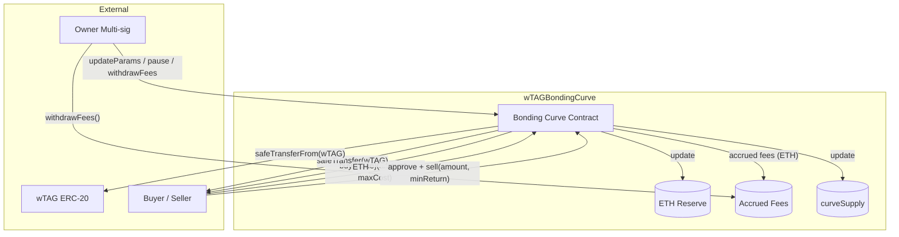

# wTAGBondingCurve — Developer Reference

> **Task**: 2A. Build wTAGBondingCurve.sol + tests (ID: `3314e3e9-a2d3-8185-a32a-e6f17bf802af`)
> **Contracts PR**: [tagit-contracts #11](https://github.com/TAG-IT-NETWORK/tagit-contracts/pull/11)
> **Notion Wiki**: [wTAGBondingCurve — Investor Overview](https://www.notion.so/3334e3e9a2d381f99af3d6d4faf749d7)
> **tagit-docs PR**: [tagit-docs #8](https://github.com/TAG-IT-NETWORK/tagit-docs/pull/8)
> **tagit-docs**: [wTAGBondingCurve MDX Reference](https://github.com/TAG-IT-NETWORK/tagit-docs/blob/main/docs/token/wtag-bonding-curve.mdx)

---

## Table of Contents

1. [Purpose](#purpose)
2. [Architecture Overview](#architecture-overview)
3. [Bonding Curve Math](#bonding-curve-math)
4. [Contract Details](#contract-details)
5. [Function Signatures](#function-signatures)
6. [Event Schemas](#event-schemas)
7. [Custom Errors](#custom-errors)
8. [State Variables & Constants](#state-variables--constants)
9. [Security Model](#security-model)
10. [Test Suite Summary](#test-suite-summary)
11. [Integration Guide](#integration-guide)

---

## Purpose

`wTAGBondingCurve` is the primary price-discovery mechanism for the wTAG token. Rather than relying on an external DEX, the contract acts as an always-available automated market maker: users send ETH to buy wTAG, or approve wTAG and receive ETH on sell. Price adjusts deterministically based on the total tokens in circulation through the curve.

**File**: `src/token/wTAGBondingCurve.sol`
**Test file**: `test/token/wTAGBondingCurve.t.sol`
**Solidity**: `^0.8.20` | **License**: MIT

---

## Architecture Overview



---

## Bonding Curve Math

The instantaneous price at supply `S` (tokens sold through the curve, 18-decimal units):

```
price(S) = initialPrice + (slope × S) / PRECISION
```

### Buy Cost (integral)

Cost in ETH to buy `N` tokens when current supply is `S`:

```
cost = ∫[S to S+N] price(x) dx
     = P₀·N/PREC + slope·N·(2S + N) / (2·PREC²)
```

### Sell Return (integral)

ETH returned for selling `N` tokens when current supply is `S`:

```
return = ∫[S-N to S] price(x) dx
       = P₀·N/PREC + slope·N·(2S − N) / (2·PREC²)
```

### Fee

```
fee  = base × feeBps / BASIS_POINTS        // BASIS_POINTS = 10_000
buy  → totalCost  = base + fee
sell → netReturn  = base - fee
```

### Monotonicity Invariant

Because the slope `m > 0`, price strictly increases with supply. Fuzz tests verify `priceAfter > priceBefore` for any nonzero buy.

---

## Contract Details

| Property | Value |
|----------|-------|
| Contract name | `wTAGBondingCurve` |
| Inherits | `ReentrancyGuard`, `Ownable`, `Pausable` (OpenZeppelin) |
| Token dependency | `IERC20` (wTAG, 18 decimals) |
| Arithmetic | Fixed-point 1e18 (`PRECISION`) |
| Fee cap | 1,000 bps (10%) |
| Slope cap | 1e12 wei per token-unit |

---

## Function Signatures

### Constructor

```solidity
constructor(
    address _wtagToken,   // wTAG ERC-20 address (must != address(0))
    address _owner,        // Initial owner — Ownable validates != address(0)
    uint256 _initialPrice, // Starting price in wei; must be > 0
    uint256 _slope,        // Slope in wei; 0 < slope <= MAX_SLOPE
    uint256 _feeBps        // Protocol fee; feeBps <= MAX_FEE_BPS (1000)
) Ownable(_owner)
```

### View / Price Quotes

```solidity
// Instantaneous spot price per full wTAG token (1e18 units) in wei
function currentPrice() external view returns (uint256 price);

// ETH cost + fee breakdown to buy `tokenAmount` wTAG at current supply
function getBuyQuote(uint256 tokenAmount)
    external view
    returns (uint256 totalCost, uint256 fee);

// Net ETH return + fee breakdown for selling `tokenAmount` wTAG
function getSellQuote(uint256 tokenAmount)
    external view
    returns (uint256 netReturn, uint256 fee);
```

### Trading

```solidity
// Buy `tokenAmount` wTAG; send ETH; excess refunded; reverts if cost > maxCost
function buy(uint256 tokenAmount, uint256 maxCost)
    external payable
    nonReentrant whenNotPaused;

// Sell `tokenAmount` wTAG for ETH; caller must approve curve first
// reverts if netReturn < minReturn
function sell(uint256 tokenAmount, uint256 minReturn)
    external
    nonReentrant whenNotPaused;
```

### Admin (onlyOwner)

```solidity
// Update curve parameters — only when curveSupply == 0
function updateParams(uint256 _initialPrice, uint256 _slope, uint256 _feeBps)
    external onlyOwner;

// Withdraw all accrued protocol fees to owner
function withdrawFees() external onlyOwner nonReentrant;

// Emergency pause — blocks buy() and sell()
function pause() external onlyOwner;

// Resume trading
function unpause() external onlyOwner;
```

### ETH Reception

```solidity
// Accepts direct ETH transfers (reserve top-ups)
receive() external payable;
```

---

## Event Schemas

### `Buy`

```solidity
event Buy(
    address indexed buyer,
    uint256 tokenAmount,   // wTAG tokens received (18 dec)
    uint256 ethCost,       // Total ETH paid (base + fee)
    uint256 fee            // Fee portion in ETH
);
```

### `Sell`

```solidity
event Sell(
    address indexed seller,
    uint256 tokenAmount,   // wTAG tokens sold (18 dec)
    uint256 ethReturn,     // Net ETH returned (base - fee)
    uint256 fee            // Fee portion in ETH
);
```

### `FeesWithdrawn`

```solidity
event FeesWithdrawn(
    address indexed to,    // Recipient (owner)
    uint256 amount         // ETH transferred
);
```

### `ParamsUpdated`

```solidity
event ParamsUpdated(
    uint256 newInitialPrice,
    uint256 newSlope,
    uint256 newFeeBps
);
```

---

## Custom Errors

| Error | Selector | Trigger |
|-------|----------|---------|
| `ZeroAddress()` | — | `_wtagToken == address(0)` |
| `ZeroAmount()` | — | `tokenAmount == 0` |
| `ZeroInitialPrice()` | — | `_initialPrice == 0` |
| `ZeroSlope()` | — | `_slope == 0` |
| `FeeTooHigh(uint256 provided, uint256 maximum)` | — | `feeBps > MAX_FEE_BPS` |
| `SlopeTooHigh(uint256 provided, uint256 maximum)` | — | `slope > MAX_SLOPE` |
| `InsufficientPayment(uint256 required, uint256 provided)` | — | `msg.value < totalCost` |
| `InsufficientBalance(uint256 required, uint256 available)` | — | Curve wTAG balance < `tokenAmount` |
| `ExceedsCurveSupply(uint256 requested, uint256 available)` | — | `tokenAmount > curveSupply` |
| `ETHTransferFailed(address to, uint256 amount)` | — | Low-level ETH call returned false |
| `NoFeesToWithdraw()` | — | `accruedFees == 0` |
| `SlippageExceeded(uint256 cost, uint256 maxCost)` | — | Cost > `maxCost` or return < `minReturn` |

---

## State Variables & Constants

### Constants

| Name | Value | Description |
|------|-------|-------------|
| `PRECISION` | `1e18` | Fixed-point scale (matches ERC-20 18 decimals) |
| `MAX_FEE_BPS` | `1000` | Maximum fee = 10% |
| `MAX_SLOPE` | `1e12` | Overflow-safe slope ceiling |

### Storage Layout

| Slot (approx) | Name | Type | Mutability |
|---------------|------|------|------------|
| — | `wtagToken` | `IERC20` | `immutable` |
| 0 | `initialPrice` | `uint256` | Owner-updatable |
| 1 | `slope` | `uint256` | Owner-updatable |
| 2 | `feeBps` | `uint256` | Owner-updatable |
| 3 | `curveSupply` | `uint256` | Updated on buy/sell |
| 4 | `reserve` | `uint256` | Updated on buy/sell |
| 5 | `accruedFees` | `uint256` | Updated on buy/sell; cleared on `withdrawFees` |

---

## Security Model

| Control | Implementation | Covers |
|---------|---------------|--------|
| Reentrancy guard | `ReentrancyGuard` on `buy`, `sell`, `withdrawFees` | ETH refund and seller callbacks |
| CEI pattern | Effects (state) before Interactions (external calls) in all functions | Same-transaction reentrancy |
| Pausable | `whenNotPaused` on `buy` and `sell` | Emergency circuit-breaker |
| Access control | `onlyOwner` on admin functions | Privilege escalation |
| Slippage protection | `maxCost` (buy) / `minReturn` (sell) | Front-running / sandwich attacks |
| Input validation | All parameters validated on construction and `updateParams` | Invariant preservation |
| No string reverts | Custom errors only | Gas efficiency + ABI-decodable errors |

### Invariants

1. `reserve + accruedFees == ETH balance of contract` (after all trades)
2. `curveSupply` only increases on buys, decreases on sells — never underflows
3. `price` is strictly monotonically increasing with `curveSupply`
4. Zero-fee round-trip `buy → sell` returns exactly the input ETH (fuzz-verified)

---

## Test Suite Summary

**File**: `test/token/wTAGBondingCurve.t.sol` | **Lines**: 664 | **Framework**: Foundry

| Category | Test Functions | Key Assertions |
|----------|---------------|----------------|
| Constructor | `test_constructor_setsParameters`, `test_constructor_setsOwner`, revert × 4 | Params stored; correct owner |
| Buy quotes | `test_getBuyQuote_*` | Correct base/fee math |
| Sell quotes | `test_getSellQuote_*` | Correct base/fee math |
| Buy flow | `test_buy_*` | Token transfer, reserve update, fee accrual, excess refund |
| Sell flow | `test_sell_*` | wTAG pull, ETH push, state decrements |
| Slippage | `test_buy_revert_slippage`, `test_sell_revert_slippage` | `SlippageExceeded` errors |
| Admin — `updateParams` | Success + 4 revert cases | Param writes, `ParamsUpdated` event |
| Admin — fees | `test_ownerWithdrawFees`, event, no-fee revert, non-owner revert | `FeesWithdrawn`, balance assertion |
| Pause | `test_pauseBlocking_*`, `test_pauseUnpause_*` | Buy/sell blocked; unpaused resumes trading |
| Integration | `test_buyThenSell_fullRoundTripReserve` | reserve=0, supply=0, fees = buyFee+sellFee |
| Multi-participant | `test_multipleParticipants_priceRises` | `bobCost > aliceCost` |
| Receive ETH | `test_receiveETH` | Direct ETH accepted |
| Fuzz — round-trip | `testFuzz_buyAndSellRoundTrip(uint256)` | Zero-fee lossless; supply/reserve = 0 |
| Fuzz — fee invariant | `testFuzz_feeAlwaysLessThanCost(uint256)` | `fee < totalCost` always |
| Fuzz — monotonic price | `testFuzz_priceMonotonicallyIncreases(uint256,uint256)` | `priceAfter > priceBefore` |

---

## Integration Guide

### Deployment Sequence

```bash
# 1. Deploy wTAG token (or use existing)
forge create src/token/wTAG.sol:wTAG --constructor-args ...

# 2. Deploy bonding curve
forge create src/token/wTAGBondingCurve.sol:wTAGBondingCurve \
  --constructor-args \
    <wTAG_ADDRESS> \
    <OWNER_MULTISIG> \
    1000000000000000 \   # 0.001 ETH initial price
    1000000 \            # 1e6 slope
    333                  # 3.33% fee

# 3. Fund curve with wTAG inventory
cast send <wTAG> "transfer(address,uint256)" <CURVE> <AMOUNT>
```

### Buying wTAG (TypeScript)

```typescript
// 1. Get quote
const [totalCost] = await publicClient.readContract({
  address: curveAddress,
  abi,
  functionName: "getBuyQuote",
  args: [parseEther("100")],
});

// 2. Apply slippage (1%)
const maxCost = (totalCost * 101n) / 100n;

// 3. Execute buy
await walletClient.writeContract({
  address: curveAddress,
  abi,
  functionName: "buy",
  args: [parseEther("100"), maxCost],
  value: maxCost,
});
```

### Selling wTAG (TypeScript)

```typescript
// 1. Approve curve
await walletClient.writeContract({
  address: wtagAddress,
  abi: erc20Abi,
  functionName: "approve",
  args: [curveAddress, parseEther("100")],
});

// 2. Get quote
const [netReturn] = await publicClient.readContract({
  address: curveAddress,
  abi,
  functionName: "getSellQuote",
  args: [parseEther("100")],
});

// 3. Execute sell with 1% slippage
const minReturn = (netReturn * 99n) / 100n;
await walletClient.writeContract({
  address: curveAddress,
  abi,
  functionName: "sell",
  args: [parseEther("100"), minReturn],
});
```

---

*Generated 2026-03-30 | TAG IT Network SUDO AI | Task `3314e3e9-a2d3-8185-a32a-e6f17bf802af`*
